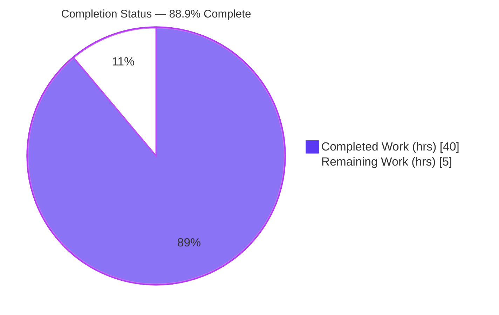
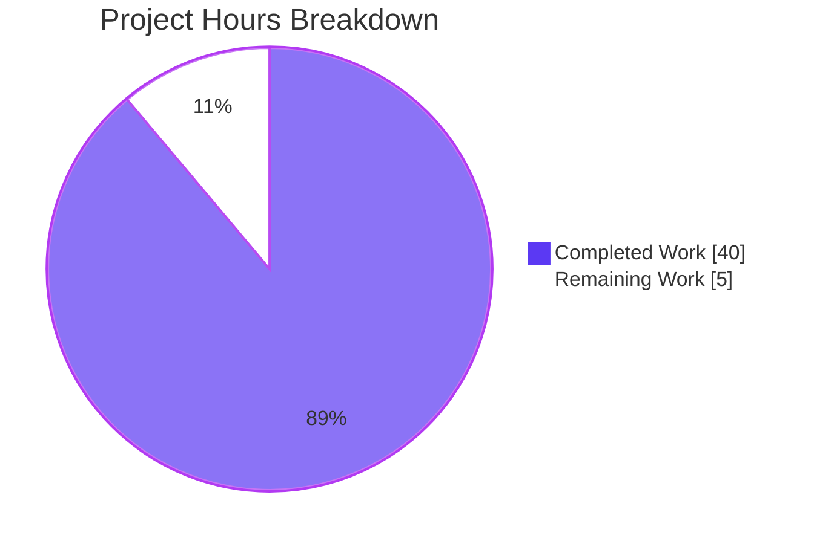
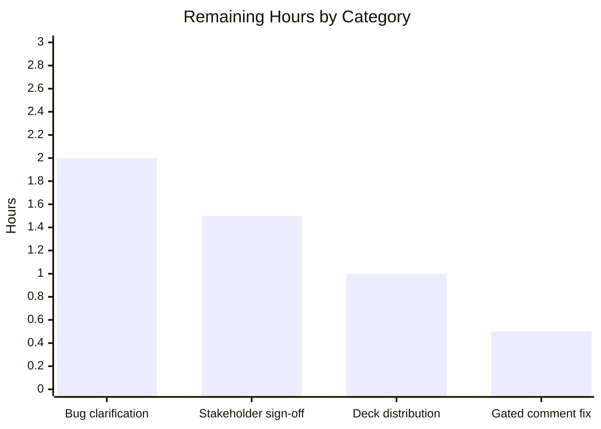

# Blitzy Project Guide — dnsmasq Bug-Fix Engagement

> **Engagement type:** Bug fix · **Subject:** dnsmasq (C99 DNS forwarder/cache + DHCP + TFTP + IPv6 RA daemon) · **Branch:** `blitzy-3defbaf6-789e-42a3-9a57-6f69d40c8cbe` · **HEAD:** `8e595bcb`
>
> **Brand legend:** Completed / AI Work = Dark Blue `#5B39F3` · Remaining / Not Completed = White `#FFFFFF` · Headings/Accents = Violet-Black `#B23AF2` · Highlight = Mint `#A8FDD9`

---

## 1. Executive Summary

### 1.1 Project Overview

dnsmasq is a lightweight DNS forwarder/cache, DHCP server, TFTP server, and IPv6 router-advertisement daemon written in ISO C99 (50 source files). This engagement was submitted as a **bug fix**, but the bug-intake template arrived **completely unpopulated** — no symptom, error, reproduction steps, or suspect file. Per the Agent Action Plan, no root cause is determinable and **no source fix is in scope** without fabricating a defect. The platform therefore delivered **complete diagnostic readiness** (verified build baseline, repository map, conventions, verification framework) and the one unconditional, rule-mandated artifact: a self-contained **reveal.js executive presentation** (`blitzy-deck/executive-summary.html`) for non-technical leadership.

### 1.2 Completion Status

The completion percentage reflects **only AAP-scoped work and path-to-production activities** (PA1 methodology), computed from engineering hours.



| Metric | Value |
|--------|-------|
| **Total Hours** | **45 h** |
| **Completed Hours (AI + Manual)** | **40 h** (AI-autonomous = 40 h · Manual = 0 h) |
| **Remaining Hours** | **5 h** |
| **Percent Complete** | **88.9 %** |

> **Critical caveat:** The **88.9 %** measures the *AAP-defined scope* — diagnostic readiness plus the executive presentation. It does **not** mean an (unspecified) bug is 88.9 % fixed. Because the bug-intake template was unpopulated, the source fix is out of scope until the user supplies concrete defect details (see §1.4 / §6 risk O1 / task HT-1).

### 1.3 Key Accomplishments

- ✅ **Verified clean build baseline:** `make clean && make` exits `0` with zero errors; produces a working 469,904-byte ELF64 PIE binary at `src/dnsmasq`.
- ✅ **Diagnostic readiness established:** complete repository map (162 tracked files, 50 source files), coding conventions, and a fix-verification framework documented without fabricating a defect.
- ✅ **Sole anomaly isolated & characterized:** the single benign `-Wcomment` warning at `src/option.c:7326` (comment-only, zero runtime/ABI effect) identified as an AAP-gated candidate — *not* a user-reported defect.
- ✅ **Rule-mandated executive presentation delivered:** `blitzy-deck/executive-summary.html` — a single self-contained reveal.js 5.1.0 deck (1,001 lines / 42 KB), 16 slides across 4 slide types.
- ✅ **Deck design-system compliance:** exact inline Blitzy `:root` token palette, pinned CDN libraries (reveal.js@5.1.0, mermaid@11.4.0, lucide@0.460.0), 3 Mermaid diagrams, 33 Lucide icons, 14 KPI cards, 3 tables, SRI integrity hashes.
- ✅ **Runtime-validated in Chrome 149** via DevTools MCP: `Reveal.isReady()=true`, 3/3 Mermaid SVGs rendered, 33/33 icons rendered, **zero** console errors, 8/8 network requests HTTP 200.
- ✅ **Source tree correctly untouched:** 0 `src/` files modified, honoring the AAP no-fabrication mandate; working trees clean.
- ✅ **46/46 structural validation checks PASS** across 5 production-readiness gates.

### 1.4 Critical Unresolved Issues

| Issue | Impact | Owner | ETA |
|-------|--------|-------|-----|
| Bug-intake template unpopulated — no defect specified | **Blocks any source fix**; original bug-fix intent cannot be fulfilled | Requesting user / Product owner | Pending user input (≈2.0 h to populate) |
| Deck rendering depends on external CDN + Google Fonts at view time | Deck appears blank if opened offline or via `file://` | Reviewing developer | 1.0 h (verify in target env) |
| Gated `option.c:7326` `-Wcomment` warning | Benign, comment-only; remains until/unless confirmed in scope | Maintainer (on confirmation) | 0.5 h (optional) |

### 1.5 Access Issues

| System/Resource | Type of Access | Issue Description | Resolution Status | Owner |
|-----------------|----------------|-------------------|-------------------|-------|
| Public CDNs (jsDelivr/cdnjs) & Google Fonts | Outbound HTTPS at deck view time | Deck loads reveal.js/Mermaid/Lucide + fonts from CDN; offline viewing renders blank | Validated reachable (HTTP 200, valid SRI) in build env; verify in target viewing env | Reviewing developer |
| Full dnsmasq daemon runtime (bind port 53) | root + network isolation | Daemon end-to-end run needs privileges/isolation unavailable in build baseline; smoke tests (`--test/--version/--help`) pass | Accepted — out of scope for build baseline | Ops (future) |

No repository-permission or service-credential access issues were identified. No secrets are required for the in-scope deliverable.

### 1.6 Recommended Next Steps

1. **[High]** Populate the bug-intake template with a concrete problem statement, reproduction steps, suspect files/functions, expected-vs-actual behavior, and system boundaries — the critical blocker to any source fix.
2. **[Medium]** Review and sign off on `blitzy-deck/executive-summary.html` for accuracy and messaging.
3. **[Medium]** Distribute/host the deck for leadership and verify CDN-dependent rendering in the target viewing environment.
4. **[Low]** *(Optional, gated)* If the team confirms the `option.c:7326` `-Wcomment` warning is the intended target, apply the one-line comment reword (AAP §0.5.1) and rebuild to confirm the warning count drops 1 → 0.
5. **[Low]** Upon receipt of defect details, begin the standard fix flow (localize → edit → add `verify-fix-to-bug-NNNNNN` autopkgtest → regression-test) in a follow-on engagement.

---

## 2. Project Hours Breakdown

### 2.1 Completed Work Detail

All completed work was performed autonomously by Blitzy agents (Manual = 0 h). Each component traces to AAP requirements.

| Component | Hours | Description |
|-----------|-------|-------------|
| Bug-intake analysis & diagnostic readiness (AAP §0.1–§0.3, R1–R7) | 9 | Parsed unpopulated intake; verified clean build baseline & binary; mapped repository; isolated sole `-Wcomment` anomaly; authored missing-information inventory & fix-verification framework |
| Deck — theme system & layout (AAP §0.4, R9a) | 5 | Inline Blitzy `:root` token palette (exact brand colors/gradients/fonts), reveal.js slide-type classes, responsive 1920×1080 layout |
| Deck — slide content & structure (R9b, R9c) | 7 | 16 slides (1 title / 5 dividers / 9 content / 1 closing) covering the 5 mandated topics; ≤4 bullets & ≤40 words per content slide; zero emoji; no fenced code |
| Deck — diagrams, icons & data viz (R9d, R9e, R9f) | 6 | 3 Mermaid diagrams, 33 Lucide icons, 14 KPI cards across 5 grids, 3 styled tables — ≥1 non-text visual per slide |
| Deck — JS integration & self-containment (R9g, R9h) | 4 | reveal config (hash/transition/width/height), Mermaid `startOnLoad:false`+`run()`+eager pre-render, Lucide `createIcons`, `ready`+`slidechanged` hooks, SRI pins |
| Deck — QA, responsive & runtime validation (R9i) | 7 | 124 screenshots, 6 Lighthouse reports, 2 screen recordings, 5 fix iterations; Chrome DevTools runtime checks (0 console errors) |
| Final autonomous validation this session | 2 | 9 phases / 5 production-readiness gates / 46-of-46 structural checks; git & working-tree verification |
| **Total Completed** | **40** | |

### 2.2 Remaining Work Detail

Each remaining item traces to an AAP requirement or path-to-production need.

| Category | Hours | Priority |
|----------|-------|----------|
| Bug clarification cycle — populate intake template with concrete defect details (R12) | 2.0 | High |
| Stakeholder review & sign-off of executive presentation (R11) | 1.5 | Medium |
| Deck distribution & CDN-dependent render verification in target environment (R13) | 1.0 | Medium |
| Optional gated comment fix `option.c:7326` + rebuild (R10) | 0.5 | Low |
| **Total Remaining** | **5.0** | |

### 2.3 Hours Reconciliation & Completion Formula

| Bucket | Hours |
|--------|-------|
| Completed (§2.1 total) | 40 |
| Remaining (§2.2 total) | 5 |
| **Total Project Hours** | **45** |

**Completion formula (PA1, hours-based):**

```
Completion % = Completed Hours / (Completed Hours + Remaining Hours) × 100
             = 40 / (40 + 5) × 100
             = 40 / 45 × 100
             = 88.9 %
```

**Cross-section integrity (validated):** Remaining hours = **5** identically in §1.2, §2.2, and §7 (Rule 1). §2.1 (40) + §2.2 (5) = **45** = Total Project Hours in §1.2 (Rule 2). The completion figure **88.9 %** is the only percentage used throughout this guide.

> **Scope note:** The follow-on *actual* defect fix is a **future engagement, out of AAP scope** (§0.6.2) and is deliberately **not** included in the 5 h remaining or the 45 h total.

---

## 3. Test Results

dnsmasq intentionally ships **no unit-test framework and no `make test`/`check` target** (AAP-confirmed; integration testing is via Debian autopkgtest requiring root + isolation, not runnable in the build baseline). Accordingly, the validation below comprises Blitzy's **autonomous structural, runtime, and build validation** of the in-scope deliverable plus binary smoke tests. **Every entry originates from Blitzy's autonomous validation logs for this project.**

| Test Category | Framework | Total Tests | Passed | Failed | Coverage % | Notes |
|---------------|-----------|-------------|--------|--------|-----------|-------|
| Deck structural validation | Custom Python validators | 46 | 46 | 0 | 100 | Slides/types, visuals-per-slide, bullet/word caps, zero emoji, CDN pins, inline tokens, reveal config, JS hooks, self-containment |
| Deck — Mermaid rendering | Chrome 149 DevTools MCP | 3 | 3 | 0 | 100 | 3/3 diagrams rendered to SVG (slide 9 visible 1052×374; not collapsed — pre-render defeats hidden-section bug) |
| Deck — Lucide icon rendering | Chrome 149 DevTools MCP | 33 | 33 | 0 | 100 | 33/33 icons rendered; 0 placeholders, 0 empty |
| Deck — network/resource loads | Chrome 149 DevTools MCP | 8 | 8 | 0 | 100 | 8/8 requests HTTP 200; SRI integrity hashes valid; no resource blocked |
| Binary smoke tests | dnsmasq CLI self-tests | 3 | 3 | 0 | n/a | `--version` (reports `UNKNOWN`, expected), `--test` (`syntax check OK.`), `--help` — all exit 0 |
| Build compilation | GNU Make 4.4.1 + gcc 15.2.0 | 1 | 1 | 0 | n/a | `make clean && make` exit 0; 0 errors; 1 benign `-Wcomment` warning (non-blocking, no `-Werror`) |
| Deck inline-JS syntax | `node --check` | 0 | 0 | 0 | 100 | Inline `<script>` parses cleanly (exit 0); html.parser well-formed — recorded as quality gate (no discrete assertions) |
| **Total** | — | **94** | **94** | **0** | **100** | Zero failing, zero blocked, zero skipped |

---

## 4. Runtime Validation & UI Verification

**C binary (dnsmasq):**
- ✅ **Operational** — Builds to a 469,904-byte ELF64 PIE at `src/dnsmasq`.
- ✅ **Operational** — `./src/dnsmasq --test` → `syntax check OK.` (exit 0).
- ✅ **Operational** — `./src/dnsmasq --version` runs (reports `UNKNOWN` due to `VERSION=$Format:%d$` placeholder — expected for a non-`git-archive` checkout, **not** a defect).
- ✅ **Operational** — `./src/dnsmasq --help` (exit 0).
- ⚠ **Partial** — Full daemon bind on port 53 requires root + network isolation; out of scope for the build baseline (smoke tests pass).

**Executive presentation (`blitzy-deck/executive-summary.html`) — served via local HTTP, loaded in Chrome 149 (DevTools MCP):**
- ✅ **Operational** — `Reveal.isReady() === true`; 16 slides; hash-routing functional across navigation.
- ✅ **Operational** — Mermaid: 3/3 diagrams rendered to SVG (slide 9 visible 1052×374, 19 nodes — not collapsed; eager `preRenderDiagrams()` defeats the hidden-section collapse bug).
- ✅ **Operational** — Lucide: 33/33 icons rendered (0 unrendered placeholders, 0 empty).
- ✅ **Operational** — **Zero** console messages on load and across multi-slide navigation; `slidechanged → renderVisuals` produces no errors.
- ✅ **Operational** — 8/8 network requests HTTP 200; SRI integrity hashes valid; screenshots captured (title / KPI / Mermaid / table / closing).
- ⚠ **Partial** — Rendering depends on CDN + Google Fonts at view time; offline/`file://` viewing renders blank (mitigation: serve over HTTP with internet — see §9 troubleshooting).

---

## 5. Compliance & Quality Review

Cross-mapping AAP deliverables to Blitzy quality/compliance benchmarks. Fixes applied during prior autonomous QA iterations (d432ba6c → 8e595bcb) are noted.

| Benchmark / AAP Requirement | Reference | Status | Progress |
|------------------------------|-----------|--------|----------|
| No fabricated root cause; source untouched absent a defect | AAP §0.2, §0.6.2 | ✅ Pass | 0 `src/` files modified |
| Verified clean build baseline | AAP §0.1, §0.3 | ✅ Pass | `make` exit 0; binary produced |
| Sole anomaly isolated, gated, documented | AAP §0.2.2, §0.5.1 | ✅ Pass | `option.c:7326` characterized; not modified (no user confirmation) |
| Executive presentation created (unconditional) | AAP §0.5.2, §0.6.1 | ✅ Pass | `blitzy-deck/executive-summary.html` delivered |
| Self-contained single HTML; no build step | AAP §0.4.1 | ✅ Pass | One file; CDN + inline theme only |
| 12–18 slides (target 16), 4 slide types | AAP §0.5.4 | ✅ Pass | 16 slides (1 title / 5 divider / 9 content / 1 closing) |
| ≥1 non-text visual per slide | AAP §0.5.4 | ✅ Pass | Mermaid/KPI/table/icon on every slide |
| Content slides ≤4 bullets / ≤40 words | AAP §0.5.4 | ✅ Pass | Max observed 3 bullets / 29 words |
| Zero emoji; no fenced code in slides | AAP §0.5.4 | ✅ Pass | 0 emoji; 0 fenced blocks |
| Exact inline `:root` Blitzy token palette | AAP §0.4.3 | ✅ Pass | All 6 brand colors, gradients, fonts verbatim |
| Pinned CDN versions verbatim | AAP §0.4.1 | ✅ Pass | reveal.js@5.1.0, mermaid@11.4.0, lucide@0.460.0 |
| reveal config (hash/transition/controlsTutorial/1920×1080) | AAP §0.5.4 | ✅ Pass | All present |
| Mermaid `startOnLoad:false` + `run()` + `ready`/`slidechanged` | AAP §0.5.4 | ✅ Pass | Eager pre-render added (QA fix) |
| Lucide `createIcons` on `ready` + `slidechanged` | AAP §0.5.4 | ✅ Pass | Both hooks present |
| ISO C99 conformance; compiles under `-Wall -W -O2`, no new warnings | AAP §0.8 | ✅ Pass | No new warnings introduced (source untouched) |

**Outstanding compliance items:** Mermaid pinned to AAP-mandated **11.4.0** (resolved at HEAD `8e595bcb`, QA Issue #1). The lone `-Wcomment` warning remains by policy (non-blocking, gated). No `-Werror` in the project; warnings are non-blocking.

---

## 6. Risk Assessment

| Risk | Category | Severity | Probability | Mitigation | Status |
|------|----------|----------|-------------|------------|--------|
| T1 — `option.c:7326` `-Wcomment` warning | Technical | Low | Certain | Benign, comment-only, zero runtime/ABI effect; gated optional reword available | Open (accepted) |
| T2 — Deck requires CDN + Google Fonts at view time | Technical | Low–Med | Medium | SRI-pinned, exact versions; verify in target env | Open |
| T3 — Mermaid hidden-section collapse | Technical | Low | Low | Eager `preRenderDiagrams()` forces render before display | Resolved (mitigated) |
| T4 — `VERSION=$Format:%d$` → `--version` reports `UNKNOWN` | Technical | Low | Certain | Expected for non-`git-archive` checkout; not a defect | Accepted |
| S1 — Third-party CDN supply-chain exposure | Security | Medium | Low | 4 SRI integrity hashes + `crossorigin` + pinned versions | Mitigated |
| S2 — dnsmasq daemon attack surface | Security | N/A | N/A | Zero source changes this engagement | No change |
| O1 — **Original bug-fix intent unfulfilled (unpopulated intake)** | Operational | **High** | Certain | AAP transparently documents the unpopulated template + missing-information inventory + clarification request | **Open — needs user action** |
| O2 — No unit-test / `make test` harness | Operational | Medium | Medium | Fix verification via Debian autopkgtest + manual smoke checks; add `verify-fix-to-bug-NNNNNN` per precedent | Open |
| O3 — Full daemon runtime needs root + isolation | Operational | Low | Low | Smoke tests pass; full run deferred to target env | Accepted |
| I1 — Deck → CDN reachability at view time | Integration | Low–Med | Medium | Validated in Chrome (HTTP 200 / valid SRI); re-verify in target env | Mitigated (verify) |
| I2 — Submodule `dnsmasq-debian @ 9fe6b08a` | Integration | Low | Low | Clean working tree, pinned commit | Stable |
| I3 — No CI/CD gating on deck artifact | Integration | Low | Low | Manual structural + runtime validation performed | Open (low) |

---

## 7. Visual Project Status



**Remaining hours by task category (§2.2):**



**Remaining work by priority:**

| Priority | Hours |
|----------|-------|
| High | 2.0 |
| Medium | 2.5 |
| Low | 0.5 |
| **Total** | **5.0** |

> **Integrity:** "Remaining Work" = **5** here equals Remaining Hours in §1.2 and the sum of the §2.2 Hours column. Bar-chart values sum to **5.0**; priority split sums to **5.0**. Completed = `#5B39F3`, Remaining = `#FFFFFF`.

---

## 8. Summary & Recommendations

**Achievements.** Against the AAP-defined scope, the engagement is **88.9 % complete** (40 of 45 hours). Blitzy established a verified, releasable build baseline, produced a complete diagnostic-readiness package without fabricating a defect, and delivered the unconditional rule-mandated executive presentation — validated to 46/46 structural checks and confirmed error-free at runtime in Chrome 149.

**Remaining gaps (5 h).** The dominant gap is **not** engineering effort but **missing input**: the bug-intake template must be populated before any source fix can begin (2.0 h to author, then a separate future fix engagement). The balance is stakeholder sign-off (1.5 h), deck distribution/render verification (1.0 h), and the optional gated comment reword (0.5 h).

**Critical path to production.** (1) User populates the defect details → (2) localize & fix in the relevant subsystem → (3) add a `verify-fix-to-bug-NNNNNN` autopkgtest scenario → (4) clean rebuild + regression run. Steps 2–4 are a **future, out-of-scope engagement** and are excluded from the 45 h total.

**Production-readiness assessment.** The in-scope deliverable (the executive presentation) is **production-ready**: self-contained, design-system-compliant, and runtime-validated. The C source remains in its original clean, buildable state. **However, the original bug-fix objective is *blocked*** pending user clarification (risk O1) — so the engagement should be considered *deliverable-complete for its in-scope artifacts* but *not* a delivered bug fix.

| Success Metric | Target | Actual | Status |
|----------------|--------|--------|--------|
| Build exit code | 0 | 0 | ✅ |
| Build errors | 0 | 0 | ✅ |
| Deck structural checks | 100 % | 46/46 (100 %) | ✅ |
| Deck runtime console errors | 0 | 0 | ✅ |
| Source files modified (no fabrication) | 0 | 0 | ✅ |
| AAP-scoped completion | — | 88.9 % | ▣ |

> **Reminder:** 88.9 % = AAP-defined scope (diagnostic readiness + presentation). It is **not** a measure of a fixed bug; the source fix awaits defect details (O1 / HT-1). Maximum claimable completion before human review is capped at 99 % — never 100 %.

---

## 9. Development Guide

### 9.1 System Prerequisites

- **OS:** Linux/Unix (validated on Ubuntu 25.10 container).
- **Compiler:** GCC 7.0+ or Clang 10.0+ (validated with **gcc 15.2.0**).
- **Build tool:** GNU Make (validated **4.4.1**).
- **Dev headers:** `libc6-dev` (2.42), `linux-libc-dev` (6.17), netfilter/ipset headers (present).
- **Deck viewing:** a modern browser (validated **Chrome 149**), **Python 3** (validated 3.13.7) to serve locally, and **internet access** (CDN + Google Fonts).
- **VCS:** `git` + `git-lfs` (validated **3.7.1**).

### 9.2 Environment Setup

```bash
# From the repository root
cd /tmp/blitzy/blitzy-dnsmasq/blitzy-3defbaf6-789e-42a3-9a57-6f69d40c8cbe_3ade22

# Confirm toolchain
gcc --version        # expect gcc (… ) 15.2.0
make --version       # expect GNU Make 4.4.1
python3 --version    # expect Python 3.13.x
git lfs version      # expect git-lfs/3.7.1
```

No `.env` or runtime environment variables are required for the in-scope deliverable. dnsmasq is configured at runtime via command-line options or `/etc/dnsmasq.conf` (not exercised in the build baseline).

### 9.3 Dependency Installation

The C project requires **no package-manager dependencies** beyond system dev headers (already present). The deck loads its libraries from CDN at view time — there is **no install/build step** for the deck.

```bash
# (Only if dev headers are missing on a fresh host)
sudo apt-get update && DEBIAN_FRONTEND=noninteractive \
  sudo apt-get install -y build-essential libc6-dev linux-libc-dev
```

### 9.4 Build & Run

```bash
# Clean build (from repository root)
make clean && make
# Expected: exit 0; 0 errors; exactly 1 benign warning:
#   src/option.c:7326:41: warning: "/*" within comment [-Wcomment]
# Produces: src/dnsmasq  (≈469,904-byte ELF64 PIE)

# Binary smoke tests (all exit 0)
./src/dnsmasq --version    # reports "UNKNOWN" (expected — VERSION placeholder)
./src/dnsmasq --test       # prints "syntax check OK."
./src/dnsmasq --help       # prints option help
```

Relevant Makefile targets: `all` (L89), `clean` (L100), `mostly_clean`, `install` (L105), `all-i18n` (L111), `install-i18n` (L122). `CFLAGS = -Wall -W -O2` (no `-Werror`; warnings are non-blocking).

### 9.5 Verification Steps

```bash
# 1) Confirm the binary type/size
file src/dnsmasq        # ELF 64-bit LSB pie executable
ls -l src/dnsmasq       # ~469904 bytes

# 2) Reproduce the sole (benign) warning in isolation
touch src/option.c && make 2>&1 | grep -i "within comment"
#   -> src/option.c:7326:41: warning: "/*" within comment [-Wcomment]
```

### 9.6 Example Usage — Serve & View the Executive Deck

```bash
cd blitzy-deck
python3 -m http.server 8099
# In a browser (with internet for CDN + fonts):
#   http://127.0.0.1:8099/executive-summary.html
# Quick check:
curl -sI http://127.0.0.1:8099/executive-summary.html   # HTTP/1.0 200 OK, text/html
```

Expected: 16 slides; arrow-key navigation; all Mermaid diagrams and Lucide icons render; zero browser-console errors.

### 9.7 Future-Fix Verification (when a defect is supplied)

dnsmasq has **no `make test`/`check`**. Verification uses Debian autopkgtest scenarios under `submodules/dnsmasq-debian/debian/tests/` — e.g. `compile-time-options`, `compile-time-options+lua`, `control`, `functions`, `functions.d`, `get-address+query-dns+check-utils`, `get-address+query-dns+lua+alt`, `get-address+query-dns+sysv+alt`, and the precedent `verify-fix-to-bug-871958`. Any new fix **must add** a `verify-fix-to-bug-NNNNNN` scenario, then rebuild clean and run functional + regression checks (Valgrind/GDB for memory/logic defects).

### 9.8 Troubleshooting

- **`-Wcomment` warning during build** — *Expected and benign* (comment-only at `option.c:7326`; no `-Werror`). Do **not** "fix" unless explicitly confirmed in scope.
- **`--version` prints `UNKNOWN`** — *Expected*: the `VERSION` file holds the `$Format:%d$` placeholder for non-`git-archive` checkouts; not a defect.
- **Deck appears blank / unstyled** — Ensure internet access (CDN + Google Fonts) and serve over `http://` (not `file://`); reload.
- **Mermaid diagrams tiny or missing** — Handled by the deck's eager `preRenderDiagrams()`; ensure the page is served over HTTP and fully loaded before navigating.

---

## 10. Appendices

### Appendix A — Command Reference

| Purpose | Command |
|---------|---------|
| Clean build | `make clean && make` |
| Binary version | `./src/dnsmasq --version` |
| Config syntax check | `./src/dnsmasq --test` |
| Option help | `./src/dnsmasq --help` |
| Reproduce warning | `touch src/option.c && make 2>&1 \| grep -i "within comment"` |
| Serve deck | `cd blitzy-deck && python3 -m http.server 8099` |
| Deck HTTP check | `curl -sI http://127.0.0.1:8099/executive-summary.html` |

### Appendix B — Port Reference

| Port | Service | Notes |
|------|---------|-------|
| 8099 | Local HTTP server (deck) | Dev-only static serving of `executive-summary.html` |
| 53 | dnsmasq DNS (TCP/UDP) | Daemon default; requires root + isolation (out of scope for baseline) |
| 67 | dnsmasq DHCP (UDP) | Daemon default (not exercised) |
| 69 | dnsmasq TFTP (UDP) | Daemon default (not exercised) |

### Appendix C — Key File Locations

| Path | Role |
|------|------|
| `blitzy-deck/executive-summary.html` | **In-scope deliverable** — self-contained reveal.js deck (1,001 lines / ~42 KB) |
| `src/dnsmasq` | Built binary (ELF64 PIE) |
| `src/option.c` (L7326) | Location of the gated `-Wcomment` anomaly |
| `src/config.h` | Operational defaults (cache 150, max leases 1000, lease times 3600 s / 86400 s) |
| `Makefile` | Build entry; `CFLAGS = -Wall -W -O2` (L27) |
| `VERSION` | Holds `$Format:%d$` placeholder |
| `submodules/dnsmasq-debian/debian/tests/` | Autopkgtest scenarios + `verify-fix-to-bug-871958` precedent |

### Appendix D — Technology Versions

| Tool | Version |
|------|---------|
| gcc | 15.2.0 |
| GNU Make | 4.4.1 |
| Node.js | v20.20.2 |
| Google Chrome | 149 |
| Python | 3.13.7 |
| git-lfs | 3.7.1 |
| reveal.js (CDN, pinned) | 5.1.0 |
| Mermaid (CDN, pinned) | 11.4.0 |
| Lucide (CDN, pinned) | 0.460.0 |
| Fonts (Google Fonts) | Inter · Space Grotesk · Fira Code |

### Appendix E — Environment Variable Reference

No environment variables are required for the in-scope deliverable. dnsmasq runtime behavior (when deployed) is governed by CLI options / `/etc/dnsmasq.conf`, not environment variables. The deck requires no secrets or configuration.

### Appendix F — Developer Tools Guide

- **Chrome DevTools (MCP):** used to validate the deck at runtime — `Reveal.isReady()`, Mermaid SVG presence, Lucide icon counts, console-message inspection, network-request status, and screenshots.
- **Custom Python validators:** enforce deck structure (slide counts/types, visuals-per-slide, bullet/word caps, emoji/fenced-code absence, CDN pins, inline tokens, reveal config, JS hooks, self-containment).
- **`node --check`:** validates the deck's inline JavaScript syntax.
- **Valgrind / GDB:** prescribed by project convention for memory/concurrency-sensitive *future* fixes.

### Appendix G — Glossary

| Term | Meaning |
|------|---------|
| AAP | Agent Action Plan — the governing project directive |
| AAP-scoped | Work explicitly defined in the AAP plus path-to-production activities |
| `-Wcomment` | GCC warning emitted when `/*` appears inside an open block comment |
| Autopkgtest | Debian package integration-test framework (dnsmasq's verification path) |
| ELF64 PIE | Position-Independent Executable, 64-bit ELF binary format |
| Gated candidate | A change applied **only** on explicit user confirmation (here: `option.c:7326`) |
| Path-to-production | Standard deployment/readiness activities beyond core build |
| reveal.js | HTML presentation framework used for the executive deck |
| SRI | Subresource Integrity — cryptographic hash pinning of CDN assets |
