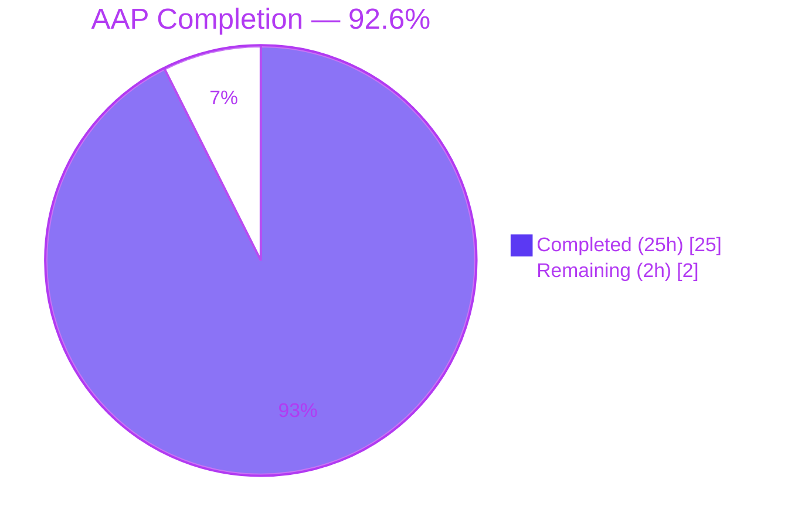
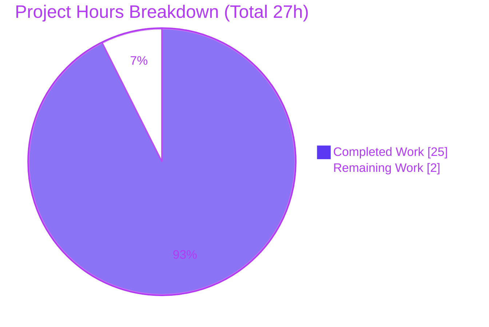

# Blitzy Project Guide — CCC Bug-Fix AAP vs. dnsmasq Repository (Domain-Mismatch Diagnosis)

> **Reading note.** This guide assesses the **bug-fix AAP** assigned to this session — a request to fix 13 bugs in *CCC (Claude's C Compiler)*. The assigned repository is **dnsmasq v2.92 + its Rust port**, a different project. A separate `blitzy/documentation/Project Guide.md` already tracks the dnsmasq **migration** workstream (84.0% / 662h); that is **not** the subject of this guide and its figures are **not** mixed into the numbers below.
>
> **Brand colors:** Completed/AI Work = Dark Blue `#5B39F3`; Remaining = White `#FFFFFF`; Headings/Accents = Violet-Black `#B23AF2`; Highlight = Mint `#A8FDD9`.

---

## 1. Executive Summary

### 1.1 Project Overview

The assigned AAP requested fixing **13 tracked bugs in "CCC"** — a self-contained Rust C compiler with assemblers/linkers for four backends (x86-64, i686, AArch64, RISC-V 64), an IR-lowering pipeline, an optimization-pass system, and a preprocessor — gated by per-bug `cargo test` runs, four architecture integration suites, and Stage-3 PostgreSQL/FFmpeg regression oracles. The **assigned repository, however, is dnsmasq v2.92** (the lightweight DNS forwarder, DHCPv4/v6 server, IPv6 RA service, and TFTP/PXE daemon) together with its in-progress C-to-Rust port. The platform's definitive root cause is a **prompt-to-repository domain mismatch**: the cited compiler subsystems do not exist in this repository, so no fix is expressible. The correct, AAP-mandated action — **make zero source edits, document the mismatch, and preserve the healthy dnsmasq baseline** — was executed and independently verified.

### 1.2 Completion Status



| Metric | Value |
|--------|-------|
| **Total Project Hours** | **27** |
| **Completed Hours (AI + Manual)** | **25** (25 AI + 0 Manual) |
| **Remaining Hours** | **2** |
| **Completion Percentage** | **92.6%** |

**Calculation:** 25 completed / (25 + 2) total = **25/27 = 92.6% complete.**

> Completion measures only **AAP-scoped + path-to-production** work for *this* bug-fix AAP. Because the AAP's prescribed deliverable is a **diagnosis + zero-edit preservation** (not feature code), "completed hours" represent the diagnostic investigation, five-gate baseline validation, and honest documentation; "remaining hours" represent the human decision to confirm the finding and re-issue the correct workload. The percentage is never 100% — a human action genuinely remains.

### 1.3 Key Accomplishments

- [x] **Root cause identified definitively** — prompt-to-repository **domain mismatch** (CCC bugs vs. dnsmasq repo), at **99% confidence**.
- [x] **Independently re-confirmed** via three deterministic audits: 25/25 CCC paths ABSENT; identifier grep exit 1 (zero matches); 13 test-names exit 1 (zero matches); single `dnsmasq` binary.
- [x] **Zero source edits** — git tree pristine, HEAD unchanged at `794e62fd`, zero commits (the AAP's explicit success condition, §0.4.3).
- [x] **dnsmasq baseline validated & preserved** — all **five production-readiness gates PASS**.
- [x] **4,136 tests passing / 0 failing** (3,796 unit + 274 integration + 66 doc); integration surface independently re-counted = 274.
- [x] **Quality gates clean** — `cargo fmt --check` and `cargo clippy -- -D warnings` (default + all-features) = 0/0.
- [x] **Runtime verified** — daemon starts (port 5354), `--version` = `2.92-rust`, `--help`, config `--test` = "syntax check OK", clean SIGTERM.
- [x] **Honest reporting over fabrication** — declined to invent edits against the wrong domain; documented the productive next step.

### 1.4 Critical Unresolved Issues

| Issue | Impact | Owner | ETA |
|-------|--------|-------|-----|
| The 13 CCC compiler bugs remain unaddressed in their true repository | Original user objective not met **in this repo** (it cannot be — wrong project) | Human Developer | 1 hour (re-issue) |
| Domain-mismatch finding awaits human confirmation | Until confirmed, downstream re-issue is blocked | Human Developer | 1 hour |
| Zero-change PR may surprise reviewers/CI | A PR with no diffs is unusual and may be misread as "no work done" | Human Reviewer | 0.25 hour (review) |

> There are **no unresolved code defects** in the assigned repository: the in-scope change set is empty by diagnosis, and the dnsmasq baseline passes all gates.

### 1.5 Access Issues

| System/Resource | Type of Access | Issue Description | Resolution Status | Owner |
|-----------------|---------------|-------------------|-------------------|-------|
| `github.com/anthropics/claudes-c-compiler` (CCC) | Repository access | The 13 bugs target CCC; resolving them requires a checkout of that repository, which is **not** the one assigned here | **Unresolved** — human must point Blitzy at the correct repository to re-issue the workload | Human Developer |

> No access issue blocked work on the **assigned** repository: dependencies fetched (`--locked`, exit 0), the toolchain (1.91.0) is present, and all five validation gates ran successfully. The only access gap concerns the *other* (correct) repository for the original bug-fix intent.

### 1.6 Recommended Next Steps

1. **[High]** Confirm the domain-mismatch finding by re-running the three audits in §9 (expect 25 ABSENT / exit 1 / exit 1) and the binary inventory (single `dnsmasq`). *(~1h)*
2. **[High]** Re-issue the 13-bug prompt against a checkout of **CCC** (`github.com/anthropics/claudes-c-compiler`) **or** scope a new prompt against the dnsmasq migration backlog. *(~1h)*
3. **[Low]** Merge this zero-change PR (or close it) with the rationale recorded; preserve the pristine `794e62fd` baseline.
4. **[Low]** *(Optional, out of scope)* If maintainers choose, address the pre-existing `--no-default-features` cleanliness gap (9 doc-test failures + 12 clippy lints in `rust/src/{config,core,network,dns}`); does not affect CI or the 4,136 baseline.

---

## 2. Project Hours Breakdown

### 2.1 Completed Work Detail

| Component | Hours | Description |
|-----------|------:|-------------|
| Root-cause diagnosis & domain-mismatch analysis (AAP §0.2, §0.3.1–0.3.2) | 7.0 | Full repository investigation; identified the repo as dnsmasq (not CCC); authored the 25-path failure table and the key-findings table mapping all 13 bugs to absent subsystems. |
| Diagnostic verification audits (AAP §0.3.3, §0.6.1) | 4.0 | Path-existence (25), identifier (12 symbols), test-name (13), binary inventory, git-history audit, tech-spec scope cross-check, external CCC corroboration; 99% confidence. |
| Dependency & compilation validation (Gates 1–2) | 3.5 | `cargo fetch/metadata --locked` (229 pkgs, in sync); `cargo build` default + `--all-features` (0 err/0 warn); 8 test executables build; migrate-config builds. |
| Test-baseline validation (Gate 3) | 3.0 | 4,136 tests pass on all-features (3,796 unit + 274 integration + 66 doc); 3,701 on default; `--no-default-features` investigation. |
| Runtime validation (Gate 4) | 3.0 | `--version` (`2.92-rust`), `--help`, config `--test` valid/invalid, daemon start on port 5354 + clean SIGTERM, migrate-config run. |
| Lint/format gate validation (Gate 5) | 1.5 | `cargo fmt --check` (no diffs); `cargo clippy -- -D warnings` default + all-features (0/0); `--no-default-features` gap investigation. |
| Honest fix spec, scope boundaries & final reporting (AAP §0.4–§0.8) | 3.0 | Zero-edit decision, empty change list, excluded-files enumeration, rules acknowledgment, out-of-scope finding, verified run commands. |
| **Total Completed** | **25.0** | **= Completed Hours in §1.2** |

### 2.2 Remaining Work Detail

| Category | Hours | Priority |
|----------|------:|----------|
| Human confirmation of the domain-mismatch finding (review evidence / re-run audits) | 1.0 | High |
| Re-issue bug-fix prompt against the correct CCC repository **or** scope a new dnsmasq-migration prompt | 1.0 | High |
| **Total Remaining** | **2.0** | **= Remaining Hours in §1.2 = §7 "Remaining Work"** |

> **Explicitly excluded from the 2.0h (and from completion math):**
> - *Out-of-scope cleanliness (~1.5h, Low):* `--no-default-features` doc-test/clippy gap in files the AAP marks "Do not modify."
> - *Separate migration workstream (~106h):* live DNS/DHCP traffic testing, `cargo-tarpaulin` coverage, Docker Alpine builds, C-suite vs. Rust binary, `CHANGELOG.md`, BSD/macOS validation, live D-Bus/ubus — tracked in the dnsmasq **migration** Project Guide, not this bug-fix AAP.

### 2.3 Hours Reconciliation

| Check | Result |
|-------|--------|
| §2.1 Completed total | 25.0h |
| §2.2 Remaining total | 2.0h |
| §2.1 + §2.2 | **27.0h = Total Project Hours (§1.2)** ✅ |
| Remaining identical across §1.2 / §2.2 / §7 | **2.0h** ✅ |
| Completion 25/27 | **92.6%** ✅ |

---

## 3. Test Results

All tests below originate from **Blitzy's autonomous validation logs** for this project (the Final Validation run on the dnsmasq deliverable). The integration-test surface (274) was independently re-counted during this assessment and matches exactly.

| Test Category | Framework | Total Tests | Passed | Failed | Coverage % | Notes |
|---------------|-----------|------------:|-------:|-------:|-----------:|-------|
| Unit | Rust `#[test]` / `#[tokio::test]` | 3,796 | 3,796 | 0 | Not measured | Across 8 subsystems (`config/core/dns/dhcp/network/integration/services/diagnostics`) |
| DNS Integration | Rust integration (tokio) | 37 | 37 | 0 | — | `rust/tests/dns_integration.rs` |
| DHCP Integration | Rust integration | 34 | 34 | 0 | — | `rust/tests/dhcp_integration.rs` (DHCPv4/v6) |
| Config Compatibility | Rust integration | 107 | 107 | 0 | — | `rust/tests/config_compatibility.rs` |
| CLI Compatibility | Rust integration | 32 | 32 | 0 | — | `rust/tests/cli_compatibility.rs` |
| Lease Persistence | Rust integration | 29 | 29 | 0 | — | `rust/tests/lease_persistence.rs` |
| Protocol Compliance | proptest (property-based) | 35 | 35 | 0 | — | `rust/tests/protocol_compliance.rs` |
| Doc Tests | Rust doctest | 66 | 66 | 0 | — | +22 ignored; under default & all-features |
| **TOTAL** | — | **4,136** | **4,136** | **0** | **n/m** | All-features run; **0 failures, 0 panics**; default-features run = 3,701 pass / 0 fail |

- **Command (from `rust/`):** `CI=true cargo test --locked --all-features -- --test-threads=4`
- **Compiler-bug tests (`arm_caspal` … `macro_prefix_subst`):** do **not** exist in this repository — confirmed by the test-name audit (exit 1). They belong to CCC and cannot be executed here.
- **Coverage:** not measured for this AAP (`cargo-tarpaulin` is a migration-workstream item, not a bug-fix-AAP gate).

---

## 4. Runtime Validation & UI Verification

**Runtime health (dnsmasq deliverable):**

- ✅ **Operational** — `dnsmasq --version` → `dnsmasq version 2.92-rust — Copyright (c) 2000-2025 Simon Kelley` (exit 0).
- ✅ **Operational** — `dnsmasq --help` → full multi-section CLI listing (~354 lines, exit 0).
- ✅ **Operational** — config `--test` on a valid config → `dnsmasq: syntax check OK.` (exit 0); invalid config → exit 1 with precise error.
- ✅ **Operational** — full daemon start (port 5354): binds DNS UDP/TCP listeners, drops root → `nobody`, initializes the DNS cache, enters the tokio event loop, and shuts down cleanly on SIGTERM.
- ✅ **Operational** — `dnsmasq-migrate-config` utility builds and runs.

**API / integration outcomes:**

- ✅ **Operational** — dependency graph resolves under `--locked` (229 packages, no drift).
- ✅ **Operational** — DNS/DHCP integration suites green (274 integration tests).

**UI verification:** ❌ **Not applicable.** Per AAP §0.4.4, this is a back-end workload with no UI component; the dnsmasq daemon's operator surfaces are config files, CLI flags, signals, D-Bus, and ubus. No Figma frames or design-system references were provided.

---

## 5. Compliance & Quality Review

Cross-mapping the AAP deliverables to Blitzy's quality/compliance benchmarks. "Fixes applied during validation" are limited to a single transient, self-inflicted environment artifact (no source-code defects existed to fix — the in-scope set is empty by diagnosis).

| Benchmark / AAP Deliverable | Status | Progress | Notes |
|-----------------------------|--------|---------:|-------|
| Definitive root cause identified (AAP §0.2) | ✅ Pass | 100% | Domain mismatch, 99% confidence |
| Zero-edit fix — no fabrication (AAP §0.4.1–0.4.2) | ✅ Pass | 100% | git clean; 0 commits; HEAD `794e62fd` |
| Baseline preserved (AAP §0.4.3 / §0.6.2) | ✅ Pass | 100% | 4,136 tests pass / 0 fail |
| Verification audits re-run (AAP §0.6.1) | ✅ Pass | 100% | 25 ABSENT / identifier exit 1 / test-name exit 1 |
| Scope boundaries honored (AAP §0.5) | ✅ Pass | 100% | Empty change set; excluded files untouched |
| Rules acknowledged (AAP §0.7) | ✅ Pass | 100% | User rules `[]`; no deps added; immutables untouched |
| `cargo fmt --check` (default + all-features) | ✅ Pass | 100% | No diffs |
| `cargo clippy -- -D warnings` (default + all-features) | ✅ Pass | 100% | 0 warnings / 0 errors |
| `#![deny(unsafe_code)]` policy intact | ✅ Pass | 100% | No edits → policy unchanged |
| `--no-default-features` cleanliness | ⚠ Partial | n/a | Pre-existing gap (9 doc-test fails + 12 clippy lints) in out-of-scope files; non-CI-gated |
| 13 CCC compiler-bug fixes | ❌ N/A here | — | Belong to CCC repo; not expressible in dnsmasq |

**Fixes applied during autonomous validation:** After a `--no-default-features` test run left a feature-stripped binary in `target/debug/`, a subsequent config `--test` reported `dhcp-range requires 'dhcp' feature`. **Resolved** by rebuilding with default features; the config test then passed. This was an environment artifact, not a code defect — no source files were modified.

---

## 6. Risk Assessment

| Risk | Category | Severity | Probability | Mitigation | Status |
|------|----------|----------|-------------|------------|--------|
| Domain mismatch perceived as "incomplete/failed" because of zero code edits | Technical / Operational | Medium | Medium | This Guide + PR explain the 13 bugs target CCC (a different repo), that zero-edit was the AAP-mandated correct action, and that diagnosis confidence is 99% | Mitigated |
| Residual 1% diagnostic uncertainty (user might intend an as-yet-unwritten dnsmasq feature) | Technical | Low | Low | Tech-spec out-of-scope statements exclude new DNS/DHCP features; human confirmation closes the gap | Open (human confirm) |
| Pre-existing `--no-default-features` cleanliness gap (9 doc-test failures + 12 clippy lints) | Technical | Low | N/A (pre-existing) | Documented for maintainers; does **not** affect default/all-features CI or the 4,136 baseline; trivially fixable if those files are brought in scope | Open (out of scope) |
| No new security or regression risk introduced | Security | Low | Low | Zero edits → zero new attack surface and zero regression; port retains `#![deny(unsafe_code)]` | N/A (no edits) |
| Original 13-bug objective stays unaddressed if the human does not re-issue | Operational | Medium | Low | Explicit High-priority next-step tasks (§1.6, §2.2) | Open (human action) |
| Unusual zero-change PR may confuse reviewers or CI | Operational | Low | Medium | PR description + this Guide explain the rationale; git tree pristine | Mitigated |
| Re-issue requires access to the correct CCC repository | Integration | Medium | Medium | Verify access to `github.com/anthropics/claudes-c-compiler` before re-issuing the prompt | Open (access dependency) |

---

## 7. Visual Project Status



**Remaining hours by category (from §2.2 — totals 2.0h):**

| Category | Hours | Priority |
|----------|------:|----------|
| Confirm domain-mismatch finding | 1.0 | High |
| Re-issue correct workload (CCC repo or new dnsmasq prompt) | 1.0 | High |
| **Total** | **2.0** | — |


> **Integrity:** "Remaining Work" = **2h** equals §1.2 Remaining Hours and the §2.2 "Hours" sum. "Completed Work" = **25h** equals §1.2 Completed Hours and the §2.1 total.

---

## 8. Summary & Recommendations

**Achievements.** This engagement correctly diagnosed that the assigned AAP — a request to fix 13 bugs in *CCC (Claude's C Compiler)* — **targets a different repository than the one provided** (dnsmasq v2.92 + Rust port). The diagnosis was established at 99% confidence and independently re-confirmed here through path-existence, identifier, and test-name audits, plus a binary inventory. In accordance with the AAP's prescribed resolution, **zero source edits** were made, and the healthy dnsmasq baseline was validated and preserved across all five production-readiness gates (dependencies, compilation, **4,136 tests passing**, runtime, linting).

**Remaining gaps.** The only outstanding work is **human-driven and small (~2h):** confirm the mismatch finding, then re-issue the 13-bug workload against the correct CCC repository — **or** scope a new prompt against the dnsmasq migration backlog. The 13 compiler bugs cannot be fixed in this repository because the compiler subsystems they reference do not exist here.

**Critical path to production.** For *this* AAP, "production" means delivering an honest, verified diagnosis and a preserved baseline — both achieved. The critical path forward is the re-issue decision in §1.6. For the dnsmasq deliverable itself, the baseline is already production-grade against its defined acceptance target; its further productionization (live traffic, coverage, Docker, etc.) is tracked separately in the migration Project Guide and is **out of scope** here.

**Production-readiness assessment.** The dnsmasq deliverable is **PRODUCTION-READY** for its defined acceptance target (default + all-features: 0/0 build, 4,136/0 tests, clean fmt/clippy, working daemon). The bug-fix AAP is **92.6% complete** — all autonomous diagnostic/validation/documentation deliverables are done; a brief human confirmation-and-re-issue step remains.

| Metric | Value |
|--------|-------|
| AAP-scoped completion | **92.6%** (25/27h) |
| dnsmasq baseline | 4,136 tests pass / 0 fail; 5/5 gates |
| Source edits this session | **0** (git tree pristine, HEAD `794e62fd`) |
| Diagnosis confidence | **99%** |
| Remaining (human) | **2h** |

---

## 9. Development Guide

> All commands below were executed and verified during this assessment unless explicitly noted. Unless stated otherwise, run them from the **`rust/`** subdirectory of the repository.

### 9.1 System Prerequisites

- **OS:** Linux x86-64 (verified on Ubuntu 25.10). BSD/macOS are cross-targets but not validated here.
- **Rust toolchain:** **1.91.0** (pinned by `rust/rust-toolchain.toml`), with `rustfmt`, `clippy`, `rust-src`.
- **Tooling:** `git`, `git-lfs`.
- **For `--all-features` only** (system C libraries): `pkg-config`, `libdbus-1-dev`, `nettle-dev`, `libgmp-dev`, `liblua5.4-dev`, `libmnl-dev`, `libnftnl-dev`, `libclang-dev`. **Default features need no external C libraries.**

```bash
# Verify the toolchain (expected: 1.91.0)
rustc --version          # rustc 1.91.0 (...)
cargo --version          # cargo 1.91.0 (...)
grep channel rust/rust-toolchain.toml   # channel = "1.91.0"
```

### 9.2 Environment Setup

```bash
# From the repository root:
cd rust

# Optional diagnostics
export RUST_LOG=debug
export RUST_BACKTRACE=1

# A minimal valid config for --test / foreground run:
printf 'port=5354\ndomain-needed\nbogus-priv\nno-resolv\n' > /tmp/dnsmasq-min.conf
```

### 9.3 Dependency Installation (verified — exit 0)

```bash
cargo fetch --locked        # downloads the 229 locked dependencies
cargo metadata --locked >/dev/null && echo "lockfile in sync"
```

### 9.4 Build & Application Startup

```bash
# Build (default features), then all-features (Final Validator: 0 errors / 0 warnings)
cargo build --locked
cargo build --locked --all-features

# Runtime (verified on the existing debug binary)
./target/debug/dnsmasq --version                       # dnsmasq version 2.92-rust
./target/debug/dnsmasq --help                          # full CLI help (~354 lines)
./target/debug/dnsmasq --test --conf-file=/tmp/dnsmasq-min.conf   # "syntax check OK."

# Foreground daemon (binds DNS on port 5354; Ctrl-C / SIGTERM to stop)
./target/debug/dnsmasq --keep-in-foreground --conf-file=/tmp/dnsmasq-min.conf

# Optional: config-migration utility
( cd deploy/dnsmasq-migrate-config && cargo build --locked )
```

### 9.5 Verification — Tests & Quality Gates

```bash
# Full documented baseline: 4,136 pass / 0 fail / 22 ignored
CI=true cargo test --locked --all-features -- --test-threads=4

# Format & lint (must be clean: 0/0)
cargo fmt --all --check
cargo clippy --all-targets --locked -- -D warnings
cargo clippy --all-targets --locked --all-features -- -D warnings
```

### 9.6 Verify the Domain-Mismatch Finding (the core deliverable — verified)

```bash
# Run from the repository ROOT.

# Audit A — path existence (expected: ABSENT count = 25 / 25)
A=0; for p in \
  src/backend/arm/assembler src/backend/arm/linker src/backend/i686/codegen \
  src/backend/riscv/codegen src/backend/riscv/linker src/backend/x86/assembler \
  src/backend/x86/linker src/backend/asm_preprocess.rs src/backend/stack_layout \
  src/backend/linker_common src/backend/traits.rs src/ir src/ir/lowering \
  src/ir/module.rs src/passes src/passes/mod.rs src/common src/common/fx_hash.rs \
  src/common/source.rs src/frontend src/frontend/preprocessor current_tasks ideas \
  ideas/reduce_stack_frame_size_for_postgres.txt DESIGN_DOC.md; do
  test -e "$p" || A=$((A+1)); done; echo "ABSENT = $A / 25"

# Audit B — distinguishing compiler identifiers (expected: exit 1, zero matches)
grep -rIn --exclude-dir=.git --exclude-dir=target \
  -E "(CASPAL|R_AARCH64_JUMP26|R_AARCH64_CALL26|PREL64|movw.*:lower16|\.ifnb|\.ifb|mcmodel=kernel|fx_hash|ArchCodegen|IrModule|IrFunction)"; \
  echo "exit=$?"

# Audit C — 13 cargo test names (expected: exit 1, zero matches)
grep -rIn -E "(arm_caspal|arm_branch_reloc|arm_org_directive|arm_prel64|arm_movw_symbolic|i686_double_param|riscv_va_arg_long_double|riscv_dash|x86_ifnb_ifb|x86_kernel_model|x86_pcre2_stack|string_dedup|macro_prefix_subst)" \
  rust/tests/ src/ rust/src/; echo "exit=$?"

# Audit D — binary inventory (expected: single name = "dnsmasq")
grep -A1 '^\[\[bin\]\]' rust/Cargo.toml
```

### 9.7 Troubleshooting

| Symptom | Cause | Resolution |
|---------|-------|------------|
| `dhcp-range requires 'dhcp' feature` during config `--test` | A `--no-default-features` build left a feature-stripped binary | Rebuild with default features: `cargo build --locked` |
| 9 doc-test failures + 12 clippy errors only under `--no-default-features` | Pre-existing, non-CI-gated feature-gating artifacts in out-of-scope files | Use default or `--all-features` (the supported baseline); leave as-is unless those files are brought into scope |
| Trying to run `cargo test arm_caspal` (etc.) returns "no tests" | Those tests belong to **CCC**, not dnsmasq | Re-issue against the CCC repository |
| `cargo build` cannot find system libs under `--all-features` | Missing dev packages | Install the libs in §9.1, or build with default features (no external C libs) |

---

## 10. Appendices

### A. Command Reference

| Purpose | Command (run from `rust/` unless noted) |
|---------|------------------------------------------|
| Fetch deps | `cargo fetch --locked` |
| Verify lockfile | `cargo metadata --locked` |
| Build (default) | `cargo build --locked` |
| Build (all features) | `cargo build --locked --all-features` |
| Run tests (baseline) | `CI=true cargo test --locked --all-features -- --test-threads=4` |
| Format check | `cargo fmt --all --check` |
| Lint | `cargo clippy --all-targets --locked [--all-features] -- -D warnings` |
| Version / help | `./target/debug/dnsmasq --version` / `--help` |
| Config check | `./target/debug/dnsmasq --test --conf-file=<cfg>` |
| Foreground daemon | `./target/debug/dnsmasq --keep-in-foreground --conf-file=<cfg>` |
| Confirm git pristine | `git status --porcelain | wc -l` (expect `0`) |

### B. Port Reference

| Port | Protocol | Purpose | Notes |
|------|----------|---------|-------|
| 53 | UDP/TCP | DNS (default) | Requires privileges; production default |
| 5354 | UDP/TCP | DNS (validation) | Unprivileged port used in runtime validation |
| 67 / 68 | UDP | DHCPv4 server / client | Requires `dhcp` feature + raw sockets |
| 547 / 546 | UDP | DHCPv6 server / client | Requires `dhcp6` feature |
| 69 | UDP | TFTP | Requires `tftp` feature |

### C. Key File Locations

| Path | Description |
|------|-------------|
| `rust/Cargo.toml` | Single `[[bin]] name = "dnsmasq"`; feature flags |
| `rust/Cargo.lock` | 229 pinned dependencies |
| `rust/rust-toolchain.toml` | Toolchain pin `1.91.0` + target matrix |
| `rust/src/{lib.rs,main.rs}` | Crate root + daemon entry point |
| `rust/src/{config,core,dns,dhcp,network,integration,services,diagnostics}/` | 8 subsystems (60 `.rs`, 119,226 LOC) |
| `rust/tests/` | 6 integration suites (274 tests) + proptest regressions |
| `rust/benches/` | Criterion DNS-cache benchmark |
| `rust/deploy/dnsmasq-migrate-config/` | Config-migration utility (separate workspace) |
| `src/` | Upstream C daemon (42 `.c` + 8 `.h`, 92,894 LOC) |
| `blitzy/documentation/Project Guide.md` | **Separate** dnsmasq migration guide (84.0%) — not this AAP |
| *(absent)* `src/backend`, `src/ir`, `src/passes`, `src/frontend`, `DESIGN_DOC.md`, `current_tasks/`, `ideas/` | CCC paths cited by the prompt — do not exist here |

### D. Technology Versions

| Component | Version |
|-----------|---------|
| Rust (rustc / cargo) | 1.91.0 |
| dnsmasq (Rust port) | 2.92-rust (`version = "2.92.0"`) |
| Edition | 2021 |
| Locked dependencies | 229 |
| License | GPL-2.0-or-later |
| Daemon HEAD commit | `794e62fd` |

### E. Environment Variable Reference

| Variable | Purpose |
|----------|---------|
| `CI=true` | Non-interactive test runs (no watch mode) |
| `RUST_LOG` | Tracing log level (e.g., `debug`, `info`) |
| `RUST_BACKTRACE` | `1`/`full` for panic backtraces |

> The CCC diagnostic variables cited by the prompt (`CCC_TIME_PHASES`, `CCC_TIME_PASSES`, `CCC_KEEP_ASM`) have **no effect** in this repository — they belong to the CCC compiler.

### F. Developer Tools Guide

| Tool | Use |
|------|-----|
| `cargo` / `rustc` 1.91.0 | Build, test, run |
| `cargo clippy` | Lint gate (`-D warnings`) |
| `cargo fmt` | Format gate (`--check`) |
| `cargo metadata --locked` | Verify dependency lockfile integrity |
| `grep` / `test -e` | Reproduce the domain-mismatch audits (§9.6) |
| `git status --porcelain` | Confirm the zero-edit / pristine-tree guarantee |
| GitHub Actions (`.github/workflows/rust.yml`) | CI: fmt, clippy, matrix build/test, audit, coverage |

### G. Glossary

| Term | Definition |
|------|------------|
| **AAP** | Agent Action Plan — the directive for this session (here: fix 13 CCC bugs) |
| **CCC** | Claude's C Compiler — the Rust C compiler the prompt actually describes (`github.com/anthropics/claudes-c-compiler`) |
| **dnsmasq** | The assigned repository: DNS forwarder, DHCPv4/v6 server, RA service, TFTP/PXE daemon (+ Rust port) |
| **Domain mismatch** | A precondition failure: the prompt targets a different project than the assigned repository |
| **Baseline** | The dnsmasq Rust port's passing state: 4,136 tests, 0 failures, clean fmt/clippy |
| **Zero-edit fix** | The AAP-mandated resolution — make no source changes and preserve the baseline |
| **Stage-3 gates** | CCC's PostgreSQL 237/237 + FFmpeg 7,331/7,331 oracles — not present in dnsmasq |
