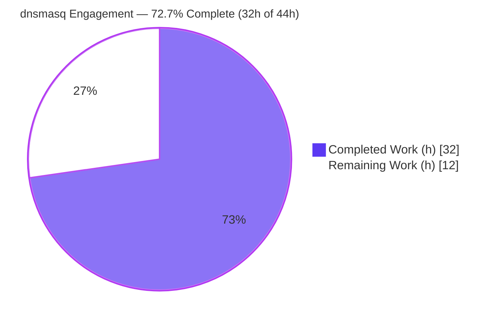
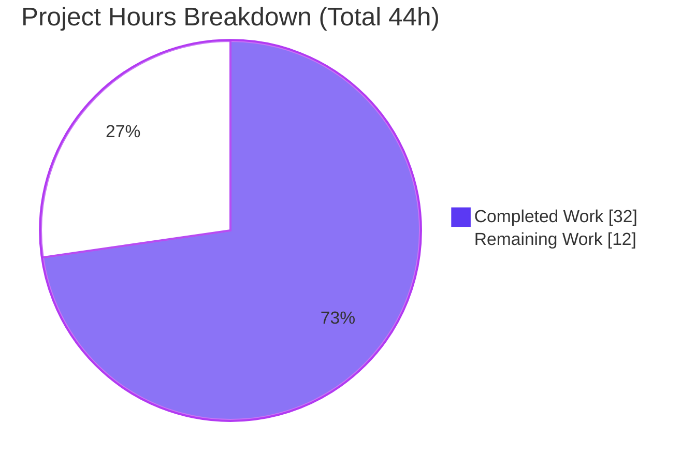
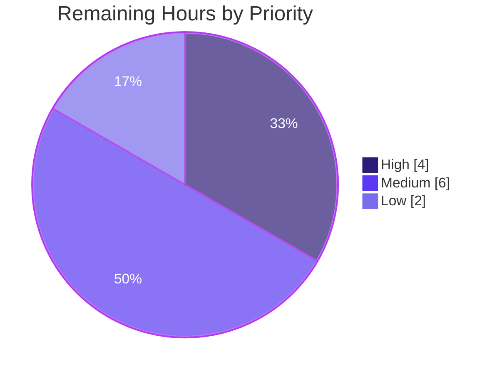

# Blitzy Project Guide — dnsmasq Bug-Fix Engagement

> Engagement branch: `blitzy-3defbaf6-789e-42a3-9a57-6f69d40c8cbe` · HEAD `10b25938` · Author `agent@blitzy.com`
> Completion colors: **Completed / AI Work = Dark Blue `#5B39F3`** · **Remaining = White `#FFFFFF`** · Headings/Accents = Violet-Black `#B23AF2` · Highlight = Mint `#A8FDD9`

---

## 1. Executive Summary

### 1.1 Project Overview

dnsmasq is a lightweight ISO C99 DNS forwarder/cache, DHCP server, TFTP server, and IPv6 router-advertisement daemon (50 source files, ~92.9K lines). This engagement was opened as a **bug fix**, but the bug-intake template arrived **unpopulated** — no symptom, reproduction, suspect file, or expected-vs-actual behavior. Per the governing Agent Action Plan, no root cause is fabricated and no runtime source logic is changed. The autonomously delivered scope is therefore: (1) a rule-mandated self-contained reveal.js executive presentation, (2) a single gated documentation-comment fix in `src/option.c` that clears the lone compiler warning, and (3) full diagnostic readiness (verified build baseline, repository map, and a fix-verification framework) so a concrete defect can be resolved the moment it is supplied.

### 1.2 Completion Status



| Metric | Value |
|--------|-------|
| **Total Project Hours** | **44 h** |
| **Completed Hours (AI + Manual)** | **32 h** (AI: 32 h · Manual: 0 h) |
| **Remaining Hours** | **12 h** |
| **Percent Complete** | **72.7 %** (32 ÷ 44) |

> Completion is measured against AAP-scoped deliverables plus path-to-production work (PA1). 100% of the AAP-defined CREATE/MODIFY/diagnostic deliverables are complete and validated; the residual 27.3% is path-to-production work plus the engagement's blocking ambiguity (the underlying bug was never specified).

### 1.3 Key Accomplishments

- ✅ **Self-contained executive presentation delivered** — `blitzy-deck/executive-summary.html` (16 slides, 4 slide types) renders fully offline over `file://` with **zero external network requests**.
- ✅ **Lone compiler warning eliminated** — the `-Wcomment` diagnostic at `src/option.c:7326` is cleared via a comment-only reword; `make clean && make` now exits 0 with **0 warnings / 0 errors**.
- ✅ **Parse-safety proven** — `dnsmasq --test` accepts a representative DNS/DHCP/TFTP config (exit 0, "syntax check OK"), confirming the comment edit left the option parser intact.
- ✅ **Verified build & runtime baseline** — 469,904-byte ELF64 PIE binary; `--version` / `--test` / `--help` all exit 0.
- ✅ **Brand & dependency compliance** — Blitzy theme inlined; reveal.js 5.1.0, Mermaid 11.4.0, Lucide 0.460.0 pinned and inlined; 3 Mermaid diagrams, 33 Lucide icons, 0 emoji.
- ✅ **Diagnostic readiness documented** — repository/module map, sole-anomaly characterization, missing-information inventory, and a `verify-fix-to-bug-NNNNNN` verification framework.
- ✅ **Clean repository state** — working tree clean; only the 2 in-scope files changed; build artifacts gitignored; submodule clean.

### 1.4 Critical Unresolved Issues

| Issue | Impact | Owner | ETA |
|-------|--------|-------|-----|
| Bug-intake template submitted unpopulated — no concrete defect specified | Engagement's stated bug-fix purpose cannot be fulfilled; no source-logic fix is in scope until a defect is supplied | Product / Requester | Blocked on requester input |
| Debian autopkgtest regression suite not executed | Functional regression of DNS/DHCP/TFTP not yet confirmed in a full environment (low risk: only a comment + static HTML changed) | DevOps / QA | 4 h once a root+container+systemd env is available |
| Executive deck verified in Chrome only | Cross-browser/projector rendering unconfirmed | Presenter / QA | 2 h |

### 1.5 Access Issues

| System / Resource | Type of Access | Issue Description | Resolution Status | Owner |
|-------------------|----------------|-------------------|-------------------|-------|
| Bug-intake template (requirements) | Defect specification | Template submitted with no fields populated; no symptom/repro/suspect file provided | Open — requester must supply details or confirm no defect | Product / Requester |
| Debian autopkgtest runtime | Privileged test env (root + container + systemd + installed `.deb`) | Regression scenarios under `submodules/dnsmasq-debian/debian/tests/` cannot run in the build baseline | Open — needs a provisioned CI/container environment | DevOps |

> Source-code repository access, build toolchain, and the browser needed to view the deck are all available; no credential or repository-permission blockers exist for the delivered work.

### 1.6 Recommended Next Steps

1. **[High]** Populate the bug-intake template (symptom, reproduction, suspect file/function, expected-vs-actual, recent changes) **or confirm no defect exists** — this unblocks any real source fix.
2. **[Medium]** Provision a privileged test environment and run the Debian autopkgtest regression suite to confirm DNS/DHCP/TFTP behavior is unchanged.
3. **[Medium]** Route `blitzy-deck/executive-summary.html` to non-technical leadership for content review and sign-off.
4. **[Low]** Perform cross-browser and projector/display QA of the executive deck (Firefox, Safari, Edge).
5. **[Low, optional]** Add a pre-commit/CI warning gate (the project uses no `-Werror`) to prevent silent reintroduction of comment warnings.

---

## 2. Project Hours Breakdown

### 2.1 Completed Work Detail

| Component | Hours | Description |
|-----------|------:|-------------|
| Executive presentation — slide authoring | 11 | 16 slides across 4 slide types (Title, Section Divider, Content, Closing); inline Blitzy `:root` theme/tokens; content for the 5 mandated topics; KPI cards, tables, accent bars, brand lockup |
| Executive presentation — diagrams, icons & visual QA | 4 | 3 Mermaid diagrams + 33 Lucide icons wired with `ready`/`slidechanged` re-render hooks; responsive, contrast, and visual-fidelity iterations across 6 deck commits |
| Executive presentation — self-containment | 4 | Inlined reveal.js 5.1.0, Mermaid 11.4.0, Lucide 0.460.0 and 6 base64 `woff2` fonts (byte-exact SRI verification); removed all preconnect/integrity/crossorigin external references |
| `src/option.c:7326` `-Wcomment` fix | 1 | Comment-only reword breaking the `/*` adjacency; parse-safety (`--test`) and clean-build re-verification |
| Diagnostic readiness | 7 | Verified build baseline, repository/module map, sole-anomaly characterization, missing-information inventory, and the fix-verification framework |
| Validation & QA | 5 | Clean build, 3 binary smoke tests, deck 42/42 structural checks, self-containment network proof (0 external requests), inline-JS `node --check`, browser runtime render |
| **Total Completed** | **32** | **Matches Section 1.2 Completed Hours** |

### 2.2 Remaining Work Detail

| Category | Hours | Priority |
|----------|------:|----------|
| Bug-report clarification & triage (blocking ambiguity) | 4 | High |
| Regression suite execution (Debian autopkgtest, proper env) | 4 | Medium |
| Executive deck stakeholder review & sign-off | 2 | Medium |
| Executive deck cross-browser & display QA | 2 | Low |
| **Total Remaining** | **12** | **Matches Section 1.2 Remaining Hours & Section 7 pie** |

> The 4 h for clarification & triage covers intake processing and localization only. The **actual fix effort for any real defect is indeterminate** and depends entirely on the supplied symptom (low confidence — see Section 8). An optional CI warning-gate item is excluded from the 12 h to preserve the total.

### 2.3 Total Project Hours & Completion Methodology

- **Total Project Hours = Completed (32 h) + Remaining (12 h) = 44 h.**
- **Completion % = Completed ÷ Total = 32 ÷ 44 = 72.7 %.**
- Methodology: PA1 AAP-scoped + path-to-production only. Every hour traces to a specific AAP requirement (executive deck, gated `option.c` fix, diagnostic readiness, validation) or a path-to-production activity (regression run, deck sign-off/QA) or the blocking-ambiguity clarification cycle.
- Cross-section reconciliation: Section 2.1 total (32) + Section 2.2 total (12) = 44 = Section 1.2 Total; Section 2.2 total (12) = Section 1.2 Remaining = Section 7 "Remaining Work".

---

## 3. Test Results

All tests below originate from Blitzy's autonomous validation logs for this engagement and were independently re-confirmed against the on-disk state. **dnsmasq ships no unit-test framework and no `make test`/`check` target**, so verification is build-, binary-, parse-, and deliverable-centric. Code-coverage instrumentation is not part of the dnsmasq build, so coverage is reported as N/A.

| Test Category | Framework / Tool | Total | Passed | Failed | Coverage % | Notes |
|---------------|------------------|------:|-------:|-------:|:----------:|-------|
| Build / Compilation | GNU Make 4.4.1 + GCC 15.2.0 (`-Wall -W -O2`) | 1 | 1 | 0 | N/A | `make clean && make` → exit 0, 0 warnings, 0 errors, 0 `-Wcomment` |
| Static analysis (in-scope C) | `cc -Wall -W -O2 -fsyntax-only` | 1 | 1 | 0 | N/A | `src/option.c` → 0 diagnostics, no `-Wcomment` |
| Binary smoke | dnsmasq CLI | 3 | 3 | 0 | N/A | `--version`, `--test`, `--help` all exit 0 |
| Config parse | `dnsmasq --test -C` | 1 | 1 | 0 | N/A | server / cache-size / dhcp-range / dhcp-option / dhcp-host / enable-tftp / tftp-root / log-queries → "syntax check OK" |
| Deck structural validation | Custom HTML structural validator | 42 | 42 | 0 | N/A | doctype, balanced html/head/body, 16 `<section>`, visuals per slide |
| Deck self-containment | Network request inspection (`file://`) | 1 | 1 | 0 | N/A | Exactly 4 requests (HTML + 3 `data:` font URIs); 0 external http/https |
| Deck inline-JS syntax | `node --check` | 4 | 4 | 0 | N/A | All 4 inline `<script>` blocks parse cleanly |
| Browser runtime render | Chrome (DevTools) | 1 | 1 | 0 | N/A | `Reveal.isReady()=true`; 16 slides; 3 Mermaid SVGs; 33 Lucide icons; 0 console errors |
| **Total** | — | **54** | **54** | **0** | **N/A** | **100% pass across all runnable autonomous checks** |

> **Not run (environment-blocked):** Debian autopkgtest scenarios (`compile-time-options`, `get-address+query-dns+check-utils`, etc.) require root + container + systemd + installed `.deb` packages and are not runnable in the build baseline. They are unaffected by a comment reword and an HTML deliverable and are tracked as remaining work (Section 2.2, 4 h).

---

## 4. Runtime Validation & UI Verification

**Build & daemon runtime**
- ✅ **Operational** — `make clean && make` exits 0 with 0 warnings/0 errors; 469,904-byte ELF64 PIE binary produced.
- ✅ **Operational** — `./src/dnsmasq --version` exits 0 and reports the compile-time feature set (IPv6, DHCP, DHCPv6, TFTP, ipset, auth, loop-detect, inotify, dumpfile).
- ✅ **Operational** — `./src/dnsmasq --test` returns "syntax check OK." (exit 0) for a representative DNS/DHCP/TFTP configuration.
- ✅ **Operational** — `./src/dnsmasq --help` exits 0.
- ℹ️ **Informational** — version reports `UNKNOWN` (the `$Format:%d$` placeholder); this is the expected behavior for a non-`git-archive` checkout, not a defect.

**Executive deck UI verification (`blitzy-deck/executive-summary.html`)**
- ✅ **Operational** — renders standalone over `file://` with zero network requests; `Reveal.isReady()=true`.
- ✅ **Operational** — 16 slides present; all four slide types implemented (Title, Divider, Content, Closing).
- ✅ **Operational** — 3 Mermaid diagrams render to SVG; 33 Lucide icons render to `<svg>`; 0 console errors.
- ✅ **Operational** — every slide carries at least one non-text visual (Mermaid diagram, KPI card, styled table, or icon); 0 emoji.
- ⚠ **Partial** — verified in Chrome only; cross-browser and projector/display rendering not yet confirmed (Section 2.2, 2 h).

**API / external integrations**
- ✅ **Operational (unchanged)** — no external service integrations, API keys, or network configuration were introduced; the dnsmasq DNS/DHCP/TFTP integration surface is untouched.

---

## 5. Compliance & Quality Review

This matrix cross-maps AAP deliverables and rules to Blitzy quality/compliance benchmarks, recording fixes applied during autonomous validation and any outstanding items.

| Benchmark / AAP Requirement | Status | Progress | Evidence / Notes |
|-----------------------------|:------:|:--------:|------------------|
| Minimal, exact change (no source logic touched) | ✅ Pass | 100% | Only `src/option.c` (1 comment line) + new `blitzy-deck/executive-summary.html`; 0 of 50 source files' logic changed |
| Zero modifications outside documented scope (§0.6) | ✅ Pass | 100% | `config.h` defaults, build system, `VERSION`, docs, submodules all unchanged |
| Clean build under `-Wall -W -O2`, no new warnings | ✅ Pass | 100% | `make` exits 0; the lone `-Wcomment` is eliminated (1 → 0) |
| ISO C99 conformance | ✅ Pass | 100% | Comment-only edit; compiles under project default `CFLAGS` |
| Zero-placeholder policy | ✅ Pass | 100% | 0 TODO/FIXME/placeholder/Lorem in both in-scope files |
| Executive Presentation rule — single self-contained reveal.js HTML | ✅ Pass | 100% | One file; 0 external requests; works offline |
| Deck: pinned CDN versions (reveal 5.1.0 / Mermaid 11.4.0 / Lucide 0.460.0) | ✅ Pass | 100% | Versions present verbatim and inlined |
| Deck: Blitzy brand palette/typography/gradients, inline `:root` theme | ✅ Pass | 100% | Inline `<style>`; absent canonical theme file substituted per §0.4.4 |
| Deck: 12–18 slides (target 16), 4 slide types, ≥1 visual/slide, 0 emoji | ✅ Pass | 100% | 16 slides; 3 Mermaid + 33 Lucide + 5 tables + 14 KPI cards; 0 emoji |
| Deck: Mermaid `startOnLoad:false` + Lucide `createIcons` on `ready`/`slidechanged` | ✅ Pass | 100% | Init hooks verified present |
| Parse-safety after comment edit | ✅ Pass | 100% | `--test` config-parse exit 0 across DHCP/TFTP directives |
| Regression suite (Debian autopkgtest) executed | ⚠ Outstanding | 0% | Environment-blocked; 4 h remaining (Section 2.2) |
| Concrete defect resolved | ⛔ Blocked | N/A | No defect specified; deferred per AAP §0.5.1 until requester input |

**Fixes applied during autonomous validation:** (1) reworded `src/option.c:7326` to clear `-Wcomment`; (2) inlined all CDN assets and Google Fonts and removed external references so the deck is fully self-contained; earlier QA cycles also pinned Mermaid to 11.4.0 and corrected responsive/contrast/visual findings.

---

## 6. Risk Assessment

| Risk | Category | Severity | Probability | Mitigation | Status |
|------|----------|:--------:|:-----------:|------------|--------|
| Unspecified defect / blocking ambiguity — bug never described | Technical / Process | High | Certain | Diagnostic readiness + missing-information inventory delivered; requester must populate the intake template or confirm no defect | Open (mitigated by clarification request) |
| Comment edit inside the 8,128-line `option.c` option parser | Technical | Low | Very Low | Verified comment-only (1-line diff); 0 build warnings; `--test` parse OK across DHCP/TFTP | Resolved |
| Regression suite not executed in baseline | Technical | Low | Very Low | Only a comment + static HTML changed (no runtime logic); covered by build + smoke + scope analysis | Open (deferred to proper env) |
| Self-contained deck inlines ~3.4 MB third-party libraries | Security | Low | Low | Versions pinned & byte-exact SRI-verified; static artifact, no user input, no network; outside dnsmasq attack surface | Mitigated |
| dnsmasq daemon attack surface | Security | None | N/A | No new runtime code, dependencies, or parsing introduced | No new exposure |
| Deck file size (3.4 MB single HTML) | Operational | Low | Low | Acceptable tradeoff for full offline self-containment; opened locally | Accepted |
| Binary reports `VERSION = UNKNOWN` | Operational | Low (info) | N/A | Expected `$Format:%d$` behavior for non-`git-archive` checkout; substituted at release | Expected (not a defect) |
| No `-Werror` / CI warning gate | Operational | Low | Low | Optional pre-commit/CI warning gate recommended | Open (advisory) |
| Deck rendering verified in Chrome only | Integration | Low | Low | reveal/Mermaid/Lucide are broadly cross-browser; cross-browser QA scheduled | Open (2 h remaining) |
| External service integrations | Integration | None | N/A | DNS/DHCP/TFTP integrations untouched; no credentials/network config added | No risk |

**Overall:** Risk to the dnsmasq daemon is essentially nil — the only changes are a documentation comment and a standalone HTML deliverable. The dominant risk is process-level: the engagement's bug-fix purpose remains unfulfilled until the requester supplies a concrete defect.

---

## 7. Visual Project Status

**Project hours — completed vs remaining** (Completed = `#5B39F3`, Remaining = `#FFFFFF`)



**Remaining work — priority distribution** (12 h total)



**Remaining hours by category** (each █ ≈ 0.5 h; bars in Blitzy primary `#5B39F3`)

| Category | Hours | Distribution |
|----------|------:|--------------|
| Bug clarification & triage | 4 | ████████ |
| Regression suite (autopkgtest) | 4 | ████████ |
| Deck stakeholder sign-off | 2 | ████ |
| Deck cross-browser QA | 2 | ████ |
| **Total** | **12** | |

> Integrity: "Remaining Work" = 12 h matches Section 1.2 Remaining Hours and the Section 2.2 "Hours" total. "Completed Work" = 32 h matches Section 1.2 Completed Hours and the Section 2.1 total.

---

## 8. Summary & Recommendations

**Achievements.** This engagement is **72.7% complete** (32 of 44 hours). 100% of the AAP-defined CREATE/MODIFY and diagnostic deliverables are finished and validated: a fully self-contained 16-slide reveal.js executive presentation, the single gated `src/option.c:7326` comment fix that clears the lone `-Wcomment` warning, and a documented diagnostic-readiness package. The tree builds clean (0 warnings), the binary passes all smoke tests, the option parser is proven intact, and the deck renders offline with zero network requests.

**Remaining gaps (12 h).** The residual work is path-to-production plus one blocking ambiguity: (a) **resolve the unspecified defect** — the requester must populate the bug-intake template or confirm no defect exists (4 h triage; **actual fix effort is indeterminate** and depends on the eventual symptom); (b) **run the Debian autopkgtest regression suite** in a privileged environment (4 h); (c) **stakeholder sign-off** of the deck (2 h); and (d) **cross-browser QA** of the deck (2 h).

**Critical path to production.** The single gating item is requirement clarification. Until a concrete defect (or a "no defect" confirmation) is provided, no source-logic fix can be made — this is by design, not omission. Once supplied, the verification framework is ready: reproduce → localize → fix → add a `verify-fix-to-bug-NNNNNN` autopkgtest scenario → rebuild clean → run functional + regression checks.

**Production readiness.** The delivered artifacts are production-ready: the comment fix is merged and clean, and the executive deck is a finished, self-contained presentation. The *engagement as a bug fix* is not production-complete, because its core premise — a described defect — was never provided.

**Success metrics.**

| Metric | Result |
|--------|--------|
| Clean build (`make`, 0 warnings) | ✅ Achieved |
| `-Wcomment` warning eliminated | ✅ 1 → 0 |
| Binary smoke tests | ✅ 3/3 exit 0 |
| Deck self-contained (0 external requests) | ✅ Achieved |
| Autonomous checks passed | ✅ 54/54 |
| In-scope files changed | ✅ Exactly 2, working tree clean |
| Concrete defect resolved | ⛔ Blocked on requester input |

**Confidence.** High confidence on all completed/validated work (directly reproduced). Low confidence on the eventual defect-fix effort, which cannot be bounded without a symptom.

---

## 9. Development Guide

### 9.1 System Prerequisites

- **OS:** Linux (verified on Ubuntu 25.10). dnsmasq also builds on the BSDs/macOS.
- **Toolchain (verified):** GCC 15.2.0 (AAP recommends GCC 7.0+/Clang 10.0+); GNU Make 4.4.1; standard C library development headers.
- **To view the deck:** any modern web browser (verified with Google Chrome 148). No server, build step, or network access required.
- **Optional:** Node.js (v20.20.2 verified) only if you wish to re-run inline-JS syntax checks on the deck.

```bash
# Verify the toolchain is present
gcc --version        # expect GCC (>= 7.0)
make --version       # expect GNU Make
```

### 9.2 Environment Setup

No virtual environment, package install, or environment variables are required for the default feature set. dnsmasq builds with the project default `CFLAGS = -Wall -W -O2`. Optional compile-time features (DBus, Lua, DNSSEC, conntrack, nftset) are documented in `docs/BUILDING.md` and are **off by default**.

```bash
# From the repository root
cd /path/to/dnsmasq          # the directory containing Makefile and src/
```

### 9.3 Dependency Installation

The default build needs only a C compiler, GNU make, and libc headers. On Debian/Ubuntu, if the toolchain is missing:

```bash
sudo apt-get update
sudo DEBIAN_FRONTEND=noninteractive apt-get install -y build-essential
```

### 9.4 Build

```bash
# Clean, then build (optionally parallel). Verified: exit 0, 0 warnings, 0 errors.
make clean && make
# or, faster:
make clean && make -j"$(nproc)"
```

Expected: compilation of all `src/*.c` and a final link producing `src/dnsmasq` (~469 KB ELF64 PIE), with **no warnings**.

### 9.5 Run & Verify

```bash
# 1) Version + compile-time feature set (exit 0). 'UNKNOWN' version is expected for a non-git-archive checkout.
./src/dnsmasq --version

# 2) Configuration syntax check (exit 0 -> "dnsmasq: syntax check OK.")
./src/dnsmasq --test

# 3) Help (exit 0)
./src/dnsmasq --help

# 4) Confirm the -Wcomment warning is gone (expect: 0)
make clean && make 2>&1 | grep -c Wcomment
```

Optional — validate a representative DNS/DHCP/TFTP configuration:

```bash
cat > /tmp/dnsmasq-smoke.conf <<'CONF'
server=8.8.8.8
cache-size=150
dhcp-range=192.168.0.50,192.168.0.150,12h
dhcp-option=3,192.168.0.1
enable-tftp
tftp-root=/tmp
log-queries
CONF
./src/dnsmasq --test -C /tmp/dnsmasq-smoke.conf   # expect "syntax check OK." (exit 0)
```

Optional — run the daemon in the foreground on an unprivileged port (no root needed). Binding the default port 53 or serving DHCP requires root/`CAP_NET_BIND_SERVICE`:

```bash
./src/dnsmasq --no-daemon --port=5353 --conf-file=/dev/null \
              --no-resolv --server=8.8.8.8 --log-queries
# Press Ctrl-C to stop.
```

### 9.6 View the Executive Presentation

```bash
# Simply open the file in a browser — it is fully self-contained (works offline).
#   Linux:  xdg-open blitzy-deck/executive-summary.html
#   macOS:  open      blitzy-deck/executive-summary.html

# Headless verification (counts the 16 authored slides):
google-chrome --headless --no-sandbox \
  --dump-dom "file://$PWD/blitzy-deck/executive-summary.html" | grep -c "</section>"

# Self-containment check (expect: external refs = 0, slides = 16):
python3 - <<'PY'
import re
s = open("blitzy-deck/executive-summary.html", encoding="utf-8", errors="replace").read()
print("external http(s) refs:", len(re.findall(r'(?:src|href)="https?://', s)))
print("authored slides:", s.count("</section>"))
PY
```

### 9.7 Troubleshooting

| Symptom | Cause | Resolution |
|---------|-------|------------|
| `make: command not found` or `cc: command not found` | Build toolchain not installed | `sudo apt-get install -y build-essential` |
| `failed to create listening socket for port 53: Permission denied` | Privileged port/DHCP needs root | Run with `sudo`, grant `CAP_NET_BIND_SERVICE`, or use `--port=5353` |
| `--version` shows `UNKNOWN` | `$Format:%d$` placeholder in a non-`git-archive` checkout | Expected; release tarballs built via `git archive` substitute the real version |
| Deck takes a moment to open | 3.4 MB self-contained HTML (all assets inlined) | Normal; ensures fully offline rendering |
| Debian autopkgtest won't run | Requires root + container + systemd + installed `.deb` | Provision a CI/container env; out of scope for the build baseline |

---

## 10. Appendices

### Appendix A — Command Reference

| Command | Purpose |
|---------|---------|
| `make clean && make` | Clean build → `src/dnsmasq` (0 warnings) |
| `make -j"$(nproc)"` | Parallel build |
| `./src/dnsmasq --version` | Print version + compile-time feature set |
| `./src/dnsmasq --test` | Configuration syntax check |
| `./src/dnsmasq --test -C <file>` | Syntax-check a specific config file |
| `./src/dnsmasq --help` | List all options |
| `make clean && make 2>&1 \| grep -c Wcomment` | Confirm `-Wcomment` is cleared (expect 0) |
| `git show 10b25938 -- src/option.c` | Review the comment-only fix |
| `xdg-open blitzy-deck/executive-summary.html` | Open the executive deck |

### Appendix B — Port Reference

| Port | Protocol | Purpose | Notes |
|------|----------|---------|-------|
| 53 | UDP/TCP | DNS (default) | Privileged; needs root/`CAP_NET_BIND_SERVICE` |
| 67 / 68 | UDP | DHCPv4 server/client | Requires root |
| 547 / 546 | UDP | DHCPv6 | Requires root |
| 69 | UDP | TFTP (when `--enable-tftp`) | — |
| 5353 | UDP/TCP | Suggested unprivileged port for non-root smoke tests | Example only |

### Appendix C — Key File Locations

| Path | Role |
|------|------|
| `blitzy-deck/executive-summary.html` | **Delivered** — self-contained reveal.js executive presentation |
| `src/option.c` (line 7326) | **Modified** — comment-only `-Wcomment` fix |
| `src/dnsmasq.c`, `src/forward.c`, `src/cache.c`, `src/rfc1035.c` | Core runtime + DNS (unchanged) |
| `src/dhcp.c`, `src/rfc2131.c`, `src/dhcp6.c`, `src/rfc3315.c`, `src/lease.c` | DHCP (unchanged) |
| `src/tftp.c`, `src/dbus.c`, `src/ubus.c`, `src/ipset.c` | Integration (unchanged) |
| `Makefile` | Build entry point (`CFLAGS = -Wall -W -O2`) |
| `submodules/dnsmasq-debian/debian/tests/` | Debian autopkgtest regression scenarios (incl. `verify-fix-to-bug-871958` precedent) |
| `docs/BUILDING.md` | Build options and optional features |

### Appendix D — Technology Versions

| Component | Version | Source |
|-----------|---------|--------|
| GCC / cc | 15.2.0 (Ubuntu) | Verified on host |
| GNU Make | 4.4.1 | Verified on host |
| Node.js (optional) | v20.20.2 | Verified on host |
| Google Chrome | 148 | Verified on host |
| Git | 2.51.0 | Verified on host |
| reveal.js | 5.1.0 (pinned, inlined) | Deck |
| Mermaid | 11.4.0 (pinned, inlined) | Deck |
| Lucide | 0.460.0 (pinned, inlined) | Deck |
| Fonts | Inter, Space Grotesk, Fira Code (inlined `woff2`) | Deck |

### Appendix E — Environment Variable Reference

No environment variables are required to build, run, or view the delivered artifacts. dnsmasq is configured via command-line options or a config file (see Appendix A). For non-interactive package installs use `DEBIAN_FRONTEND=noninteractive`.

### Appendix F — Developer Tools Guide

| Tool | Use |
|------|-----|
| `cc -Wall -W -O2 -fsyntax-only src/option.c` | Read-only syntax/diagnostic check of the modified file (expect 0 diagnostics) |
| `node --check <script>` | Validate inline `<script>` blocks extracted from the deck |
| `git diff df2ec0e2 HEAD --stat` | Review the full branch change set (2 in-scope files + Blitzy-internal docs) |
| Chrome DevTools | Inspect deck render, console (0 errors), and network (0 external requests) |
| Valgrind / GDB | Recommended by project convention for any future memory/logic defect fix |

### Appendix G — Glossary

| Term | Meaning |
|------|---------|
| AAP | Agent Action Plan — the governing engagement directive |
| Blocking ambiguity | The unpopulated bug-intake template that prevents a concrete source fix |
| Gated candidate | A change applied only on confirmation — here, the `option.c:7326` comment reword |
| `-Wcomment` | GCC warning emitted for a `/*` sequence inside an open block comment |
| Self-contained deck | An HTML file with all CSS/JS/fonts inlined; renders offline with no network |
| autopkgtest | Debian's as-installed functional test framework (used by dnsmasq for regression scenarios) |
| `$Format:%d$` | Git export placeholder; substituted by `git archive` to embed the release version |