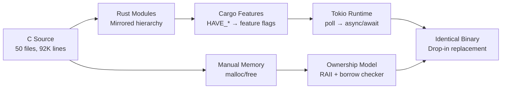

# Technical Specification

# 0. Agent Action Plan

## 0.1 Intent Clarification


### 0.1.1 Core Refactoring Objective

Based on the prompt, the Blitzy platform understands that the refactoring objective is to perform a **complete technology stack migration of the dnsmasq daemon from C (ISO C99) to Rust (1.91.0 stable)**, driven by the primary goal of eliminating all memory-safety vulnerabilities inherent in the C implementation — including buffer overflows, use-after-free, double-free, and dangling pointer issues — by leveraging Rust's ownership system, borrow checker, and lifetime annotations.

- **Refactoring type:** Tech stack migration (C → Rust) with memory-safety modernization
- **Target repository:** Same repository — the Rust implementation will coexist alongside the existing C source, allowing parallel builds during the transition period
- **Refactoring goals with enhanced clarity:**
  - **Memory Safety Modernization** — Replace all manual memory management (`malloc`/`free`/`realloc`, `safe_malloc`/`whine_malloc` wrappers in `util.c`) with Rust's RAII, `Box`, `Vec`, `String`, `Arc`, and `Rc` smart pointers; enforce compile-time memory safety across the entire codebase of 92,894 lines (50 source files)
  - **Functional Preservation** — Maintain 100% feature parity with dnsmasq v2.92's DNS forwarding, DHCP v4/v6 server, DHCPv6 prefix delegation, Router Advertisement, TFTP server, PXE network boot, DNSSEC validation, and authoritative DNS capabilities
  - **Drop-in Replacement** — The Rust binary must accept identical configuration files (`dnsmasq.conf` INI-style format, 350+ directives), produce identical network behavior (packet formats, timing, retry logic), and serve as a drop-in replacement for the existing systemd service unit
  - **Configuration Compatibility** — 100% backward compatibility with existing `dnsmasq.conf` files, command-line flags, and environment variable overrides
  - **Async I/O Modernization** — Replace the C single-process poll-based event loop (`poll.c`, `dnsmasq.c` main loop) with Rust's `async`/`await` paradigm backed by `tokio`, while preserving the single-process, event-driven architecture
- **Implicit requirements surfaced by analysis:**
  - Maintain identical privilege separation behavior (bind to ports <1024, then drop privileges)
  - Preserve the `HAVE_*` feature flag system as Cargo feature flags for conditional compilation
  - Maintain signal handling semantics (SIGHUP for config reload, SIGUSR1/SIGUSR2 for cache dump/statistics)
  - Preserve lease file format and persistence behavior for seamless upgrades
  - Maintain D-Bus interface contract for NetworkManager integration
  - Preserve `/etc/hosts` file monitoring via inotify and `/etc/resolv.conf` parsing

### 0.1.2 Technical Interpretation

This refactoring translates to the following technical transformation strategy:

- **Current Architecture:** Single-process, event-driven C daemon using `poll(2)` for I/O multiplexing, manual memory management with bounded data structures (DNS cache: 150 default, MAXLEASES: 1000, FTABSIZ: 150 outstanding requests, TFTP_MAX_CONNECTIONS: 50), compiled with GCC/Clang under ISO C99, with 12 core functional modules
- **Target Architecture:** Single-binary Rust daemon using `tokio` async runtime with `epoll`/`kqueue` backend (via `mio`), Rust ownership model for memory management, `enum`-based error handling replacing errno patterns, and Cargo feature flags replacing `HAVE_*`/`NO_*` C preprocessor macros
- **Transformation rules:**
  - Each C source file (`.c`) maps to a corresponding Rust module (`.rs`) within a mirrored module hierarchy
  - C header files (`.h`) dissolve into Rust module-level `pub` type/trait/struct definitions
  - Manual `malloc`/`free` → Rust `Vec`, `Box`, `String` with automatic drop semantics
  - C `union` types → Rust `enum` with pattern matching
  - C function pointers → Rust trait objects or closures
  - C `goto` error cleanup → Rust `?` operator and `Result<T, E>` propagation
  - C preprocessor conditionals (`#ifdef HAVE_DHCP`) → Cargo feature flags (`#[cfg(feature = "dhcp")]`)
  - C global mutable state (`struct daemon` in `dnsmasq.h`) → Rust application state struct passed through `Arc<RwLock<...>>` or function parameters
  - C `poll()` event loop → `tokio::select!` with async socket I/O



### 0.1.3 Success Criteria

- Zero memory-safety vulnerabilities detected by the Rust compiler and `cargo-audit`
- All existing dnsmasq test suites pass without modification when run against the Rust binary
- Configuration file compatibility maintained — 100% backward compatible with existing `dnsmasq.conf` files
- Zero `unsafe` blocks in core logic; FFI exceptions are allowed and documented for platform-specific code (e.g., `libc` bindings for privilege dropping, raw socket operations)
- Unit test coverage exceeding 80% as measured by `cargo-tarpaulin`
- Property-based test coverage for DNS and DHCP protocol correctness via `proptest`


## 0.2 Source Analysis


### 0.2.1 Comprehensive Source File Discovery

The dnsmasq repository at version 2.92 contains **50 source files** (44 `.c` implementation files and 6 `.h` header files) totaling **92,894 lines** in the `src/` directory. All C source files are refactoring targets for the Rust migration.

**Search patterns applied to identify all files:**
- `src/*.c` — All 44 C implementation files (core logic, protocol handlers, platform abstractions, integrations)
- `src/*.h` — All 6 C header files (global declarations, protocol constants, configuration macros)
- `contrib/**/*.pl` — Perl integration helpers (reference only, not migrated)
- `man/dnsmasq.8` — Man page documentation (141 KB reference for CLI/config behavior)
- `dbus/*.conf` — D-Bus system bus configuration (preserved as-is)
- `Makefile` — Build system (explicitly out of scope, preserved)

### 0.2.2 Current Structure Mapping

```
Current:
src/
├── [Core Runtime — 19,509 lines]
│   ├── dnsmasq.c        (3,827 lines — main entry, event loop, signal handling, initialization)
│   ├── dnsmasq.h         (2,233 lines — global type declarations, struct daemon, function prototypes)
│   ├── config.h          (3,020 lines — compile-time constants, HAVE_* feature flags, platform detection)
│   ├── poll.c            (484 lines — poll() abstraction, fd set management)
│   ├── option.c          (8,128 lines — config file parser, CLI arg processing, 350+ directives)
│   ├── log.c             (1,120 lines — logging subsystem, syslog integration, async-safe logging)
│   └── util.c            (2,730 lines — memory allocation wrappers, string utilities, safe_malloc)
│
├── [DNS Subsystem — 21,856 lines]
│   ├── forward.c         (6,068 lines — DNS query forwarding, upstream server selection, retry logic)
│   ├── cache.c           (4,119 lines — DNS cache management, hash table, TTL expiry, NXDOMAIN caching)
│   ├── rfc1035.c         (3,622 lines — DNS packet construction/parsing, wire format, compression)
│   ├── dnssec.c          (4,009 lines — DNSSEC validation, signature verification, chain of trust)
│   ├── crypto.c          (1,295 lines — cryptographic operations, Nettle/hogweed integration)
│   ├── edns0.c           (1,340 lines — EDNS0 extensions, client subnet, DNS cookie)
│   ├── rrfilter.c        (918 lines — DNS resource record filtering)
│   ├── dns-protocol.h    (873 lines — DNS protocol constants, RR types, opcodes, RCODE definitions)
│   ├── auth.c            (1,284 lines — authoritative DNS zone serving)
│   ├── domain-match.c    (1,591 lines — domain name matching, wildcard patterns, server selection)
│   ├── domain.c          (707 lines — domain synthesis for reverse DNS)
│   ├── blockdata.c       (810 lines — block-allocated data storage for DNSSEC records)
│   └── loop.c            (539 lines — DNS forwarding loop detection)
│
├── [DHCP Subsystem — 20,569 lines]
│   ├── rfc2131.c         (5,209 lines — DHCPv4 protocol, DISCOVER/OFFER/REQUEST/ACK state machine)
│   ├── rfc3315.c         (4,216 lines — DHCPv6 protocol, SOLICIT/ADVERTISE/REQUEST/REPLY)
│   ├── dhcp.c            (2,344 lines — DHCP server initialization, packet dispatch, raw socket I/O)
│   ├── dhcp6.c           (1,487 lines — DHCPv6 server, prefix delegation)
│   ├── dhcp-common.c     (2,337 lines — shared DHCP utilities, option encoding/decoding)
│   ├── lease.c           (3,364 lines — lease management, persistence, lease file I/O)
│   ├── radv.c            (2,175 lines — IPv6 Router Advertisement daemon)
│   ├── slaac.c           (537 lines — SLAAC address tracking)
│   ├── outpacket.c       (702 lines — DHCPv6 outgoing packet construction)
│   ├── dhcp-protocol.h   (936 lines — DHCPv4 option codes, message types)
│   ├── dhcp6-protocol.h  (685 lines — DHCPv6 option codes, message types)
│   ├── radv-protocol.h   (869 lines — Router Advertisement ICMPv6 constants)
│   └── ip6addr.h         (183 lines — IPv6 address manipulation macros)
│
├── [Network & Platform — 8,351 lines]
│   ├── network.c         (6,331 lines — interface enumeration, socket binding, listener management)
│   ├── netlink.c         (740 lines — Linux netlink socket interface, route/addr monitoring)
│   ├── bpf.c             (805 lines — BSD BPF raw packet capture)
│   └── arp.c             (475 lines — ARP table inspection)
│
├── [Integration — 6,038 lines]
│   ├── dbus.c            (2,175 lines — D-Bus interface, NetworkManager integration)
│   ├── ubus.c            (968 lines — OpenWrt ubus integration)
│   ├── helper.c          (1,528 lines — script execution helper, lease-change callbacks)
│   ├── conntrack.c       (324 lines — Linux conntrack mark support)
│   ├── ipset.c           (532 lines — Linux ipset/netlink integration)
│   ├── nftset.c          (392 lines — nftables set integration)
│   └── tables.c          (386 lines — routing table interaction, FreeBSD)
│
├── [Services — 1,647 lines]
│   └── tftp.c            (1,647 lines — TFTP server, PXE boot support)
│
├── [Diagnostics & Monitoring — 2,167 lines]
│   ├── dump.c            (815 lines — packet dump for debugging)
│   ├── inotify.c         (687 lines — inotify file watch, /etc/hosts change detection)
│   ├── metrics.c         (315 lines — runtime metrics counters)
│   ├── metrics.h         (365 lines — metrics enum definitions)
│   └── pattern.c         (648 lines — wildcard/glob pattern matching)
│
docs/
├── CHANGELOG              (developer change log)
├── CHANGELOG.archive      (historical change log)
├── DBus-interface         (D-Bus API specification)
├── dnsmasq-xml.pdf        (XML configuration documentation, PDF)
├── doc.html               (HTML API documentation)
├── example.conf           (reference configuration with all directives)
├── FAQ                    (frequently asked questions)
├── metrics.txt            (metrics endpoint documentation)
└── setup.html             (installation/setup guide)
│
contrib/
├── dynamic-dnsmasq/
│   └── dynamic-dnsmasq.pl (dynamic DNS update Perl script)
├── lease-tools/
│   └── dhcp_lease_time.c  (lease time query C utility)
│   └── dhcp_release.c     (lease release C utility)
│   └── dhcp_release6.c    (DHCPv6 lease release)
├── dnslist/
│   └── dnslist.pl         (DHCP lease monitoring Perl dashboard)
├── port-forward/
│   └── dnsmasq-portforward (port forwarding helper)
├── try-resolve/
│   └── try-resolve.c      (DNS resolution test utility)
└── webmin/
    └── dnsmasq.wbm        (Webmin administration module)
│
dbus/
└── DBus-interface.conf    (D-Bus system bus activation configuration)
│
man/
├── dnsmasq.8              (141 KB man page — comprehensive CLI/config reference)
├── es/dnsmasq.8           (Spanish translation)
└── fr/dnsmasq.8           (French translation)
│
bld/
└── Android.mk             (Android build system fragment)
```

### 0.2.3 Source File Inventory by Complexity

All 50 source files are comprehensively listed below with their line counts and refactoring complexity classification:

| File | Lines | Category | Complexity | Key Refactoring Challenge |
|------|-------|----------|------------|--------------------------|
| option.c | 8,128 | Core Runtime | Very High | Massive parser with 350+ config directives, deeply nested switch statements |
| network.c | 6,331 | Platform | Very High | Heavy platform-specific socket code, interface enumeration, raw sockets |
| forward.c | 6,068 | DNS | Very High | Complex async forwarding logic, upstream server selection, retry/timeout |
| rfc2131.c | 5,209 | DHCP | Very High | Full DHCPv4 state machine, packet construction, option processing |
| rfc3315.c | 4,216 | DHCP | High | DHCPv6 protocol, prefix delegation, complex option encoding |
| cache.c | 4,119 | DNS | High | Hash table with manual memory, TTL management, cache eviction |
| dnssec.c | 4,009 | DNS | Very High | Cryptographic validation chains, signature verification, key trust |
| dnsmasq.c | 3,827 | Core Runtime | High | Main event loop, initialization, signal handling, global state setup |
| rfc1035.c | 3,622 | DNS | High | DNS wire format parsing, name compression, packet construction |
| lease.c | 3,364 | DHCP | High | Lease persistence, file I/O, lease state machine |
| config.h | 3,020 | Core Runtime | Medium | Feature flag definitions, platform detection, constants |
| util.c | 2,730 | Core Runtime | Medium | Memory wrappers (safe_malloc), string utilities, helper functions |
| dhcp.c | 2,344 | DHCP | High | Raw socket DHCP I/O, packet dispatch, BPF filter setup |
| dhcp-common.c | 2,337 | DHCP | Medium | Shared option encode/decode, vendor class matching |
| dnsmasq.h | 2,233 | Core Runtime | High | Global struct definitions, all function prototypes, type aliases |
| radv.c | 2,175 | DHCP | High | Router Advertisement construction, prefix/route advertisement |
| dbus.c | 2,175 | Integration | Medium | D-Bus message handling, property getters, signal emission |
| domain-match.c | 1,591 | DNS | Medium | Domain matching algorithms, server selection rules |
| helper.c | 1,528 | Integration | Medium | Script execution (fork/exec), lease-change notifications |
| dhcp6.c | 1,487 | DHCP | Medium | DHCPv6 initialization, relay agent support |
| edns0.c | 1,340 | DNS | Medium | EDNS0 option processing, client subnet, DNS cookies |
| crypto.c | 1,295 | DNS | High | Nettle library FFI, digest/signature verification |
| auth.c | 1,284 | DNS | Medium | Authoritative zone serving, SOA/NS record generation |
| log.c | 1,120 | Core Runtime | Medium | Async-safe syslog logging, connection-based logging |
| ubus.c | 968 | Integration | Low | OpenWrt ubus message bus integration |
| dhcp-protocol.h | 936 | DHCP | Low | DHCP option code constants, message type definitions |
| rrfilter.c | 918 | DNS | Low | RR type filtering, response manipulation |
| radv-protocol.h | 869 | DHCP | Low | ICMPv6 RA protocol constants |
| dns-protocol.h | 873 | DNS | Low | DNS RR type codes, opcode constants |
| blockdata.c | 810 | DNS | Medium | Block-allocated storage, DNSSEC record caching |
| dump.c | 815 | Diagnostics | Low | pcap-format packet dump for debugging |
| bpf.c | 805 | Platform | Medium | BSD BPF device access, filter program assembly |
| domain.c | 707 | DNS | Low | Reverse DNS domain synthesis |
| outpacket.c | 702 | DHCP | Low | DHCPv6 output packet buffer management |
| netlink.c | 740 | Platform | Medium | Linux netlink protocol, address/route change monitoring |
| inotify.c | 687 | Diagnostics | Low | inotify watch for /etc/hosts and /etc/resolv.conf changes |
| dhcp6-protocol.h | 685 | DHCP | Low | DHCPv6 option and message type constants |
| pattern.c | 648 | Core Runtime | Low | Wildcard/glob pattern matching |
| slaac.c | 537 | DHCP | Low | SLAAC address tracking and ping checks |
| loop.c | 539 | DNS | Low | DNS forwarding loop detection |
| ipset.c | 532 | Integration | Low | Linux ipset netlink integration |
| poll.c | 484 | Core Runtime | Medium | Poll abstraction, fd set management |
| arp.c | 475 | Platform | Low | ARP cache reading (platform-specific) |
| nftset.c | 392 | Integration | Low | nftables set manipulation |
| tables.c | 386 | Integration | Low | Routing table interaction (FreeBSD) |
| metrics.h | 365 | Diagnostics | Low | Metrics counter enum definitions |
| conntrack.c | 324 | Integration | Low | Linux conntrack mark tagging |
| metrics.c | 315 | Diagnostics | Low | Metrics counter increment/query |
| ip6addr.h | 183 | DHCP | Low | IPv6 address utility macros |

### 0.2.4 Module Interdependency Analysis

The C codebase uses a monolithic compilation model where `dnsmasq.h` serves as the universal header included by every `.c` file. The global `struct daemon` (defined in `dnsmasq.h`) holds all runtime state and is accessed directly by every module. Key dependency clusters:

- **DNS Core** (`forward.c`, `cache.c`, `rfc1035.c`) — tightly coupled through shared packet buffer handling and the global DNS cache
- **DHCP Core** (`rfc2131.c`, `rfc3315.c`, `dhcp.c`, `lease.c`) — tightly coupled through the shared lease database and DHCP context structures
- **Platform Abstraction** (`network.c`, `netlink.c`, `bpf.c`, `arp.c`) — conditionally compiled; only `network.c` is universal, others are platform-gated
- **Crypto Chain** (`dnssec.c` → `crypto.c` → `blockdata.c`) — DNSSEC validation depends on crypto operations and block storage
- **Integration Layer** (`dbus.c`, `ubus.c`, `helper.c`, `ipset.c`, `nftset.c`, `conntrack.c`) — each independently gated by `HAVE_*` flags; minimal cross-dependencies


## 0.3 Scope Boundaries


### 0.3.1 Exhaustively In Scope

**Source Transformations (C → Rust):**
- `src/*.c` — All 44 C implementation files migrated to equivalent Rust modules
- `src/*.h` — All 6 C header files dissolved into Rust module-level type/trait/struct/const definitions
- All files matching the core runtime pattern: `src/dnsmasq.c`, `src/config.h`, `src/dnsmasq.h`, `src/poll.c`, `src/option.c`, `src/log.c`, `src/util.c`
- All files matching the DNS subsystem pattern: `src/forward.c`, `src/cache.c`, `src/rfc1035.c`, `src/dnssec.c`, `src/crypto.c`, `src/edns0.c`, `src/rrfilter.c`, `src/auth.c`, `src/domain-match.c`, `src/domain.c`, `src/blockdata.c`, `src/loop.c`, `src/dns-protocol.h`
- All files matching the DHCP subsystem pattern: `src/rfc2131.c`, `src/rfc3315.c`, `src/dhcp.c`, `src/dhcp6.c`, `src/dhcp-common.c`, `src/lease.c`, `src/radv.c`, `src/slaac.c`, `src/outpacket.c`, `src/dhcp-protocol.h`, `src/dhcp6-protocol.h`, `src/radv-protocol.h`, `src/ip6addr.h`
- All files matching the network/platform pattern: `src/network.c`, `src/netlink.c`, `src/bpf.c`, `src/arp.c`
- All files matching the integration pattern: `src/dbus.c`, `src/ubus.c`, `src/helper.c`, `src/conntrack.c`, `src/ipset.c`, `src/nftset.c`, `src/tables.c`
- All files matching the services pattern: `src/tftp.c`
- All files matching the diagnostics pattern: `src/dump.c`, `src/inotify.c`, `src/metrics.c`, `src/metrics.h`, `src/pattern.c`

**New Rust Project Files (to be created):**
- `Cargo.toml` — Workspace and crate dependency manifest
- `Cargo.lock` — Dependency lock file (generated)
- `rust-toolchain.toml` — Rust 1.91.0 stable toolchain pinning
- `src/lib.rs` — Library crate root with module declarations
- `src/main.rs` — Binary entry point
- `src/**/*.rs` — All Rust module implementations mirroring C structure
- `build.rs` — Build script for conditional compilation and platform detection

**Test Files (to be created):**
- `tests/**/*.rs` — Integration tests for end-to-end protocol compliance
- `src/**/tests.rs` — Unit test modules co-located with implementation modules
- Property-based test files using `proptest` for DNS/DHCP protocol correctness

**Configuration and Tooling:**
- `.cargo/config.toml` — Cargo build configuration, target settings
- `clippy.toml` — Clippy lint configuration
- `rustfmt.toml` — Code formatting configuration
- `audit.toml` — `cargo-audit` configuration for vulnerability scanning

**Documentation (to be generated from source):**
- `README.md` — Updated with Rust build instructions and project overview
- `docs/**/*.md` — New documentation generated from original C source code inline comments
- `CHANGELOG.md` — Migration changelog

**Deployment Files:**
- `Dockerfile` — Alpine Linux-based container image (supporting Alpine 3.19.9, 3.20.8, 3.21.5, 3.22.2)
- `dnsmasq.service` — Systemd service unit (drop-in replacement)
- `dnsmasq-migrate-config` — Configuration migration/validation binary

**CI/CD Configuration:**
- `.github/workflows/*.yml` — CI pipeline for Rust build, test, lint, and audit

### 0.3.2 Explicitly Out of Scope

**Build System (C version):**
- `Makefile` — Do not modify the existing C build system Makefile or autoconf scripts
- `bld/Android.mk` — Do not modify the Android build fragment

**Existing Test Suites:**
- Preserve C test infrastructure as acceptance tests for the Rust version — do not modify existing test scripts

**Distribution Packaging:**
- Do not modify `.deb`, `.rpm` spec files until the Rust version is production-ready
- `submodules/dnsmasq-debian/` — Debian packaging submodule preserved untouched

**Existing Documentation (preserved as-is for reference):**
- `man/dnsmasq.8` — Man page (141 KB); to be referenced but not modified
- `man/es/dnsmasq.8` — Spanish man page translation
- `man/fr/dnsmasq.8` — French man page translation
- `docs/example.conf` — Reference configuration file (preserved for compatibility testing)
- `docs/FAQ` — FAQ document
- `docs/DBus-interface` — D-Bus API specification document

**Integration Helpers (contrib/):**
- `contrib/**/*.pl` — Perl helper scripts (not migrated)
- `contrib/**/*.c` — C utility programs in `contrib/lease-tools/` and `contrib/try-resolve/` (not part of core dnsmasq)
- `contrib/webmin/dnsmasq.wbm` — Webmin module

**D-Bus Configuration:**
- `dbus/DBus-interface.conf` — System bus activation configuration (preserved, not modified)

**No Feature Enhancements:**
- Do not add new DNS/DHCP protocol features beyond dnsmasq v2.92 capabilities
- Do not optimize algorithms beyond what Rust's type system naturally provides
- Do not introduce new configuration directives or CLI flags


## 0.4 Target Design


### 0.4.1 Refactored Structure Planning

The target Rust project creates a dedicated `rust/` directory within the existing repository, allowing parallel C and Rust builds during the transition period. The Rust module hierarchy mirrors the C source structure organized by functional domain.

```
Target:
rust/
├── Cargo.toml                     (workspace manifest, dependency declarations, feature flags)
├── Cargo.lock                     (generated dependency lock file)
├── rust-toolchain.toml            (pin Rust 1.91.0 stable)
├── build.rs                       (build script — platform detection, conditional compilation)
├── clippy.toml                    (Clippy lint configuration)
├── rustfmt.toml                   (rustfmt formatting rules)
├── audit.toml                     (cargo-audit vulnerability scanning config)
├── .cargo/
│   └── config.toml                (Cargo build settings, linker config)
├── src/
│   ├── main.rs                    (binary entry point, CLI parsing, daemon initialization)
│   ├── lib.rs                     (library crate root, module declarations, re-exports)
│   │
│   ├── config/
│   │   ├── mod.rs                 (config module root)
│   │   ├── constants.rs           (from config.h — FTABSIZ, CACHESIZ, MAXLEASES, EDNS_PKTSZ, etc.)
│   │   ├── features.rs            (from config.h — HAVE_* feature flag compilation logic)
│   │   ├── options.rs             (from option.c — config file parser, 350+ directives)
│   │   └── cli.rs                 (from option.c — CLI argument processing via clap)
│   │
│   ├── core/
│   │   ├── mod.rs                 (core module root)
│   │   ├── daemon.rs              (from dnsmasq.c — main event loop, signal handling, init)
│   │   ├── types.rs               (from dnsmasq.h — global struct definitions, DaemonState)
│   │   ├── poll.rs                (from poll.c — async I/O abstraction via tokio)
│   │   ├── log.rs                 (from log.c — structured logging, syslog integration)
│   │   ├── util.rs                (from util.c — string utilities, helper functions)
│   │   └── pattern.rs             (from pattern.c — wildcard/glob pattern matching)
│   │
│   ├── dns/
│   │   ├── mod.rs                 (DNS module root)
│   │   ├── forward.rs             (from forward.c — query forwarding, upstream selection, retry)
│   │   ├── cache.rs               (from cache.c — DNS cache, hash table, TTL management)
│   │   ├── protocol.rs            (from dns-protocol.h + rfc1035.c — wire format, packet parsing)
│   │   ├── dnssec.rs              (from dnssec.c — DNSSEC validation, chain of trust)
│   │   ├── crypto.rs              (from crypto.c — digest/signature verification)
│   │   ├── edns.rs                (from edns0.c — EDNS0 extensions, client subnet, cookies)
│   │   ├── rrfilter.rs            (from rrfilter.c — RR type filtering)
│   │   ├── auth.rs                (from auth.c — authoritative DNS zone serving)
│   │   ├── domain_match.rs        (from domain-match.c — domain matching, server selection)
│   │   ├── domain.rs              (from domain.c — reverse DNS domain synthesis)
│   │   ├── blockdata.rs           (from blockdata.c — block-allocated DNSSEC record storage)
│   │   └── loop_detect.rs         (from loop.c — forwarding loop detection)
│   │
│   ├── dhcp/
│   │   ├── mod.rs                 (DHCP module root)
│   │   ├── v4/
│   │   │   ├── mod.rs             (DHCPv4 module root)
│   │   │   ├── server.rs          (from dhcp.c — DHCPv4 server init, packet dispatch)
│   │   │   ├── protocol.rs        (from dhcp-protocol.h + rfc2131.c — DHCPv4 state machine)
│   │   │   └── options.rs         (from dhcp-common.c — DHCPv4 option encode/decode)
│   │   ├── v6/
│   │   │   ├── mod.rs             (DHCPv6 module root)
│   │   │   ├── server.rs          (from dhcp6.c — DHCPv6 server, relay agent)
│   │   │   ├── protocol.rs        (from dhcp6-protocol.h + rfc3315.c — DHCPv6 state machine)
│   │   │   └── outpacket.rs       (from outpacket.c — DHCPv6 packet construction)
│   │   ├── common.rs              (from dhcp-common.c — shared DHCP utilities)
│   │   ├── lease.rs               (from lease.c — lease management, persistence, file I/O)
│   │   ├── radv.rs                (from radv.c + radv-protocol.h — Router Advertisement)
│   │   ├── slaac.rs               (from slaac.c — SLAAC address tracking)
│   │   └── ip6addr.rs             (from ip6addr.h — IPv6 address utilities)
│   │
│   ├── network/
│   │   ├── mod.rs                 (network module root)
│   │   ├── interface.rs           (from network.c — interface enumeration, socket binding)
│   │   ├── netlink.rs             (from netlink.c — Linux netlink, cfg(target_os = "linux"))
│   │   ├── bpf.rs                 (from bpf.c — BSD BPF, cfg(target_os = "freebsd"/"macos"))
│   │   └── arp.rs                 (from arp.c — ARP cache reading)
│   │
│   ├── integration/
│   │   ├── mod.rs                 (integration module root)
│   │   ├── dbus.rs                (from dbus.c — D-Bus interface, cfg(feature = "dbus"))
│   │   ├── ubus.rs                (from ubus.c — OpenWrt ubus, cfg(feature = "ubus"))
│   │   ├── helper.rs              (from helper.c — script execution, lease-change callbacks)
│   │   ├── conntrack.rs           (from conntrack.c — conntrack marks, cfg(feature = "conntrack"))
│   │   ├── ipset.rs               (from ipset.c — ipset integration, cfg(feature = "ipset"))
│   │   ├── nftset.rs              (from nftset.c — nftables sets, cfg(feature = "nftset"))
│   │   └── tables.rs              (from tables.c — routing table, cfg(target_os = "freebsd"))
│   │
│   ├── services/
│   │   ├── mod.rs                 (services module root)
│   │   └── tftp.rs                (from tftp.c — TFTP server, PXE boot)
│   │
│   └── diagnostics/
│       ├── mod.rs                 (diagnostics module root)
│       ├── dump.rs                (from dump.c — pcap-format packet dump)
│       ├── inotify.rs             (from inotify.c — file change monitoring)
│       └── metrics.rs             (from metrics.c + metrics.h — runtime counters)
│
├── tests/
│   ├── dns_integration.rs         (DNS forwarding end-to-end tests)
│   ├── dhcp_integration.rs        (DHCPv4/v6 integration tests)
│   ├── config_compatibility.rs    (configuration file backward compatibility tests)
│   ├── cli_compatibility.rs       (CLI argument compatibility tests)
│   ├── lease_persistence.rs       (lease file format/persistence tests)
│   └── protocol_compliance.rs     (property-based protocol tests via proptest)
│
├── benches/
│   └── dns_cache_bench.rs         (DNS cache lookup performance benchmarks)
│
├── deploy/
│   ├── Dockerfile                 (Alpine Linux multi-stage build)
│   ├── dnsmasq.service            (systemd service unit drop-in replacement)
│   └── dnsmasq-migrate-config/
│       ├── Cargo.toml             (migration tool crate manifest)
│       └── src/
│           └── main.rs            (config syntax validation binary)
│
└── docs/
    ├── README.md                  (Rust project overview, build instructions)
    ├── MIGRATION.md               (C-to-Rust migration guide)
    ├── ARCHITECTURE.md            (Rust module architecture documentation)
    ├── SAFETY.md                  (unsafe block inventory and justifications)
    └── API.md                     (internal API documentation)
```

### 0.4.2 Design Pattern Applications

- **Module-per-file pattern** — Each C source file maps to a dedicated Rust module, maintaining logical grouping and discoverability
- **Type-state pattern** — DHCP state machines (DISCOVER → OFFER → REQUEST → ACK) expressed as Rust enums with compile-time state transition enforcement
- **Builder pattern** — DNS packet construction (`rfc1035.c` → `dns/protocol.rs`) uses builders for type-safe packet assembly
- **Strategy pattern** — Upstream DNS server selection (`forward.c` → `dns/forward.rs`) uses trait objects for pluggable selection algorithms
- **Platform abstraction via cfg** — Conditional compilation using `#[cfg(target_os = "...")]` replaces C `#ifdef HAVE_LINUX_NETWORK` / `HAVE_BSD_NETWORK` preprocessor guards
- **Feature flags via Cargo** — Optional dependencies gated by Cargo feature flags (`dbus`, `dnssec`, `conntrack`, `nftset`, `ubus`, `ipset`, `luascript`, `idn`) replacing `HAVE_*` C macros
- **Error handling via Result** — All fallible operations return `Result<T, DnsmasqError>`, replacing C errno-checking patterns and `goto` cleanup blocks
- **RAII for resource management** — Socket descriptors, file handles, and allocated buffers wrapped in Drop-implementing types for deterministic cleanup

### 0.4.3 Web Search Research Conducted

- **C-to-Rust migration best practices** — Established pattern of creating Rust modules that mirror C source structure, using `unsafe` FFI wrappers at boundaries, and progressively replacing C modules
- **Tokio for network daemons** — Tokio 1.48.0 is the current release; LTS releases 1.43.x (until March 2026) and 1.47.x (until September 2026) available; provides `epoll`/`kqueue` backend via `mio`, async TCP/UDP sockets, signal handling, and timers
- **nix crate for POSIX bindings** — Version 0.30.1 provides safe wrappers around `libc` for privilege dropping, signal handling, socket options, and netlink — directly replacing raw C system calls
- **socket2 for advanced socket configuration** — Version 0.6.0 provides safe abstractions for socket options (SO_REUSEADDR, SO_BINDTODEVICE, IP_PKTINFO) needed by dnsmasq's multi-interface binding
- **Alpine Linux Docker images** — Alpine 3.22.2 is the latest patch release in the 3.22 series (released October 2025); ships Rust 1.87 in its package repository but the project requires Rust 1.91.0 via `rustup`

### 0.4.4 Cargo Feature Flag Mapping

The C `HAVE_*` macro system maps to Cargo feature flags:

| C Macro | Cargo Feature | Default | Description |
|---------|---------------|---------|-------------|
| `HAVE_DHCP` | `dhcp` | enabled | DHCPv4 server |
| `HAVE_DHCP6` | `dhcp6` | enabled | DHCPv6 server (implies `dhcp`) |
| `HAVE_TFTP` | `tftp` | enabled | TFTP server and PXE boot |
| `HAVE_SCRIPT` | `script` | enabled | Lease-change script execution |
| `HAVE_AUTH` | `auth` | enabled | Authoritative DNS zones |
| `HAVE_IPSET` | `ipset` | enabled | Linux ipset integration |
| `HAVE_LOOP` | `loop-detect` | enabled | DNS forwarding loop detection |
| `HAVE_DUMPFILE` | `dumpfile` | enabled | Packet dump for debugging |
| `HAVE_DNSSEC` | `dnssec` | disabled | DNSSEC validation (requires nettle) |
| `HAVE_DBUS` | `dbus` | disabled | D-Bus/NetworkManager integration |
| `HAVE_UBUS` | `ubus` | disabled | OpenWrt ubus integration |
| `HAVE_IDN` / `HAVE_LIBIDN2` | `idn` | disabled | International domain names |
| `HAVE_CONNTRACK` | `conntrack` | disabled | Linux conntrack mark support |
| `HAVE_NFTSET` | `nftset` | disabled | nftables set integration |
| `HAVE_LUASCRIPT` | `luascript` | disabled | Lua scripting support |
| `HAVE_INOTIFY` | `inotify` | auto | File change monitoring (Linux) |
| `HAVE_LINUX_NETWORK` | (auto-detected) | auto | Linux network stack via `cfg(target_os)` |
| `HAVE_BSD_NETWORK` | (auto-detected) | auto | BSD network stack via `cfg(target_os)` |


## 0.5 Transformation Mapping


### 0.5.1 File-by-File Transformation Plan

Every target Rust file is mapped to its C source origin. Transformation mode definitions:
- **CREATE** — New Rust file created from a C source file (the core C-to-Rust rewrite)
- **REFERENCE** — Existing file used as a pattern/reference for the new Rust implementation

**Core Runtime Module:**

| Target File | Transformation | Source File | Key Changes |
|------------|---------------|-------------|-------------|
| rust/Cargo.toml | CREATE | Makefile | Cargo workspace manifest with feature flags replacing COPTS |
| rust/Cargo.lock | CREATE | (none) | Auto-generated dependency lock file |
| rust/rust-toolchain.toml | CREATE | (none) | Pin Rust 1.91.0 stable channel |
| rust/build.rs | CREATE | src/config.h | Platform detection, conditional compilation logic |
| rust/clippy.toml | CREATE | (none) | Clippy lint configuration for project conventions |
| rust/rustfmt.toml | CREATE | (none) | Code formatting rules |
| rust/audit.toml | CREATE | (none) | cargo-audit vulnerability scanning configuration |
| rust/.cargo/config.toml | CREATE | (none) | Cargo build settings, linker configuration |
| rust/src/main.rs | CREATE | src/dnsmasq.c | Binary entry point, tokio runtime init, daemon bootstrap |
| rust/src/lib.rs | CREATE | src/dnsmasq.h | Library root, module declarations, public re-exports |
| rust/src/config/mod.rs | CREATE | src/config.h | Config module root with sub-module declarations |
| rust/src/config/constants.rs | CREATE | src/config.h | Numeric constants (FTABSIZ, CACHESIZ, MAXLEASES, EDNS_PKTSZ, etc.) |
| rust/src/config/features.rs | CREATE | src/config.h | Feature flag compilation logic as Cargo cfg attributes |
| rust/src/config/options.rs | CREATE | src/option.c | Config file parser for 350+ dnsmasq.conf directives |
| rust/src/config/cli.rs | CREATE | src/option.c | CLI argument processing via clap, matching C dnsmasq CLI exactly |
| rust/src/core/mod.rs | CREATE | src/dnsmasq.h | Core module root |
| rust/src/core/daemon.rs | CREATE | src/dnsmasq.c | Main async event loop, signal handling, initialization |
| rust/src/core/types.rs | CREATE | src/dnsmasq.h | DaemonState struct, global type definitions, enums |
| rust/src/core/poll.rs | CREATE | src/poll.c | Async I/O abstraction using tokio::select! |
| rust/src/core/log.rs | CREATE | src/log.c | Structured logging (syslog + JSON), async-safe logging |
| rust/src/core/util.rs | CREATE | src/util.c | String utilities, helper functions (no manual malloc) |
| rust/src/core/pattern.rs | CREATE | src/pattern.c | Wildcard/glob pattern matching |

**DNS Module:**

| Target File | Transformation | Source File | Key Changes |
|------------|---------------|-------------|-------------|
| rust/src/dns/mod.rs | CREATE | src/dns-protocol.h | DNS module root, protocol constant re-exports |
| rust/src/dns/forward.rs | CREATE | src/forward.c | Async query forwarding with tokio, upstream selection |
| rust/src/dns/cache.rs | CREATE | src/cache.c | DNS cache using HashMap/BTreeMap, TTL-based eviction |
| rust/src/dns/protocol.rs | CREATE | src/rfc1035.c, src/dns-protocol.h | DNS wire format parsing/construction, name compression |
| rust/src/dns/dnssec.rs | CREATE | src/dnssec.c | DNSSEC validation, chain of trust verification |
| rust/src/dns/crypto.rs | CREATE | src/crypto.c | Cryptographic operations, ring/nettle-rs FFI |
| rust/src/dns/edns.rs | CREATE | src/edns0.c | EDNS0 option processing, client subnet, cookies |
| rust/src/dns/rrfilter.rs | CREATE | src/rrfilter.c | DNS resource record type filtering |
| rust/src/dns/auth.rs | CREATE | src/auth.c | Authoritative DNS zone serving, SOA/NS generation |
| rust/src/dns/domain_match.rs | CREATE | src/domain-match.c | Domain matching algorithms, server selection rules |
| rust/src/dns/domain.rs | CREATE | src/domain.c | Reverse DNS domain synthesis |
| rust/src/dns/blockdata.rs | CREATE | src/blockdata.c | Block-allocated DNSSEC record storage using Vec/Box |
| rust/src/dns/loop_detect.rs | CREATE | src/loop.c | DNS forwarding loop detection |

**DHCP Module:**

| Target File | Transformation | Source File | Key Changes |
|------------|---------------|-------------|-------------|
| rust/src/dhcp/mod.rs | CREATE | src/dhcp-protocol.h | DHCP module root |
| rust/src/dhcp/v4/mod.rs | CREATE | src/dhcp-protocol.h | DHCPv4 sub-module root |
| rust/src/dhcp/v4/server.rs | CREATE | src/dhcp.c | DHCPv4 server init, raw socket I/O, packet dispatch |
| rust/src/dhcp/v4/protocol.rs | CREATE | src/rfc2131.c, src/dhcp-protocol.h | DHCPv4 state machine as Rust enum, packet parsing |
| rust/src/dhcp/v4/options.rs | CREATE | src/dhcp-common.c | DHCPv4 option encode/decode |
| rust/src/dhcp/v6/mod.rs | CREATE | src/dhcp6-protocol.h | DHCPv6 sub-module root |
| rust/src/dhcp/v6/server.rs | CREATE | src/dhcp6.c | DHCPv6 server, relay agent, prefix delegation |
| rust/src/dhcp/v6/protocol.rs | CREATE | src/rfc3315.c, src/dhcp6-protocol.h | DHCPv6 state machine, message types |
| rust/src/dhcp/v6/outpacket.rs | CREATE | src/outpacket.c | DHCPv6 output packet buffer construction |
| rust/src/dhcp/common.rs | CREATE | src/dhcp-common.c | Shared DHCP utilities, vendor class matching |
| rust/src/dhcp/lease.rs | CREATE | src/lease.c | Lease management, file persistence, state machine |
| rust/src/dhcp/radv.rs | CREATE | src/radv.c, src/radv-protocol.h | Router Advertisement construction/dispatch |
| rust/src/dhcp/slaac.rs | CREATE | src/slaac.c | SLAAC address tracking |
| rust/src/dhcp/ip6addr.rs | CREATE | src/ip6addr.h | IPv6 address utility functions |

**Network & Platform Module:**

| Target File | Transformation | Source File | Key Changes |
|------------|---------------|-------------|-------------|
| rust/src/network/mod.rs | CREATE | src/network.c | Network module root, platform dispatch |
| rust/src/network/interface.rs | CREATE | src/network.c | Interface enumeration, async socket binding via tokio |
| rust/src/network/netlink.rs | CREATE | src/netlink.c | Linux netlink via nix crate, cfg(target_os = "linux") |
| rust/src/network/bpf.rs | CREATE | src/bpf.c | BSD BPF via nix crate, cfg(target_os = "freebsd"/"macos") |
| rust/src/network/arp.rs | CREATE | src/arp.c | ARP cache reading via nix crate |

**Integration Module:**

| Target File | Transformation | Source File | Key Changes |
|------------|---------------|-------------|-------------|
| rust/src/integration/mod.rs | CREATE | (none) | Integration module root |
| rust/src/integration/dbus.rs | CREATE | src/dbus.c | D-Bus via dbus crate, cfg(feature = "dbus") |
| rust/src/integration/ubus.rs | CREATE | src/ubus.c | OpenWrt ubus, cfg(feature = "ubus") |
| rust/src/integration/helper.rs | CREATE | src/helper.c | Script execution via tokio::process::Command |
| rust/src/integration/conntrack.rs | CREATE | src/conntrack.c | Conntrack via nix/netlink, cfg(feature = "conntrack") |
| rust/src/integration/ipset.rs | CREATE | src/ipset.c | ipset via netlink, cfg(feature = "ipset") |
| rust/src/integration/nftset.rs | CREATE | src/nftset.c | nftables via nftables crate, cfg(feature = "nftset") |
| rust/src/integration/tables.rs | CREATE | src/tables.c | Routing table (FreeBSD), cfg(target_os = "freebsd") |

**Services Module:**

| Target File | Transformation | Source File | Key Changes |
|------------|---------------|-------------|-------------|
| rust/src/services/mod.rs | CREATE | (none) | Services module root |
| rust/src/services/tftp.rs | CREATE | src/tftp.c | TFTP server with async I/O, PXE boot, cfg(feature = "tftp") |

**Diagnostics Module:**

| Target File | Transformation | Source File | Key Changes |
|------------|---------------|-------------|-------------|
| rust/src/diagnostics/mod.rs | CREATE | (none) | Diagnostics module root |
| rust/src/diagnostics/dump.rs | CREATE | src/dump.c | pcap-format packet dump, cfg(feature = "dumpfile") |
| rust/src/diagnostics/inotify.rs | CREATE | src/inotify.c | Async inotify via tokio, cfg(feature = "inotify") |
| rust/src/diagnostics/metrics.rs | CREATE | src/metrics.c, src/metrics.h | Runtime counters using AtomicU64 |

**Test Files:**

| Target File | Transformation | Source File | Key Changes |
|------------|---------------|-------------|-------------|
| rust/tests/dns_integration.rs | CREATE | (none) | DNS forwarding end-to-end tests |
| rust/tests/dhcp_integration.rs | CREATE | (none) | DHCP v4/v6 integration tests |
| rust/tests/config_compatibility.rs | CREATE | docs/example.conf | Config backward compatibility against reference config |
| rust/tests/cli_compatibility.rs | CREATE | man/dnsmasq.8 | CLI flag compatibility tests |
| rust/tests/lease_persistence.rs | CREATE | (none) | Lease file format round-trip tests |
| rust/tests/protocol_compliance.rs | CREATE | (none) | Property-based protocol tests via proptest |
| rust/benches/dns_cache_bench.rs | CREATE | (none) | DNS cache performance benchmarks |

**Deployment Files:**

| Target File | Transformation | Source File | Key Changes |
|------------|---------------|-------------|-------------|
| rust/deploy/Dockerfile | CREATE | (none) | Multi-stage Alpine Linux build (3.19.9/3.20.8/3.21.5/3.22.2) |
| rust/deploy/dnsmasq.service | CREATE | (none) | Systemd service unit, drop-in replacement |
| rust/deploy/dnsmasq-migrate-config/Cargo.toml | CREATE | (none) | Config migration tool crate manifest |
| rust/deploy/dnsmasq-migrate-config/src/main.rs | CREATE | src/option.c | Config syntax validation/migration binary |

**Documentation:**

| Target File | Transformation | Source File | Key Changes |
|------------|---------------|-------------|-------------|
| rust/docs/README.md | CREATE | README | Rust build instructions, project overview |
| rust/docs/MIGRATION.md | CREATE | (none) | C-to-Rust migration guide and rationale |
| rust/docs/ARCHITECTURE.md | CREATE | (none) | Rust module architecture documentation |
| rust/docs/SAFETY.md | CREATE | (none) | unsafe block inventory with justifications |
| rust/docs/API.md | CREATE | src/*.c inline comments | Internal API documentation generated from C comments |

**Reference Files (used as behavioral specification):**

| Target File | Transformation | Source File | Key Changes |
|------------|---------------|-------------|-------------|
| (behavioral reference) | REFERENCE | docs/example.conf | Comprehensive config directive reference for parser |
| (behavioral reference) | REFERENCE | man/dnsmasq.8 | CLI flag and directive behavior specification |
| (behavioral reference) | REFERENCE | docs/DBus-interface | D-Bus API contract for integration module |
| (behavioral reference) | REFERENCE | docs/metrics.txt | Metrics endpoint specification |
| (behavioral reference) | REFERENCE | docs/FAQ | Behavioral edge cases and known behaviors |

### 0.5.2 Cross-File Dependencies and Import Changes

The C codebase uses a flat compilation model where all 44 `.c` files include `dnsmasq.h` which in turn includes `config.h`. In Rust, this becomes explicit module imports:

- **FROM (C pattern):** `#include "dnsmasq.h"` (universal include in every .c file)
- **TO (Rust pattern):** Explicit, scoped imports per module:
  - `use crate::core::types::DaemonState;`
  - `use crate::dns::cache::DnsCache;`
  - `use crate::config::constants::CACHESIZ;`

Key import transformation rules:
- `src/**/*.rs` — All Rust modules use explicit `use crate::` imports instead of universal header inclusion
- Global `struct daemon` access → Pass `Arc<RwLock<DaemonState>>` through function parameters or use module-scoped state
- C function prototypes in `dnsmasq.h` → Rust `pub fn` declarations within their respective modules with re-exports in `lib.rs`
- C `extern` declarations → Rust `mod` and `pub use` re-exports
- Platform-conditional includes (`#ifdef HAVE_LINUX_NETWORK`) → `#[cfg(target_os = "linux")]` module attributes

### 0.5.3 Wildcard Pattern Summary

- `rust/src/**/*.rs` — All Rust source modules (CREATE from `src/*.c` and `src/*.h`)
- `rust/tests/**/*.rs` — All integration and property-based test files (CREATE)
- `rust/benches/**/*.rs` — Performance benchmark files (CREATE)
- `rust/deploy/**/*` — Deployment artifacts (CREATE)
- `rust/docs/**/*.md` — Documentation files (CREATE from C inline comments and existing docs)
- `rust/.cargo/**/*.toml` — Cargo configuration (CREATE)

### 0.5.4 One-Phase Execution

The entire C-to-Rust refactor is executed by Blitzy in **one phase**. All 80+ target files are generated simultaneously. There is no phased rollout — the complete Rust implementation, tests, deployment configuration, and documentation are produced in a single unified pass.


## 0.6 Dependency Inventory


### 0.6.1 Key Public Packages

The following public crates are required for the Rust implementation. Versions are verified from crates.io and docs.rs as of March 2026.

**Runtime Dependencies:**

| Registry | Package | Version | Purpose |
|----------|---------|---------|---------|
| crates.io | `tokio` | 1.48.0 | Async runtime — event loop, TCP/UDP sockets, signal handling, timers, process spawning |
| crates.io | `nix` | 0.30.1 | Safe POSIX bindings — privilege dropping, raw sockets, netlink, inotify, signal handling |
| crates.io | `socket2` | 0.6.0 | Advanced socket configuration — SO_REUSEADDR, SO_BINDTODEVICE, IP_PKTINFO, multicast |
| crates.io | `libc` | 0.2 | Raw FFI bindings to libc — required for platform-specific syscalls in `unsafe` FFI blocks |
| crates.io | `clap` | 4.5.60 | CLI argument parsing — derive API to match dnsmasq's exact command-line interface |
| crates.io | `serde` | 1 | Serialization framework — config parsing, lease file serialization, JSON structured logging |
| crates.io | `serde_json` | 1 | JSON serialization — structured logging output for SIEM integration |
| crates.io | `tracing` | 0.1 | Structured diagnostics — async-aware logging, replacing C syslog integration |
| crates.io | `tracing-subscriber` | 0.3 | Log output formatting — syslog, JSON, and console output subscribers |
| crates.io | `bytes` | 1 | Efficient byte buffers — DNS/DHCP packet construction and parsing |
| crates.io | `thiserror` | 2 | Error type derivation — `#[derive(Error)]` for DnsmasqError enum |
| crates.io | `anyhow` | 1 | Error context — used in binary entry point for top-level error handling |
| crates.io | `cfg-if` | 1 | Conditional compilation helper — platform-specific code branching |

**Optional Feature Dependencies (gated by Cargo features):**

| Registry | Package | Version | Feature Gate | Purpose |
|----------|---------|---------|-------------|---------|
| crates.io | `dbus` | 0.9 | `dbus` | D-Bus integration for NetworkManager (replaces libdbus-1 C dependency) |
| crates.io | `nettle` | 7 | `dnssec` | Cryptographic operations for DNSSEC validation (replaces libnettle C dependency) |
| crates.io | `nftables` | 0.4 | `nftset` | nftables set manipulation (replaces libnftables C dependency) |
| crates.io | `mlua` | 0.10 | `luascript` | Lua scripting support (replaces liblua C dependency) |
| crates.io | `idna` | 1.0 | `idn` | Internationalized domain name processing (replaces libidn2 C dependency) |

**Development & Testing Dependencies:**

| Registry | Package | Version | Purpose |
|----------|---------|---------|---------|
| crates.io | `proptest` | 1.9.0 | Property-based testing for DNS/DHCP protocol correctness |
| crates.io | `mockall` | 0.13.1 | Mock testing for external interactions (sockets, file I/O, system calls) |
| crates.io | `tokio-test` | 0.4 | Async test utilities for tokio-based code |
| crates.io | `assert_cmd` | 2 | CLI integration testing — testing binary command-line behavior |
| crates.io | `tempfile` | 3 | Temporary file/directory management for test isolation |

**Build & Quality Tooling (installed via `cargo install`):**

| Registry | Tool | Version | Purpose |
|----------|------|---------|---------|
| crates.io | `cargo-audit` | 0.22.1 | Security vulnerability scanning of dependency tree |
| crates.io | `cargo-tarpaulin` | 0.35.1 | Code coverage measurement (target: >80%) |
| crates.io | `rustfmt` | (bundled with Rust 1.91.0) | Code formatting enforcement |
| crates.io | `clippy` | (bundled with Rust 1.91.0) | Lint checking and code quality |

### 0.6.2 Import Refactoring

The C codebase uses a flat `#include "dnsmasq.h"` pattern universally. The Rust migration requires converting this to explicit, scoped module imports across all source files.

**Files requiring import updates:**
- `rust/src/**/*.rs` — All Rust modules use explicit `use crate::` imports

**Import transformation rules:**

- Old (C): `#include "dnsmasq.h"` (every .c file includes the universal header)
- New (Rust): Scoped module imports per file, e.g.:
  - `use crate::core::types::{DaemonState, AllAddr};`
  - `use crate::dns::cache::DnsCache;`
  - `use crate::config::constants::CACHESIZ;`

- Old (C): `extern void function_name(args);` (prototype in dnsmasq.h)
- New (Rust): `pub fn function_name(args)` in the defining module, accessed via `use crate::module::function_name;`

- Old (C): `#ifdef HAVE_DHCP` ... `#endif`
- New (Rust): `#[cfg(feature = "dhcp")]` attribute on modules, structs, or functions

- Old (C): `struct daemon` global state (single global instance accessed everywhere)
- New (Rust): `Arc<RwLock<DaemonState>>` passed through function parameters or held in module-scoped state

### 0.6.3 External Reference Updates

**Configuration files:**
- `rust/Cargo.toml` — All dependency declarations with exact versions
- `rust/rust-toolchain.toml` — Pin Rust 1.91.0 stable
- `rust/.cargo/config.toml` — Build configuration, linker settings
- `rust/clippy.toml` — Clippy lint rules
- `rust/rustfmt.toml` — Formatting configuration
- `rust/audit.toml` — Vulnerability scanning configuration

**Documentation:**
- `rust/docs/README.md` — Build prerequisites, dependency installation instructions
- `rust/docs/MIGRATION.md` — Dependency mapping from C libraries to Rust crates

**Build files:**
- `rust/build.rs` — Platform detection, conditional feature activation
- `rust/Cargo.toml` — Feature flag declarations mapping to `HAVE_*` macros

**Deployment:**
- `rust/deploy/Dockerfile` — Alpine Linux base image with Rust toolchain for building
- `rust/deploy/dnsmasq.service` — Systemd service unit referencing Rust binary path

**CI/CD:**
- `.github/workflows/rust.yml` — CI pipeline with `cargo build`, `cargo test`, `cargo clippy`, `cargo audit`, `cargo tarpaulin`


## 0.7 Refactoring Rules


### 0.7.1 Refactoring-Specific Rules

The following rules are explicitly mandated by the user's prompt and govern all implementation decisions throughout this refactoring effort.

**Functional Preservation:**
- Maintain 100% feature parity with dnsmasq's DNS forwarding, DHCP server, router advertisement, and network boot capabilities
- Maintain identical network behavior including packet formats, timing, and retry logic
- Keep configuration file syntax and semantics unchanged — 100% backward compatible with existing `dnsmasq.conf` files
- Preserve all command-line flags and their exact behavior (the Rust binary must accept identical arguments to the C binary)
- All existing dnsmasq test suites must pass without modification when run against the Rust implementation

**Memory Safety:**
- Zero `unsafe` blocks in core logic — FFI exceptions are allowed only for platform-specific code
- All network input validated through Rust's type system before processing
- No buffer overflows, use-after-free, or double-free vulnerabilities — enforced by the compiler
- Zero memory-safety vulnerabilities detected by the Rust compiler and `cargo-audit`

**Privilege Separation:**
- Drop privileges after binding to privileged ports (<1024)
- Run as unprivileged user after initialization, maintaining compatibility with the existing systemd unit

**Audit Trail:**
- All security-relevant events logged including privilege drops, config reloads, and lease allocations
- Support for structured logging in JSON format for SIEM integration

**Test Coverage:**
- Unit tests: >80% code coverage measured by `cargo-tarpaulin`
- Property-based tests via `proptest`: DNS/DHCP packet protocol compliance
- Mock testing via `mockall`: external interaction isolation

### 0.7.2 Special Instructions and Constraints

**Minimal Change Clause — Core Principle:**

User Example: *"IMPORTANT: Make only the changes that are absolutely necessary to implement this refactor. Maintain existing functionality exactly as-is and do not modify code beyond what is directly required for the C-to-Rust technology transition. Your goal is to preserve current behavior while eliminating memory-safety vulnerabilities and updating to modern Rust idioms with minimal risk and disruption."*

**Refactor Discipline Guidelines:**

- **Minimal Necessary Changes**: Refactor only the C source files into Rust equivalents. Do not change DNS/DHCP protocol behavior or introduce new features. Do not optimize algorithms beyond what Rust's type system naturally provides.
- **Preserve Existing Functionality**: Maintain identical network behavior (packet formats, timing, retry logic). Keep configuration file syntax and semantics unchanged. Preserve all command-line flags and their exact behavior.
- **Avoid Out-of-Scope Modifications**: Do not refactor the build system (Makefile) or test infrastructure. Do not modify packaging scripts or distribution-specific files. Do not enhance features beyond dnsmasq's current capabilities.
- **Technology-Specific Changes Only**: Use Rust's type system for memory safety (ownership, borrowing). Replace manual memory management with RAII and smart pointers. Use async/await for I/O where C used blocking calls or manual event loops. Document why `unsafe` blocks are necessary (FFI to libc/nix).
- **Isolation of New Implementations**: Create dedicated Rust modules mirroring C source structure. Use feature flags for experimental Rust-specific optimizations. Keep C and Rust implementations buildable in parallel during transition.
- **Documentation of Changes**: Comment all deviations from C implementation behavior. Document Rust idioms that replace C patterns. Explain safety properties gained (e.g., "no buffer overflow possible due to bounds checking").

**Build System Boundaries:**
- The C Makefile and autoconf scripts must NOT be modified
- The existing C test infrastructure is preserved as acceptance tests for the Rust implementation
- Distribution packaging files (.deb, .rpm spec) must NOT be modified until the Rust version is production-ready

**Migration Tooling:**
- A `dnsmasq-migrate-config` binary must be provided for configuration syntax validation
- Docker container images must target Alpine Linux base versions 3.19.9, 3.20.8, 3.21.5, or 3.22.2
- Systemd service unit must be a drop-in replacement for the existing `dnsmasq.service`

**Documentation Generation:**
- New documentation must be generated from original C source code inline comments and documentation
- Rust doc comments (`///` and `//!`) must capture the knowledge embedded in the C source comments

### 0.7.3 Additional User-Provided Rules

**Drop-in Replacement Guarantee:**
- The Rust implementation must replace the C version without configuration changes or behavioral differences
- Users running dnsmasq must not need to alter their existing workflows, scripts, or monitoring to adopt the Rust version

**Parallel Build Requirement:**
- C and Rust implementations must remain buildable in parallel during the transition period
- The Rust `Cargo.toml` and the C `Makefile` operate in separate directory trees (`rust/` and `src/` respectively)

**Platform-Specific Code Policy:**
- Linux-specific code (netlink, inotify, systemd) uses `#[cfg(target_os = "linux")]`
- BSD-specific code (BPF, kqueue) uses `#[cfg(target_os = "freebsd")]` or `#[cfg(any(target_os = "freebsd", target_os = "openbsd", target_os = "macos"))]`
- macOS-specific code (launchd) uses `#[cfg(target_os = "macos")]`
- `unsafe` FFI blocks for platform syscalls must include `// SAFETY:` comments explaining the invariant

**Feature Flag Discipline:**
- Every optional C feature (`HAVE_*`) maps to a Cargo feature
- Default features match the C default-enabled set: `dhcp`, `dhcp6`, `tftp`, `script`, `auth`, `ipset`, `loop-detection`, `dumpfile`, `inotify`
- Non-default features match the C disabled-by-default set: `luascript`, `dbus`, `idn`, `conntrack`, `dnssec`, `nftset`


## 0.8 References


### 0.8.1 Repository Files and Folders Searched

The following files and folders were comprehensively inspected during analysis to derive all conclusions in this Agent Action Plan.

**Root Directory:**
- `/` (repository root) — Makefile, CHANGELOG, COPYING, COPYING-v3, setup.html, dbus/, man/, contrib/, bld/, src/

**Source Files (all 50 files in `src/`):**

| File | Lines | Category |
|------|-------|----------|
| `src/arp.c` | 475 | Platform — ARP table inspection |
| `src/auth.c` | 1,284 | DNS — authoritative DNS zone serving |
| `src/blockdata.c` | 810 | DNS — DNSSEC block data management |
| `src/bpf.c` | 805 | Platform — BSD packet filter |
| `src/cache.c` | 4,119 | DNS — DNS cache storage and lookup |
| `src/config.h` | 3,020 | Core — compile-time constants and feature flags |
| `src/conntrack.c` | 324 | Integration — Linux conntrack mark queries |
| `src/crypto.c` | 1,295 | DNS — DNSSEC cryptographic verification |
| `src/dbus.c` | 2,175 | Integration — D-Bus API interface |
| `src/dhcp-common.c` | 2,337 | DHCP — shared DHCPv4/v6 utilities |
| `src/dhcp-protocol.h` | 936 | DHCP — DHCPv4 protocol constants |
| `src/dhcp.c` | 2,344 | DHCP — DHCPv4 server core |
| `src/dhcp6-protocol.h` | 685 | DHCP — DHCPv6 protocol constants |
| `src/dhcp6.c` | 1,487 | DHCP — DHCPv6 server core |
| `src/dns-protocol.h` | 873 | DNS — DNS protocol constants |
| `src/dnsmasq.c` | 3,827 | Core — main entry point and event loop |
| `src/dnsmasq.h` | 2,233 | Core — universal header, type definitions |
| `src/dnssec.c` | 4,009 | DNS — DNSSEC validation engine |
| `src/domain-match.c` | 1,591 | DNS — domain matching and routing |
| `src/domain.c` | 707 | DNS — domain name manipulation |
| `src/dump.c` | 815 | Diagnostics — packet capture to pcap |
| `src/edns0.c` | 1,340 | DNS — EDNS0 extension handling |
| `src/forward.c` | 6,068 | DNS — DNS query forwarding engine |
| `src/helper.c` | 1,528 | Integration — script execution helper process |
| `src/inotify.c` | 687 | Integration — inotify-based file monitoring |
| `src/ip6addr.h` | 183 | Utility — IPv6 address manipulation macros |
| `src/ipset.c` | 532 | Integration — Linux ipset management |
| `src/lease.c` | 3,364 | DHCP — DHCP lease persistence |
| `src/log.c` | 1,120 | Core — syslog/async logging |
| `src/loop.c` | 539 | Core — DNS forwarding loop detection |
| `src/metrics.c` | 315 | Diagnostics — runtime metric counters |
| `src/metrics.h` | 365 | Diagnostics — metric definitions |
| `src/netlink.c` | 740 | Platform — Linux netlink interface discovery |
| `src/network.c` | 6,331 | Core — network interface and socket management |
| `src/nftset.c` | 392 | Integration — nftables set management |
| `src/option.c` | 8,128 | Core — configuration parsing (350+ directives) |
| `src/outpacket.c` | 702 | DHCP — DHCPv6 packet construction |
| `src/pattern.c` | 648 | Utility — wildcard pattern matching |
| `src/poll.c` | 484 | Core — poll-based event loop abstraction |
| `src/radv.c` | 2,175 | DHCP — IPv6 router advertisement |
| `src/radv-protocol.h` | 869 | DHCP — router advertisement protocol constants |
| `src/rfc1035.c` | 3,622 | DNS — DNS packet encoding/decoding |
| `src/rfc2131.c` | 5,209 | DHCP — DHCPv4 protocol state machine |
| `src/rfc3315.c` | 4,216 | DHCP — DHCPv6 protocol state machine |
| `src/rrfilter.c` | 918 | DNS — DNS resource record filtering |
| `src/slaac.c` | 537 | DHCP — SLAAC address tracking |
| `src/tables.c` | 386 | Integration — IP table manipulation abstraction |
| `src/tftp.c` | 1,647 | Services — TFTP server for network boot |
| `src/ubus.c` | 968 | Integration — OpenWrt UBus interface |
| `src/util.c` | 2,730 | Core — utility functions, safe memory allocation wrappers |

**Documentation and Support Files:**
- `CHANGELOG` — version history
- `COPYING`, `COPYING-v3` — GPL v2.0+ license texts
- `setup.html` — installation guide
- `Makefile` — build system (inspected for build flags, PREFIX, CFLAGS, COPTS)
- `man/dnsmasq.8` — comprehensive man page (141,292 bytes)
- `man/es/`, `man/fr/` — localized man pages

**Developer Documentation (`doc/`):**
- `doc/DNSSEC` — DNSSEC implementation notes
- `doc/dbus-interface` — D-Bus method/signal specification

**Contrib Scripts (`contrib/`):**
- `contrib/dnslist/dnslist.pl` — DHCP lease monitoring dashboard
- `contrib/dynamic-dnsmasq/dynamic-dnsmasq.pl` — Dynamic DNS update helper
- `contrib/try-all-ns/` — Upstream nameserver fallback helper

**Platform Integration:**
- `dbus/dnsmasq.conf` — D-Bus security policy configuration
- `bld/Android.mk` — Android build fragment
- `trust-anchors.conf` — DNSSEC root trust anchors

**Submodules:**
- `dnsmasq-debian/` — Debian packaging submodule (out of scope)

### 0.8.2 Technical Specification Sections Retrieved

The following tech spec sections were retrieved via `get_tech_spec_section` to inform this analysis:

| Section | Key Information Extracted |
|---------|-------------------------|
| 1.1 Executive Summary | dnsmasq v2.92, GPL v2.0+, integrated DNS/DHCP/RA/TFTP daemon, 25-year codebase, sub-1ms DNS cache hits, 350+ config directives |
| 5.1 High-Level Architecture | Single-process event-driven architecture, poll-based I/O, no threads, manual memory management, bounded data structures, 12 core components |
| 3.2 Programming Languages | C (ISO C99), ~15,000 SLOC (excluding comments/blanks), 50 source files |
| 3.3 Frameworks & Libraries | GNU Make ≥3.81, pkg-config ≥0.29, optional GNU gettext |
| 3.4 Open Source Dependencies | Zero-dependency baseline, 8 optional dependency groups via HAVE_* macros |

### 0.8.3 Web Research Conducted

The following web searches were performed to obtain current package versions and best practices:

| Search Topic | Key Findings |
|-------------|-------------|
| proptest crate version | proptest 1.9.0, MSRV 1.82, 75.7M downloads |
| mockall crate version | mockall 0.13.1, MSRV 1.71, 84.9M downloads |
| cargo-tarpaulin version | cargo-tarpaulin 0.35.1, supports LLVM instrumentation engine |
| clap crate version | clap 4.5.60, derive API for CLI parsing |
| tracing ecosystem | tracing 0.1.x, tracing-subscriber 0.3.x, MSRV 1.63, Tokio project maintained |
| Rust toolchain versions | Rust 1.91.0 stable (user-specified) |

### 0.8.4 Attachments

No attachments were provided for this project. No Figma screens, design mockups, or supplementary files were included.


