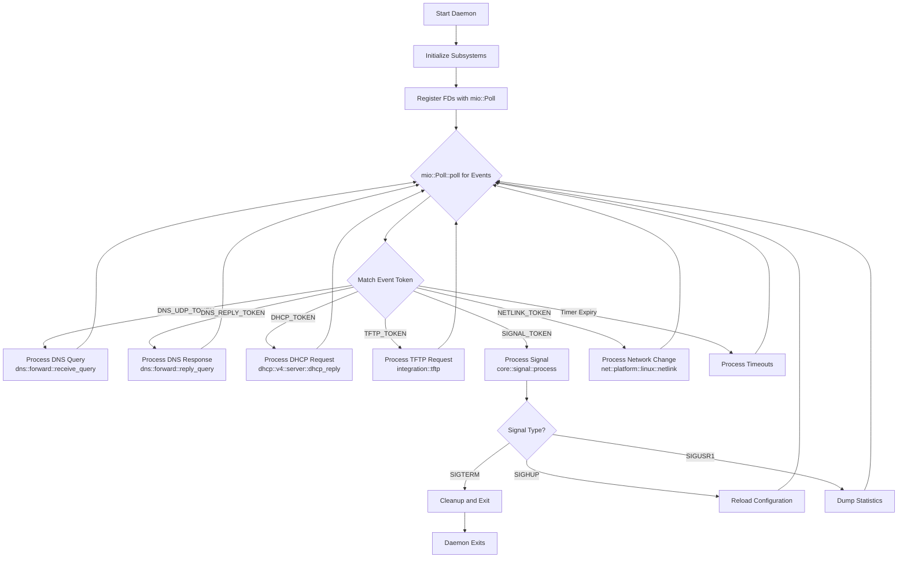
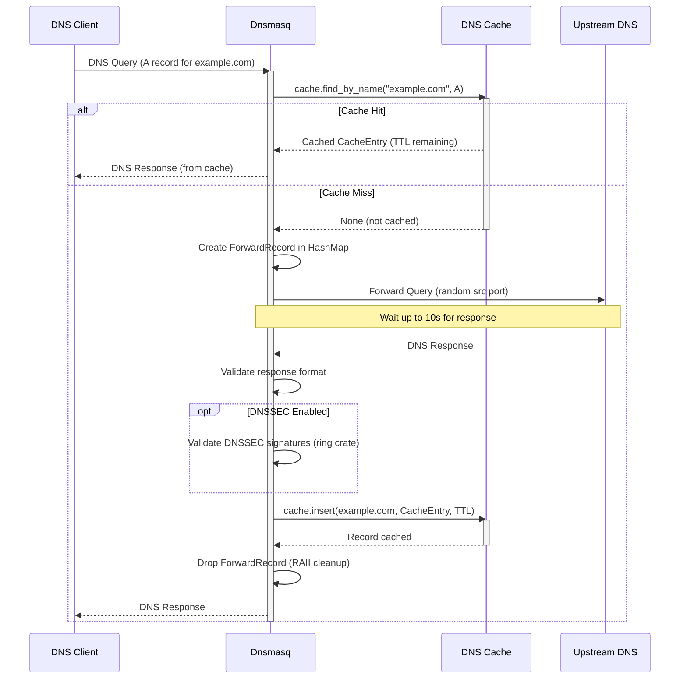
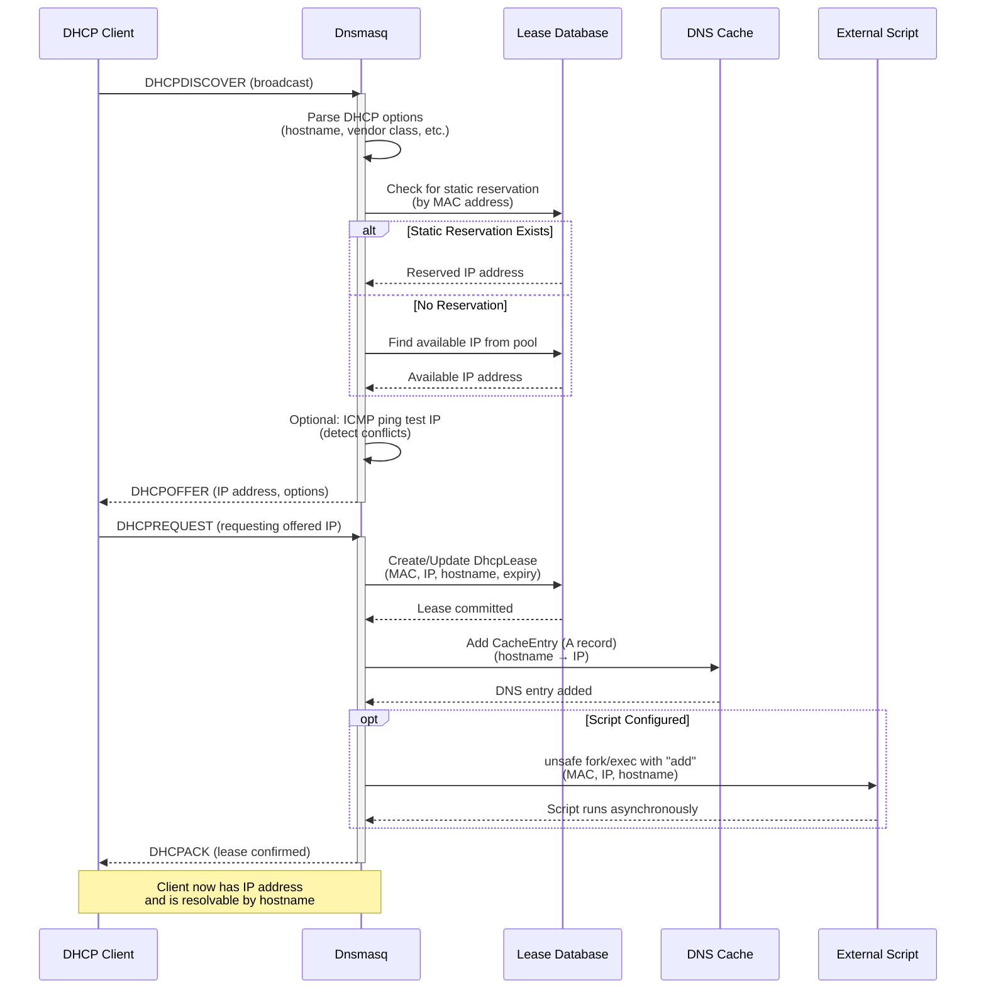
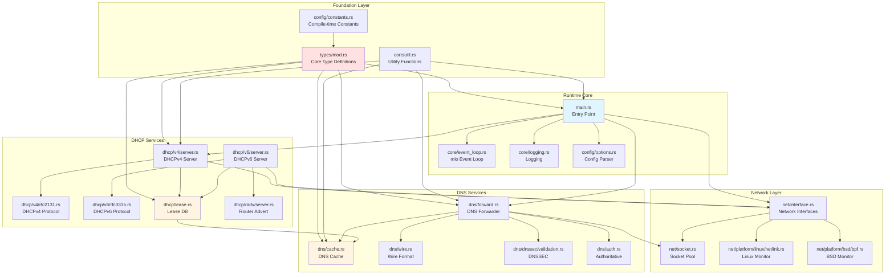

# Dnsmasq System Architecture (Rust Implementation)

## Table of Contents

1. [Overview and Design Philosophy](#overview-and-design-philosophy)
2. [Architectural Principles](#architectural-principles)
3. [Core Services Breakdown](#core-services-breakdown)
4. [System Architecture Components](#system-architecture-components)
5. [Event Loop Architecture](#event-loop-architecture)
6. [Data Flow and Processing](#data-flow-and-processing)
7. [Memory Management Strategy](#memory-management-strategy)
8. [Platform Abstraction Layer](#platform-abstraction-layer)
9. [Inter-Module Dependencies](#inter-module-dependencies)
10. [Configuration and Build System](#configuration-and-build-system)

---

## Overview and Design Philosophy

Dnsmasq is designed as a **lightweight, single-process network services daemon** that provides DNS forwarding and caching, DHCP server capabilities, TFTP services, and Router Advertisement for small networks and embedded systems. The codebase has been **rewritten in Rust from the original C implementation**, preserving the proven architectural design while gaining compile-time memory safety, type-safe error handling, and modern dependency management. The architecture embodies traditional Unix design principles: simplicity, portability, and efficiency.

### Design Goals

The architecture prioritizes:

1. **Resource Efficiency**: Minimal memory footprint (1-10MB resident set size) and CPU utilization suitable for embedded devices with limited resources (single-core processors, 8-16MB RAM).

2. **Operational Simplicity**: Zero-configuration deployment capability with automatic upstream DNS server discovery from `/etc/resolv.conf`, integrated DNS-DHCP management eliminating synchronization overhead, and hot-reload support via SIGHUP signal without service interruption.

3. **Platform Portability**: Runs on Linux (glibc/musl) and BSD variants (FreeBSD, OpenBSD, NetBSD) with platform-specific optimizations isolated in dedicated modules using Rust's conditional compilation (`#[cfg(target_os = "...")]`).

4. **Deterministic Behavior**: Rust's ownership model ensures deterministic memory deallocation without garbage collection pauses, single-threaded event-driven model without synchronization complexity, and predictable resource consumption patterns enable months or years of continuous operation.

### Key Architectural Characteristics

- **Single Daemon Process**: All services (DNS, DHCP, TFTP, RA) operate within a single process using event-driven I/O multiplexing via `mio`, eliminating inter-process communication overhead.

- **No External Dependencies**: Zero reliance on databases, message queues, or external services ensures reliable operation even when network connectivity is limited.

- **Modular Compilation**: Compile-time feature selection via Cargo feature flags (`dhcp`, `dnssec`, `tftp`, etc.) enables customized builds from minimal (DNS-only, ~200KB) to full-featured (~800KB). The Rust module hierarchy is organized across ~70 modules grouped by functional domain.

---

## Architectural Principles

### 1. Single-Threaded Event-Driven Architecture

Dnsmasq employs a single-threaded event-driven architecture using `mio`-based I/O multiplexing. This design eliminates thread synchronization complexity while maintaining responsive performance through non-blocking operations.

**Core Implementation**: The main event loop in `src/main.rs` and `src/core/event_loop.rs` monitors multiple file descriptors simultaneously using `mio::Poll`:

- **DNS sockets** (UDP port 53 for queries, TCP port 53 for large responses and zone transfers)
- **DHCP sockets** (UDP port 67 for DHCPv4 server, port 547 for DHCPv6 server)
- **TFTP sockets** (UDP port 69 for TFTP server when enabled)
- **Control interfaces** (D-Bus connections on Linux, UBus on OpenWrt)
- **Platform-specific sockets** (Netlink sockets on Linux, routing sockets on BSD)
- **Signal pipes** (for async-signal-safe signal handling via the `nix` crate)

The event loop uses `mio::Poll::poll()` to wait for I/O events, dispatching to appropriate handlers when file descriptors become ready. Each file descriptor is registered with a unique `mio::Token` for efficient identification. This approach provides excellent performance for typical small network workloads (hundreds to thousands of queries per second) while maintaining predictable latency.

**Advantages**:
- No thread synchronization primitives (mutexes, condition variables) required
- No race conditions or deadlocks possible
- Deterministic resource usage and behavior
- Single core suffices for target deployment scenarios
- Rust's ownership model enforces single-owner semantics at compile time

**Trade-offs**:
- Cannot utilize multiple CPU cores (acceptable for target embedded systems)
- Long-running operations must be non-blocking or offloaded (DNS queries have timeouts, scripts use fork/exec)

### 2. Rust Ownership Model

All memory management is handled by Rust's ownership and borrowing system. This approach ensures deterministic memory consumption without garbage collection pauses and eliminates entire classes of bugs (use-after-free, double-free, buffer overflows) at compile time.

**Key Strategies**:

- **Standard Library Allocation**: Types like `Vec<T>`, `Box<T>`, `String`, and `HashMap<K, V>` replace manual `malloc()`/`free()` patterns. Rust's allocator handles all memory automatically, with deallocation occurring deterministically when values go out of scope via the `Drop` trait.

- **Bounded Collections with Configurable Limits**: Core data structures use bounded sizes to prevent unbounded memory growth:
  - DNS cache: Default 150 entries (`CACHESIZ` in `src/config/constants.rs`), configurable via `--cache-size`, implemented as `HashMap<DnsName, Vec<CacheEntry>>` with `VecDeque`-based LRU eviction
  - DHCP lease table: Maximum 1000 leases (`MAXLEASES` in `src/config/constants.rs`), stored in `HashMap<IpAddr, DhcpLease>`
  - Forward record table: 150 concurrent queries (`FTABSIZ` in `src/config/constants.rs`), managed in `HashMap<u16, ForwardRecord>`

- **Zero-Copy Buffer Handling**: DNS and DHCP packet processing uses Rust slices (`&[u8]`) and the `bytes::Bytes` crate for efficient zero-copy buffer management, avoiding unnecessary allocations in hot paths.

- **Minimal Dynamic Allocation in Hot Paths**: Packet processing paths leverage stack-allocated buffers and pre-allocated structures, with Rust's compiler ensuring no hidden allocations.

### 3. Modular Compilation with Cargo Feature Flags

The codebase uses Cargo feature flags to enable customized builds containing only required functionality. This approach reduces binary size and eliminates dead code for unused features through Rust's conditional compilation.

**Primary Feature Flags** (from `Cargo.toml`):

| Feature Flag | Purpose | Dependencies |
|--------------|---------|--------------|
| `dhcp` | Enable DHCPv4 server | None |
| `dhcp6` | Enable DHCPv6 and Router Advertisement | `dhcp` implied |
| `dnssec` | Enable DNSSEC validation | `ring` crate (pure Rust) |
| `tftp` | Enable TFTP server | None |
| `auth` | Enable authoritative DNS mode | None |
| `dbus` | Enable D-Bus control interface | `dbus` crate (FFI to libdbus-1) |
| `ubus` | Enable UBus interface (OpenWrt) | FFI to libubus, libubox |
| `ipset` | Enable Linux ipset integration | `netlink-packet-core` crate |
| `nftset` | Enable nftables set integration | FFI to libnftables |
| `conntrack` | Enable connection tracking | FFI to libnetfilter_conntrack |
| `script` | Enable external script execution | None |
| `idn` | Enable IDN 2008 support | `idna` crate (pure Rust) |
| `dump` | Enable pcap packet dumping | `pcap-file` crate |

**Build Configuration**: Feature flags are set via Cargo:

```bash
cargo build --release --features "dnssec,dbus"  # Enable only DNSSEC and D-Bus
cargo build --release                            # Default build with common features
```

### 4. Zero External Service Dependencies

Dnsmasq operates as a completely self-contained daemon without dependencies on:

- **Databases**: Lease state stored in flat files, no SQL or NoSQL databases required
- **Message Queues**: No AMQP, MQTT, or other message bus dependencies
- **External APIs**: No cloud service API calls, metrics collection services, or telemetry
- **Configuration Servers**: Reads local configuration files only

The core binary has no runtime dependencies beyond `libc`. Optional features (D-Bus, nftset, conntrack) require system libraries accessed via thin FFI wrappers. Cryptographic operations for DNSSEC use the `ring` crate, which is pure Rust with no external library dependency, replacing the C implementation's Nettle/GnuTLS requirement.

This independence ensures reliable operation even when network connectivity to external services is unavailable, making dnsmasq suitable for isolated networks, air-gapped environments, and network infrastructure recovery scenarios.

---

## Core Services Breakdown

### DNS Forwarding Subsystem (`src/dns/forward.rs`)

The DNS forwarding engine operates as a **forwarding resolver** (not a recursive resolver). It accepts queries from downstream clients, consults a local cache, and forwards cache misses to configured upstream recursive DNS servers.

**Key Components**:

- **Query Reception**: Listens on UDP port 53 for standard queries and TCP port 53 for large responses (>512 bytes), AXFR zone transfers in authoritative mode, and DNSSEC-validated responses
- **Forward Record Table**: Tracks up to 150 concurrent outstanding queries (`ForwardRecord` in `src/types/dns.rs`), managed in a `HashMap<u16, ForwardRecord>` keyed by transaction ID with state management
- **Upstream Server Selection**: Supports multiple upstream servers with:
  - Round-robin selection for load distribution
  - Domain-specific routing (e.g., `*.internal.company.com` → internal DNS server) via `src/dns/server_match.rs`
  - Fallback on timeout or SERVFAIL responses
  - Source port randomization for security
- **TCP Fallback**: Automatically retries failed UDP queries over TCP when upstream servers require it
- **Query Timeout Management**: Default 10-second timeout (`TIMEOUT` in `src/config/constants.rs`), after which query fails and client receives SERVFAIL

**Data Flow**:
1. Client query arrives on UDP/TCP socket
2. Check local cache for matching entry (see DNS Caching Subsystem)
3. On cache miss: create `ForwardRecord`, forward to upstream server
4. Upstream response received → validate, cache, and forward to client
5. `ForwardRecord` dropped automatically via RAII when processing completes

### DNS Caching Subsystem (`src/dns/cache.rs`)

Implements an in-memory LRU (Least Recently Used) cache for DNS records, integrated with multiple data sources.

**Cache Structure**:

- **HashMap-Based Storage**: Records stored in `HashMap<DnsName, Vec<CacheEntry>>` for O(1) average-case lookup by domain name
- **LRU Eviction**: `VecDeque`-based tracking of access order; when cache reaches capacity, least recently accessed entries are evicted
- **Default Capacity**: 150 entries (`CACHESIZ`), configurable to thousands via `--cache-size`

**Cached Record Types**:
- A (IPv4 addresses)
- AAAA (IPv6 addresses)
- CNAME (canonical names)
- PTR (reverse lookups)
- DNSKEY and DS (when DNSSEC enabled)
- Negative caching (NXDOMAIN responses with TTL)

**Data Source Integration**:

1. **Upstream DNS Responses**: Primary cache population from forwarded query responses
2. **`/etc/hosts` File**: Static hostname-to-IP mappings loaded at startup and on SIGHUP reload
3. **DHCP Lease Integration**: DHCP-assigned hostnames automatically added to cache, enabling immediate name resolution for dynamically configured clients
4. **Manual Configuration**: `--host-record` and `--address` configuration directives

**TTL Management**:
- Respects TTL from upstream responses
- Configurable minimum TTL (`--min-cache-ttl`) prevents excessive upstream queries
- Configurable maximum TTL (`--max-cache-ttl`) ensures stale data eventually expires
- Negative cache TTL from SOA minimum field

### DHCPv4 Server Subsystem (`src/dhcp/v4/server.rs`, `src/dhcp/v4/rfc2131.rs`)

Provides complete RFC 2131 compliant DHCPv4 server functionality with static reservations and dynamic address allocation.

**Protocol Implementation**:

The four-phase DHCP message exchange:
1. **DISCOVER** (client broadcast) → daemon receives on port 67
2. **OFFER** (daemon response) → selects available IP from configured pool
3. **REQUEST** (client confirms) → client requests offered or renews existing address
4. **ACK** (daemon confirms) → finalizes lease assignment

**Address Allocation**:

- **Static Reservations**: MAC address → fixed IP mapping takes precedence
- **Dynamic Allocation**: First available IP from configured `dhcp-range` pools, using SDBM hash-based allocation
- **Conflict Detection**: Optional ICMP ping before offer to detect IP conflicts
- **Lease Database**: Persistent storage in `/var/lib/misc/dnsmasq.leases` (Linux default), managed by `src/dhcp/lease.rs`
- **Default Lease Time**: 3600 seconds (1 hour, `DEFLEASE` in `src/config/constants.rs`)
- **Maximum Leases**: 1000 concurrent leases (`MAXLEASES`)

**DNS Integration**:

When a DHCP lease is assigned with a hostname:
1. Daemon immediately adds A record to DNS cache
2. Client becomes resolvable by name within 1 second
3. Lease expiration/release removes DNS cache entry
4. No manual DNS zone file editing required

**Script Integration** (when `script` feature enabled):

Lease events trigger external script execution via `src/dhcp/helper.rs`:
- **add**: New lease assigned
- **old**: Existing lease renewed
- **del**: Lease expired or released

Scripts receive MAC address, IP address, hostname as arguments and environment variables including `DNSMASQ_LEASE_LENGTH`, `DNSMASQ_CLIENT_ID`, `DNSMASQ_INTERFACE`.

### DHCPv6 Server Subsystem (`src/dhcp/v6/server.rs`, `src/dhcp/v6/rfc3315.rs`)

Implements RFC 3315 DHCPv6 with both stateful (address assignment) and stateless (configuration only) operation modes.

**Operation Modes**:

1. **Stateful DHCPv6** (Managed addressing, M=1 in Router Advertisement):
   - SOLICIT → ADVERTISE → REQUEST → REPLY exchange
   - Daemon assigns IPv6 addresses from configured pools
   - Lease tracking similar to DHCPv4
   - Default lease time: 86400 seconds (24 hours, `DEFLEASE6` in `src/config/constants.rs`)

2. **Stateless DHCPv6** (Configuration only, O=1, M=0 in RA):
   - INFORMATION-REQUEST → REPLY exchange
   - Provides DNS servers, domain search lists without address assignment
   - Clients use SLAAC for address configuration

**Coordination with Router Advertisement** (`src/dhcp/radv/server.rs`):

The M (managed) and O (other configuration) flags in Router Advertisement messages control client DHCPv6 behavior:
- **M=1**: Use DHCPv6 for address assignment (stateful)
- **O=1**: Use DHCPv6 for configuration only (stateless)
- **M=0, O=0**: Use SLAAC only, no DHCPv6

**Prefix Delegation**:

Supports IPv6 prefix delegation (IA_PD) for hierarchical network addressing, enabling downstream routers to obtain prefixes for their local networks. DHCPv6 option serialization is handled by `src/dhcp/v6/outpacket.rs`.

### TFTP Server Subsystem (`src/integration/tftp.rs`)

Read-only TFTP server primarily for network boot scenarios, implementing RFC 1350 with performance extensions.

**Features**:
- **Concurrent Connections**: Default 50 maximum (`TFTP_MAX_CONNECTIONS` in `src/config/constants.rs`)
- **Option Negotiation**: RFC 2349 (blksize, tsize, timeout) and RFC 7440 (windowsize)
- **Maximum Window Size**: 32 blocks (`TFTP_MAX_WINDOW` in `src/config/constants.rs`)
- **Transfer Modes**: Netascii and binary (octet)
- **Security**: Secure mode verifies file ownership, root directory restriction prevents path traversal

**PXE Integration**:

Works with DHCPv4 PXE boot options:
- Option 67: Boot filename
- Option 93: Client architecture type
- PXE proxy mode: Coexists with existing DHCP servers

### Authoritative DNS Mode Subsystem (`src/dns/auth.rs`)

Enables dnsmasq to serve as primary nameserver for designated local zones, complementing the forwarding mode.

**Capabilities**:
- Authoritative responses for configured zones (AA bit set in DNS response)
- SOA record generation with configurable parameters
- Zone transfer (AXFR) support for secondary nameservers
- Per-zone subnet filtering for split-horizon DNS
- Supports A, AAAA, PTR, CNAME, MX, SRV, TXT, NAPTR record types

**Use Cases**:
- Internal domain hosting (e.g., `*.internal.company.com`)
- Split-horizon DNS (internal vs external views)
- Small zone hosting without separate authoritative DNS server

### DNSSEC Validation Subsystem (`src/dns/dnssec/validation.rs`, `src/dns/dnssec/crypto.rs`)

Provides cryptographic validation of DNS responses to protect against cache poisoning and man-in-the-middle attacks.

**Validation Process**:

1. **Trust Chain Validation**: DNSKEY → DS → parent zone, recursively to root trust anchor
2. **RRSIG Verification**: Cryptographic signature validation using the `ring` crate (RSA, ECDSA P-256/P-384, Ed25519)
3. **NSEC/NSEC3 Processing**: Authenticated denial-of-existence proofs
4. **Trust Anchor Management**: Root zone KSK from `trust-anchors.conf`

**Resource Limits** (DoS protection, defined in `src/config/constants.rs`):
- Maximum 40 queries per validation (`DNSSEC_LIMIT_WORK`)
- Maximum 20 signature failures (`DNSSEC_LIMIT_SIG_FAIL`)
- Maximum 200 crypto operations (`DNSSEC_LIMIT_CRYPTO`)
- Maximum 150 NSEC3 iterations (`DNSSEC_LIMIT_NSEC3_ITERS`)

**Validation States**:
- **SECURE**: Valid DNSSEC chain to trust anchor
- **INSECURE**: Unsigned zone (no DNSSEC)
- **BOGUS**: Invalid signatures or broken trust chain → return SERVFAIL

---

## System Architecture Components

The following diagram illustrates the major components and their relationships:

```mermaid
graph TB
    subgraph "Client Layer"
        DNSClient[DNS Clients<br/>UDP/TCP Port 53]
        DHCP4Client[DHCPv4 Clients<br/>Port 67/68]
        DHCP6Client[DHCPv6 Clients<br/>Port 546/547]
        TFTPClient[TFTP Clients<br/>Port 69]
    end
    
    subgraph "Core Runtime - mio Event Loop"
        MainLoop[Entry Point / Event Loop<br/>src/main.rs<br/>src/core/event_loop.rs]
        SigHandler[Signal Handler<br/>src/core/signal.rs<br/>SIGHUP/SIGUSR1/SIGTERM]
        ConfigParser[Configuration Parser<br/>src/config/options.rs]
        Logger[Logging System<br/>src/core/logging.rs]
    end
    
    subgraph "DNS Service Layer"
        DNSForward[DNS Forwarder<br/>src/dns/forward.rs]
        DNSCache[DNS Cache<br/>src/dns/cache.rs]
        Wire[Wire Format Parser<br/>src/dns/wire.rs]
        DNSSEC[DNSSEC Validator<br/>src/dns/dnssec/validation.rs]
        Auth[Authoritative DNS<br/>src/dns/auth.rs]
    end
    
    subgraph "DHCP Service Layer"
        DHCP4[DHCPv4 Server<br/>src/dhcp/v4/server.rs<br/>src/dhcp/v4/rfc2131.rs]
        DHCP6[DHCPv6 Server<br/>src/dhcp/v6/server.rs<br/>src/dhcp/v6/rfc3315.rs]
        LeaseDB[Lease Database<br/>src/dhcp/lease.rs]
        RadV[Router Advertisement<br/>src/dhcp/radv/server.rs]
    end
    
    subgraph "Network Abstraction Layer"
        Interface[Network Interfaces<br/>src/net/interface.rs]
        Socket[Socket Pool<br/>src/net/socket.rs]
        Netlink[Linux Netlink<br/>src/net/platform/linux/netlink.rs]
        BPF[BSD BPF<br/>src/net/platform/bsd/bpf.rs]
    end
    
    subgraph "Integration Layer"
        Scripts[Script Executor<br/>src/dhcp/helper.rs]
        DBus[D-Bus Interface<br/>src/integration/dbus.rs]
        Firewall[Firewall Integration<br/>src/net/platform/linux/ipset.rs<br/>src/integration/nftset.rs]
    end
    
    subgraph "External Systems"
        Upstream[Upstream DNS Servers]
        Syslog[Syslog Daemon]
        HostsFile[/etc/hosts]
        ResolvConf[/etc/resolv.conf]
    end
    
    DNSClient --> MainLoop
    DHCP4Client --> MainLoop
    DHCP6Client --> MainLoop
    TFTPClient --> MainLoop
    
    MainLoop --> DNSForward
    MainLoop --> DHCP4
    MainLoop --> DHCP6
    
    ConfigParser --> MainLoop
    SigHandler --> MainLoop
    Logger --> Syslog
    
    DNSForward --> DNSCache
    DNSForward --> Wire
    DNSForward --> DNSSEC
    DNSForward --> Upstream
    DNSForward --> Auth
    
    DNSCache --> HostsFile
    DNSCache <--> LeaseDB
    
    DHCP4 --> LeaseDB
    DHCP6 --> LeaseDB
    DHCP6 --> RadV
    
    LeaseDB --> Scripts
    LeaseDB --> DNSCache
    
    DNSForward --> Interface
    DNSForward --> Socket
    DHCP4 --> Interface
    DHCP6 --> Interface
    RadV --> Interface
    
    Interface --> Netlink
    Interface --> BPF
    
    DNSForward --> Firewall
    
    ConfigParser --> ResolvConf
    
    DBus -.-> MainLoop
    
    style MainLoop fill:#e1f5ff
    style DNSCache fill:#fff4e1
    style LeaseDB fill:#fff4e1
    style Interface fill:#e1ffe1
```

### Component Responsibilities

**Core Runtime Components**:

- **Entry Point / Event Loop** (`src/main.rs`, `src/core/event_loop.rs`): Coordinates all subsystem activities through `mio::Poll`-based I/O multiplexing, monitoring file descriptors for DNS, DHCP, TFTP, control interfaces, and platform-specific sockets. Each file descriptor is registered with a unique `mio::Token` for dispatch.
- **Configuration Parser** (`src/config/options.rs`): Processes 350+ configuration directives from config file and command line using `Result<DaemonConfig, ConfigError>` return types for type-safe error handling, validating options and initializing subsystem configurations
- **Signal Handler** (`src/core/signal.rs`): Manages process lifecycle via signals using `nix::sys::signal` with a safe self-pipe pattern - SIGTERM (graceful shutdown), SIGHUP (configuration reload), SIGUSR1 (cache statistics dump), SIGUSR2 (detailed status)
- **Logging System** (`src/core/logging.rs`): Non-blocking logging via the `log`/`tracing` crate facade with bounded message queue (maximum 5 queued messages), prevents main loop blocking on syslog operations

**DNS Service Components**:

- **DNS Forwarder** (`src/dns/forward.rs`): State machine tracking up to 150 concurrent queries in `HashMap<u16, ForwardRecord>`, manages upstream server selection with domain-specific routing via `src/dns/server_match.rs`, implements retry and timeout logic
- **DNS Cache** (`src/dns/cache.rs`): `HashMap`-based storage with `VecDeque` LRU eviction, default 150 entries, integrates data from upstream, `/etc/hosts`, and DHCP leases
- **Wire Format Parser** (`src/dns/wire.rs`): RFC 1035 DNS packet parsing and serialization, name compression, resource record encoding/decoding using Rust slices for zero-copy buffer handling
- **DNSSEC Validator** (`src/dns/dnssec/validation.rs`): Complete DNSSEC validation chain using the `ring` crate for cryptographic operations, with resource limits preventing DoS attacks
- **Authoritative DNS** (`src/dns/auth.rs`): Serves designated local zones with SOA generation and AXFR support

**DHCP Service Components**:

- **DHCPv4 Server** (`src/dhcp/v4/server.rs`, `src/dhcp/v4/rfc2131.rs`): Full RFC 2131 implementation, static reservations, dynamic pools, PXE boot support
- **DHCPv6 Server** (`src/dhcp/v6/server.rs`, `src/dhcp/v6/rfc3315.rs`): Stateful and stateless modes, prefix delegation, coordination with Router Advertisement
- **Lease Database** (`src/dhcp/lease.rs`): Persistent lease storage with filesystem-based persistence, DNS integration, script trigger management
- **Router Advertisement** (`src/dhcp/radv/server.rs`): ICMPv6 RA transmission with configurable M/O flags, RDNSS options, prefix information

**Network Abstraction Components**:

- **Network Interfaces** (`src/net/interface.rs`): Platform-independent interface for listener socket creation, interface enumeration, and listener management
- **Socket Pool** (`src/net/socket.rs`): Upstream server socket pool with randomized source ports for security
- **Linux Netlink** (`src/net/platform/linux/netlink.rs`): Real-time monitoring of network interface state changes (up/down, address add/remove) via netlink sockets
- **BSD BPF** (`src/net/platform/bsd/bpf.rs`): Berkeley Packet Filter for raw packet access on BSD platforms, routing socket monitoring for interface events

**Integration Components**:

- **Script Executor** (`src/dhcp/helper.rs`): Fork-based execution of external scripts on lease events via `unsafe` FFI to `nix::unistd::fork()`, proper signal handling and exit status collection
- **D-Bus Interface** (`src/integration/dbus.rs`): System bus control interface at `uk.org.thekelleys.dnsmasq`, cache query/manipulation, upstream server reconfiguration
- **Firewall Integration** (`src/net/platform/linux/ipset.rs`, `src/integration/nftset.rs`): Populates ipset collections and nftables sets with resolved IP addresses for domain-based firewall rules

---

## Event Loop Architecture

### mio-Based I/O Multiplexing

The event loop implementation uses the `mio` crate's `Poll` abstraction to monitor multiple file descriptors with a single blocking wait. On Linux, `mio` uses `epoll` internally; on BSD it uses `kqueue`. This provides efficient, portable I/O multiplexing without exposing platform-specific APIs.

**Event Loop Flow** (`src/main.rs` entry point, `src/core/event_loop.rs`):



### File Descriptor Management

**Monitored File Descriptors**:

1. **DNS Listener Sockets**:
   - UDP sockets on port 53 (one per network interface or wildcard)
   - TCP listening socket on port 53
   - TCP connected sockets for active queries (up to `MAX_PROCS=20`)

2. **DHCP Listener Sockets**:
   - DHCPv4: UDP socket on port 67
   - DHCPv6: UDP socket on port 547
   - Router Advertisement: ICMPv6 raw socket

3. **TFTP Listener Socket** (when `tftp` feature enabled):
   - UDP socket on port 69

4. **Control Interface Sockets**:
   - D-Bus connection file descriptor (when `dbus` feature enabled)
   - UBus connection file descriptor (when `ubus` feature enabled)

5. **Platform Monitoring Sockets**:
   - Linux: Netlink socket for interface/address changes
   - BSD: Routing socket for interface events

6. **Signal Communication**:
   - Signal pipe for async-signal-safe signal delivery from signal handlers to main loop

**mio Event Registration** (`src/core/event_loop.rs`):

The daemon maintains a `mio::Poll` registry where each file descriptor is registered with a unique `mio::Token`. The `mio::Poll::poll()` call blocks with a configurable timeout, returning when:
- One or more file descriptors become ready for I/O (identified by their `Token`)
- A signal is received (detected via the signal pipe's `Token`)
- The timeout expires (triggers periodic maintenance tasks)

### Signal Handling Strategy

**Async-Signal-Safe Approach**:

Traditional signal handlers have severe restrictions on what functions they can safely call. Dnsmasq uses a two-stage signal handling mechanism implemented in `src/core/signal.rs`:

1. **Signal Handler Stage** (registered via `nix::sys::signal::sigaction`):
   - Minimal work: writes signal number to signal pipe
   - Uses only async-signal-safe operations
   - Returns immediately

2. **Main Loop Stage** (signal event processing in `src/core/signal.rs`):
   - Main loop detects signal pipe ready for reading (via `SIGNAL_TOKEN`)
   - Reads signal number from pipe
   - Performs full signal processing in normal context with access to all functions
   - Uses Rust pattern matching to dispatch signal-specific handlers

**Signal Responses**:

- **SIGTERM**: Graceful shutdown - closes sockets, writes lease database, exits cleanly
- **SIGHUP**: Hot reload - reopens log files, re-reads configuration, clears DNS cache, re-enumerates network interfaces
- **SIGUSR1**: Statistics dump - writes cache statistics to syslog
- **SIGUSR2**: Detailed status - writes comprehensive state to syslog
- **SIGCHLD**: Child process termination - collects exit status of helper scripts

### Non-Blocking Operations

To maintain event loop responsiveness, all operations must either complete quickly or be non-blocking:

**Fast Synchronous Operations**:
- DNS cache lookups: HashMap lookup, typically <0.1ms
- DHCP lease lookups: HashMap lookup, <1ms
- Packet parsing: Wire format decoding via Rust slices, <1ms

**Handled via Timeout**:
- DNS upstream queries: 10-second timeout, no result → SERVFAIL to client
- TCP connections: 5-second timeout per connection

**Offloaded to Child Processes**:
- External script execution: `nix::unistd::fork()` via `unsafe` FFI in `src/dhcp/helper.rs`, parent continues processing
- Note: Lua script embedding is deferred to a future phase; only external script execution is supported

---

## Data Flow and Processing

### DNS Query Processing Pipeline



**Step-by-Step DNS Query Processing**:

1. **Query Reception** (`dns::forward::receive_query()`):
   - UDP packet arrives on port 53 listener
   - Parse DNS header and question section via `dns::wire`
   - Extract query name, type, class
   - Validate packet format, reject malformed queries

2. **Cache Lookup** (`dns::cache::Cache::find_by_name()`):
   - Compute hash of query name
   - Search `HashMap` for matching entry
   - Check TTL hasn't expired
   - If found: return cached answer immediately

3. **Forward Record Creation** (on cache miss):
   - Create `ForwardRecord` and insert into `HashMap<u16, ForwardRecord>` bounded to `FTABSIZ` (150)
   - Store client query ID, source address, query details
   - Generate new query ID for upstream (prevents query ID prediction attacks)
   - Select upstream server based on domain-specific routing rules via `dns::server_match`

4. **Upstream Forwarding**:
   - Construct DNS query packet with new query ID
   - Send via UDP to selected upstream server
   - Use randomized source port for security
   - Set 10-second timeout

5. **Response Reception** (`dns::forward::reply_query()`):
   - Upstream response arrives
   - Match response to outstanding `ForwardRecord` by query ID in the HashMap
   - Validate response: matching question section, reasonable TTL values

6. **DNSSEC Validation** (if `dnssec` feature enabled, `dns::dnssec::validation` module):
   - Check for RRSIG records
   - Validate signature chain to trust anchor using `ring` crate
   - Process NSEC/NSEC3 proofs for negative responses
   - Return SERVFAIL if validation fails (bogus)

7. **Cache Insertion** (`dns::cache::Cache::insert()`):
   - Add validated response to cache
   - Apply `VecDeque`-based LRU eviction if cache full
   - TTL copied from response

8. **Client Response**:
   - Restore original query ID
   - Send response packet to client
   - `ForwardRecord` dropped automatically (RAII cleanup — Rust's `Drop` trait closes any associated resources)

### DHCP Lease Assignment Flow



**DHCP Processing Steps**:

1. **DISCOVER Reception** (`dhcp::v4::server::dhcp_reply()`):
   - Parse DHCP options from packet via `dhcp::common`
   - Extract client MAC address, requested IP, hostname, vendor class
   - Apply tag-based configuration rules

2. **Address Selection**:
   - Check static reservations by MAC address
   - If no reservation: find first available IP in configured pools
   - Skip addresses already leased or in static reservations

3. **Conflict Detection** (optional):
   - Send ICMP ping to candidate IP address
   - Wait brief period for response
   - If response received: IP in use, try next address

4. **OFFER Transmission**:
   - Construct DHCPOFFER packet
   - Include offered IP, subnet mask, router, DNS servers, lease time
   - Send to client

5. **REQUEST Processing**:
   - Client requests offered IP (or renews existing)
   - Verify request matches previous offer
   - Finalize lease assignment

6. **Lease Database Update** (`dhcp::lease` module):
   - Write `DhcpLease` to in-memory `HashMap<IpAddr, DhcpLease>`
   - Asynchronously write to lease file on disk
   - Format: `<expiry> <mac> <ip> <hostname> <client-id>`

7. **DNS Integration**:
   - Immediately add `CacheEntry` (A record) to DNS cache
   - Client now resolvable by hostname
   - PTR record added for reverse lookup

8. **Script Execution** (if configured):
   - Fork child process via `unsafe` FFI to `nix::unistd::fork()` in `src/dhcp/helper.rs`
   - Execute script with arguments: `add <mac> <ip> <hostname>`
   - Environment includes `DNSMASQ_LEASE_LENGTH`, interface, client ID
   - Parent continues without waiting

---

## Memory Management Strategy

### Rust Ownership and Bounded Collections

Dnsmasq uses Rust's ownership and borrowing system for all memory management, combined with bounded-size collections to ensure predictable memory consumption and prevent unbounded growth under load or attack. The Rust compiler enforces memory safety at compile time, eliminating use-after-free, double-free, and buffer overflow vulnerabilities.

**Core Capacity Limits** (from `src/config/constants.rs`):

| Structure | Default Size | Constant | Purpose |
|-----------|--------------|----------|---------|
| DNS Cache | 150 entries | `CACHESIZ` / `--cache-size` | Cached DNS records |
| Forward Record Table | 150 entries | `FTABSIZ` | Outstanding DNS queries |
| DHCP Lease Table | 1000 leases | `MAXLEASES` | Active DHCP leases |
| TCP Child Processes | 20 processes | `MAX_PROCS` | Concurrent TCP DNS connections |
| TFTP Connections | 50 connections | `TFTP_MAX_CONNECTIONS` | Concurrent TFTP transfers |

### Memory Allocation Patterns

**Initialization Phase**:
- `DaemonState` struct and nested domain-specific structs allocated at startup
- DNS cache `HashMap` allocated with `HashMap::with_capacity(cache_size)`
- Lease table `HashMap` pre-allocated with `HashMap::with_capacity(max_leases)`
- Configuration structures sized based on config file via `Vec::with_capacity()`

**Runtime Phase**:
- Minimal heap allocation during packet processing
- Stack-allocated buffers and Rust slices (`&[u8]`) for packet parsing avoid heap allocation latency
- `HashMap<u16, ForwardRecord>` with capacity limit for forward records (entries automatically dropped when removed)
- Rust's compiler manages all lifetimes and deallocation via the `Drop` trait

**Standard Library Allocation**:

Rust's standard library allocator handles all memory allocation. The `safe_malloc`/`whine_realloc` wrappers from the original C implementation are eliminated — Rust panics on allocation failure by default, or can be configured to abort via `[profile.release] panic = "abort"` in `Cargo.toml`.

```rust
// Rust allocation examples — no manual free required
let cache = HashMap::with_capacity(cache_size);  // Pre-allocated HashMap
let buffer = Vec::with_capacity(4096);            // Pre-allocated buffer
let entry = Box::new(CacheEntry::new(...));       // Heap-allocated entry
// All automatically freed when they go out of scope
```

### Variable-Length Data

The block allocation system from the original C implementation (`blockdata.c`) is entirely replaced by Rust's `Vec<u8>` and the `bytes::Bytes` crate for variable-length data. Rust's allocator handles fragmentation prevention natively.

**Use Cases**:
- DNSSEC RRSIG records (variable-length signatures) → `Vec<u8>`
- DNSKEY records (public keys, various sizes) → `Vec<u8>`
- Large TXT records → `String` or `Vec<u8>`
- DNS/DHCP packet construction → `bytes::BytesMut` for efficient append operations

### Memory Consumption Profile

**Typical Memory Usage**:

- **Minimal Configuration** (DNS forwarding only, 150 cache entries): ~2-3MB RSS
- **Standard Configuration** (DNS + DHCP, 150 cache, 50 leases): ~3-5MB RSS
- **Full Configuration** (DNS + DHCP + DNSSEC + TFTP, 1000 cache, 200 leases): ~6-12MB RSS

Note: Rust binaries include the Rust standard library, which adds ~1-2MB to base RSS compared to the C implementation.

**Memory Growth Factors**:
- Cache size: ~200 bytes per cached record
- DHCP leases: ~100-200 bytes per active lease
- Configuration size: Static hosts, DHCP reservations (~50-100 bytes each)
- DNSSEC: Additional memory for DNSKEY/DS records and validation state

**Memory Safety Guarantees**:

Memory safety is guaranteed by Rust's ownership and borrowing system. No manual allocation/deallocation pairing is needed. The `unsafe` FFI boundaries (D-Bus, netfilter, nftables, and `fork`/`exec` for the helper process) are the only areas requiring manual memory audit. Each `unsafe` block includes a `// SAFETY:` comment explaining the invariants maintained.

---

## Platform Abstraction Layer

Dnsmasq supports Linux and BSD platforms through careful abstraction of platform-specific functionality. Platform differences are isolated in dedicated modules under `src/net/platform/`, with Rust's conditional compilation (`#[cfg(target_os = "...")]`) selecting appropriate implementations at compile time.

### Network Interface Monitoring

Different platforms provide different mechanisms for monitoring network interface state changes:

**Linux: Netlink Sockets** (`src/net/platform/linux/netlink.rs`):

```rust
use nix::sys::socket::{socket, AddressFamily, SockType, SockFlag};

/// Initialize netlink socket for route/address monitoring.
/// Registers the fd with the mio::Poll event loop.
pub fn netlink_init(poll: &mio::Poll) -> Result<RawFd, nix::Error> {
    let fd = socket(
        AddressFamily::Netlink,
        SockType::Raw,
        SockFlag::SOCK_CLOEXEC | SockFlag::SOCK_NONBLOCK,
        // NETLINK_ROUTE protocol
    )?;
    // Bind to RTMGRP_LINK | RTMGRP_IPV4_IFADDR | RTMGRP_IPV6_IFADDR
    // Register fd with mio::Poll using NETLINK_TOKEN
    Ok(fd)
}

/// Process incoming netlink messages and update interface state.
pub fn netlink_process(state: &mut DaemonState) -> Result<(), Error> {
    // Read netlink messages from socket
    // Parse RTM_NEWADDR, RTM_DELADDR, RTM_NEWLINK, RTM_DELLINK
    // Update internal interface state
    // Trigger listener reconfiguration if needed
    Ok(())
}
```

**Features**:
- Real-time event notification (no polling required)
- Low overhead (kernel pushes events to userspace)
- Supports IPv4 and IPv6 address monitoring
- Route table change detection

**BSD: Routing Sockets and BPF** (`src/net/platform/bsd/bpf.rs`):

```rust
use nix::sys::socket::{socket, AddressFamily, SockType, SockFlag};

/// Initialize BSD routing socket for interface event monitoring.
pub fn bpf_init(poll: &mio::Poll) -> Result<RawFd, nix::Error> {
    let fd = socket(
        AddressFamily::Route,
        SockType::Raw,
        SockFlag::SOCK_CLOEXEC | SockFlag::SOCK_NONBLOCK,
    )?;
    // Register fd with mio::Poll
    Ok(fd)
}

/// Process routing socket messages and update interface state.
pub fn bpf_process(state: &mut DaemonState) -> Result<(), Error> {
    // Read routing messages
    // Update interface state
    Ok(())
}
```

**Features**:
- Routing socket for interface/address events
- BPF for raw packet access (DHCP, TFTP)
- Different ioctl() interfaces for interface enumeration

**Platform Detection** (Rust conditional compilation):

```rust
// In src/net/platform/mod.rs
#[cfg(target_os = "linux")]
pub mod linux;

#[cfg(any(target_os = "freebsd", target_os = "openbsd", target_os = "netbsd"))]
pub mod bsd;
```

Platform selection is handled entirely at compile time by Rust's `#[cfg()]` attributes, replacing the C preprocessor's `#ifdef HAVE_LINUX_NETWORK` / `#ifdef HAVE_BSD_NETWORK` guards. The `build.rs` script performs additional platform detection for optional native library linking.

### Unified Network API (`src/net/interface.rs`, `src/net/socket.rs`)

The network modules provide platform-independent interfaces via the `trait NetworkBackend` pattern:

**Interface Enumeration**:
- `enumerate_interfaces()`: Returns list of all network interfaces
- Abstracts: Linux `getifaddrs()`, BSD `getifaddrs()` via the `nix` crate

**Socket Creation** (`src/net/socket.rs`):
- `create_bound_listeners()`: Creates listener sockets on specific interfaces
- `create_wildcard_listeners()`: Creates wildcard listeners (all interfaces)
- Handles: IPv4/IPv6 dual-stack, `SO_REUSEADDR`, `IPV6_V6ONLY` via the `socket2` crate

**Address Utilities**:
- `iface_check()`: Check if address is on specific interface
- `local_addr()`: Determine if address is local to daemon
- Platform-agnostic address family handling via `std::net` types

### Service Management Integration

Different platforms use different service management frameworks:

**Linux: systemd**:
- Unit file: `dnsmasq.service`
- Socket activation support
- Integration with systemd-resolved

**BSD: rc.d**:
- Init script: `/etc/rc.d/dnsmasq` or `/usr/local/etc/rc.d/dnsmasq`
- rcvar configuration

### File System Paths

Platform-specific file paths are defined as constants in `src/config/constants.rs`:

| Purpose | Linux Default | BSD Default | Configurable |
|---------|---------------|-------------|--------------|
| Lease database | `/var/lib/misc/dnsmasq.leases` | `/var/db/dnsmasq.leases` | `--dhcp-leasefile` |
| PID file | `/var/run/dnsmasq.pid` | `/var/run/dnsmasq.pid` | `--pid-file` |
| Configuration | `/etc/dnsmasq.conf` | `/usr/local/etc/dnsmasq.conf` | `-C <file>` |

---

## Inter-Module Dependencies

### Dependency Graph



### Key Integration Points

**DNS-DHCP Integration** (`dns::cache` ↔ `dhcp::lease`):

When a DHCP lease is assigned with a hostname:
1. `dhcp::lease::Lease::update()` updates lease database
2. Calls `dns::cache::Cache::add_dhcp_entry()` to add DNS A record
3. DNS cache immediately contains hostname → IP mapping
4. Subsequent DNS queries for hostname return cached entry
5. Lease expiration/release triggers `Cache::del_dhcp_entry()`

**Forward-Cache Integration** (`dns::forward` → `dns::cache`):

```rust
/// Simplified query processing flow (src/dns/forward.rs)
pub fn receive_query(
    state: &mut DaemonState,
    fd: RawFd,
) -> Result<(), DnsError> {
    // Parse DNS query
    let header: DnsHeader = dns::wire::parse_header(packet)?;
    
    // Check cache
    if let Some(entry) = state.cache.find_by_name(&query_name, query_type) {
        if !entry.is_expired(state.now) {
            // Cache hit — return immediately
            return send_cached_answer(fd, &header, &entry);
        }
    }
    
    // Cache miss — forward to upstream
    let forward = ForwardRecord::new(&header, client_addr, query_name);
    state.forward_table.insert(forward.new_id, forward);
    forward_to_upstream(state, &header, &query_name)?;
    Ok(())
}

pub fn reply_query(
    state: &mut DaemonState,
    fd: RawFd,
) -> Result<(), DnsError> {
    // Upstream response received
    let forward = state.forward_table.remove(&query_id)
        .ok_or(DnsError::UnknownQueryId)?;
    
    // Validate response
    if validate_response(&response)? {
        // Add to cache
        state.cache.insert(&query_name, response_data, ttl);
        
        // Return to client
        send_answer(forward.client_fd, &response)?;
    }
    // ForwardRecord dropped here automatically (RAII)
    Ok(())
}
```

**Network-Multiple Services** (`src/core/event_loop.rs` → all protocol handlers):

The event loop dispatches incoming events to appropriate handlers based on `mio::Token`:

```rust
/// Simplified dispatch logic (src/core/event_loop.rs)
pub fn run_event_loop(state: &mut DaemonState) -> Result<(), Error> {
    let mut events = mio::Events::with_capacity(1024);
    
    loop {
        state.poll.poll(&mut events, Some(timeout))?;
        
        for event in events.iter() {
            match event.token() {
                DNS_UDP_TOKEN   => dns::forward::receive_query(state)?,
                DNS_REPLY_TOKEN => dns::forward::reply_query(state)?,
                DHCP_TOKEN      => dhcp::v4::server::dhcp_reply(state)?,
                DHCP6_TOKEN     => dhcp::v6::server::dhcp6_reply(state)?,
                TFTP_TOKEN      => integration::tftp::tftp_request(state)?,
                NETLINK_TOKEN   => net::platform::linux::netlink::process(state)?,
                SIGNAL_TOKEN    => core::signal::process(state)?,
                _               => {} // Unknown token, ignore
            }
        }
    }
}
```

**Configuration-All Modules** (`config::options` → `DaemonState`):

Configuration parsing initializes the `DaemonState` struct which is passed by reference to all subsystem methods:

```rust
/// Central daemon state (src/core/daemon.rs)
pub struct DaemonState {
    pub dns: DnsConfig,           // DNS configuration
    pub cache: CacheState,        // DNS cache state  
    pub dhcp: DhcpState,          // DHCP configuration and state
    pub network: NetworkState,    // Network listeners and interfaces
    pub leases: LeaseStore,       // Active DHCP leases
    pub forward_table: HashMap<u16, ForwardRecord>,  // Outstanding queries
    pub poll: mio::Poll,          // Event loop poll instance
    pub now: Instant,             // Current time cache
    // ...
}
```

`DaemonState` is passed as `&mut` or `&` reference to subsystem methods, enforcing Rust's borrowing rules. Where multiple subsystems need mutation within the single-threaded event loop, interior mutability via `RefCell` is used for specific fields. This replaces the C pattern of a global `struct daemon` pointer accessed by all modules.

---

## Configuration and Build System

### Compilation Model

**Cargo.toml Workspace**:

The build system (`Cargo.toml` in repository root) provides:

1. **Feature Detection**: Cargo features with optional `pkg-config` for native library detection in `build.rs`
2. **Conditional Compilation**: `#[cfg(feature = "...")]` attributes on modules and functions
3. **Platform Detection**: Rust's `#[cfg(target_os = "...")]` attributes and `build.rs` for platform-specific configuration
4. **Cross-Compilation**: `.cargo/config.toml` with target-specific linker configurations for `x86_64-unknown-linux-gnu` and `aarch64-unknown-linux-gnu`

**Default Build** (common features enabled):

```bash
# Standard build with default features
cargo build --release

# Default features include:
# - DNS forwarding and caching (always)
# - DHCP and DHCPv6 (dhcp, dhcp6 features)
# - TFTP (tftp feature)
# - Authoritative DNS (auth feature)
# - Script execution (script feature)
# - ipset integration (ipset feature)
# - Loop detection (loop_detect feature)
# - Packet dumping (dump feature)
```

**Minimal Build** (embedded systems):

```bash
# Minimal DNS-only build
cargo build --release --no-default-features

# Result: Minimal binary, DNS forwarding only
```

**Full-Featured Build**:

```bash
# Enable all optional features
cargo build --release --all-features

# Includes: dnssec, dbus, ubus, conntrack, nftset, idn
# Requires optional system libraries for FFI features
```

### Configuration File Processing

**Configuration Hierarchy** (precedence order, highest to lowest):

1. **Command-line options**: Override all other settings
2. **Configuration file**: Default `/etc/dnsmasq.conf`, specifiable via `-C`
3. **Included files**: `conf-dir=` and `conf-file=` directives
4. **Built-in defaults**: Defined as `const` values in `src/config/constants.rs`

**Configuration Parsing** (`src/config/options.rs`):

The `config::options::parse()` function processes configuration and returns `Result<DaemonConfig, ConfigError>`:

1. **First Pass**: Parse basic options, open files, check syntax — errors propagated via `Result<T, ConfigError>`
2. **Network Pass**: Enumerate interfaces, validate interface names
3. **Final Pass**: Validate cross-dependencies, initialize structures

This replaces the C implementation's `setjmp`/`longjmp` error recovery pattern with idiomatic Rust `Result<T, E>` propagation using the `?` operator.

**Configuration Validation**:

- **Type Checking**: Port numbers must be valid (1-65535)
- **Range Checking**: DHCP ranges must be valid subnets
- **Consistency Checking**: Options that require other options
- **File Access**: Config files, lease files must be readable/writable

**Example Configuration Directives**:

```bash
# DNS Configuration
port=53                          # DNS port (0 disables DNS)
cache-size=150                   # DNS cache entries
server=8.8.8.8                   # Upstream DNS server
server=/company.internal/10.0.0.1  # Domain-specific upstream

# DHCP Configuration
dhcp-range=192.168.1.50,192.168.1.150,255.255.255.0,12h
dhcp-option=option:router,192.168.1.1
dhcp-host=00:11:22:33:44:55,192.168.1.100,hostname,12h

# Integration
dhcp-script=/usr/local/bin/lease-notify.sh
enable-dbus
log-queries
log-dhcp
```

### Runtime Configuration Changes

**Hot Reload via SIGHUP**:

When SIGHUP is received, the signal handler in `src/core/signal.rs` dispatches reload processing:

```rust
/// Simplified reload logic (src/core/signal.rs)
fn handle_sighup(state: &mut DaemonState) -> Result<(), Error> {
    // Clear DNS cache completely
    state.cache.clear();
    
    // Re-read configuration file
    let new_config = config::options::parse(&state.config_path)?;
    state.apply_config(new_config);
    
    // Re-enumerate network interfaces
    net::interface::enumerate_interfaces(state)?;
    
    // Recreate DNS listeners (if interfaces changed)
    net::interface::set_dns_listeners(state)?;
    
    // Reload /etc/hosts entries
    state.cache.read_hosts_file(&state.hosts_path)?;
    
    // DHCP leases preserved (not cleared)
    
    // Resume normal operation
    Ok(())
}
```

**Preserved State**:
- Active DHCP leases remain valid
- Outstanding DNS queries complete correctly
- TCP connections remain open

**Cleared State**:
- DNS cache completely cleared
- `/etc/hosts` entries reloaded
- Static configuration reapplied

---

## Performance Characteristics

### Latency Profile

**DNS Query Latency**:

| Scenario | Expected Latency | Notes |
|----------|------------------|-------|
| Cache hit | <1ms | HashMap lookup, no I/O |
| Cache miss, fast upstream | 10-20ms | Upstream RTT + processing |
| Cache miss, slow upstream | 100-200ms | Depends on upstream latency |
| DNSSEC validation | +10-50ms | `ring` crate crypto operations, additional queries |
| First query after startup | +5-10ms | Cache cold, interface enumeration |

Rust's zero-cost abstractions maintain the same performance characteristics as the original C implementation.

**DHCP Transaction Latency**:

| Operation | Expected Latency | Notes |
|-----------|------------------|-------|
| DISCOVER → OFFER | <10ms | Address lookup and allocation |
| REQUEST → ACK | <10ms | Lease commit, DNS integration |
| Full DORA cycle | <50ms | Including network propagation |
| Lease renewal | <5ms | Existing lease update |

### Throughput Capacity

**DNS Query Throughput** (single core, typical hardware):

- **Cache hits**: 10,000-50,000 queries/second (memory-bound)
- **Cache misses**: 1,000-5,000 queries/second (upstream-limited)
- **Mixed workload (70% hits)**: 5,000-20,000 queries/second

**Bottlenecks**:
- Upstream server response time (cache miss scenarios)
- Single-threaded architecture (CPU-bound for cache hits)
- DNSSEC validation (crypto operations)

**DHCP Transaction Throughput**:

- **Sustained rate**: 100-500 DHCP transactions/second
- **Burst capacity**: 1,000-2,000 transactions/second (limited duration)
- **Lease database I/O**: Async writes prevent blocking

### Resource Utilization

**CPU Utilization**:

| Load Level | CPU Usage (single core) | Scenario |
|------------|------------------------|----------|
| Idle | <1% | No queries, maintenance only |
| Light (10 qps) | 1-2% | Typical home network |
| Moderate (100 qps) | 5-10% | Small office network |
| Heavy (1000 qps) | 20-40% | Busy small network |
| Maximum (5000+ qps) | 80-100% | Single-core saturation |

**Memory Utilization**:

Predictable and bounded by configuration:

```
Base memory: 2-3 MB (includes Rust standard library)
+ (cache_size * 200 bytes) for DNS cache
+ (max_leases * 150 bytes) for DHCP leases
+ (config_entries * 100 bytes) for static configuration
+ DNSSEC validation state (when active): 1-5 MB

Typical: 3-6 MB RSS
Maximum (large deployment): 12-25 MB RSS
```

**Network Bandwidth**:

Minimal - only DNS and DHCP protocol overhead:
- DNS: ~100 bytes per query/response
- DHCP: ~300-500 bytes per transaction
- TFTP: Actual file transfer bandwidth (boot images)

### Scalability Limits

**Practical Deployment Limits**:

| Metric | Recommended Maximum | Hard Limit | Constraint |
|--------|---------------------|------------|-----------|
| Concurrent clients | 250 | 1000 | DHCP lease table (`MAXLEASES`) |
| DNS cache size | 10,000 | No hard limit | Memory, HashMap efficiency |
| Query rate | 5,000 qps | 10,000 qps | Single-core CPU |
| Concurrent TCP connections | 20 | 20 | `MAX_PROCS` in `src/config/constants.rs` |
| TFTP connections | 50 | 50 | `TFTP_MAX_CONNECTIONS` in `src/config/constants.rs` |
| Static host entries | 10,000 | No hard limit | Memory, startup time |

---

## Security Architecture

### Privilege Separation

**Startup Phase** (running as root):

1. Parse configuration
2. Bind to privileged ports (53, 67, 547, 69)
3. Open necessary files
4. Chroot to secure directory (optional, via `--chroot`)

**Runtime Phase** (running as unprivileged user):

5. Drop privileges to configured user (default "nobody") via `nix::unistd::setuid()`
6. Drop supplementary groups via `nix::unistd::setgroups()`
7. Continue operation with minimal privileges

**Linux Capabilities** (when available):

Instead of full root privileges, retain only necessary capabilities:
- `CAP_NET_BIND_SERVICE`: Bind privileged ports
- `CAP_NET_ADMIN`: Configure network (DHCPv6, routing)
- `CAP_NET_RAW`: Raw sockets (DHCP, ICMPv6)

### Attack Surface Reduction

**Memory Safety**:

- **Compile-time safety**: Rust's type system and borrow checker prevent buffer overflows, use-after-free, and data races at compile time
- **Zero `unsafe` blocks** except thin FFI wrappers around D-Bus, netfilter, nftables, and fork/exec — each annotated with `// SAFETY:` comments
- **No shell execution in main process**: Scripts use safe fork/exec via `nix::unistd::fork()` in `src/dhcp/helper.rs`
- **Input validation**: DNS packet parsing validates format via `src/dns/wire.rs`
- **Resource limits**: Prevents DoS via resource exhaustion (bounded collections)

**DNSSEC Validation**:

- **Cache poisoning protection**: Cryptographic validation via the `ring` crate
- **Trust chain enforcement**: Invalid signatures → SERVFAIL
- **Resource limits**: Prevent validation DoS attacks

### Secure Defaults

- DNS cache enabled by default (reduces upstream exposure)
- Query ID randomization via `rand` crate CSPRNG (prevents cache poisoning)
- Source port randomization (prevents blind spoofing)
- Negative caching limited (prevents false negative DoS)

---

## Extensibility and Integration

### External Integration Points

**Script Execution** (`src/dhcp/helper.rs`):

- **Lease events**: add, old, del on DHCP assignments
- **Auth scripts**: Custom authentication logic
- **Environment**: Full lease details, interface, client ID
- **Security**: Scripts run as daemon user, not root
- **Implementation**: Fork-based via `unsafe` FFI to `nix::unistd::fork()`

**D-Bus Interface** (`src/integration/dbus.rs`):

Methods exposed on `uk.org.thekelleys.dnsmasq`:
- `GetVersion()`: Query daemon version
- `ClearCache()`: Clear DNS cache
- `SetServers()`: Reconfigure upstream servers
- `GetMetrics()`: Retrieve cache statistics

**UBus Interface** (`src/integration/ubus.rs`):

OpenWrt-specific control interface:
- `metrics`: Cache hit/miss ratios
- `servers`: Upstream server status
- `leases`: Active DHCP leases

### Firewall Integration

**Dynamic Set Population**:

```bash
# Configuration example
ipset=/example.com/blacklist        # Add resolved IPs to ipset
nftset=/example.com/ip/filter/block # Add to nftables set
```

When `example.com` is queried:
1. DNS resolution completes
2. Resolved IP addresses extracted
3. IPs added to specified ipset/nftset via `src/net/platform/linux/ipset.rs` or `src/integration/nftset.rs`
4. Firewall rules using set are immediately active

**Use Cases**:
- Content filtering (add ad domains to block list)
- Security policy (whitelist corporate resources)
- Routing policy (route specific domains via VPN)

---

## Deployment Patterns

### Common Deployment Scenarios

**1. Home Router / Small Office**:

- Single dnsmasq instance
- DNS forwarding to ISP or public DNS
- DHCP for local network (10-50 clients)
- Optional TFTP for network boot
- Configuration: Minimal, often zero-config

**2. Embedded Device (Wireless AP)**:

- Integrated with wireless AP firmware (OpenWrt, DD-WRT)
- UBus integration for web UI control
- DHCP for wireless clients
- DNS captive portal integration
- Resource constraints: <10MB RAM, <1MB storage

**3. Virtualization Host (libvirt, LXC)**:

- Multiple isolated dnsmasq instances per virtual network
- DHCP for VM/container addressing
- DNS resolution within virtual network
- Bridge integration with host networking
- Dynamic configuration via libvirt APIs

**4. Development Environment**:

- Local DNS for `*.dev`, `*.test` domains
- DHCP for test virtual machines
- Integration with development tools
- Rapid configuration changes

**5. Network Boot Server**:

- TFTP boot image serving
- PXE boot option delivery via DHCP
- Multiple architecture support (x86, x86-64, EFI)
- Boot menu configuration
- Integration with provisioning systems

### High Availability Considerations

Dnsmasq is designed for simple deployments and does **not include built-in HA**:

**Multiple Instance Deployment**:

- Run multiple independent dnsmasq instances
- Use separate address pools (split DHCP range)
- Configure same upstream DNS servers
- Clients fail over automatically (DHCP lease renewal)

**Limitations**:
- No lease synchronization between instances
- No cache synchronization
- No automatic failover coordination

**External HA Solutions**:
- Keepalived for virtual IP management
- Cluster resource managers (Pacemaker)
- Load balancers for DNS (round-robin, health checks)

---

## Future Architecture Evolution

### Identified Opportunities

**1. Multi-Threading for DNS Cache Hits**:

- Current: Single thread limits cache hit throughput
- Potential: Read-only cache lookups could be parallelized using `Arc<RwLock<Cache>>`
- Trade-off: Added complexity vs. performance gain

**2. Improved Cache Algorithms**:

- Current: Simple LRU eviction via `VecDeque`
- Potential: Frequency-based eviction, adaptive sizing
- Benefit: Better hit rates for working set

**3. DNS-over-HTTPS / DNS-over-TLS**:

- Current: Plaintext DNS only
- Potential: Encrypted upstream communication via `rustls` crate
- Challenge: Increased complexity, TLS library dependency

**4. Prometheus Metrics**:

- Current: Basic syslog statistics via `src/core/metrics.rs`
- Potential: Native Prometheus exporter
- Benefit: Modern monitoring integration

### Architectural Constraints

**Preserved Principles**:

- Single-threaded event-driven core (simplicity)
- Rust ownership model (memory safety with deterministic deallocation)
- Zero external service dependencies (reliability)
- Minimal binary size (embedded deployment)
- Linux and BSD portability via conditional compilation

These core principles guide all evolution decisions. The Rust rewrite preserves all these architectural strengths while adding compile-time memory safety, type-safe error handling via `Result<T, E>`, and modern dependency management via Cargo.

---

## Conclusion

Dnsmasq's architecture reflects 25 years of design evolution toward a singular goal: **providing lightweight, reliable network services for small networks and embedded systems**. The Rust rewrite preserves the proven single-process event-driven design while adding compile-time memory safety, type-safe error handling, and modern dependency management through Cargo.

The architecture demonstrates that sophisticated network services (DNS forwarding with DNSSEC validation, DHCPv4/v6, TFTP, Router Advertisement) can be delivered in a compact, efficient package suitable for resource-constrained devices, without sacrificing reliability or standards compliance. Rust's ownership model eliminates entire classes of memory safety bugs at compile time, while the `mio`-based event loop maintains the same performance characteristics as the original C `poll()` implementation.

### Key Architectural Strengths

1. **Simplicity**: Single-threaded design eliminates concurrency complexity
2. **Efficiency**: Minimal overhead suitable for embedded single-core processors; Rust's zero-cost abstractions add no runtime penalty
3. **Reliability**: Deterministic behavior enables months/years of continuous operation; Rust's ownership model prevents memory corruption
4. **Portability**: Runs on Linux and BSD platforms with platform-specific optimizations via `#[cfg(target_os)]` conditional compilation
5. **Integration**: DNS-DHCP integration eliminates manual synchronization overhead
6. **Safety**: Memory safety guaranteed at compile time — zero `unsafe` blocks outside of thin FFI wrappers

### Appropriate Use Cases

Dnsmasq excels in scenarios prioritizing:
- **Resource efficiency** over maximum throughput
- **Operational simplicity** over enterprise features
- **Self-contained deployment** over distributed architecture
- **Small network scale** (10-250 clients) over enterprise scale

For enterprise-scale deployments requiring high availability, horizontal scaling, or advanced DNS features, alternative solutions (BIND, Unbound, ISC Kea) remain more appropriate.

---

**Document Information**:

- **Version**: 2.0
- **Target Audience**: Developers, system architects, platform engineers
- **Based on**: dnsmasq version 2.92 Rust implementation
- **Last Updated**: [Current Date]

**References**:

- Source Code: `src/` directory (Rust module hierarchy — ~70 modules organized by functional domain)
- Build System: `Cargo.toml`, `build.rs`, `rust-toolchain.toml`, `.cargo/config.toml`
- Type Definitions: `src/types/` module (`addr.rs`, `dns.rs`, `dhcp.rs`, `network.rs`, `ipv6.rs`)
- Configuration Constants: `src/config/constants.rs`, `src/config/feature_flags.rs`
- Documentation: `doc.html`, `setup.html`
- Configuration: `dnsmasq.conf.example`
