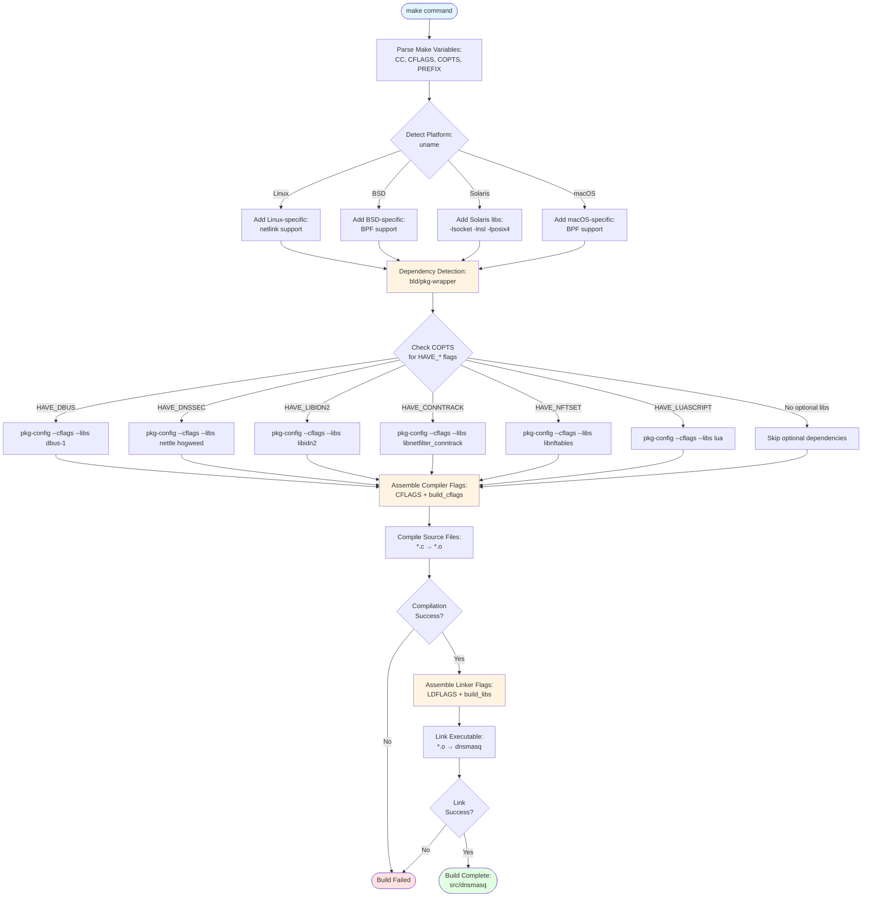
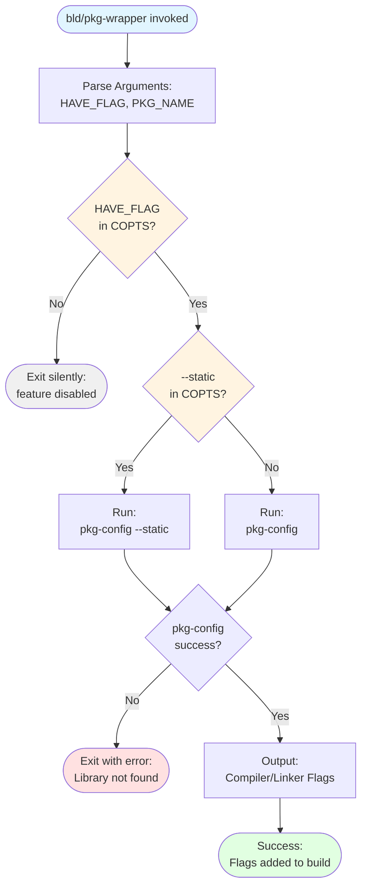

# Building dnsmasq

**Version:** 2.92  
**Copyright:** © 2000-2025 Simon Kelley  
**License:** GPL-2.0-or-later

## Table of Contents

- [Overview](#overview)
- [Platform Support](#platform-support)
- [Required Dependencies](#required-dependencies)
- [Optional Dependencies](#optional-dependencies)
- [Basic Build Instructions](#basic-build-instructions)
- [Feature Selection with COPTS](#feature-selection-with-copts)
- [Cross-Compilation](#cross-compilation)
- [Platform-Specific Instructions](#platform-specific-instructions)
- [Static vs Dynamic Linking](#static-vs-dynamic-linking)
- [Binary Size Optimization](#binary-size-optimization)
- [Build Troubleshooting](#build-troubleshooting)
- [Build System Architecture](#build-system-architecture)

---

## Overview

Dnsmasq uses a straightforward build system based on GNU Make and standard C compilation tools. The build process is designed for maximum portability across Unix-like operating systems, with platform-specific adaptations handled automatically through feature detection.

The build system supports:
- **Modular compilation**: Enable only required features via compile-time flags
- **Automatic dependency detection**: Uses pkg-config for library discovery
- **Platform adaptation**: Automatically detects and adapts to Linux, BSD, Solaris, macOS, and Android
- **Minimal external dependencies**: Core functionality requires only standard C library
- **Size optimization**: Feature selection produces executables ranging from 100KB (minimal) to 500KB (full-featured)

**Build Time:** Typical compilation completes in under 30 seconds on modern hardware.

---

## Platform Support

Dnsmasq compiles and runs on the following operating systems and architectures:

### Supported Operating Systems

| Operating System | Status | Platform-Specific Code | Notes |
|-----------------|--------|----------------------|-------|
| **Linux** (glibc) | Fully Supported | `src/netlink.c` for interface monitoring | Primary development platform |
| **Linux** (uclibc/musl) | Fully Supported | Same as glibc | Common in embedded systems |
| **FreeBSD** | Fully Supported | `src/bpf.c` for BPF interface | Requires BPF device access |
| **OpenBSD** | Fully Supported | `src/bpf.c` for BPF interface | Requires BPF device access |
| **NetBSD** | Fully Supported | `src/bpf.c` for BPF interface | Requires BPF device access |
| **DragonFly BSD** | Fully Supported | `src/bpf.c` for BPF interface | Requires BPF device access |
| **macOS/Darwin** | Fully Supported | `src/bpf.c` for BPF interface | See [macOS Instructions](#macos) |
| **Solaris/OpenSolaris** | Fully Supported | Requires special libraries | See [Solaris Instructions](#solaris) |
| **Android (AOSP)** | Fully Supported | Special build system | See [Android Instructions](#android) |

### Supported Architectures

- **x86** (32-bit Intel/AMD)
- **x86-64** (64-bit Intel/AMD)
- **ARM** (ARMv5, ARMv6, ARMv7, ARMv8/AArch64)
- **MIPS** (MIPS32, MIPS64, both big and little endian)
- **PowerPC** (32-bit and 64-bit)
- **RISC-V** (32-bit and 64-bit)
- **Other architectures** supported by the operating system and compiler

**Endianness:** Both big-endian and little-endian architectures are fully supported.

---

## Required Dependencies

The following components are required to build dnsmasq from source:

### Core Build Tools

| Component | Minimum Version | Purpose | Installation |
|-----------|----------------|---------|--------------|
| **GCC** or **Clang** | GCC 4.7+ / Clang 3.4+ | C compiler with C99 support | `apt-get install gcc` (Debian/Ubuntu)<br>`yum install gcc` (RHEL/CentOS)<br>`pkg install gcc` (FreeBSD) |
| **GNU Make** | 3.81+ | Build orchestration | `apt-get install make`<br>`yum install make`<br>Pre-installed on BSDs |
| **pkg-config** | 0.29+ | Library detection | `apt-get install pkg-config`<br>`yum install pkgconfig`<br>`pkg install pkgconf` (FreeBSD) |

### System Requirements

- **POSIX-compliant operating system**: Full POSIX.1-2008 API support
- **Standard C library**: glibc 2.17+, uclibc-ng 1.0.0+, musl 1.1.0+, or BSD libc
- **POSIX sockets API**: For network operations
- **POSIX signals**: For daemon control and configuration reload

**Note on BSD Make:** BSD pmake is supported but GNU Make is recommended for full build system features including internationalization targets.

---

## Optional Dependencies

Optional features require additional libraries. The build system automatically detects available libraries via pkg-config and enables corresponding features.

### D-Bus Control Interface

**Library:** libdbus-1  
**Minimum Version:** 1.12.0  
**Compile Flag:** `HAVE_DBUS`  
**Purpose:** Enables programmatic control via D-Bus system bus

**Installation:**
```bash
# Debian/Ubuntu
apt-get install libdbus-1-dev

# RHEL/CentOS/Fedora
yum install dbus-devel

# FreeBSD
pkg install dbus

# macOS (via Homebrew)
brew install d-bus
```

**Provides:**
- Cache query and manipulation methods
- Upstream server reconfiguration
- Lease information retrieval
- Service: `uk.org.thekelleys.dnsmasq`
- Policy file: `/etc/dbus-1/system.d/dnsmasq.conf`

---

### Internationalized Domain Name (IDN) Support

#### IDN 2008 (Recommended)

**Library:** libidn2  
**Minimum Version:** 2.0.0  
**Compile Flag:** `HAVE_LIBIDN2`  
**Purpose:** IDNA2008 internationalized domain name support

**Installation:**
```bash
# Debian/Ubuntu
apt-get install libidn2-dev

# RHEL/CentOS/Fedora
yum install libidn2-devel

# FreeBSD
pkg install libidn2
```

**Standards:** RFC 5891 (IDNA2008)

#### IDN 2003 (Legacy)

**Library:** libidn  
**Minimum Version:** 1.33  
**Compile Flag:** `HAVE_IDN`  
**Purpose:** IDNA2003 internationalized domain name support (legacy)

**Installation:**
```bash
# Debian/Ubuntu
apt-get install libidn11-dev

# RHEL/CentOS/Fedora
yum install libidn-devel
```

**Note:** `HAVE_IDN` and `HAVE_LIBIDN2` are mutually exclusive. IDN 2008 (`HAVE_LIBIDN2`) is recommended for new deployments.

---

### DNSSEC Validation

**Libraries:** nettle, hogweed  
**Minimum Version:** nettle 3.4, hogweed 3.4  
**Compile Flag:** `HAVE_DNSSEC`  
**Purpose:** Cryptographic validation of DNS responses

**Installation:**
```bash
# Debian/Ubuntu
apt-get install nettle-dev

# RHEL/CentOS/Fedora
yum install nettle-devel

# FreeBSD
pkg install nettle

# macOS (via Homebrew)
brew install nettle
```

**Optional:** libgmp (GNU Multi-Precision arithmetic library) for enhanced crypto performance. Automatically detected if available.

**Provides:**
- RRSIG signature verification
- DNSKEY and DS record validation
- NSEC/NSEC3 denial-of-existence proofs
- Trust anchor management

**Standards:** RFC 4033, 4034, 4035 (DNSSEC)

---

### Connection Tracking Integration

**Library:** libnetfilter_conntrack  
**Minimum Version:** 1.0.6  
**Compile Flag:** `HAVE_CONNTRACK`  
**Purpose:** Linux netfilter connection tracking mark preservation

**Installation:**
```bash
# Debian/Ubuntu
apt-get install libnetfilter-conntrack-dev

# RHEL/CentOS/Fedora
yum install libnetfilter_conntrack-devel
```

**Platform:** Linux only  
**Kernel Requirements:** CONFIG_NF_CONNTRACK enabled

**Provides:**
- Connection tracking mark queries
- Mark preservation across NAT
- Integration with policy-based routing

---

### nftables Set Integration

**Library:** libnftables  
**Minimum Version:** 0.9.0  
**Compile Flag:** `HAVE_NFTSET`  
**Purpose:** Populates nftables sets with resolved IP addresses

**Installation:**
```bash
# Debian/Ubuntu
apt-get install libnftables-dev

# RHEL/CentOS/Fedora (RHEL 8+)
yum install nftables-devel

# FreeBSD (nftables support experimental)
pkg install nftables
```

**Platform:** Linux primary, FreeBSD experimental  
**Kernel Requirements:** CONFIG_NF_TABLES enabled

**Provides:**
- Dynamic nftables set population
- Domain-based firewall rules
- Integration with nftables packet filtering

---

### Lua Scripting Support

**Library:** Lua  
**Minimum Version:** 5.2 (5.3+ recommended)  
**Compile Flag:** `HAVE_LUASCRIPT`  
**Purpose:** Embedded Lua interpreter for DHCP event scripts

**Installation:**
```bash
# Debian/Ubuntu
apt-get install liblua5.3-dev

# RHEL/CentOS/Fedora
yum install lua-devel

# FreeBSD
pkg install lua53

# macOS (via Homebrew)
brew install lua
```

**Lua Version Selection:** Set `LUA` make variable to specify version (e.g., `LUA=lua5.3`)

**Provides:**
- DHCP lease event handling via Lua functions
- Reduced process creation overhead vs external scripts
- Access to lease details (MAC, IP, hostname)

---

### UBus Control Interface (OpenWrt)

**Libraries:** libubus, libubox  
**Minimum Version:** OpenWrt 19.07+  
**Compile Flag:** `HAVE_UBUS`  
**Purpose:** Native OpenWrt/LEDE control interface

**Installation:**
```bash
# OpenWrt/LEDE build system
# Automatically included in OpenWrt SDK
```

**Platform:** OpenWrt/LEDE only

**Provides:**
- Cache management via UBus
- Lease query via UBus
- Integration with LuCI web interface
- Low memory footprint IPC

---

## Basic Build Instructions

### Quick Start (Default Configuration)

For a standard build with automatic feature detection:

```bash
# Extract source
tar xzf dnsmasq-2.92.tar.gz
cd dnsmasq-2.92

# Build with all auto-detected features
make

# Install (requires root)
make install
```

**Default Installation Paths:**
- Binary: `/usr/local/sbin/dnsmasq`
- Man page: `/usr/local/share/man/man8/dnsmasq.8`
- Configuration: User must create `/etc/dnsmasq.conf` (optional)

### Customizing Installation Paths

Override installation directories with make variables:

```bash
make install \
  PREFIX=/opt/dnsmasq \
  BINDIR=/opt/dnsmasq/bin \
  MANDIR=/opt/dnsmasq/man
```

**Available Path Variables:**

| Variable | Default | Purpose |
|----------|---------|---------|
| `PREFIX` | `/usr/local` | Installation prefix |
| `BINDIR` | `$(PREFIX)/sbin` | Executable location |
| `MANDIR` | `$(PREFIX)/share/man` | Man page location |
| `LOCALEDIR` | `$(PREFIX)/share/locale` | Translation files |
| `DESTDIR` | (empty) | Staging directory for packaging |

**Example for system-wide installation:**
```bash
make install PREFIX=/usr
# Installs to /usr/sbin/dnsmasq
```

---

## Feature Selection with COPTS

The `COPTS` make variable controls compile-time feature selection by passing C preprocessor flags to the compiler.

### Feature Selection Syntax

```bash
make COPTS="<flags>"
```

Where `<flags>` is a space-separated list of:
- **Feature enables**: `-DHAVE_<FEATURE>`
- **Feature disables**: `-DNO_<FEATURE>`
- **Custom values**: `-D<CONSTANT>=<value>`

### Common Feature Flags

#### Core Service Features

| Flag | Default | Purpose |
|------|---------|---------|
| `HAVE_DHCP` | ON | DHCPv4 and DHCPv6 server |
| `HAVE_DHCP6` | ON | DHCPv6 and Router Advertisement |
| `HAVE_TFTP` | ON | TFTP server for network boot |
| `HAVE_AUTH` | ON | Authoritative DNS mode |
| `HAVE_SCRIPT` | ON | External script execution |
| `HAVE_LOOP` | ON | DNS forwarding loop detection |
| `HAVE_INOTIFY` | ON (Linux) | Configuration file monitoring |

#### Optional Features (require libraries)

| Flag | Library Required | Purpose |
|------|-----------------|---------|
| `HAVE_DBUS` | libdbus-1 | D-Bus control interface |
| `HAVE_UBUS` | libubus, libubox | UBus control (OpenWrt) |
| `HAVE_IDN` | libidn | IDN 2003 support |
| `HAVE_LIBIDN2` | libidn2 | IDN 2008 support (preferred) |
| `HAVE_DNSSEC` | nettle, hogweed | DNSSEC validation |
| `HAVE_CONNTRACK` | libnetfilter_conntrack | Connection tracking |
| `HAVE_IPSET` | (kernel support) | Linux ipset integration |
| `HAVE_NFTSET` | libnftables | nftables set integration |
| `HAVE_LUASCRIPT` | lua | Lua scripting support |
| `HAVE_DUMPFILE` | (none) | Packet capture to pcap |

#### Feature Negation Flags

| Flag | Effect |
|------|--------|
| `NO_DHCP` | Disables all DHCP functionality (DHCPv4, DHCPv6, RA) |
| `NO_TFTP` | Disables TFTP server |
| `NO_SCRIPT` | Disables script execution hooks |
| `NO_INOTIFY` | Disables inotify file monitoring (Linux) |
| `NO_AUTH` | Disables authoritative DNS mode |
| `NO_LOOP` | Disables forwarding loop detection |
| `NO_ID` | Disables process ID file creation |
| `NO_GMP` | Disables GMP library (DNSSEC crypto optimization) |

---

### Feature Selection Examples

#### Minimal DNS-only Build

Create the smallest possible binary containing only DNS forwarding and caching:

```bash
make COPTS="-DNO_DHCP -DNO_TFTP -DNO_SCRIPT -DNO_AUTH -DNO_INOTIFY -DNO_LOOP -DNO_ID"
```

**Result:** ~100KB executable (stripped)  
**Capabilities:** DNS forwarding, DNS caching, `/etc/hosts` integration  
**Excluded:** All DHCP, TFTP, scripting, auth DNS

#### DNSSEC-enabled Build

Build with DNSSEC validation support:

```bash
make COPTS="-DHAVE_DNSSEC"
```

**Requirements:** nettle and hogweed libraries installed  
**Provides:** Cryptographic DNS response validation  
**Trust Anchors:** `trust-anchors.conf` must be present at runtime

#### Full-featured Build with D-Bus

Build with all auto-detected features plus D-Bus:

```bash
make COPTS="-DHAVE_DBUS -DHAVE_DNSSEC -DHAVE_IDN2"
```

**Requirements:**
- libdbus-1-dev
- nettle-dev
- libidn2-dev

#### DHCP and TFTP Only (No DNS)

Build for PXE boot server without DNS functionality:

```bash
make COPTS="-DHAVE_TFTP"
# DHCP is enabled by default
```

**Note:** This configuration is unusual. DHCP typically requires DNS for hostname registration.

#### Embedded System Build (OpenWrt/LEDE)

Typical configuration for resource-constrained routers:

```bash
make COPTS="-DHAVE_UBUS -DHAVE_IPSET -DNO_SCRIPT -DNO_INOTIFY" LUA=lua5.3
```

**Rationale:**
- UBus integration for LuCI web interface
- ipset for firewall integration
- Disabled script execution (security)
- Disabled inotify (not needed with UBus control)

---

### Dependency Detection Mechanism

The build system uses `bld/pkg-wrapper` to automatically detect library availability via pkg-config:

```bash
# From Makefile lines 55-71
dbus_cflags = `echo $(COPTS) | $(top)/bld/pkg-wrapper HAVE_DBUS $(PKG_CONFIG) --cflags dbus-1`
dbus_libs =   `echo $(COPTS) | $(top)/bld/pkg-wrapper HAVE_DBUS $(PKG_CONFIG) --libs dbus-1`
```

**How it works:**
1. If `HAVE_<FEATURE>` appears in `COPTS`, the wrapper invokes pkg-config
2. If library is found, flags are passed to compiler/linker
3. If library is missing, build fails with error message
4. If `HAVE_<FEATURE>` is not in `COPTS`, feature is skipped silently

**Manual Library Specification:**

If pkg-config detection fails, specify libraries manually:

```bash
make COPTS="-DHAVE_DBUS" LIBS="-ldbus-1"
```

---

## Cross-Compilation

Cross-compilation for embedded systems and alternative architectures is supported through standard make variables.

### Cross-Compilation Variables

| Variable | Purpose | Example |
|----------|---------|---------|
| `CC` | C compiler | `arm-linux-gnueabihf-gcc` |
| `CFLAGS` | Compiler flags | `-march=armv7-a -mfpu=neon` |
| `LDFLAGS` | Linker flags | `-static` |
| `PKG_CONFIG` | pkg-config tool | `arm-linux-gnueabihf-pkg-config` |
| `PKG_CONFIG_PATH` | Library search path | `/opt/arm-sdk/lib/pkgconfig` |

### Cross-Compilation Example: ARM Linux

Build for ARM-based embedded device:

```bash
# Set cross-compilation environment
export CC=arm-linux-gnueabihf-gcc
export CFLAGS="-march=armv7-a -mfpu=neon -O2"
export LDFLAGS="-static"
export PKG_CONFIG=arm-linux-gnueabihf-pkg-config
export PKG_CONFIG_PATH=/opt/arm-sdk/usr/lib/pkgconfig

# Build with minimal features
make COPTS="-DNO_SCRIPT -DNO_INOTIFY -DNO_AUTH"

# Result: Static ARM binary
file src/dnsmasq
# src/dnsmasq: ELF 32-bit LSB executable, ARM, statically linked
```

### Cross-Compilation Example: MIPS OpenWrt

Using OpenWrt SDK toolchain:

```bash
# OpenWrt SDK environment
export STAGING_DIR=/opt/openwrt-sdk/staging_dir
export PATH=$STAGING_DIR/toolchain-mips_24kc_gcc-8.4.0_musl/bin:$PATH
export CC=mips-openwrt-linux-gcc
export CFLAGS="-Os -pipe -mips32r2 -mtune=24kc"
export LDFLAGS=""

# Build for OpenWrt
make COPTS="-DHAVE_UBUS -DHAVE_IPSET -DNO_SCRIPT" LUA=lua5.3

# Result: MIPS binary for OpenWrt
```

### Cross-Compilation Troubleshooting

**Problem:** pkg-config finds host libraries instead of target libraries

**Solution:** Set `PKG_CONFIG_PATH` and `PKG_CONFIG_LIBDIR`:

```bash
export PKG_CONFIG_PATH=/opt/target-sdk/usr/lib/pkgconfig
export PKG_CONFIG_LIBDIR=/opt/target-sdk/usr/lib/pkgconfig
unset PKG_CONFIG_SYSTEM_LIBRARY_PATH
unset PKG_CONFIG_SYSTEM_INCLUDE_PATH
```

**Problem:** Linker finds wrong libraries

**Solution:** Use `LDFLAGS` to specify library search path:

```bash
export LDFLAGS="-L/opt/target-sdk/usr/lib -Wl,-rpath-link,/opt/target-sdk/usr/lib"
```

---

## Platform-Specific Instructions

### Linux

Linux is the primary development platform with full feature support.

**Standard Build:**
```bash
make
make install PREFIX=/usr
```

**Distribution-Specific Notes:**

#### Debian/Ubuntu

Install build dependencies:
```bash
apt-get install build-essential pkg-config \
  libdbus-1-dev libidn2-dev nettle-dev \
  libnetfilter-conntrack-dev libnftables-dev
```

#### RHEL/CentOS/Fedora

Install build dependencies:
```bash
yum install gcc make pkgconfig \
  dbus-devel libidn2-devel nettle-devel \
  libnetfilter_conntrack-devel nftables-devel
```

**Note:** RHEL 7 and earlier use iptables/ipset instead of nftables.

---

### FreeBSD

FreeBSD uses BPF (Berkeley Packet Filter) for raw packet access.

**Build Commands:**
```bash
# Install dependencies
pkg install nettle libidn2

# Build (GNU make required)
gmake

# Install
gmake install PREFIX=/usr/local
```

**Platform-Specific Behavior:**
- Uses BPF instead of Linux netlink (`src/bpf.c`)
- Requires `/dev/bpf` device access for DHCP
- Service management via `rc.d` scripts

**Service Installation:**
```bash
# Copy rc.d script
cp contrib/FreeBSD/rc.d/dnsmasq /usr/local/etc/rc.d/

# Enable in /etc/rc.conf
echo 'dnsmasq_enable="YES"' >> /etc/rc.conf

# Start service
service dnsmasq start
```

---

### OpenBSD

OpenBSD provides tight security integration with BPF and unveil/pledge support.

**Build Commands:**
```bash
# Install dependencies (as root)
pkg_add nettle libidn2

# Build (GNU make required)
gmake

# Install
gmake install PREFIX=/usr/local
```

**Security Notes:**
- Privilege separation via `_dnsmasq` user (create before running)
- BPF filter socket requires root or appropriate group membership
- Consider using OpenBSD packet filter (PF) integration

---

### NetBSD

**Build Commands:**
```bash
# Install dependencies via pkgsrc
pkgin install nettle libidn2 gmake

# Build
gmake

# Install
gmake install PREFIX=/usr/pkg
```

---

### macOS

macOS uses BPF for packet capture and launchd for service management.

**Install Dependencies via Homebrew:**
```bash
brew install nettle libidn2
```

**Build Commands:**
```bash
make

# Install to /usr/local
make install PREFIX=/usr/local
```

**launchd Service Integration:**

Install launchd plist for automatic startup:

```bash
# Copy launchd plist
cp contrib/MacOSX-launchd/uk.org.thekelleys.dnsmasq.plist \
   /Library/LaunchDaemons/

# Set permissions
chown root:wheel /Library/LaunchDaemons/uk.org.thekelleys.dnsmasq.plist
chmod 644 /Library/LaunchDaemons/uk.org.thekelleys.dnsmasq.plist

# Load service
launchctl load /Library/LaunchDaemons/uk.org.thekelleys.dnsmasq.plist

# Start service
launchctl start uk.org.thekelleys.dnsmasq
```

**macOS-Specific Notes:**
- System Integrity Protection (SIP) may prevent binding to port 53
- Consider using high port (e.g., 5353) or disabling SIP for development
- BPF device limit: macOS limits number of `/dev/bpf*` devices (check `sysctl debug.bpf_maxdevices`)

---

### Solaris/OpenSolaris

Solaris requires additional system libraries for socket operations.

**Build Commands:**
```bash
# Install dependencies (Solaris 11+)
pkg install gcc nettle libidn2 pkg-config

# Build with Solaris libraries
make CFLAGS="-O2 -Wall" LIBS="-lsocket -lnsl -lposix4"

# Install
make install PREFIX=/opt/dnsmasq
```

**Automatic Library Detection:**

The Makefile automatically adds Solaris libraries (line 69):
```makefile
sunos_libs = `if uname | grep SunOS >/dev/null 2>&1; then echo -lsocket -lnsl -lposix4; fi`
```

**Service Management Framework (SMF):**

Solaris uses SMF for service management:

```bash
# Import SMF manifest
svccfg import contrib/Solaris10/dnsmasq.xml

# Enable service
svcadm enable svc:/network/dnsmasq:default

# Check status
svcs dnsmasq
```

**SMF Manifest Location:** `contrib/Solaris10/dnsmasq.xml`

---

### Android

Android builds use the Android Open Source Project (AOSP) build system.

**Build File:** `bld/Android.mk`

**AOSP Build Integration:**

```makefile
# From bld/Android.mk
LOCAL_PATH := external/dnsmasq/src
LOCAL_MODULE := dnsmasq
LOCAL_CFLAGS := -O2 -g -W -Wall -D__ANDROID__ -DNO_TFTP -DNO_SCRIPT
LOCAL_SYSTEM_SHARED_LIBRARIES := libc
```

**Android-Specific Configuration:**
- **TFTP disabled:** `-DNO_TFTP` (Android security policy)
- **Script execution disabled:** `-DNO_SCRIPT` (Android security policy)
- **Platform detection:** `-D__ANDROID__`
- **Installation path:** `/system/bin/dnsmasq` or `/system/xbin/dnsmasq`

**Building within AOSP:**

1. Place dnsmasq source in `external/dnsmasq/`
2. Build via AOSP build system:
   ```bash
   cd /path/to/aosp
   source build/envsetup.sh
   lunch <target>
   make dnsmasq
   ```
3. Binary located at: `out/target/product/<device>/system/bin/dnsmasq`

**Android NDK Build:**

For standalone NDK builds:

```bash
# Set NDK environment
export NDK_ROOT=/opt/android-ndk-r25c
export CC=$NDK_ROOT/toolchains/llvm/prebuilt/linux-x86_64/bin/aarch64-linux-android30-clang
export CFLAGS="-O2 -D__ANDROID__ -DNO_TFTP -DNO_SCRIPT"
export LDFLAGS="-static"

# Build
make COPTS="-DNO_DHCP6 -DNO_AUTH -DNO_INOTIFY"
```

---

## Static vs Dynamic Linking

The build system supports both dynamic (default) and static linking.

### Dynamic Linking (Default)

Dynamic linking produces smaller binaries that depend on system shared libraries:

```bash
make
# Result: ~300-400KB binary (stripped)
```

**Advantages:**
- Smaller binary size
- Shared library updates benefit all programs
- Reduced memory usage (shared library code)

**Disadvantages:**
- Requires shared libraries at runtime
- Library version mismatches can cause issues
- Not suitable for rescue environments

**Check Dynamic Dependencies:**
```bash
ldd src/dnsmasq
# linux-vdso.so.1
# libdbus-1.so.3 => /usr/lib/x86_64-linux-gnu/libdbus-1.so.3
# libnettle.so.7 => /usr/lib/x86_64-linux-gnu/libnettle.so.7
# libc.so.6 => /lib/x86_64-linux-gnu/libc.so.6
```

---

### Static Linking

Static linking produces self-contained binaries with no external library dependencies:

```bash
make LDFLAGS="-static"
# Result: ~1-2MB binary (stripped)
```

**Advantages:**
- Self-contained executable
- No runtime library dependencies
- Suitable for embedded systems and rescue environments
- Consistent behavior across different systems

**Disadvantages:**
- Larger binary size
- No benefit from shared library security updates
- Increased memory usage (no shared library code)

**Verify Static Linking:**
```bash
ldd src/dnsmasq
# not a dynamically linked executable (statically linked)
```

---

### Partial Static Linking

Link some libraries statically while keeping others dynamic:

```bash
# Static nettle, dynamic glibc
make LDFLAGS="-static-libgcc -Wl,-Bstatic -lnettle -lhogweed -Wl,-Bdynamic"
```

**Use Case:** Embed optional libraries statically while using system libc dynamically.

---

### Static Linking with pkg-config

The `bld/pkg-wrapper` script handles static library flags:

```bash
# From bld/pkg-wrapper (line 18-23)
if [ -z "$CHECK" ] || echo "$COPTS" | grep -q "$CHECK"; then
  if echo "$COPTS" | grep -q -- "--static"; then
    pkg-config --static "$@"
  else
    pkg-config "$@"
  fi
fi
```

**Enable static pkg-config flags:**
```bash
make COPTS="-DHAVE_DNSSEC --static"
# Automatically uses pkg-config --static for library detection
```

---

## Binary Size Optimization

Optimize binary size for embedded systems and size-constrained deployments.

### Size Optimization Techniques

#### 1. Feature Selection

Disable unnecessary features via `COPTS`:

```bash
# DNS-only configuration
make COPTS="-DNO_DHCP -DNO_TFTP -DNO_SCRIPT -DNO_AUTH -DNO_INOTIFY -DNO_LOOP"
```

**Impact:** Reduces code size by 50-70% compared to full build.

#### 2. Compiler Optimization Flags

Use size-optimized compilation:

```bash
# Optimize for size (-Os)
make CFLAGS="-Os -Wall"
```

**Comparison:**
- `-O2` (default): Speed-optimized, ~350KB
- `-Os`: Size-optimized, ~280KB
- `-O3`: Aggressive speed, ~420KB
- `-Oz` (Clang): Ultra size, ~250KB

#### 3. Strip Debug Symbols

Remove debugging information:

```bash
# Build
make

# Strip symbols
strip --strip-all src/dnsmasq

# Check size
ls -lh src/dnsmasq
```

**Impact:** Reduces size by 30-50% (debug symbols are large).

#### 4. Link-Time Optimization (LTO)

Enable LTO for additional size reduction:

```bash
make CFLAGS="-Os -flto" LDFLAGS="-flto"
```

**Impact:** Additional 10-20% size reduction through cross-file optimization.

#### 5. Static Linking with Size Optimization

Combine static linking with size optimization:

```bash
make CFLAGS="-Os -flto" LDFLAGS="-static -flto -Wl,--gc-sections"
```

**Flags Explained:**
- `-Os`: Optimize for size
- `-flto`: Link-time optimization
- `-static`: Static linking
- `-Wl,--gc-sections`: Remove unused sections

---

### Size Comparison Table

| Configuration | Size (stripped) | Features |
|--------------|----------------|----------|
| Full build (dynamic, -O2) | ~350KB | All features enabled |
| Full build (static, -O2) | ~1.8MB | All features, static libs |
| Minimal (dynamic, -Os) | ~100KB | DNS-only, no optional libs |
| Minimal (static, -Os) | ~800KB | DNS-only, static libc |
| Embedded optimized | ~120KB | DHCP+DNS, uclibc, -Os |
| Android build | ~250KB | No TFTP/script, Bionic libc |

**Target Size Goals:**
- **Ultra-minimal:** <100KB (DNS forwarding only, no DHCP)
- **Minimal:** 100-150KB (DNS+DHCP, no optional features)
- **Standard:** 250-350KB (most features, dynamic linking)
- **Full-featured:** 400-500KB (all features, dynamic linking)

---

## Build Troubleshooting

### Common Build Errors and Solutions

#### Error: "pkg-config: command not found"

**Symptom:**
```
/bin/sh: pkg-config: command not found
```

**Cause:** pkg-config is not installed or not in PATH.

**Solution:**
```bash
# Debian/Ubuntu
apt-get install pkg-config

# RHEL/CentOS
yum install pkgconfig

# FreeBSD
pkg install pkgconf
```

---

#### Error: "Package dbus-1 was not found"

**Symptom:**
```
Package dbus-1 was not found in the pkg-config search path
```

**Cause:** D-Bus development headers not installed, but `HAVE_DBUS` is enabled.

**Solution 1:** Install D-Bus development package:
```bash
# Debian/Ubuntu
apt-get install libdbus-1-dev

# RHEL/CentOS
yum install dbus-devel
```

**Solution 2:** Build without D-Bus:
```bash
make  # Omit HAVE_DBUS from COPTS
```

**Solution 3:** Specify library path manually:
```bash
make COPTS="-DHAVE_DBUS" \
     PKG_CONFIG_PATH=/opt/dbus/lib/pkgconfig
```

---

#### Error: "undefined reference to `nettle_sha256_init'"

**Symptom:**
```
dnssec.o: In function `hash_init':
dnssec.c:123: undefined reference to `nettle_sha256_init'
```

**Cause:** DNSSEC enabled but nettle library not linked.

**Solution 1:** Install nettle development package:
```bash
# Debian/Ubuntu
apt-get install nettle-dev

# RHEL/CentOS
yum install nettle-devel
```

**Solution 2:** Disable DNSSEC:
```bash
make  # Omit HAVE_DNSSEC from COPTS
```

---

#### Error: "conntrack.c: No such file or directory"

**Symptom:**
```
make: *** No rule to make target 'conntrack.o', needed by 'dnsmasq'
```

**Cause:** Stale build with obsolete object file references.

**Solution:** Clean and rebuild:
```bash
make clean
make
```

---

#### Error: Platform-Specific Library Missing (Solaris)

**Symptom:**
```
Undefined symbol: socket
```

**Cause:** Solaris requires explicit socket library linking.

**Solution:** The Makefile handles this automatically, but if manual override is needed:
```bash
make LIBS="-lsocket -lnsl -lposix4"
```

---

#### Error: Cross-Compilation Finds Wrong Libraries

**Symptom:**
```
/usr/lib/x86_64-linux-gnu/libdbus-1.so: file not recognized: File format not recognized
```

**Cause:** pkg-config is finding host libraries instead of target cross-compiled libraries.

**Solution:** Set pkg-config environment variables:
```bash
export PKG_CONFIG_PATH=/opt/target-sdk/usr/lib/pkgconfig
export PKG_CONFIG_LIBDIR=/opt/target-sdk/usr/lib/pkgconfig
export PKG_CONFIG_SYSROOT_DIR=/opt/target-sdk

make CC=arm-linux-gnueabihf-gcc
```

---

#### Warning: "implicit declaration of function"

**Symptom:**
```
warning: implicit declaration of function 'getifaddrs'
```

**Cause:** Missing feature detection or platform incompatibility.

**Solution:** Check that appropriate feature flags are enabled for your platform. This usually indicates a platform-specific API is unavailable.

For BSD platforms:
```bash
make  # Should auto-detect BSD and use BPF instead
```

---

#### Error: "make: *** No rule to make target 'all-i18n'"

**Symptom:**
```
make: *** No rule to make target 'all-i18n'
```

**Cause:** Internationalization requires GNU Make and gettext tools.

**Solution 1:** Use basic build target:
```bash
make  # Instead of make all-i18n
```

**Solution 2:** Install GNU Make and gettext:
```bash
# FreeBSD
pkg install gmake gettext-tools
gmake all-i18n
```

---

### Debugging Build Issues

#### Enable Verbose Build Output

```bash
make V=1
# Shows full compiler and linker commands
```

#### Check Compiler Availability

```bash
which gcc
gcc --version

# For cross-compilation
which arm-linux-gnueabihf-gcc
arm-linux-gnueabihf-gcc --version
```

#### Test pkg-config Detection

```bash
# Test library detection
pkg-config --exists dbus-1 && echo "Found" || echo "Not found"
pkg-config --cflags dbus-1
pkg-config --libs dbus-1

# Check search path
pkg-config --variable pc_path pkg-config
```

#### Examine Build Options

```bash
# Check what features will be compiled
make COPTS="-DHAVE_DBUS -DHAVE_DNSSEC" 2>&1 | grep -E "HAVE_|NO_"
```

---

## Build System Architecture

### Build Flow Diagram



---

### Dependency Detection Flow



**Key Points:**
- **Conditional Execution**: Features are only enabled if explicitly requested via `COPTS`
- **Silent Failure**: If a feature is not requested, the wrapper exits silently (no error)
- **Error on Missing**: If a feature is requested but library is missing, build fails with clear error
- **Static Linking Support**: `--static` flag triggers `pkg-config --static` for correct static library flags

---

### Compilation Process

The build system compiles each `.c` source file to a `.o` object file, then links all objects into the final binary:

**Compilation Rule** (from Makefile line 149-150):
```makefile
%.o: $(SRC)/%.c $(hdrs) $(copts_conf)
	$(CC) $(CFLAGS) $(COPTS) $(RPM_OPT_FLAGS) $(build_cflags) $(version) -c $<
```

**Linking Rule** (from Makefile line 163-164):
```makefile
dnsmasq: $(objs)
	$(CC) $(LDFLAGS) -o $@ $(objs) $(build_libs) $(LIBS)
```

**Object Files** (from Makefile line 78-84):
```
cache.o rfc1035.o util.o option.o forward.o network.o dnsmasq.o
dhcp.o lease.o rfc2131.o netlink.o dbus.o bpf.o helper.o tftp.o
log.o conntrack.o dhcp6.o rfc3315.o dhcp-common.o outpacket.o
radv.o slaac.o auth.o ipset.o pattern.o domain.o dnssec.o
blockdata.o tables.o loop.o inotify.o poll.o rrfilter.o edns0.o
arp.o crypto.o dump.o ubus.o metrics.o domain-match.o nftset.o
```

**Header Dependencies** (from Makefile line 86-87):
```
dnsmasq.h config.h dhcp-protocol.h dhcp6-protocol.h
dns-protocol.h radv-protocol.h ip6addr.h metrics.h
```

All object files depend on all headers, ensuring recompilation when headers change.

---

### Build Configuration Caching

The build system caches the configuration to avoid unnecessary recompilation:

**Configuration Checksum** (from Makefile line 74-76):
```makefile
sum = $(shell echo $(CC) -DDNSMASQ_COMPILE_FLAGS="$(CFLAGS)" \
       -DDNSMASQ_COMPILE_OPTS $(COPTS) -E $(top)/$(SRC)/dnsmasq.h \
       | md5sum | cut -f 1 -d ' ')
copts_conf = .copts_$(sum)
```

**How it works:**
1. Calculate MD5 hash of compiler, flags, and options
2. Create marker file `.copts_<hash>`
3. If configuration changes, hash changes, triggering rebuild
4. Avoids full rebuild when unrelated files change

**Clean Configuration Cache:**
```bash
make clean
# Removes .copts_* files and forces reconfiguration
```

---

## Advanced Build Topics

### Internationalization (i18n)

Build with translation support:

```bash
# Requires GNU Make and gettext tools
make all-i18n

# Install with translations
make install-i18n PREFIX=/usr
```

**Translation Files:** Located in `po/` directory (`.po` files for each language)

**Supported Languages:** Check `po/` directory for available translations.

---

### Developer Build (Debug Symbols)

Build with debugging symbols for development:

```bash
make CFLAGS="-g -O0 -Wall -Wextra"
```

**Debug Flags:**
- `-g`: Include debugging symbols
- `-O0`: Disable optimization for easier debugging
- `-Wall -Wextra`: Enable all warnings

**Debug with GDB:**
```bash
gdb src/dnsmasq
(gdb) run --no-daemon --log-queries
```

---

### Memory Debugging (Valgrind)

Build for memory leak detection:

```bash
make CFLAGS="-g -O0"

# Run with valgrind
valgrind --leak-check=full --show-leak-kinds=all \
  src/dnsmasq --no-daemon --log-queries
```

---

### Code Coverage Analysis

Build with coverage instrumentation:

```bash
# Build with coverage
make CFLAGS="-g -O0 -fprofile-arcs -ftest-coverage" \
     LDFLAGS="-fprofile-arcs"

# Run tests
src/dnsmasq --no-daemon --log-queries &
DNSMASQ_PID=$!

# Generate traffic (run test queries)
dig @127.0.0.1 example.com

# Stop daemon
kill $DNSMASQ_PID

# Generate coverage report
gcov src/*.c
lcov --capture --directory . --output-file coverage.info
genhtml coverage.info --output-directory coverage-html
```

---

## Summary

### Quick Reference: Common Build Commands

```bash
# Standard build with auto-detection
make

# Full-featured build with optional libraries
make COPTS="-DHAVE_DBUS -DHAVE_DNSSEC -DHAVE_LIBIDN2"

# Minimal DNS-only build
make COPTS="-DNO_DHCP -DNO_TFTP -DNO_SCRIPT -DNO_AUTH"

# Size-optimized build
make CFLAGS="-Os -flto" LDFLAGS="-flto -Wl,--gc-sections"

# Static build
make LDFLAGS="-static"

# Cross-compile for ARM
make CC=arm-linux-gnueabihf-gcc LDFLAGS="-static"

# Install to system
make install PREFIX=/usr

# Clean build artifacts
make clean
```

---

### Build System Files Reference

| File | Purpose |
|------|---------|
| `Makefile` | Main build system configuration and rules |
| `src/config.h` | Compile-time defaults and feature flags (480 lines) |
| `bld/pkg-wrapper` | pkg-config wrapper for dependency detection (46 lines) |
| `bld/Android.mk` | Android AOSP build system integration (27 lines) |
| `bld/get-version` | Version string extraction script |

---

### Getting Help

**Documentation:**
- Build system: This document (`docs/BUILDING.md`)
- Configuration: `dnsmasq.conf.example` (690 lines with inline documentation)
- User manual: `man/dnsmasq.8` (man page)
- Project website: http://www.thekelleys.org.uk/dnsmasq/

**Reporting Build Issues:**
- Mailing list: dnsmasq-discuss@lists.thekelleys.org.uk
- Include: Platform, compiler version, build command, error output
- Provide: `uname -a`, `gcc --version`, `make V=1` output

---

**Document Version:** 1.0  
**Based on:** dnsmasq 2.92 build system  
**Last Updated:** 2025  
**Maintainer:** Simon Kelley

