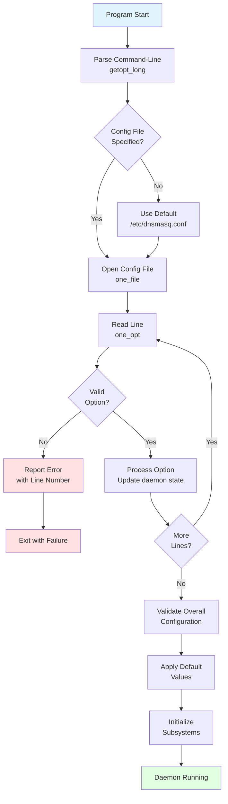
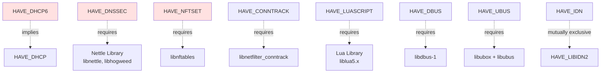
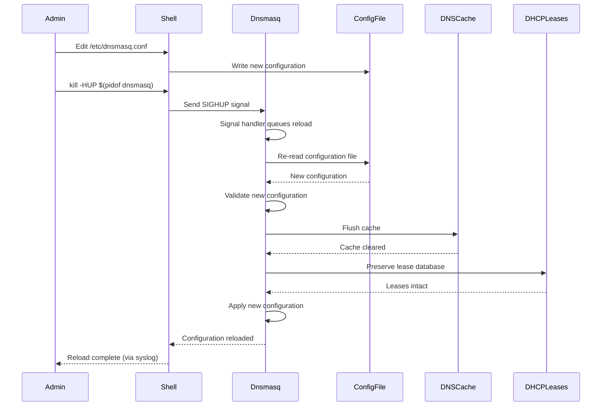

# Dnsmasq Configuration System

## Table of Contents

1. [Overview](#overview)
2. [Configuration System Architecture](#configuration-system-architecture)
3. [Configuration File Format](#configuration-file-format)
4. [Command-Line Options](#command-line-options)
5. [Configuration Precedence](#configuration-precedence)
6. [Compile-Time Options](#compile-time-options)
7. [Numeric Constants](#numeric-constants)
8. [Configuration Validation](#configuration-validation)
9. [Dynamic Configuration](#dynamic-configuration)
10. [Common Configuration Patterns](#common-configuration-patterns)

---

## Overview

The dnsmasq configuration system provides flexible, hierarchical configuration management supporting three configuration sources:

1. **Compile-time options**: Feature flags and default values built into the binary
2. **Configuration file**: Persistent settings in `/etc/dnsmasq.conf` (or specified location)
3. **Command-line arguments**: Runtime overrides passed at daemon startup

This three-tier approach enables:
- **Default behavior** suitable for zero-configuration deployments
- **Site-specific customization** through configuration files
- **Runtime flexibility** via command-line overrides for testing and temporary changes

### Key Configuration Characteristics

- **Simple Text Format**: One option per line, matching long command-line options
- **Flexible Precedence**: Command-line → config file → compile-time defaults
- **Hot Reload**: SIGHUP signal triggers configuration reload without service interruption
- **Extensive Options**: 350+ configuration directives supporting all features
- **Modular Compilation**: Feature flags enable/disable entire subsystems at build time

---

## Configuration System Architecture

### Configuration Parsing Overview

The configuration system is implemented in `src/option.c` (approximately 7,800 lines), the largest single source file in dnsmasq. The parser implements a state machine that processes configuration directives sequentially, maintaining global state in the `daemon` structure.



### Configuration Parsing Entry Point

**Source:** `src/option.c:7752`

```c
void read_opts(int argc, char **argv, char *compile_opts)
```

**Function:** Main configuration parsing entry point called from `main()` in `src/dnsmasq.c`

**Parameters:**
- `argc`, `argv`: Command-line argument count and vector
- `compile_opts`: String containing compile-time feature flags (displayed in version output)

**Processing Flow:**
1. Initialize option parsing state
2. Parse command-line options using `getopt_long()` (line 7811)
3. Process configuration file(s) via `one_file()` function
4. Validate interdependent options
5. Apply default values for unspecified options
6. Allocate and initialize data structures

### Command-Line Parsing with getopt_long

**Source:** `src/option.c:7811`

```c
option = getopt_long(argc, argv, OPTSTRING, opts, NULL);
```

The `opts` array (defined starting at line 335) contains all long command-line options with their corresponding short options, argument requirements, and help text. This structure drives both command-line parsing and `--help` output generation.

**Example from opts[] array:**

```c
static const struct option opts[] = {
  { "version", 0, 0, 'v' },
  { "no-hosts", 0, 0, 'h' },
  { "no-poll", 0, 0, 'n' },
  { "help", 0, 0, 'w' },
  { "no-daemon", 0, 0, 'd' },
  { "log-queries", 2, 0, 'q' },
  { "user", 2, 0, 'u' },
  { "group", 2, 0, 'g' },
  { "resolv-file", 2, 0, 'r' },
  { "servers-file", 1, 0, LOPT_SERV_FILE },
  { "mx-host", 1, 0, 'm' },
  { "mx-target", 1, 0, 't' },
  { "cache-size", 2, 0, 'c' },
  { "port", 1, 0, 'p' },
  { "dhcp-leasefile", 2, 0, 'l' },
  { "dhcp-lease", 1, 0, 'l' },
  { "dhcp-host", 1, 0, 'G' },
  { "dhcp-range", 1, 0, 'F' },
  { "dhcp-option", 1, 0, 'O' },
  // ... (continues for 300+ options)
};
```

### Configuration File Parsing

**Source:** `src/option.c` functions `one_file()` and `one_opt()`

**File Format:**
- One option per line
- Option names match long command-line options (without leading `--`)
- Comments start with `#` character
- Blank lines ignored
- Options with arguments use `=` separator: `option=value`
- Multiple values can be comma-separated where appropriate

**Example Configuration Snippets:**

```
# DNS configuration
port=53
cache-size=1000
server=8.8.8.8
server=8.8.4.4

# DHCP configuration
dhcp-range=192.168.1.50,192.168.1.150,12h
dhcp-option=option:router,192.168.1.1
dhcp-option=option:dns-server,192.168.1.1

# Logging
log-queries
log-dhcp
log-facility=/var/log/dnsmasq.log
```

### Configuration File Location

**Default:** `/etc/dnsmasq.conf`

**Override via command-line:**
```bash
dnsmasq --conf-file=/path/to/alternate.conf
```

**Disable configuration file:**
```bash
dnsmasq --conf-file
```

**Additional configuration files:**
```bash
dnsmasq --conf-file=/etc/dnsmasq.conf --conf-dir=/etc/dnsmasq.d
```

The `--conf-dir` option specifies a directory containing additional configuration files. Files in this directory are processed in alphabetical order, allowing modular configuration management.

---

## Configuration File Format

### Syntax Rules

1. **One Option Per Line**
   - Each configuration directive occupies a single line
   - Multi-line options not supported (use multiple directives)

2. **Comment Syntax**
   - Lines starting with `#` are comments
   - Inline comments NOT supported: `option=value # comment` treats `# comment` as part of value

3. **Option Format**
   - Options without arguments: `option-name`
   - Options with arguments: `option-name=value`
   - No spaces around `=` separator (spaces become part of value)

4. **Quoting**
   - Values containing spaces must be quoted: `txt-record=example.com,"TXT record with spaces"`
   - Backslash escaping supported for special characters

5. **Case Sensitivity**
   - Option names are case-insensitive
   - Values are case-sensitive (hostnames, IP addresses, paths)

### Configuration File Example

**Source:** `dnsmasq.conf.example` (689 lines of comprehensive examples)

The example configuration file demonstrates every supported option with explanatory comments. Key sections include:

- **Lines 7-100**: DNS configuration (upstream servers, caching, DNSSEC)
- **Lines 162-308**: DHCPv4 configuration (ranges, static leases, options)
- **Lines 191-220**: DHCPv6 and IPv6 Router Advertisement
- **Lines 448-500**: PXE network boot configuration
- **Lines 508-540**: TFTP server configuration
- **Lines 568-572**: Script execution (lease-change hooks)
- **Lines 669-674**: Logging configuration

---

## Command-Line Options

### Option Categories

Dnsmasq supports 350+ command-line options organized by functional area:

#### DNS Options

| Option | Short | Argument | Description |
|--------|-------|----------|-------------|
| `--port` | `-p` | PORT | DNS port to listen on (default 53, 0 disables DNS) |
| `--cache-size` | `-c` | SIZE | DNS cache size in entries (default 150, 0 disables caching) |
| `--no-hosts` | `-h` | - | Don't read /etc/hosts |
| `--no-resolv` | `-R` | - | Don't read /etc/resolv.conf |
| `--resolv-file` | `-r` | FILE | Specify alternate resolv.conf file |
| `--server` | `-S` | SERVER | Upstream DNS server ([/domain/]server[@interface]) |
| `--local` | - | /DOMAIN/ | Never forward queries for DOMAIN |
| `--address` | `-A` | /DOMAIN/ADDR | Return ADDR for all queries in DOMAIN |
| `--ipset` | - | /DOMAIN/SETNAME | Add resolved IPs to ipset SETNAME |
| `--nftset` | - | /DOMAIN/SPEC | Add resolved IPs to nftables set |

#### DNSSEC Options

| Option | Argument | Description |
|--------|----------|-------------|
| `--dnssec` | - | Enable DNSSEC validation (requires HAVE_DNSSEC) |
| `--trust-anchor` | KEYTAG,ALGO,DIGEST | Specify trust anchor |
| `--dnssec-check-unsigned` | - | Check unsigned replies for security |
| `--dnssec-no-timecheck` | - | Don't check DNSSEC signature timestamps |

#### DHCP Options

| Option | Short | Argument | Description |
|--------|-------|----------|-------------|
| `--dhcp-range` | `-F` | START,END[,MASK][,TIME] | Enable DHCP with address range |
| `--dhcp-host` | `-G` | HOST,ADDR[,TIME] | Static DHCP lease |
| `--dhcp-option` | `-O` | OPTION,VALUE | Set DHCP option value |
| `--dhcp-leasefile` | `-l` | FILE | Lease database file path |
| `--dhcp-script` | - | SCRIPT | Execute script on lease events |
| `--dhcp-luascript` | - | SCRIPT | Execute Lua script on lease events |

#### Network Boot Options

| Option | Argument | Description |
|--------|----------|-------------|
| `--enable-tftp` | [=INTERFACE] | Enable built-in TFTP server |
| `--tftp-root` | DIR[,INTERFACE] | TFTP root directory |
| `--tftp-secure` | - | Enable secure mode (ownership check) |
| `--pxe-service` | TAG,TYPE,TEXT | Define PXE boot service |
| `--dhcp-boot` | FILE | Specify boot filename |

#### Interface and Address Options

| Option | Short | Argument | Description |
|--------|-------|----------|-------------|
| `--interface` | `-i` | IFACE | Listen only on IFACE |
| `--listen-address` | `-a` | ADDR | Listen only on ADDR |
| `--bind-interfaces` | `-z` | - | Bind to interfaces instead of wildcard |
| `--except-interface` | `-I` | IFACE | Don't listen on IFACE |

#### Logging and Debugging Options

| Option | Short | Argument | Description |
|--------|-------|----------|-------------|
| `--log-queries` | `-q` | [=DEST] | Log DNS queries |
| `--log-dhcp` | - | - | Log DHCP transactions |
| `--log-facility` | - | FACILITY | Syslog facility or file path |
| `--log-debug` | - | - | Enable debug-level logging |

#### Control and Integration Options

| Option | Argument | Description |
|--------|----------|-------------|
| `--enable-dbus` | [=SERVICE] | Enable D-Bus interface |
| `--enable-ubus` | [=SERVICE] | Enable UBus interface (OpenWrt) |
| `--conf-dir` | DIR | Read additional config files from DIR |
| `--conf-file` | FILE | Configuration file path (empty = disable) |

### Complete Option Reference

The complete list of all supported options is available via:

```bash
dnsmasq --help
```

Or by examining the `opts[]` array in `src/option.c:335-800`.

---

## Configuration Precedence

Dnsmasq applies configuration from three sources with strict precedence ordering:


### Precedence Rules

1. **Command-Line Options (Highest Precedence)**
   - Options specified via command-line arguments override all other sources
   - Example: `dnsmasq --port=5353` overrides any `port=` directive in config file

2. **Configuration File (Medium Precedence)**
   - Options in configuration file override compile-time defaults
   - Later options in file override earlier ones for same parameter
   - Multiple configuration files: processed in order specified

3. **Compile-Time Defaults (Lowest Precedence)**
   - Default values compiled into binary from `src/config.h`
   - Used only when option not specified in config file or command-line

### Precedence Example

**Scenario:** Cache size configuration

**Compile-time default** (`src/config.h:38`):
```c
#define CACHESIZ 150
```

**Configuration file** (`/etc/dnsmasq.conf`):
```
cache-size=1000
```

**Command-line override**:
```bash
dnsmasq --cache-size=500
```

**Effective cache size:** 500 entries (command-line wins)

### Option Override Behavior

**Most options follow "last-wins" precedence:**
- Scalar values (port, cache-size, user, group): last specified value used
- Example: `--port=53 --port=5353` results in port 5353

**Some options are additive:**
- Upstream servers (`--server`): all specified servers used
- DHCP options (`--dhcp-option`): all options applied
- DHCP ranges (`--dhcp-range`): all ranges active
- Example: Multiple `server=` directives add multiple upstream servers

**Some options are boolean toggles:**
- Enable options (e.g., `--log-queries`): presence enables feature
- Disable options (e.g., `--no-hosts`): presence disables feature
- Cannot be un-set via subsequent options

---

## Compile-Time Options

Dnsmasq uses compile-time feature flags to enable or disable entire subsystems at build time. This approach allows:

- **Minimal binary size** for embedded systems (disable unused features)
- **Security reduction** by excluding unnecessary code
- **Dependency management** (features requiring external libraries can be disabled)

### Feature Flag Specification

**Via Makefile COPTS variable:**

```bash
make COPTS="-DHAVE_DHCP -DHAVE_DNSSEC"
```

**Via config.h editing:**

Uncomment desired features in `src/config.h:71-200`

### Complete Compile-Time Option Reference

**Source:** `src/config.h:71-200`

#### Core Protocol Features

| Flag | Description | Dependencies | Impact |
|------|-------------|--------------|--------|
| `HAVE_DHCP` | Enable DHCPv4 server | None | Enables `src/dhcp.c`, `src/rfc2131.c`, lease management; adds ~50KB to binary |
| `HAVE_DHCP6` | Enable DHCPv6 and Router Advertisement | Implies `HAVE_DHCP` | Enables `src/dhcp6.c`, `src/rfc3315.c`, `src/radv.c`; adds ~40KB |
| `HAVE_TFTP` | Enable TFTP server | None | Enables `src/tftp.c`; adds ~15KB |
| `HAVE_DNSSEC` | Enable DNSSEC validation | Requires Nettle library | Enables `src/dnssec.c`, `src/crypto.c`; adds ~60KB plus Nettle dependency |
| `HAVE_AUTH` | Enable authoritative DNS mode | None | Enables `src/auth.c`; adds ~20KB |

#### Integration Features

| Flag | Description | Dependencies | Impact |
|------|-------------|--------------|--------|
| `HAVE_DBUS` | Enable D-Bus control interface | Requires libdbus-1 | Enables `src/dbus.c`; adds D-Bus service on system bus |
| `HAVE_UBUS` | Enable UBus interface (OpenWrt) | Requires libubox, libubus | Enables `src/ubus.c`; OpenWrt-specific integration |
| `HAVE_SCRIPT` | Enable lease-change script execution | None | Enables fork-exec for external scripts in `src/helper.c` |
| `HAVE_LUASCRIPT` | Enable Lua scripting for lease events | Requires Lua library | Enables embedded Lua interpreter; reduces fork overhead |
| `HAVE_IPSET` | Enable Linux ipset integration | None (uses netlink or legacy ipset API) | Enables `src/ipset.c`; firewall integration |
| `HAVE_NFTSET` | Enable nftables set integration | Requires libnftables | Enables `src/nftset.c`; modern firewall integration |
| `HAVE_CONNTRACK` | Enable connection tracking marks | Requires libnetfilter_conntrack | Enables `src/conntrack.c`; advanced routing support |

#### Internationalization and Standards

| Flag | Description | Dependencies | Impact |
|------|-------------|--------------|--------|
| `HAVE_IDN` | Enable IDN 2003 support | Requires libidn | Internationalized domain name support (2003 standard) |
| `HAVE_LIBIDN2` | Enable IDN 2008 support | Requires libidn2 | Internationalized domain name support (2008 standard, preferred) |

#### Platform and Debugging Features

| Flag | Description | Dependencies | Impact |
|------|-------------|--------------|--------|
| `HAVE_LINUX_NETWORK` | Enable Linux-specific networking | Linux kernel | Enables `src/netlink.c` for interface monitoring via netlink |
| `HAVE_INOTIFY` | Enable inotify for config file monitoring | Linux kernel with inotify | Enables `src/inotify.c` for automatic config reload on file changes |
| `HAVE_LOOP` | Enable DNS forwarding loop detection | None | Enables `src/loop.c`; sends test queries to detect loops |
| `HAVE_DUMPFILE` | Enable packet capture to libpcap format | None | Enables `src/dump.c`; packet debugging |
| `HAVE_BROKEN_RTC` | Enable RTC-less embedded operation | None | Uses uptime instead of wall clock; flash-friendly lease file writes |

### Feature Dependencies

Some features require or imply other features:



**Key Dependency Rules:**

1. `HAVE_DHCP6` automatically enables `HAVE_DHCP` (DHCPv6 requires DHCPv4 infrastructure)
2. `HAVE_DNSSEC` requires Nettle cryptography library at link time
3. `HAVE_NFTSET` requires libnftables (nftables user-space library)
4. `HAVE_IDN` and `HAVE_LIBIDN2` are mutually exclusive (use one or the other, not both)
5. Platform-specific features (`HAVE_LINUX_NETWORK`, `HAVE_INOTIFY`) auto-detected by build system

### Checking Compiled Features

**View compile-time options in running daemon:**

```bash
dnsmasq --version
```

Example output:
```
Dnsmasq version 2.92  Copyright (c) 2000-2025 Simon Kelley
Compile time options: IPv6 GNU-getopt DBus UBus no-IDN DHCP DHCPv6 no-Lua TFTP conntrack ipset nftset auth cryptohash DNSSEC loop-detect inotify dumpfile

This software comes with ABSOLUTELY NO WARRANTY.
Dnsmasq is free software, and you are welcome to redistribute it
under the terms of the GNU General Public License, version 2 or 3.
```

The "Compile time options" line shows which features are enabled.

### Feature Impact Matrix

| Feature | Binary Size Impact | Memory Impact | CPU Impact | External Dependencies |
|---------|-------------------|---------------|------------|----------------------|
| DHCP | +50KB | +500KB (1000 leases) | Low | None |
| DHCP6 | +40KB | +300KB (lease tracking) | Low | None |
| DNSSEC | +60KB | +50KB (validation state) | High (crypto) | libnettle |
| TFTP | +15KB | +100KB (50 connections) | Medium (I/O) | None |
| Auth DNS | +20KB | +50KB (zone data) | Low | None |
| DBus | +20KB | +20KB (bus connection) | Low | libdbus-1 |
| IPSET | +10KB | Minimal | Low | Kernel ipset support |
| NFTSET | +15KB | Minimal | Low | libnftables |

---

## Numeric Constants

Dnsmasq defines numerous numeric constants in `src/config.h` that control performance limits, timeouts, and default behaviors.

**Source:** `src/config.h:17-70`

### DNS Configuration Constants

| Constant | Default Value | Description | Configurable Via |
|----------|---------------|-------------|------------------|
| `FTABSIZ` | 150 | Maximum concurrent outstanding DNS queries | `--dns-forward-max` |
| `CACHESIZ` | 150 | Default DNS cache size (entries) | `--cache-size` |
| `TIMEOUT` | 10 seconds | Upstream DNS query timeout | (hardcoded) |
| `EDNS_PKTSZ` | 1232 bytes | Default max EDNS.0 UDP packet size | `--edns-packet-max` |
| `CNAME_CHAIN` | 10 | Maximum CNAME chain length (loop protection) | (hardcoded) |
| `FORWARD_TEST` | 50 queries | Try all servers every N queries | (hardcoded) |
| `FORWARD_TIME` | 20 seconds | Or try all servers every N seconds | (hardcoded) |
| `UDP_TEST_TIME` | 60 seconds | Reset max packet size every N seconds | (hardcoded) |
| `TTL_FLOOR_LIMIT` | 3600 seconds | Maximum TTL that --min-cache-ttl can enforce | (hardcoded) |

### TCP Configuration Constants

| Constant | Default Value | Description | Configurable Via |
|----------|---------------|-------------|------------------|
| `MAX_PROCS` | 20 | Maximum TCP child processes | (hardcoded) |
| `TCP_MAX_QUERIES` | 100 | Maximum queries per TCP connection | (hardcoded) |
| `TCP_TIMEOUT` | 5 seconds | TCP connection timeout (10s for answers) | (hardcoded) |
| `TCP_BACKLOG` | 32 | Kernel backlog limit for TCP connections | (hardcoded) |
| `CHILD_LIFETIME` | 150 seconds | TCP child process lifetime | (hardcoded) |

### DHCP Configuration Constants

| Constant | Default Value | Description | Configurable Via |
|----------|---------------|-------------|------------------|
| `MAXLEASES` | 1000 | Maximum number of DHCP leases | (hardcoded) |
| `DEFLEASE` | 3600 seconds | Default DHCPv4 lease time (1 hour) | `dhcp-range` |
| `DEFLEASE6` | 86400 seconds | Default DHCPv6 lease time (24 hours) | `dhcp-range` |
| `DHCP_PACKET_MAX` | 16384 bytes | Maximum DHCP packet size | (hardcoded) |
| `PING_WAIT` | 3 seconds | Wait time for ping address-in-use test | (hardcoded) |
| `PING_CACHE_TIME` | 30 seconds | Assume ping test valid for N seconds | (hardcoded) |
| `DECLINE_BACKOFF` | 600 seconds | Disable DECLINEd addresses for N seconds | (hardcoded) |
| `LEASE_RETRY` | 60 seconds | Retry lease file write after error | (hardcoded) |

### DNSSEC Configuration Constants

| Constant | Default Value | Description | Impact |
|----------|---------------|-------------|--------|
| `DNSSEC_LIMIT_WORK` | 40 | Maximum queries to validate one question | DoS protection |
| `DNSSEC_LIMIT_SIG_FAIL` | 20 | Maximum signature failures per answer | DoS protection |
| `DNSSEC_LIMIT_CRYPTO` | 200 | Maximum crypto operations per query | CPU protection |
| `DNSSEC_LIMIT_NSEC3_ITERS` | 150 | Maximum NSEC3 iterations | DoS protection |
| `DNSSEC_MIN_TTL` | 60 seconds | Minimum TTL for DNSKEY/DS records in cache | Cache stability |
| `DNSSEC_ASSUMED_DS_TTL` | 3600 seconds | TTL for negative DS records | (hardcoded) |
| `KEYBLOCK_LEN` | 40 bytes | DNSSEC key storage block size | Memory optimization |

### TFTP Configuration Constants

| Constant | Default Value | Description | Configurable Via |
|----------|---------------|-------------|------------------|
| `TFTP_MAX_CONNECTIONS` | 50 | Maximum simultaneous TFTP connections | `--tftp-max` |
| `TFTP_MAX_WINDOW` | 32 | Maximum TFTP window size | (hardcoded) |
| `TFTP_TRANSFER_TIME` | 120 seconds | TFTP transfer timeout | (hardcoded) |

### Logging Configuration Constants

| Constant | Default Value | Description | Impact |
|----------|---------------|-------------|--------|
| `LOG_MAX` | 5 | Log queue length (non-blocking logging) | Memory minimal |
| `SERVERS_LOGGED` | 30 | Max upstream servers logged in status | Log verbosity |
| `LOCALS_LOGGED` | 8 | Max local addresses logged in status | Log verbosity |

### File Path Constants

| Constant | Default Value | Description | Configurable Via |
|----------|---------------|-------------|------------------|
| `HOSTSFILE` | `/etc/hosts` | Default hosts file location | `--no-hosts`, `--addn-hosts` |
| `ETHERSFILE` | `/etc/ethers` | Default ethers file location | `--read-ethers` |
| `RANDFILE` | `/dev/urandom` | Random number source | (hardcoded) |

### User/Group Constants

| Constant | Default Value | Description | Configurable Via |
|----------|---------------|-------------|------------------|
| `CHUSER` | `"nobody"` | Default unprivileged user | `--user` |
| `CHGRP` | `"dip"` | Default unprivileged group | `--group` |

### Authoritative DNS Constants

| Constant | Default Value | Description | Impact |
|----------|---------------|-------------|--------|
| `AUTH_TTL` | 600 seconds | Default TTL for authoritative responses | (hardcoded) |
| `SOA_REFRESH` | 1200 seconds | SOA refresh timer | (hardcoded) |
| `SOA_RETRY` | 180 seconds | SOA retry timer | (hardcoded) |
| `SOA_EXPIRY` | 1209600 seconds | SOA expiry timer (14 days) | (hardcoded) |

### Loop Detection Constants

| Constant | Default Value | Description | Impact |
|----------|---------------|-------------|--------|
| `LOOP_TEST_DOMAIN` | `"test"` | Domain for loop test queries | (hardcoded) |
| `SMALL_PORT_RANGE` | 30 | Threshold for port range allocation | Port randomization |

### Miscellaneous Constants

| Constant | Default Value | Description | Impact |
|----------|---------------|-------------|--------|
| `SMALLDNAME` | 50 | Typical domain name size optimization | Memory allocation |
| `DEFAULT_FAST_RETRY` | 1000 ms | Default fast retry delay | Query retry timing |
| `STALE_CACHE_EXPIRY` | 86400 seconds | Max stale cache data lifetime (1 day) | Cache staleness limit |

### Constant Modification

Most numeric constants are **hardcoded** and require recompilation to change. Notable exceptions:

**Runtime Configurable:**
- `CACHESIZ` → `--cache-size`
- `FTABSIZ` → `--dns-forward-max`
- `MAXLEASES` → (cannot be changed, but lease count naturally limited by pool size)
- `DEFLEASE` / `DEFLEASE6` → `dhcp-range` lease time parameter
- `EDNS_PKTSZ` → `--edns-packet-max`
- `TFTP_MAX_CONNECTIONS` → `--tftp-max`

**Build-Time Modification:**
Edit `src/config.h` and recompile:

```bash
# Edit src/config.h to change constants
vim src/config.h

# Recompile
make clean
make
```

---

## Configuration Validation

Dnsmasq performs extensive configuration validation during startup, detecting common errors and configuration conflicts.

### Validation Process

**Phase 1: Syntax Validation**
- Option name recognition (valid option vs. typo)
- Argument presence (options requiring arguments must have them)
- Argument format (IP addresses, port numbers, file paths)

**Phase 2: Semantic Validation**
- IP address validity (IPv4/IPv6 format, valid ranges)
- Port number ranges (1-65535)
- File path accessibility (config files, lease files, TFTP roots)
- Domain name format (RFC 1123 compliance)

**Phase 3: Consistency Validation**
- Feature availability (e.g., DHCP options require HAVE_DHCP at compile time)
- Conflicting options (e.g., `--bind-interfaces` and `--listen-address`)
- Interface existence (specified interfaces must exist at startup)
- DHCP range validity (start < end, within subnet)

### Common Validation Errors

**Invalid Option Name:**
```
dnsmasq: bad option --cahe-size=1000
```
Cause: Typo in option name (should be `--cache-size`)

**Missing Required Argument:**
```
dnsmasq: option requires an argument -- c
```
Cause: `--cache-size` specified without value

**Invalid IP Address:**
```
dnsmasq: bad address at line 45 of /etc/dnsmasq.conf
```
Cause: Malformed IP address in configuration file

**Invalid DHCP Range:**
```
dnsmasq: bad dhcp-range at line 67 of /etc/dnsmasq.conf
```
Cause: DHCP range end address before start address, or addresses outside subnet

**File Access Error:**
```
dnsmasq: cannot access /var/lib/misc/dnsmasq.leases: Permission denied
```
Cause: Lease file not writable by dnsmasq user

**Feature Not Compiled:**
```
dnsmasq: DHCP not available: set HAVE_DHCP in src/config.h
```
Cause: DHCP options specified but `HAVE_DHCP` not enabled at compile time

### Error Reporting

**Config File Errors:**
- Include line number: `line 67 of /etc/dnsmasq.conf`
- Specify exact issue: `bad address`, `bad dhcp-range`, `unknown option`
- Fatal: daemon exits with non-zero status

**Runtime Errors:**
- Logged to syslog (daemon facility)
- Non-fatal errors: logged but daemon continues
- Fatal errors: daemon exits after logging

**Validation Success:**
- No output on success (Unix philosophy: silence = success)
- Use `--test` flag for configuration validation without starting daemon:

```bash
dnsmasq --test --conf-file=/etc/dnsmasq.conf
```

Output on success:
```
dnsmasq: syntax check OK.
```

---

## Dynamic Configuration

Dnsmasq supports runtime configuration changes without daemon restart through signal-based hot reload.

### SIGHUP Hot Reload

**Signal:** `SIGHUP` (signal 1)

**Effect:** Reload configuration file and clear DNS cache

**Usage:**
```bash
# Find dnsmasq process ID
pidof dnsmasq

# Send SIGHUP signal
kill -HUP $(pidof dnsmasq)

# Or use systemctl (systemd)
systemctl reload dnsmasq

# Or use service command
service dnsmasq reload
```

### What Gets Reloaded

**Configuration File Changes:**
- All options in configuration file re-parsed
- New values take effect immediately
- Example use cases:
  - Add/remove upstream DNS servers
  - Modify DHCP pools and options
  - Add/remove static host entries
  - Change logging configuration

**DNS Cache Clearing:**
- Entire DNS cache flushed
- Cache rebuilds from scratch with new queries
- Forces fresh resolution of all domains

**DHCP Lease Preservation:**
- Active DHCP leases remain valid
- Lease database not cleared
- Existing clients retain their assignments

**Static Network Configuration:**
- Network interfaces and listeners NOT reloaded
- Interface changes require daemon restart

### What Does NOT Get Reloaded

**Compile-Time Options:**
- Feature flags (HAVE_DHCP, HAVE_DNSSEC, etc.) cannot change without recompilation

**Network Binding:**
- Listening interfaces (`--interface`, `--listen-address`)
- Socket binding options (`--bind-interfaces`)
- Port changes (`--port`)

**Process Configuration:**
- User/group (`--user`, `--group`)
- PID file location
- Privilege separation

**For these changes, full daemon restart required:**
```bash
systemctl restart dnsmasq
```

### Reload Workflow



### Configuration File Monitoring (Linux)

**Feature:** Automatic reload on file change (requires `HAVE_INOTIFY`)

**Source:** `src/inotify.c`

**Behavior:**
- Monitors configuration file(s) for changes using Linux inotify
- Automatically triggers SIGHUP-equivalent reload when file modified
- No manual signal sending required

**Enable automatic reload:**
```bash
# Automatically enabled if HAVE_INOTIFY compiled in
dnsmasq --conf-file=/etc/dnsmasq.conf
```

**Monitoring applies to:**
- Main configuration file
- Configuration directory files (`--conf-dir`)
- Hosts files (`/etc/hosts`, `--addn-hosts`)

### Reload Safety

**Configuration Validation:**
- New configuration validated before application
- Invalid configuration rejected, old configuration retained
- Daemon continues running with previous valid configuration

**Query Continuity:**
- In-flight DNS queries complete normally
- Active DHCP transactions continue
- No query drops or connection resets

**Atomicity:**
- Reload is atomic (all-or-nothing)
- Either entire new configuration applied or none of it
- No partial configuration states

---

## Common Configuration Patterns

### Minimal Configuration (Zero-Config Operation)

**Scenario:** Basic DNS forwarding with automatic upstream server discovery

**Configuration:** None required

**Command-line:**
```bash
dnsmasq
```

**Behavior:**
- Reads upstream servers from `/etc/resolv.conf`
- Cache size: 150 entries (default)
- Listens on all interfaces
- No DHCP, no TFTP

### Small Network DNS and DHCP

**Scenario:** Home network or small office with DNS caching and DHCP

**File:** `/etc/dnsmasq.conf`
```
# DNS configuration
cache-size=1000
server=8.8.8.8
server=8.8.4.4

# DHCP configuration
dhcp-range=192.168.1.50,192.168.1.150,12h
dhcp-option=option:router,192.168.1.1
dhcp-option=option:dns-server,192.168.1.1

# Logging
log-queries
log-dhcp
```

### Split-Horizon DNS (VPN)

**Scenario:** Forward corporate domains to internal DNS, public domains to public DNS

**Configuration:**
```
# Corporate domains to internal DNS
server=/corp.example.com/10.0.0.1
server=/internal.local/10.0.0.1

# Public domains to Google Public DNS
server=8.8.8.8
server=8.8.4.4

# Never forward plain names
domain-needed

# Never forward private IP reverse lookups
bogus-priv
```

### DNSSEC Validation

**Scenario:** Enable DNSSEC validation for security

**Configuration:**
```
# Enable DNSSEC
conf-file=/usr/share/dnsmasq/trust-anchors.conf
dnssec

# Validate unsigned domains
dnssec-check-unsigned

# Disable timestamp checking (for systems with broken RTC)
# dnssec-no-timecheck
```

### Network Boot (PXE) with TFTP

**Scenario:** Diskless workstation deployment

**Configuration:**
```
# Enable TFTP server
enable-tftp
tftp-root=/var/lib/tftpboot
tftp-secure

# DHCP with PXE boot information
dhcp-range=192.168.1.50,192.168.1.100,12h

# PXE boot for different architectures
dhcp-match=set:efi-x86_64,option:client-arch,7
dhcp-match=set:efi-x86_64,option:client-arch,9
dhcp-match=set:bios,option:client-arch,0

# Boot files per architecture
dhcp-boot=tag:efi-x86_64,bootx64.efi
dhcp-boot=tag:bios,pxelinux.0

# PXE menu
pxe-prompt="Press F8 for network boot", 3
pxe-service=x86PC, "Boot from network", pxelinux
```

### DHCPv6 with Router Advertisement

**Scenario:** IPv6 network with stateful DHCPv6

**Configuration:**
```
# Enable IPv6 Router Advertisement and DHCPv6
dhcp-range=2001:db8:1::100,2001:db8:1::200,slaac,ra-names,64,12h

# Stateful DHCPv6 (M flag set)
# dhcp-range=2001:db8:1::,ra-stateless

# DHCPv6 options
dhcp-option=option6:dns-server,[2001:4860:4860::8888],[2001:4860:4860::8844]
dhcp-option=option6:domain-search,example.com
```

### Content Filtering with Domain Blocking

**Scenario:** Block advertising and malware domains

**Configuration:**
```
# Block domains by returning NXDOMAIN
address=/ads.example.com/
address=/malware.example.com/
address=/tracking.example.com/

# Or redirect to localhost
address=/ads.example.com/127.0.0.1
address=/ads.example.com/::1

# Block entire TLDs (use with caution)
address=/.xxx/
```

### Firewall Integration with ipset

**Scenario:** Populate firewall ipset with resolved addresses

**Configuration:**
```
# Add all IPs from *.google.com to ipset "google"
ipset=/google.com/google

# Add all IPs from multiple domains to multiple ipsets
ipset=/facebook.com/ads.facebook.com/social,blocked

# Prerequisite: create ipset before starting dnsmasq
# iptables -N ipset create google hash:ip
# iptables -A FORWARD -m set --match-set google dst -j ACCEPT
```

### High-Availability DNS with Upstream Failover

**Scenario:** Multiple upstream servers with automatic failover

**Configuration:**
```
# Primary upstream servers
server=10.0.0.1
server=10.0.0.2

# Fallback to public DNS if primary unavailable
server=8.8.8.8
server=8.8.4.4

# Disable strict order (round-robin and failover)
# strict-order commented out enables intelligent server selection

# Test all servers periodically
# (automatic, controlled by FORWARD_TEST and FORWARD_TIME constants)
```

### Lease-Change Script Integration

**Scenario:** Update firewall rules when DHCP leases change

**Configuration:**
```
# Execute script on lease events
dhcp-script=/usr/local/bin/lease-change-handler.sh

# Script receives: add|old|del MAC IP HOSTNAME
```

**Script Example:** `/usr/local/bin/lease-change-handler.sh`
```bash
#!/bin/bash
ACTION=$1
MAC=$2
IP=$3
HOSTNAME=$4

case "$ACTION" in
  add)
    logger "DHCP: New lease $IP for $HOSTNAME ($MAC)"
    # Add firewall rule
    iptables -A FORWARD -s $IP -j ACCEPT
    ;;
  old)
    logger "DHCP: Renewed lease $IP for $HOSTNAME ($MAC)"
    ;;
  del)
    logger "DHCP: Deleted lease $IP for $HOSTNAME ($MAC)"
    # Remove firewall rule
    iptables -D FORWARD -s $IP -j ACCEPT
    ;;
esac
```

---

## Configuration Best Practices

### Security Best Practices

1. **Run as Unprivileged User**
   ```
   user=dnsmasq
   group=dnsmasq
   ```

2. **Limit DNS Forwarding to Safe Domains**
   ```
   domain-needed
   bogus-priv
   ```

3. **Enable DNSSEC Where Possible**
   ```
   conf-file=/usr/share/dnsmasq/trust-anchors.conf
   dnssec
   dnssec-check-unsigned
   ```

4. **Restrict Listening Interfaces**
   ```
   interface=eth0
   bind-interfaces
   ```

5. **Secure TFTP**
   ```
   enable-tftp
   tftp-root=/var/lib/tftpboot
   tftp-secure
   tftp-unique-root
   ```

### Performance Best Practices

1. **Increase Cache Size for Busy Networks**
   ```
   cache-size=10000
   ```

2. **Adjust Concurrent Query Limit**
   ```
   dns-forward-max=300
   ```

3. **Enable Asynchronous Logging**
   ```
   log-facility=/var/log/dnsmasq.log
   log-async
   ```

4. **Optimize DHCP Lease Times**
   ```
   # Longer leases reduce transaction rate
   dhcp-range=192.168.1.50,192.168.1.150,24h
   ```

### Reliability Best Practices

1. **Multiple Upstream DNS Servers**
   ```
   server=8.8.8.8
   server=8.8.4.4
   server=1.1.1.1
   ```

2. **Persistent Lease File**
   ```
   dhcp-leasefile=/var/lib/misc/dnsmasq.leases
   ```

3. **Enable Configuration File Monitoring**
   ```
   # Automatic with HAVE_INOTIFY on Linux
   # Manual: send SIGHUP after config changes
   ```

4. **Validate Configuration Before Reload**
   ```bash
   dnsmasq --test
   ```

### Maintainability Best Practices

1. **Modular Configuration**
   ```
   conf-file=/etc/dnsmasq.conf
   conf-dir=/etc/dnsmasq.d/,*.conf
   ```

2. **Comprehensive Comments**
   ```
   # Corporate DNS servers - updated 2024-01-15
   server=/corp.example.com/10.0.0.1
   server=/corp.example.com/10.0.0.2
   ```

3. **Structured Option Organization**
   ```
   # ===== DNS Configuration =====
   cache-size=1000
   server=8.8.8.8

   # ===== DHCP Configuration =====
   dhcp-range=192.168.1.50,192.168.1.150,12h

   # ===== Logging Configuration =====
   log-queries
   log-facility=/var/log/dnsmasq.log
   ```

---

## Configuration Troubleshooting

### Common Issues and Solutions

**Issue: Daemon fails to start**

**Symptoms:**
```
dnsmasq: failed to create listening socket for port 53: Address already in use
```

**Solutions:**
1. Check for conflicting services on port 53:
   ```bash
   sudo netstat -tulpn | grep :53
   sudo lsof -i :53
   ```

2. Stop conflicting service (e.g., systemd-resolved):
   ```bash
   sudo systemctl stop systemd-resolved
   sudo systemctl disable systemd-resolved
   ```

3. Or change dnsmasq port:
   ```
   port=5353
   ```

**Issue: Configuration file changes not taking effect**

**Symptoms:** Modified configuration but behavior unchanged

**Solutions:**
1. Verify configuration syntax:
   ```bash
   dnsmasq --test
   ```

2. Reload configuration:
   ```bash
   sudo systemctl reload dnsmasq
   # Or
   sudo kill -HUP $(pidof dnsmasq)
   ```

3. Check for command-line overrides:
   ```bash
   ps aux | grep dnsmasq
   ```
   Command-line options take precedence over config file.

**Issue: DHCP clients not getting addresses**

**Symptoms:** Clients send DISCOVER but no OFFER received

**Solutions:**
1. Verify DHCP range configuration:
   ```
   dhcp-range=192.168.1.50,192.168.1.150,12h
   ```

2. Check interface binding:
   ```
   interface=eth0
   bind-interfaces
   ```

3. Verify daemon compiled with DHCP support:
   ```bash
   dnsmasq --version | grep DHCP
   ```

4. Check firewall rules allow DHCP (UDP ports 67, 68):
   ```bash
   sudo iptables -L -n | grep 67
   ```

**Issue: DNS queries not being cached**

**Symptoms:** Every query goes to upstream servers

**Solutions:**
1. Verify cache size not set to zero:
   ```
   # cache-size=0  # Disables caching, comment out or change
   cache-size=150
   ```

2. Check cache statistics:
   ```bash
   sudo kill -USR1 $(pidof dnsmasq)
   # Check syslog for cache statistics
   sudo journalctl -u dnsmasq -n 50
   ```

**Issue: DNSSEC validation failures**

**Symptoms:**
```
dnsmasq: DNSSEC validation failure
```

**Solutions:**
1. Verify trust anchors are current:
   ```
   conf-file=/usr/share/dnsmasq/trust-anchors.conf
   ```

2. Check system clock is correct (DNSSEC signature timestamps):
   ```bash
   date
   ntpdate pool.ntp.org
   ```

3. For systems without RTC:
   ```
   dnssec-no-timecheck
   ```

---

## Configuration Reference Summary

### Critical Files

| File | Purpose | Default Location |
|------|---------|------------------|
| Configuration file | Main daemon configuration | `/etc/dnsmasq.conf` |
| Configuration directory | Additional modular configs | `/etc/dnsmasq.d/` |
| Hosts file | Static hostname resolution | `/etc/hosts` |
| Resolv file | Upstream DNS servers | `/etc/resolv.conf` |
| Lease file | DHCP lease database | `/var/lib/misc/dnsmasq.leases` |
| Trust anchors | DNSSEC root trust anchors | `/usr/share/dnsmasq/trust-anchors.conf` |
| PID file | Process ID | `/var/run/dnsmasq.pid` |

### Critical Signals

| Signal | Effect | Usage |
|--------|--------|-------|
| SIGHUP | Reload configuration and clear DNS cache | `kill -HUP $(pidof dnsmasq)` |
| SIGUSR1 | Log cache statistics | `kill -USR1 $(pidof dnsmasq)` |
| SIGUSR2 | Log forwarding information | `kill -USR2 $(pidof dnsmasq)` |
| SIGTERM | Graceful shutdown | `kill $(pidof dnsmasq)` |

### Essential Command-Line Operations

```bash
# Validate configuration without starting
dnsmasq --test

# Start with alternate config file
dnsmasq --conf-file=/path/to/config

# Start without config file
dnsmasq --conf-file

# View version and compiled features
dnsmasq --version

# View all available options
dnsmasq --help

# Reload configuration
systemctl reload dnsmasq
kill -HUP $(pidof dnsmasq)

# View cache statistics
kill -USR1 $(pidof dnsmasq)
journalctl -u dnsmasq -n 50
```

---

## Further Reading

**Official Documentation:**
- Main documentation: `doc.html` in source distribution
- Setup guide: `setup.html` in source distribution
- Example configuration: `dnsmasq.conf.example` (690 lines)
- Man page: `man 8 dnsmasq`

**Source Code References:**
- Configuration parsing: `src/option.c` (7,800 lines)
- Compile-time options: `src/config.h` (480 lines)
- Option structure definition: `src/option.c:335` (`opts[]` array)
- Main entry point: `src/dnsmasq.c:main()`

**Related Documentation:**
- ARCHITECTURE.md - System architecture and component relationships
- DNS_FORWARDING.md - DNS query forwarding implementation
- DHCP_V4.md - DHCPv4 implementation details
- BUILDING.md - Build system and platform compilation

---

**Document Version:** 1.0  
**Based on:** dnsmasq version 2.92  
**Primary Sources:** `src/option.c`, `src/config.h`, `dnsmasq.conf.example`  
**Total Configuration Options:** 350+ directives  
**Compile-Time Options:** 20+ feature flags  
**Numeric Constants:** 40+ performance and limit values
