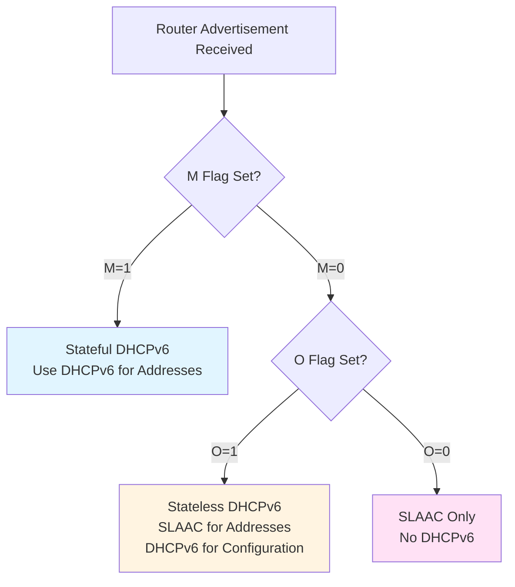
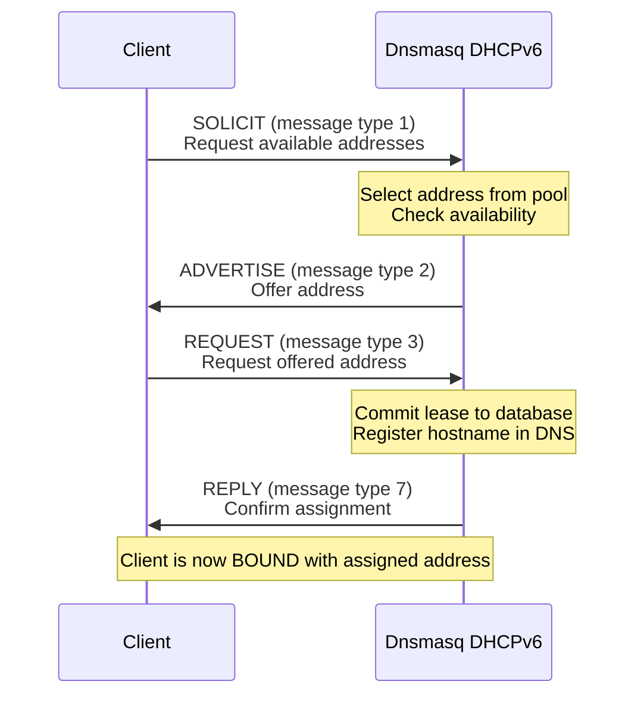
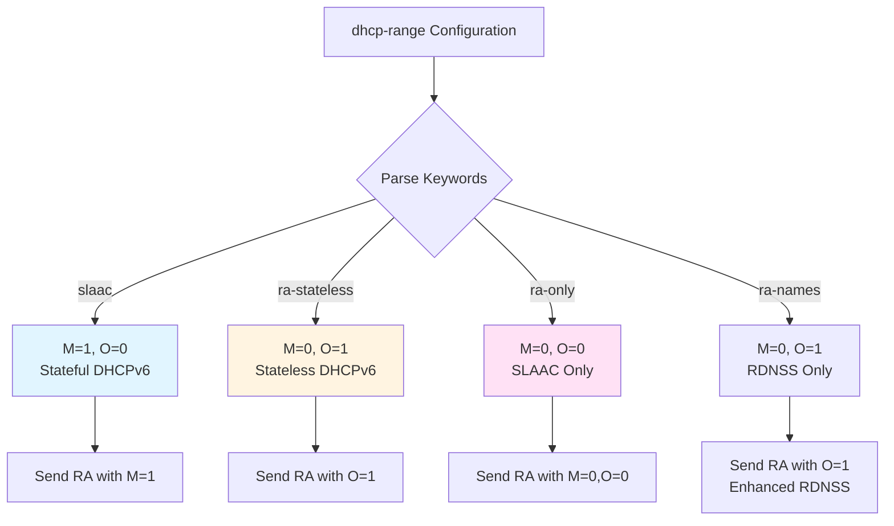
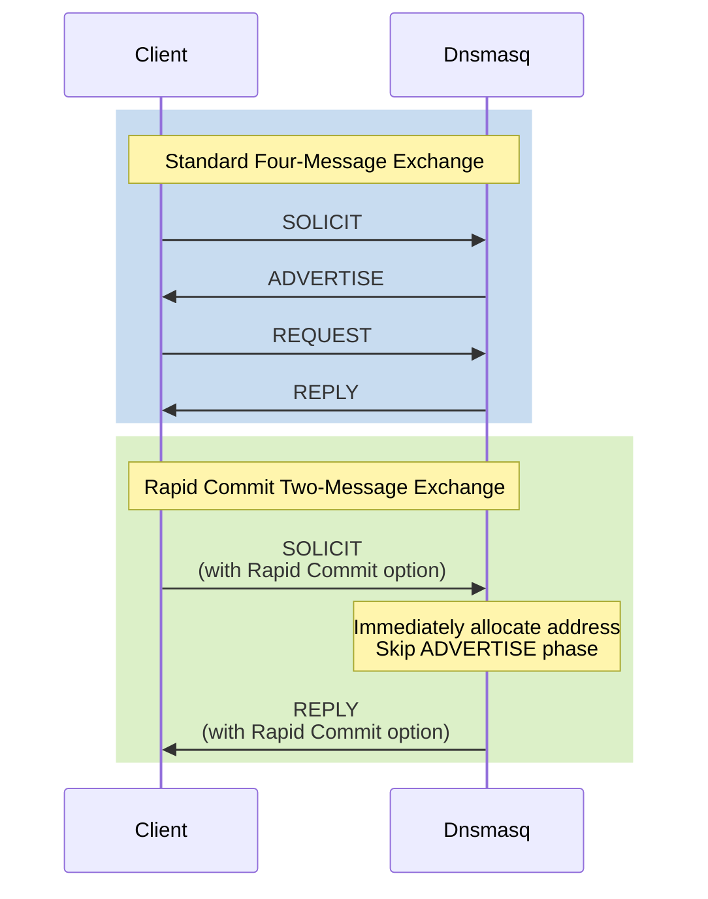

# DHCPv6 and Router Advertisement Implementation

## Table of Contents

1. [Overview](#overview)
2. [Stateful vs Stateless Operation Modes](#stateful-vs-stateless-operation-modes)
3. [DHCPv6 Message Processing Flow](#dhcpv6-message-processing-flow)
4. [Address Allocation (IA_NA)](#address-allocation-ia_na)
5. [Prefix Delegation (IA_PD)](#prefix-delegation-ia_pd)
6. [Router Advertisement](#router-advertisement)
7. [SLAAC Integration](#slaac-integration)
8. [Rapid Commit Support](#rapid-commit-support)
9. [DHCPv6 Option Serialization](#dhcpv6-option-serialization)
10. [Configuration](#configuration)
11. [Protocol Compliance](#protocol-compliance)

---

## Overview

Dnsmasq implements both DHCPv6 server functionality (RFC 3315) and IPv6 Router Advertisement (RFC 4861) to provide comprehensive IPv6 address configuration services. The implementation supports both **stateful** operation (where dnsmasq assigns IPv6 addresses) and **stateless** operation (where clients self-assign addresses using SLAAC and dnsmasq provides configuration parameters only).

### Key Capabilities

- **DHCPv6 Stateful Address Assignment**: Assigns IPv6 addresses to clients from configured pools (IA_NA - Identity Association for Non-temporary Addresses)
- **DHCPv6 Stateless Configuration**: Provides DNS servers and other configuration parameters without address assignment
- **Router Advertisement (RA)**: Broadcasts ICMPv6 Router Advertisement messages for SLAAC support
- **Prefix Delegation Snooping**: Monitors IA_PD (prefix delegation) options in relay scenarios but does not serve as a delegating router
- **Coordinated Operation**: M (Managed) and O (Other Configuration) flags coordinate DHCPv6 and SLAAC behavior
- **Rapid Commit**: Optional two-message exchange (SOLICIT→REPLY) instead of four-message exchange

### Source File Organization

| File | Purpose |
|------|---------|
| `src/dhcp/v6/server.rs` | Main DHCPv6 server logic, address allocation, context management |
| `src/dhcp/v6/rfc3315.rs` | DHCPv6 protocol message handling per RFC 3315 |
| `src/dhcp/v6/outpacket.rs` | DHCPv6 option encoding and packet buffer management |
| `src/dhcp/radv/server.rs` | Router Advertisement transmission (ICMPv6 RA messages) |
| `src/dhcp/radv/slaac.rs` | SLAAC address confirmation and duplicate detection |
| `src/dhcp/protocol_v6.rs` | DHCPv6 protocol constants and message structures |
| `src/dhcp/radv/protocol.rs` | Router Advertisement protocol constants |

### Default Configuration Parameters

| Parameter | Default Value | Source | Description |
|-----------|---------------|--------|-------------|
| DHCPv6 Server Port | 547 | `DHCPV6_SERVER_PORT` | Server listens on UDP port 547 |
| DHCPv6 Client Port | 546 | `DHCPV6_CLIENT_PORT` | Responses sent to UDP port 546 |
| Default Lease Time | 86400 seconds (24 hours) | `DEFLEASE6` in `src/config/constants.rs` | Much longer than DHCPv4 due to IPv6 address abundance |
| Minimum Refresh Time | 600 seconds (10 minutes) | RFC 4242 | Minimum lease refresh interval |

---

## Stateful vs Stateless Operation Modes

DHCPv6 and Router Advertisement coordinate to control how IPv6 clients obtain network configuration. The operation mode is determined by flags in Router Advertisement messages.

### Operation Mode Matrix



### Flag Behavior

| M Flag | O Flag | Client Behavior | Dnsmasq Role |
|--------|--------|----------------|--------------|
| 1 | * | **Stateful**: Use DHCPv6 for addresses and configuration | Assigns IPv6 addresses from pool (IA_NA) |
| 0 | 1 | **Stateless**: Use SLAAC for addresses, DHCPv6 for configuration only | Provides DNS servers, search domains, other options |
| 0 | 0 | **SLAAC-only**: Self-assign addresses, use RA for configuration | Only sends Router Advertisements |

### Stateful Mode Configuration

In stateful mode, dnsmasq assigns IPv6 addresses using DHCPv6:

```
# Stateful DHCPv6 with M=1 (Managed Address Configuration)
# Configuration in dnsmasq.conf
dhcp-range=2001:db8:1::100,2001:db8:1::1ff,slaac,64,24h
enable-ra
```

When `slaac` keyword is used in the range, dnsmasq sets M=1 in Router Advertisements, instructing clients to use DHCPv6 for address assignment.

### Stateless Mode Configuration

In stateless mode, clients use SLAAC for addresses and DHCPv6 for configuration:

```
# Stateless DHCPv6 with O=1 (Other Configuration)
dhcp-range=2001:db8:1::,ra-stateless,64,24h
```

The `ra-stateless` keyword sets M=0, O=1, indicating clients should use SLAAC for addresses but DHCPv6 for DNS and other configuration.

### SLAAC-Only Mode

For SLAAC-only networks without DHCPv6:

```
# SLAAC-only with M=0, O=0
dhcp-range=2001:db8:1::,ra-only,64
```

The `ra-only` keyword configures Router Advertisement without DHCPv6 server functionality.

### Mode Selection Rationale

| Scenario | Recommended Mode | Rationale |
|----------|------------------|-----------|
| Enterprise networks with centralized management | Stateful | Full control over address assignments, lease tracking |
| Home/small office networks | Stateless | Simplified configuration, reduced server load |
| Public Wi-Fi, guest networks | SLAAC-only | Maximum simplicity, no server state |
| Mixed environments | Stateful | Consistent with DHCPv4 operational model |

---

## DHCPv6 Message Processing Flow

DHCPv6 uses a series of message exchanges between clients and servers. The implementation in `src/dhcp/v6/rfc3315.rs` handles all DHCPv6 message types.

### Four-Message Exchange (Stateful)

The standard stateful DHCPv6 exchange involves four messages:



### Message Type Handling

Source: `src/dhcp/v6/rfc3315.rs`, function `Rfc3315Handler::process_message()`

The main message processing logic uses a match expression to route DHCPv6 messages:

| Message Type | Value | Handler | Purpose |
|--------------|-------|---------|---------|
| SOLICIT | 1 | SOLICIT match arm | Client seeks available servers and addresses |
| ADVERTISE | 2 | (Server→Client) | Server offers address (sent by dnsmasq) |
| REQUEST | 3 | REQUEST match arm | Client requests specific address |
| CONFIRM | 4 | CONFIRM match arm | Client confirms addresses still valid |
| RENEW | 5 | RENEW match arm | Client extends existing lease |
| REBIND | 6 | REBIND match arm | Client seeks any server to extend lease |
| REPLY | 7 | (Server→Client) | Server response (sent by dnsmasq) |
| RELEASE | 8 | RELEASE match arm | Client releases address |
| DECLINE | 9 | DECLINE match arm | Client declines offered address |
| INFORMATION-REQUEST | 11 | INFORMATION-REQUEST match arm | Stateless request for configuration only |

### SOLICIT Processing

Source: `src/dhcp/v6/rfc3315.rs`, SOLICIT handler

1. **Receive SOLICIT message** from client on UDP port 547
2. **Extract IA_NA options** (Identity Association for Non-temporary Addresses)
3. **Check address availability** in configured DHCPv6 pools
4. **Rapid Commit check**: If client requests rapid commit and server supports it, skip ADVERTISE and send REPLY immediately
5. **Standard flow**: Send ADVERTISE with available addresses
6. **Include options**: DNS servers, DNS search domains, refresh time, vendor-specific options

### REQUEST Processing

Source: `src/dhcp/v6/rfc3315.rs`, REQUEST handler

1. **Receive REQUEST message** following ADVERTISE
2. **Validate server DUID** matches dnsmasq's DUID
3. **Allocate address** from pool for requested IA_NA
4. **Create lease** in lease database (`src/dhcp/lease.rs`)
5. **Register hostname in DNS cache** if hostname provided
6. **Send REPLY** with confirmed address assignment, lease lifetime (T1/T2 timers)

### RENEW/REBIND Processing

Source: `src/dhcp/v6/rfc3315.rs`, RENEW/REBIND handler

Both RENEW and REBIND extend existing leases:

- **RENEW**: Client contacts original server (unicast to server)
- **REBIND**: Client broadcasts to any available server (multicast)

Processing:
1. **Look up existing lease** by client DUID and IAID
2. **Verify address validity** (still within configured pool)
3. **Extend lease lifetime** and update database
4. **Send REPLY** with new T1/T2 values

### INFORMATION-REQUEST Processing (Stateless)

Source: `src/dhcp/v6/rfc3315.rs`, INFORMATION-REQUEST handler

For stateless DHCPv6 (O=1, M=0):

1. **Receive INFORMATION-REQUEST** (no IA_NA options)
2. **Send REPLY** with configuration options only:
   - DNS recursive servers (OPTION_DNS_SERVER)
   - DNS search domains (OPTION_DOMAIN_SEARCH)
   - NTP servers if configured
   - Vendor-specific options

### CONFIRM Processing

Source: `src/dhcp/v6/rfc3315.rs`, CONFIRM handler

Clients use CONFIRM after network reconnection to validate addresses:

1. **Receive CONFIRM** with IA_NA addresses
2. **Check if addresses belong to link** (correct network prefix)
3. **Send REPLY** with status:
   - `Success`: Addresses valid for this link
   - `NotOnLink`: Addresses not valid, client must obtain new addresses

### RELEASE Processing

Source: `src/dhcp/v6/rfc3315.rs`, RELEASE handler

1. **Receive RELEASE** from client
2. **Remove lease** from database
3. **Remove DNS entry** for client hostname
4. **Execute dhcp-script** with "del" action if configured
5. **Send REPLY** confirming release

### DECLINE Processing

Source: `src/dhcp/v6/rfc3315.rs`, DECLINE handler

Clients send DECLINE if duplicate address detected:

1. **Receive DECLINE** with problematic address
2. **Mark address as unavailable** (temporarily blacklisted)
3. **Send REPLY** acknowledging decline
4. **Client will send new SOLICIT** for different address

---

## Address Allocation (IA_NA)

### Identity Association Concepts

DHCPv6 uses **Identity Associations (IA)** to manage address assignments. Each IA is identified by:

- **DUID** (DHCPv6 Unique Identifier): Client identifier, analogous to DHCPv4 client identifier
- **IAID** (Identity Association Identifier): 32-bit number identifying a specific IA on the client

**IA_NA** (Identity Association for Non-temporary Addresses) is the most common IA type, used for regular unicast IPv6 addresses.

### Address Selection Algorithm

Source: `src/dhcp/v6/server.rs`, function `Dhcpv6Server::allocate_address()`

The address allocation algorithm:

1. **Check static reservations**: Match client DUID/MAC to configured `dhcp-host` entries
2. **Check existing lease**: If client has existing lease, reuse same address
3. **Find available address**: Iterate through configured range
   - Skip addresses in use by other clients
   - Skip addresses recently declined
   - Skip addresses outside lease time window
4. **Ping test** (optional): Verify address not in use via ICMPv6 Echo Request
5. **Allocate address**: Create lease entry with lifetime

### Lease Lifetime (T1, T2, Valid, Preferred)

DHCPv6 leases include multiple time values:

| Timer | Default | Purpose |
|-------|---------|---------|
| **Valid Lifetime** | 86400s (24h) | Total lease duration before address becomes invalid |
| **Preferred Lifetime** | 86400s (24h) | Duration address is preferred for new connections |
| **T1 (Renewal Time)** | Valid / 2 | Client sends RENEW to original server at T1 |
| **T2 (Rebind Time)** | Valid * 4/5 | Client broadcasts REBIND to any server at T2 |

Configuration: `DEFLEASE6` in `src/config/constants.rs`, default 86400 seconds (24 hours)

### Address Pool Configuration

```
# Basic DHCPv6 range
dhcp-range=2001:db8:1::100,2001:db8:1::1ff,24h

# Multiple pools on same interface
dhcp-range=2001:db8:1::100,2001:db8:1::1ff,24h
dhcp-range=2001:db8:2::100,2001:db8:2::1ff,48h

# Static reservation
dhcp-host=id:00:01:00:01:xx:xx:xx:xx,2001:db8:1::50,[client-hostname]
```

### Lease Database Integration

Source: `src/dhcp/lease.rs`

DHCPv6 leases are stored in the same lease database as DHCPv4:

- **Lease file location**: `/var/lib/misc/dnsmasq.leases` (Linux default)
- **Format**: Text file, one lease per line
- **DHCPv6 lease entry**: Includes expiry time, DUID, IPv6 address, hostname, client-id

Integration with DNS:
- Client hostname automatically registered in DNS cache
- Forward DNS (hostname → IPv6 address)
- Reverse DNS (IPv6 address → hostname) via `ip6.arpa`

---

## Prefix Delegation (IA_PD)

### Dnsmasq IA_PD Capabilities

**Important**: Dnsmasq does **not** serve as a delegating router for prefix delegation. The implementation includes **snooping logic** for IA_PD options in relay scenarios but does not assign prefixes to requesting routers.

### IA_PD Snooping in Relay Mode

Source: `src/dhcp/v6/rfc3315.rs`, function `Rfc3315Handler::relay_reply()`

When operating as a DHCPv6 relay, dnsmasq can monitor prefix delegation:

1. **Relay DHCPV6 messages** between clients and upstream DHCPv6 server
2. **Inspect REPLY messages** from upstream server
3. **Extract IA_PD options** (OPTION_IA_PD, option code 25)
4. **Log prefix assignments** for operational visibility

### Prefix Delegation Context

Prefix delegation (RFC 3633) is used when:
- **Customer edge routers** request IPv6 prefixes from ISP
- **Enterprise branch routers** request prefixes from central DHCPv6 server
- **Hierarchical address allocation** is required

For environments requiring prefix delegation server functionality, consider:
- **ISC Kea**: Full-featured DHCPv6 server with IA_PD support
- **WIDE DHCPv6**: Specialized DHCPv6 implementation
- **Dibbler**: DHCPv6 server and client with IA_PD capabilities

---

## Router Advertisement

Router Advertisement (RA) is essential for IPv6 autoconfiguration. Dnsmasq implements ICMPv6 Router Advertisement per RFC 4861.

### Router Advertisement Message Structure

Source: `src/dhcp/radv/server.rs`, function `RadvServer::send_ra()`

RA messages include:

| Component | Description | Configuration |
|-----------|-------------|---------------|
| **Router Lifetime** | Time router remains default router (seconds) | Derived from dhcp-range lifetime |
| **M Flag** (Managed) | 1 = Use DHCPv6 for addresses | Set via `slaac` keyword |
| **O Flag** (Other Config) | 1 = Use DHCPv6 for configuration | Set via `ra-stateless` keyword |
| **Prefix Information** | Network prefixes for SLAAC | Derived from dhcp-range prefix |
| **RDNSS Option** | Recursive DNS Servers (RFC 6106) | Automatically included |
| **DNSSL Option** | DNS Search List (RFC 6106) | From `domain` or `dhcp-option` config |

### Prefix Information Option

Source: `src/dhcp/radv/protocol.rs`, struct definitions

Each prefix includes:

```c
struct prefix_opt {
    u8 type;              // ICMP6_OPT_PREFIX = 3
    u8 len;               // Option length in 8-byte units
    u8 prefix_len;        // Prefix length in bits (typically 64)
    u8 flags;             // L (on-link) and A (autonomous) flags
    u32 valid_lifetime;   // Valid lifetime in seconds
    u32 preferred_lifetime; // Preferred lifetime in seconds
    u32 reserved;
    struct in6_addr prefix; // IPv6 prefix
};
```

Flags:
- **L bit (On-Link)**: 1 = Prefix is on-link (default)
- **A bit (Autonomous)**: 1 = Prefix can be used for SLAAC (default)

### RDNSS Option (Recursive DNS Server)

Source: RFC 6106, implemented in `src/dhcp/radv/server.rs`

Dnsmasq automatically includes its own IPv6 address as RDNSS:

```c
struct rdnss_opt {
    u8 type;              // ICMP6_OPT_RDNSS = 25
    u8 len;               // Option length
    u16 reserved;
    u32 lifetime;         // RDNSS lifetime (typically matches RA lifetime)
    struct in6_addr addr[]; // Array of DNS server addresses
};
```

### RA Transmission Timing

Source: `src/dhcp/radv/server.rs`

Router Advertisements are transmitted:
- **Periodic unsolicited**: Every 200-600 seconds (randomized per RFC 4861)
- **Response to Router Solicitation**: Immediate response to ICMPv6 RS messages
- **Triggered by configuration change**: After SIGHUP reload

### M and O Flag Coordination

The relationship between RA flags and DHCPv6 operation:



Configuration examples:

```
# M=1: Stateful DHCPv6
dhcp-range=2001:db8:1::100,2001:db8:1::1ff,slaac,64,24h

# O=1: Stateless DHCPv6
dhcp-range=2001:db8:1::,ra-stateless,64,24h

# M=0, O=0: SLAAC-only
dhcp-range=2001:db8:1::,ra-only,64

# O=1: RDNSS only (no DHCPv6 server)
dhcp-range=2001:db8:1::,ra-names,64
```

---

## SLAAC Integration

### Stateless Address Autoconfiguration

Source: `src/dhcp/radv/slaac.rs`

SLAAC allows clients to self-assign IPv6 addresses from advertised prefixes. The process:

1. **Client receives Router Advertisement** with prefix (e.g., 2001:db8:1::/64)
2. **Client generates Interface ID** using:
   - **EUI-64**: Derived from MAC address (deprecated due to privacy)
   - **Privacy Extensions** (RFC 4941): Random interface ID, temporary addresses
3. **Client forms address**: Prefix + Interface ID (e.g., 2001:db8:1::1234:5678:90ab:cdef)
4. **Duplicate Address Detection (DAD)**: Client sends ICMPv6 Neighbor Solicitation
5. **If no conflict**: Address is confirmed and bound to interface

### SLAAC Confirmation in Dnsmasq

Source: `src/dhcp/radv/slaac.rs`, function `SlaacProber::add_addrs()`

Dnsmasq performs SLAAC address confirmation:

1. **Monitor Router Advertisements** sent by dnsmasq
2. **Track expected SLAAC addresses** based on RA prefixes
3. **Receive Neighbor Solicitations** from clients performing DAD
4. **Verify address not in use** by checking:
   - DHCPv6 lease database
   - DHCPv4 lease database (for dual-stack)
   - Active neighbor cache entries
5. **Log conflicts** if SLAAC address conflicts with managed address

### SLAAC and DHCPv6 Coexistence

In `ra-stateless` or `ra-only` modes, clients use SLAAC for addresses:

| Configuration | RA Flags | Client Address Source | Client Config Source |
|---------------|----------|---------------------|---------------------|
| `slaac` | M=1, O=0 | DHCPv6 (IA_NA) | DHCPv6 |
| `ra-stateless` | M=0, O=1 | SLAAC | DHCPv6 (INFORMATION-REQUEST) |
| `ra-only` | M=0, O=0 | SLAAC | Router Advertisement (RDNSS) |
| `ra-names` | M=0, O=1 | SLAAC | Router Advertisement (RDNSS) |

### SLAAC Address Registration

Even when using SLAAC for addressing, dnsmasq can track client addresses:

1. **Client performs DAD** with Neighbor Solicitation
2. **Dnsmasq observes NS messages** on link
3. **Extract target address** from NS
4. **Associate with client** (link-layer address from NS)
5. **Optionally register in DNS** if hostname discovery enabled

---

## Rapid Commit Support

Rapid Commit (RFC 3315 Section 17.2.1) reduces DHCPv6 exchange from four messages to two.

### Standard vs Rapid Commit Exchange



### Rapid Commit Processing

Source: `src/dhcp/v6/rfc3315.rs`, SOLICIT case

Logic flow:

1. **Check client request**: SOLICIT message includes `OPTION_RAPID_COMMIT` (option 14)
2. **Check server configuration**: Dnsmasq rapid commit enabled
3. **Immediate allocation**: Allocate address and create lease (skip ADVERTISE)
4. **Send REPLY**: Include `OPTION_RAPID_COMMIT` in reply to confirm rapid commit
5. **Client bound**: Client immediately transitions to BOUND state

### Configuration

Rapid commit is controlled by configuration options:

```
# Enable rapid commit globally
dhcp-rapid-commit

# Enable for specific DHCPv6 range
dhcp-range=2001:db8:1::100,2001:db8:1::1ff,slaac,rapid-commit,64,24h
```

### Benefits and Considerations

**Benefits:**
- **Reduced latency**: Address assignment in one round-trip instead of two
- **Lower network traffic**: Half the message count
- **Better for mobile clients**: Faster network attachment

**Considerations:**
- **Address conflict risk**: Slightly higher risk if multiple servers present (no ADVERTISE comparison)
- **Server load**: Server must commit resources immediately without waiting for REQUEST
- **Client support**: Not all DHCPv6 clients support rapid commit

---

## DHCPv6 Option Serialization

### Outpacket Buffer Management

Source: `src/dhcp/v6/outpacket.rs`

DHCPv6 uses a sophisticated option encoding system. The `outpacket` module manages a buffer for constructing DHCPv6 replies.

#### Core Data Structure

```rust
pub struct OutpacketBuilder {
    len: usize,              // Current buffer length
    capacity: usize,         // Total buffer capacity
    buf: Vec<u8>,            // Option buffer
}
```

#### Key Functions

| Function | Purpose | Source Module |
|----------|---------|--------------|
| `OutpacketBuilder::reset()` | Initialize buffer for new reply | `src/dhcp/v6/outpacket.rs` |
| `OutpacketBuilder::save()` | Save position for nested options | `src/dhcp/v6/outpacket.rs` |
| `OutpacketBuilder::end()` | Finalize option length field | `src/dhcp/v6/outpacket.rs` |
| `OutpacketBuilder::put_opt()` | Add simple option to buffer | `src/dhcp/v6/outpacket.rs` |
| `OutpacketBuilder::put_opt_string()` | Add string option | `src/dhcp/v6/outpacket.rs` |
| `OutpacketBuilder::put_opt_char()` | Add single byte | `src/dhcp/v6/outpacket.rs` |
| `OutpacketBuilder::put_opt_short()` | Add 16-bit value | `src/dhcp/v6/outpacket.rs` |
| `OutpacketBuilder::put_opt_long()` | Add 32-bit value | `src/dhcp/v6/outpacket.rs` |

### DHCPv6 Option Format

DHCPv6 options use Type-Length-Value (TLV) encoding:

```
 0                   1                   2                   3
 0 1 2 3 4 5 6 7 8 9 0 1 2 3 4 5 6 7 8 9 0 1 2 3 4 5 6 7 8 9 0 1
+-+-+-+-+-+-+-+-+-+-+-+-+-+-+-+-+-+-+-+-+-+-+-+-+-+-+-+-+-+-+-+-+
|        Option Code (16)       |       Option Length (16)      |
+-+-+-+-+-+-+-+-+-+-+-+-+-+-+-+-+-+-+-+-+-+-+-+-+-+-+-+-+-+-+-+-+
|                       Option Data...                          |
+-+-+-+-+-+-+-+-+-+-+-+-+-+-+-+-+-+-+-+-+-+-+-+-+-+-+-+-+-+-+-+-+
```

### Standard DHCPv6 Options

Source: `src/dhcp/protocol_v6.rs`

Commonly used options:

| Option Code | Option Name | Purpose |
|------------|-------------|---------|
| 1 | OPTION_CLIENTID | Client DUID |
| 2 | OPTION_SERVERID | Server DUID |
| 3 | OPTION_IA_NA | Identity Association for Non-temp Addresses |
| 5 | OPTION_IAADDR | IA Address (within IA_NA) |
| 6 | OPTION_ORO | Option Request Option (client requests) |
| 13 | OPTION_STATUS_CODE | Status code in reply |
| 14 | OPTION_RAPID_COMMIT | Rapid commit flag |
| 23 | OPTION_DNS_SERVER | DNS Recursive Name Server |
| 24 | OPTION_DOMAIN_SEARCH | DNS Domain Search List |
| 25 | OPTION_IA_PD | Identity Association for Prefix Delegation |
| 26 | OPTION_IAPREFIX | IA Prefix (within IA_PD) |
| 31 | OPTION_SNTP_SERVER | SNTP Server addresses |
| 39 | OPTION_FQDN | Client FQDN |
| 56 | OPTION_NTP_SERVER | NTP Server addresses |

### Option Construction Example

Source: `src/dhcp/v6/rfc3315.rs`, function `Rfc3315Handler::add_options()`

Building a REPLY message with multiple options:

```rust
// 1. Add Server DUID
builder.put_opt(OPTION_SERVERID, &daemon_state.duid);

// 2. Add DNS Servers (OPTION_DNS_SERVER)
if let Some(ref dns_servers) = daemon_state.dns_server_addrs {
    let addrs: Vec<u8> = dns_servers.iter()
        .flat_map(|s| s.octets())
        .collect();
    builder.put_opt(OPTION_DNS_SERVER, &addrs);  // IPv6 address = 16 bytes each
}

// 3. Add Domain Search List (OPTION_DOMAIN_SEARCH)
builder.put_opt(OPTION_DOMAIN_SEARCH, &encoded_domains);

// 4. Add IA_NA with address
builder.save();  // Save position for length calculation
builder.put_opt_long(OPTION_IA_NA);
builder.put_opt_long(iaid);           // IAID from client
builder.put_opt_long(t1_time);        // T1 renewal time
builder.put_opt_long(t2_time);        // T2 rebind time
    // Nested OPTION_IAADDR
    builder.put_opt(OPTION_IAADDR, &iaaddr_data);
    builder.put_opt_data(&client_addr.octets());   // IPv6 address
    builder.put_opt_long(preferred_lifetime);
    builder.put_opt_long(valid_lifetime);
builder.end();   // Calculate and write IA_NA length
```

### Nested Options

Some options contain nested options:

- **IA_NA** (option 3) contains:
  - **IAADDR** (option 5): Individual addresses
  - **STATUS_CODE** (option 13): Status for this IA
  
- **IA_PD** (option 25) contains:
  - **IAPREFIX** (option 26): Delegated prefixes
  - **STATUS_CODE** (option 13): Status for this IA

### DNS Search List Encoding

Domain search lists use DNS label encoding:

```
# Configuration
domain=example.com,example.net

# Wire format encoding:
Length: 7 | "example" | Length: 3 | "com" | Length: 0 |
Length: 7 | "example" | Length: 3 | "net" | Length: 0 |
```

Each label is preceded by its length byte, with zero byte terminating each domain name.

---

## Configuration

### Complete Configuration Examples

#### Stateful DHCPv6 Configuration

```conf
# Enable DHCPv6 and Router Advertisement
dhcp-range=2001:db8:1::100,2001:db8:1::1ff,slaac,64,24h
enable-ra

# Static DHCPv6 host reservation
# DUID format: id:00:01:00:01:... (DUID-LLT with timestamp and MAC)
dhcp-host=id:00:01:00:01:ab:cd:ef:01:02:03:04:05:06:07,2001:db8:1::50,[server1]

# DHCPv6 options
dhcp-option=option6:dns-server,2001:db8:1::1,2001:db8:1::2
dhcp-option=option6:domain-search,example.com,example.org

# Rapid commit for faster assignment
dhcp-rapid-commit
```

#### Stateless DHCPv6 Configuration

```conf
# Stateless mode: SLAAC for addresses, DHCPv6 for config
dhcp-range=2001:db8:1::,ra-stateless,64,24h

# DNS servers via DHCPv6
dhcp-option=option6:dns-server,2001:db8:1::1

# Domain search list
dhcp-option=option6:domain-search,example.com

# NTP servers
dhcp-option=option6:ntp-server,2001:db8:1::123
```

#### SLAAC-Only with RDNSS

```conf
# SLAAC-only: No DHCPv6 server, RDNSS in RA
dhcp-range=2001:db8:1::,ra-only,64

# Dnsmasq's own IPv6 address automatically included as RDNSS
# Optionally specify additional DNS servers:
dhcp-option=option6:dns-server,2001:4860:4860::8888,2001:4860:4860::8844
```

#### Multiple IPv6 Networks

```conf
# Network 1: Stateful DHCPv6
dhcp-range=tag:net1,2001:db8:1::100,2001:db8:1::1ff,slaac,64,12h

# Network 2: Stateless DHCPv6
dhcp-range=tag:net2,2001:db8:2::,ra-stateless,64,24h

# Interface-specific configuration
dhcp-range=interface:eth0,2001:db8:3::100,2001:db8:3::1ff,slaac,64
dhcp-range=interface:eth1,2001:db8:4::,ra-only,64
```

### DHCPv6 Option Configuration

Source: Configuration examples from `dnsmasq.conf.example`

#### Common DHCPv6 Options

```conf
# DNS recursive servers (option 23)
dhcp-option=option6:dns-server,[2001:db8::1],[2001:db8::2]

# DNS search domains (option 24)
dhcp-option=option6:domain-search,example.com,example.net

# NTP servers (option 56)
dhcp-option=option6:ntp-server,[2001:db8::123]

# Information refresh time (option 32) - seconds
dhcp-option=option6:information-refresh-time,3600

# Client FQDN (option 39) - managed by dnsmasq automatically
```

#### Vendor-Specific Options

```conf
# Vendor-specific information (option 17)
# Enterprise number + data
dhcp-option=option6:vendor-opts,9,13,"Hello DHCPv6"
```

### Router Advertisement Configuration

```conf
# Basic RA with default settings
enable-ra

# RA on specific interface only
enable-ra=eth0

# Disable RA on specific interface
no-ra=wlan0

# Custom RA interval (seconds, default 600)
ra-param=eth0,600,1800

# RA parameters: interface, min-interval, max-interval, default-lifetime
ra-param=eth0,200,600,1800
```

### DHCPv6 Range Keywords

| Keyword | M Flag | O Flag | Behavior |
|---------|--------|--------|----------|
| `slaac` | 1 | 0 | Stateful DHCPv6: Server assigns addresses |
| `ra-stateless` | 0 | 1 | Stateless DHCPv6: SLAAC for addresses, DHCPv6 for config |
| `ra-only` | 0 | 0 | SLAAC-only: No DHCPv6, RDNSS in RA |
| `ra-names` | 0 | 1 | SLAAC with enhanced RDNSS, minimal DHCPv6 |
| (no keyword) | 0 | 0 | DHCPv6 only, no Router Advertisement |

### Prefix Length and Lifetime

```conf
# Syntax: dhcp-range=start,end,mode,prefix-length,lifetime

# /64 prefix, 24 hour lease
dhcp-range=2001:db8:1::100,2001:db8:1::1ff,slaac,64,24h

# /56 prefix (for prefix delegation), infinite lease
dhcp-range=2001:db8:1::,2001:db8:1::,slaac,56,infinite

# Specific preferred and valid lifetimes (advanced)
# Format: preferred,valid
dhcp-range=2001:db8:1::,ra-stateless,64,12h,24h
```

---

## Protocol Compliance

### RFC Conformance

Dnsmasq's DHCPv6 and Router Advertisement implementation conforms to the following RFCs:

| RFC | Title | Coverage |
|-----|-------|----------|
| **RFC 3315** | Dynamic Host Configuration Protocol for IPv6 (DHCPv6) | Core protocol implementation |
| **RFC 3633** | IPv6 Prefix Options for DHCPv6 | IA_PD snooping (relay mode only) |
| **RFC 3646** | DNS Configuration options for DHCPv6 | OPTION_DNS_SERVER, OPTION_DOMAIN_SEARCH |
| **RFC 4242** | Information Refresh Time Option | Option 32 implementation |
| **RFC 4704** | DHCPv6 Client FQDN Option | Option 39 (client hostname) |
| **RFC 4861** | Neighbor Discovery for IPv6 | Router Advertisement implementation |
| **RFC 6106** | IPv6 Router Advertisement DNS Options | RDNSS and DNSSL options |
| **RFC 8415** | DHCPv6 (obsoletes RFC 3315) | Updated DHCPv6 specification |

### Implementation Details per RFC 3315

#### Message Types (Section 5.3)

All required message types implemented:

- ✅ SOLICIT (1): Locate available servers
- ✅ ADVERTISE (2): Server advertisement
- ✅ REQUEST (3): Request addresses/configuration
- ✅ CONFIRM (4): Confirm addresses valid on link
- ✅ RENEW (5): Extend existing lease
- ✅ REBIND (6): Extend lease (any server)
- ✅ REPLY (7): Server response
- ✅ RELEASE (8): Release addresses
- ✅ DECLINE (9): Decline offered addresses
- ✅ INFORMATION-REQUEST (11): Request configuration only

#### DUID Types (Section 9)

Source: `src/dhcp/v6/server.rs`, function `Dhcpv6Server::make_duid()`

Dnsmasq generates Server DUID:

- **DUID-LLT** (Type 1): Link-layer address plus time
- **DUID-EN** (Type 2): Enterprise number based
- **DUID-LL** (Type 3): Link-layer address

Client DUIDs accepted in all formats.

#### Options Implemented

Source: `src/dhcp/protocol_v6.rs`

Core options per RFC 3315:
- ✅ Client Identifier (1)
- ✅ Server Identifier (2)
- ✅ IA_NA (3)
- ✅ IA_TA (4) - Temporary addresses
- ✅ IAADDR (5)
- ✅ Option Request (6)
- ✅ Preference (7)
- ✅ Elapsed Time (8)
- ✅ Status Code (13)
- ✅ Rapid Commit (14)

Extended options:
- ✅ DNS Servers (23) - RFC 3646
- ✅ Domain Search List (24) - RFC 3646
- ✅ IA_PD (25) - RFC 3633 (snooping only)
- ✅ Information Refresh Time (32) - RFC 4242
- ✅ FQDN (39) - RFC 4704
- ✅ NTP Server (56) - RFC 5908

#### Transaction IDs and Replay Protection

- **Transaction ID**: 24-bit random value in SOLICIT, preserved through exchange
- **Replay detection**: Server verifies transaction ID matches in REQUEST
- **DUID validation**: Server DUID in REQUEST must match local DUID

#### Lease Timers (Section 22.4)

Default values source: `src/config/constants.rs`

- **Valid Lifetime**: 86400 seconds (24 hours, DEFLEASE6)
- **Preferred Lifetime**: 86400 seconds (same as valid)
- **T1 (Renewal)**: Valid / 2 = 43200 seconds (12 hours)
- **T2 (Rebind)**: Valid * 4/5 = 69120 seconds (19.2 hours)

Configurable via `dhcp-range` directive.

### Router Advertisement Compliance (RFC 4861)

#### RA Message Fields

Implemented per RFC 4861 Section 4.2:

- **Cur Hop Limit**: 64 (default)
- **M (Managed) flag**: Controlled by configuration
- **O (Other Config) flag**: Controlled by configuration
- **Router Lifetime**: 1800 seconds (default), configurable
- **Reachable Time**: 0 (unspecified)
- **Retrans Timer**: 0 (unspecified)

#### RA Options

- ✅ Source Link-Layer Address (1)
- ✅ MTU (5)
- ✅ Prefix Information (3) - RFC 4861 Section 4.6.2
- ✅ RDNSS (25) - RFC 6106
- ✅ DNSSL (31) - RFC 6106

#### RA Timing

Per RFC 4861 Section 6.2.1:

- **MaxRtrAdvInterval**: 600 seconds (default)
- **MinRtrAdvInterval**: 200 seconds (default)
- **Random delay**: 0-MAX_RA_DELAY_TIME (0.5 seconds)

Configurable via `ra-param` directive.

### RDNSS Option Compliance (RFC 6106)

Source: `src/dhcp/radv/server.rs`, RDNSS implementation

RDNSS option fields:
- **Type**: 25
- **Length**: Variable (8 + 16*N bytes)
- **Lifetime**: Matches RA lifetime (typically 1800 seconds)
- **Addresses**: One or more IPv6 addresses of DNS recursive servers

Dnsmasq automatically includes:
1. **Its own link-local address** (primary RDNSS)
2. **Its own global unicast address** (if available)
3. **Configured additional DNS servers** (via `dhcp-option`)

---

## Implementation Notes

### Thread Safety

DHCPv6 and RA implementation is **single-threaded**:

- All processing occurs in main event loop
- No mutex/locking required
- State stored in global `daemon` structure
- Safe for fork-based script execution

### Memory Management

- **Fixed-size buffers** for packet processing
- **Bounded lease database** (MAXLEASES limit)
- **No dynamic allocation** in packet processing hot path
- Lease entries allocated from fixed pool

### Performance Characteristics

| Operation | Typical Latency | Notes |
|-----------|----------------|-------|
| SOLICIT→ADVERTISE | <5ms | Address lookup in hash table |
| REQUEST→REPLY | <10ms | Lease creation, DNS registration |
| INFORMATION-REQUEST→REPLY | <5ms | No address allocation required |
| Router Advertisement transmission | <1ms | Pre-built packet |
| SLAAC address confirmation | <1ms | Neighbor cache lookup |

### Platform-Specific Notes

#### Linux
- Uses `IPV6_PKTINFO` for interface identification
- Supports `IPV6_TCLASS` for traffic class (CS6)
- RA transmission via ICMPv6 raw socket

#### BSD (FreeBSD, OpenBSD, NetBSD)
- Uses `IPV6_PKTINFO` (compatible with Linux)
- May require different socket options for traffic class

#### Solaris
- Socket options compatible with Linux
- May use different default interface names

### Known Limitations

1. **No Prefix Delegation Server**: Dnsmasq cannot serve IA_PD requests (only snooping in relay mode)
2. **No Temporary Addresses (IA_TA) Management**: Privacy extensions handled by clients
3. **No DHCPv6 Relay Agent**: Can receive relayed messages but doesn't act as relay
4. **No Reconfigure Messages**: Server-initiated configuration not supported
5. **Limited Leasequery**: Basic DHCPv4 leasequery added in v2.92, DHCPv6 leasequery not implemented

### Troubleshooting

#### Enable DHCPv6 Logging

```conf
# Enable detailed DHCPv6 logging
log-dhcp

# Enable queries (includes DHCPv6 activity)
log-queries
```

#### Common Issues

**Client not receiving addresses:**
- Check RA M/O flags match expected mode
- Verify `dhcp-range` includes `slaac` keyword for stateful
- Confirm DHCPv6 port 547 not blocked by firewall
- Verify client supports DHCPv6 (some embedded devices only support SLAAC)

**Router Advertisements not received:**
- Confirm `enable-ra` directive present
- Check interface-specific RA configuration
- Verify ICMPv6 not blocked by firewall
- Ensure dnsmasq has link-local address on interface

**DNS not working for DHCPv6 clients:**
- Stateful: Verify `dhcp-option=option6:dns-server` configured
- Stateless: Verify RDNSS option included in RA (automatic if `ra-stateless` used)
- Check client DNS configuration received RDNSS/DHCPv6 DNS servers

#### Diagnostic Commands

```bash
# View DHCPv6 statistics (send SIGUSR1)
sudo killall -USR1 dnsmasq
# Check syslog for statistics output

# Monitor DHCPv6 traffic
sudo tcpdump -i eth0 -n 'udp port 547 or udp port 546'

# Monitor Router Advertisements
sudo tcpdump -i eth0 -n 'icmp6 and ip6[40] == 134'

# View DHCPv6 leases
cat /var/lib/misc/dnsmasq.leases
```

---

## Summary

Dnsmasq provides a comprehensive, lightweight IPv6 address configuration solution suitable for small to medium networks:

- **Flexible Operation Modes**: Stateful DHCPv6, stateless DHCPv6, or SLAAC-only
- **Coordinated DHCPv6 and RA**: M and O flags ensure consistent client behavior
- **Standards Compliant**: Implements RFC 3315 (DHCPv6), RFC 4861 (Router Advertisement), RFC 6106 (RDNSS)
- **Integrated DNS**: Automatic hostname registration for DHCPv6-assigned addresses
- **Low Resource Requirements**: Efficient implementation suitable for embedded devices
- **Proven Reliability**: Production-tested in routers, firewalls, and network appliances worldwide

For advanced prefix delegation, enterprise-scale deployments, or complex multi-tier hierarchies, consider ISC Kea or WIDE DHCPv6 Server. For small networks, home routers, and embedded systems, dnsmasq provides an excellent balance of functionality, simplicity, and resource efficiency.

---

## References

### Source Files
- `src/dhcp/v6/server.rs` - DHCPv6 server implementation, address allocation, context management
- `src/dhcp/v6/rfc3315.rs` - DHCPv6 protocol message handling, main message loop
- `src/dhcp/v6/outpacket.rs` - DHCPv6 option encoding, packet buffer management
- `src/dhcp/radv/server.rs` - Router Advertisement transmission, RDNSS option construction
- `src/dhcp/radv/slaac.rs` - SLAAC address confirmation, duplicate address detection
- `src/dhcp/protocol_v6.rs` - DHCPv6 protocol constants, option codes, message types
- `src/dhcp/radv/protocol.rs` - Router Advertisement protocol structures, ICMPv6 constants
- `src/config/constants.rs` - Compile-time defaults (DEFLEASE6)
- `src/dhcp/lease.rs` - Lease database management (shared with DHCPv4)

### Configuration
- `dnsmasq.conf.example` - Complete configuration examples for DHCPv6

### RFCs
- RFC 3315 - Dynamic Host Configuration Protocol for IPv6 (DHCPv6)
- RFC 3633 - IPv6 Prefix Options for DHCPv6
- RFC 3646 - DNS Configuration options for DHCPv6
- RFC 4242 - Information Refresh Time Option for DHCPv6
- RFC 4704 - DHCPv6 Client FQDN Option
- RFC 4861 - Neighbor Discovery for IPv6
- RFC 4941 - Privacy Extensions for Stateless Address Autoconfiguration
- RFC 6106 - IPv6 Router Advertisement Options for DNS Configuration
- RFC 8415 - DHCPv6 (obsoletes RFC 3315)

### Related Documentation
- `docs/DHCP_V4.md` - DHCPv4 implementation details
- `docs/ARCHITECTURE.md` - System architecture and event loop
- `docs/DNS_FORWARDING.md` - DNS integration for DHCPv6 hostname registration
- `docs/BUILDING.md` - Cargo feature flags (`dhcp6`)
