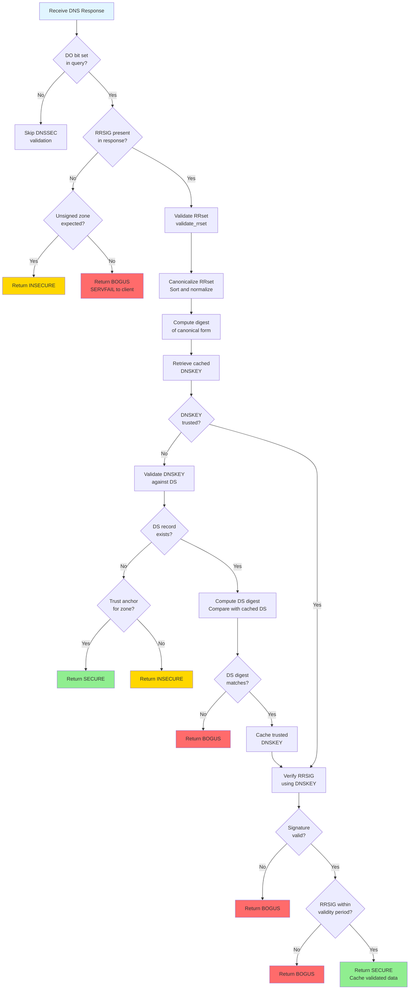
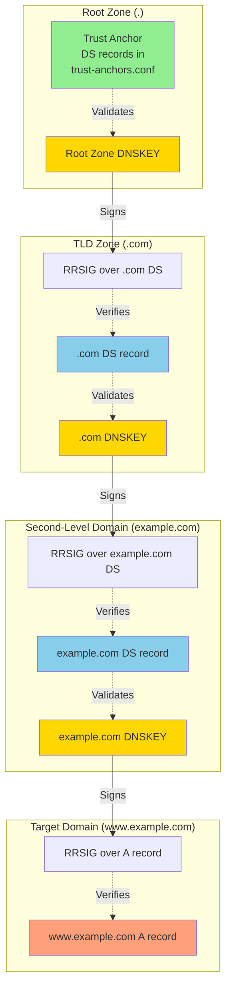
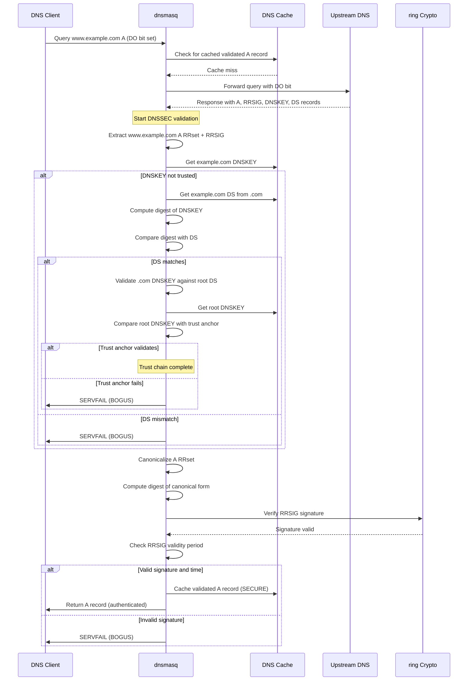
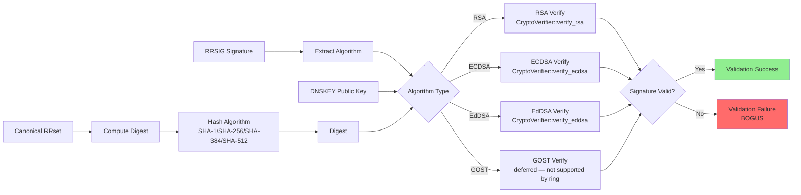
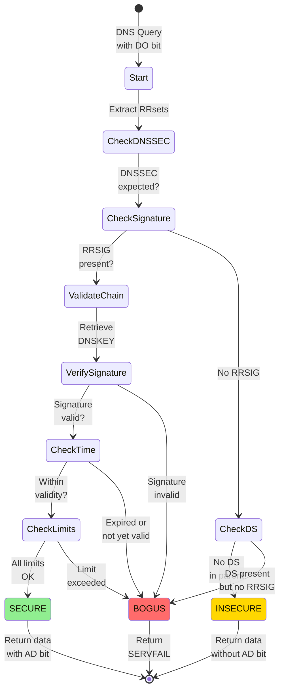

# DNSSEC Validation in dnsmasq

## Table of Contents

1. [Overview](#overview)
2. [DNSSEC Architecture](#dnssec-architecture)
3. [Trust Chain Validation](#trust-chain-validation)
4. [RRset Canonicalization](#rrset-canonicalization)
5. [Signature Verification](#signature-verification)
6. [NSEC Proof Validation](#nsec-proof-validation)
7. [NSEC3 Proof Validation](#nsec3-proof-validation)
8. [Trust Anchor Management](#trust-anchor-management)
9. [Validation Limits and DoS Protection](#validation-limits-and-dos-protection)
10. [Validation States](#validation-states)
11. [Cryptographic Library Integration](#cryptographic-library-integration)
12. [Configuration and Integration](#configuration-and-integration)
13. [See Also](#see-also)

## Overview

DNSSEC (Domain Name System Security Extensions) validation in dnsmasq provides cryptographic authentication of DNS responses to protect against cache poisoning, man-in-the-middle attacks, and DNS spoofing. The implementation conforms to RFC 4033 (DNSSEC Introduction), RFC 4034 (Resource Records), and RFC 4035 (Protocol Modifications).

**Purpose**: Verify the authenticity and integrity of DNS responses using digital signatures, ensuring that DNS data has not been tampered with during transit and originates from the authoritative source.

**Key Capabilities**:
- Complete DNSSEC validation chain from root zone to target domain
- Support for RRSIG signature verification using RSA, ECDSA, EdDSA, and GOST algorithms
- NSEC and NSEC3 authenticated denial-of-existence proof validation
- Trust anchor management with root zone KSK validation
- DoS protection through configurable validation limits
- Integration with `ring` cryptography crate for signature operations

**Implementation Location**: The DNSSEC validation logic is implemented primarily in `src/dns/dnssec/validation.rs` (cryptographic validation) and `src/dns/dnssec/crypto.rs` (cryptographic primitives using `ring` crate).

## DNSSEC Architecture

### High-Level Validation Flow

The DNSSEC validation process in dnsmasq follows a hierarchical trust chain from the DNS root zone down to the target domain:



### Validation Entry Point

The main entry point for DNSSEC validation is `DnssecValidator::validate_reply()` in `src/dns/dnssec/validation.rs`. This method is invoked for every DNS response when DNSSEC validation is enabled (Cargo feature `"dnssec"` and runtime option `--dnssec`).

**Method**: `DnssecValidator::validate_reply(&mut self, now: Instant, header: &DnsHeader, packet: &[u8], name: &str, ...) -> Result<ValidationStatus, DnssecError>`
**Source**: `src/dns/dnssec/validation.rs` (primary validation orchestrator)
**Purpose**: Validate all RRsets in a DNS response, verify signatures, and determine the security status of the response (SECURE, INSECURE, or BOGUS).

**Validation Workflow**:
1. Check if DNSSEC is requested (DO bit set in original query)
2. Extract all RRsets and associated RRSIGs from the response
3. For each RRset, invoke `DnssecValidator::validate_rrset()` to verify signatures
4. Validate DNSKEY records against DS records in parent zones
5. Follow the chain of trust to root zone trust anchors
6. Handle NSEC/NSEC3 proofs for non-existent names or types
7. Return validation status and cache validated data

## Trust Chain Validation

### DNSKEY → DS → RRSIG Verification Process

DNSSEC establishes a chain of trust from the root zone (whose trust anchors are pre-configured) down to the target domain through a series of cryptographic validations:



### Trust Chain Components

**1. Trust Anchors (Root of Trust)**

Trust anchors are the starting point of DNSSEC validation. Dnsmasq uses pre-configured DS records for the DNS root zone (`.`) stored in `trust-anchors.conf`.

**File**: `trust-anchors.conf`
**Current Trust Anchors** (as of July 2024):
```
. DS 20326 8 2 E06D44B80B8F1D39A95C0B0D7C65D08458E880409BBC683457104237C7F8EC8D
```

This DS record represents the Key Signing Key (KSK) for the root zone. The fields are:
- **20326**: Key tag (identifier for the DNSKEY)
- **8**: Algorithm (8 = RSA/SHA-256)
- **2**: Digest type (2 = SHA-256)
- **E06D44B80B8F1D39A95C0B0D7C65D08458E880409BBC683457104237C7F8EC8D**: Digest of the root zone DNSKEY

**2. DNSKEY Records**

DNSKEY records contain public keys used to verify RRSIG signatures. There are two types:
- **Zone Signing Key (ZSK)**: Used to sign zone data (A, AAAA, CNAME, etc.)
- **Key Signing Key (KSK)**: Used to sign the DNSKEY RRset itself (represented by DS in parent zone)

**3. DS Records (Delegation Signer)**

DS records in the parent zone contain a hash of the child zone's DNSKEY. This creates the cryptographic link between parent and child zones in the trust chain.

**Validation Process** in `src/dns/dnssec/validation.rs`:
```rust
// Validate DNSKEY against DS record (simplified)
// Source: src/dns/dnssec/validation.rs, DnssecValidator::validate_rrset()

// 1. Retrieve cached DS record from parent zone
// 2. Compute digest of child zone DNSKEY using specified hash algorithm
//    (via ring::digest)
// 3. Compare computed digest with DS record digest
// 4. If match: DNSKEY is trusted, cache it for future validations
//    -> Ok(ValidationStatus::Secure)
// 5. If mismatch: Return BOGUS status
//    -> Err(DnssecError::Bogus)
```

**4. RRSIG Records (Resource Record Signature)**

RRSIG records contain digital signatures over RRsets (sets of resource records with the same name and type). Each RRSIG includes:
- **Type Covered**: RR type being signed (e.g., A, AAAA)
- **Algorithm**: Cryptographic algorithm used (RSA, ECDSA, EdDSA)
- **Labels**: Number of labels in the original owner name
- **Original TTL**: TTL of the signed RRset
- **Signature Expiration**: Validity end time
- **Signature Inception**: Validity start time
- **Key Tag**: Identifier of the DNSKEY that created the signature
- **Signer's Name**: Domain name of the zone that created the signature
- **Signature**: The actual cryptographic signature

### Validation Sequence

The validation sequence follows this pattern for each domain level:



## RRset Canonicalization

Before signature verification, the RRset (Resource Record Set) must be converted to a canonical form exactly as it was when the signature was created. This ensures that signature verification works correctly regardless of case variations or record ordering.

**Source**: `src/dns/dnssec/validation.rs`, `DnssecValidator::validate_rrset()` method (canonicalization logic integrated into validation)

### Canonicalization Steps

**1. Name Canonicalization**
- Convert all domain names to lowercase
- Preserve wire format (no textual conversion)
- Example: `Example.COM` → `example.com`

**2. RRset Sorting**
- Sort resource records within the RRset in canonical order
- Sorting is based on wire-format RDATA (resource data) comparison
- Required by RFC 4034 Section 6.3

**3. RDATA Normalization**
- Ensure consistent field ordering for multi-field records
- Normalize domain names within RDATA (e.g., CNAME targets, MX hostnames)

**4. Canonical RR Form Construction**
```
RRSIG_RDATA = {
    Type Covered (2 octets)
    Algorithm (1 octet)
    Labels (1 octet)
    Original TTL (4 octets)
    Signature Expiration (4 octets)
    Signature Inception (4 octets)
    Key Tag (2 octets)
    Signer's Name (variable)
}

For each RR in RRset (sorted order):
    RR_WIRE_FORMAT = {
        Owner Name (canonical, wire format)
        Type (2 octets)
        Class (2 octets)
        TTL (Original TTL from RRSIG, not current TTL)
        RDLENGTH (2 octets)
        RDATA (canonical form)
    }

CANONICAL_FORM = RRSIG_RDATA || RR_WIRE_FORMAT[0] || RR_WIRE_FORMAT[1] || ...
```

**5. Digest Computation**
- Compute cryptographic hash (SHA-1, SHA-256, SHA-384, SHA-512) of canonical form
- Hash algorithm determined by RRSIG algorithm field
- Example: RSA/SHA-256 (algorithm 8) uses SHA-256 hash

### Canonicalization Example

**Original RRset**:
```
WWW.EXAMPLE.COM.  300  IN  A  192.0.2.1
www.Example.com.  300  IN  A  192.0.2.2
```

**Canonical Form**:
```
www.example.com.  3600  IN  A  192.0.2.1
www.example.com.  3600  IN  A  192.0.2.2
```
(Note: Owner names lowercased, records sorted, Original TTL from RRSIG used)

**Implementation Detail** (from `src/dns/dnssec/validation.rs`):

The canonicalization process is integrated into `DnssecValidator::validate_rrset()`:

```rust
// Simplified canonicalization logic
// Source: src/dns/dnssec/validation.rs, DnssecValidator::validate_rrset()

// 1. Extract RRSIG fields (type covered, algorithm, original TTL, etc.)
// 2. Build canonical RRset by sorting records
// 3. For each record:
//    - Convert owner name to lowercase wire format
//    - Use original TTL from RRSIG (not current TTL)
//    - Append RDATA in canonical form
// 4. Compute digest of concatenated canonical form using ring::digest
// 5. Pass digest and signature to CryptoVerifier::verify() method
```

## Signature Verification

Signature verification is the cryptographic heart of DNSSEC validation, confirming that RRset data has not been modified and was signed by the legitimate zone operator.

**Source**: `src/dns/dnssec/crypto.rs` (cryptographic operations using `ring` crate)

### Verification Flow



### Supported Algorithms

Dnsmasq supports the following DNSSEC algorithms through the `ring` cryptography crate:

| Algorithm Number | Algorithm Name | Hash Function | Implementation |
|-----------------|----------------|---------------|----------------|
| 5 | RSA/SHA-1 | SHA-1 | `CryptoVerifier::verify_rsa` |
| 7 | RSASHA1-NSEC3-SHA1 | SHA-1 | `CryptoVerifier::verify_rsa` |
| 8 | RSA/SHA-256 | SHA-256 | `CryptoVerifier::verify_rsa` |
| 10 | RSA/SHA-512 | SHA-512 | `CryptoVerifier::verify_rsa` |
| 13 | ECDSA P-256/SHA-256 | SHA-256 | `CryptoVerifier::verify_ecdsa` |
| 14 | ECDSA P-384/SHA-384 | SHA-384 | `CryptoVerifier::verify_ecdsa` |
| 15 | Ed25519 | SHA-512 | `CryptoVerifier::verify_eddsa` |
| 16 | Ed448 | SHAKE256 | `CryptoVerifier::verify_eddsa` |
| 12 | GOST R 34.10-2012 | GOST R 34.11-2012 | *Deferred — GOST not supported by `ring`* |

### Verification Implementation

**Main Verification Entry Point**: `CryptoVerifier::verify(&self, algo: DnssecAlgorithm, key: &[u8], sig: &[u8], digest: &[u8]) -> Result<(), CryptoError>`

**Source**: `src/dns/dnssec/crypto.rs`

**Purpose**: Dispatcher method that selects the appropriate algorithm-specific verification logic using trait-based dispatch and performs signature validation.

**Algorithm Selection**:
```rust
// Source: src/dns/dnssec/crypto.rs, CryptoVerifier::verify()
// Uses match-based dispatch to select algorithm-specific verifier

impl CryptoVerifier {
    pub fn verify(
        &self,
        algo: DnssecAlgorithm,
        key: &[u8],
        sig: &[u8],
        digest: &[u8],
    ) -> Result<(), CryptoError> {
        match algo {
            DnssecAlgorithm::RsaSha1
            | DnssecAlgorithm::RsaSha1Nsec3
            | DnssecAlgorithm::RsaSha256
            | DnssecAlgorithm::RsaSha512 => self.verify_rsa(algo, key, sig, digest),
            DnssecAlgorithm::EcdsaP256Sha256
            | DnssecAlgorithm::EcdsaP384Sha384 => self.verify_ecdsa(algo, key, sig, digest),
            DnssecAlgorithm::Ed25519
            | DnssecAlgorithm::Ed448 => self.verify_eddsa(algo, key, sig, digest),
            DnssecAlgorithm::GostR34_10_2012 => Err(CryptoError::UnsupportedAlgorithm(algo)),
            _ => Err(CryptoError::UnsupportedAlgorithm(algo)),
        }
    }
}
```

### RSA Verification

**Method**: `CryptoVerifier::verify_rsa(&self, algo: DnssecAlgorithm, key: &[u8], sig: &[u8], digest: &[u8]) -> Result<(), CryptoError>`

**Source**: `src/dns/dnssec/crypto.rs`

**Supported Variants**:
- **Algorithm 5**: RSA/SHA-1 (legacy, being phased out)
- **Algorithm 8**: RSA/SHA-256 (most common)
- **Algorithm 10**: RSA/SHA-512 (high security)

**Implementation Details**:
```rust
// Simplified RSA verification logic
// Source: src/dns/dnssec/crypto.rs, CryptoVerifier::verify_rsa()

// 1. Parse RSA public key from DNSKEY RDATA
//    - Extract public exponent (e) and modulus (n)

// 2. Select ring verification algorithm based on RRSIG algorithm field
let algorithm = match algo {
    DnssecAlgorithm::RsaSha1 | DnssecAlgorithm::RsaSha1Nsec3 =>
        &ring::signature::RSA_PKCS1_1024_8192_SHA1_FOR_LEGACY_USE_ONLY,
    DnssecAlgorithm::RsaSha256 =>
        &ring::signature::RSA_PKCS1_2048_8192_SHA256,
    DnssecAlgorithm::RsaSha512 =>
        &ring::signature::RSA_PKCS1_2048_8192_SHA512,
    _ => return Err(CryptoError::UnsupportedAlgorithm(algo)),
};

// 3. Construct ring public key from DER-encoded components
let public_key = ring::signature::UnparsedPublicKey::new(algorithm, key_bytes);

// 4. Verify signature (ring handles cleanup via RAII)
public_key.verify(digest, sig)
    .map_err(|_| CryptoError::SignatureVerificationFailed)
```

### ECDSA Verification

**Method**: `CryptoVerifier::verify_ecdsa(&self, algo: DnssecAlgorithm, key: &[u8], sig: &[u8], digest: &[u8]) -> Result<(), CryptoError>`

**Source**: `src/dns/dnssec/crypto.rs`

**Supported Curves**:
- **Algorithm 13**: ECDSA P-256 with SHA-256
- **Algorithm 14**: ECDSA P-384 with SHA-384

**Implementation Details**:
```rust
// Simplified ECDSA verification logic
// Source: src/dns/dnssec/crypto.rs, CryptoVerifier::verify_ecdsa()

// 1. Select ring ECDSA algorithm based on DNSSEC algorithm number
let algorithm = match algo {
    DnssecAlgorithm::EcdsaP256Sha256 =>
        &ring::signature::ECDSA_P256_SHA256_FIXED,   // P-256
    DnssecAlgorithm::EcdsaP384Sha384 =>
        &ring::signature::ECDSA_P384_SHA384_FIXED,   // P-384
    _ => return Err(CryptoError::UnsupportedAlgorithm(algo)),
};

// 2. Parse public key (X, Y coordinates) from DNSKEY RDATA
//    ring expects the uncompressed point format: 0x04 || X || Y

// 3. Construct ring public key
let public_key = ring::signature::UnparsedPublicKey::new(algorithm, key_bytes);

// 4. Parse signature (R, S components in fixed-size format)

// 5. Verify signature (ring handles cleanup via RAII)
public_key.verify(digest, sig)
    .map_err(|_| CryptoError::SignatureVerificationFailed)
```

### EdDSA Verification

**Method**: `CryptoVerifier::verify_eddsa(&self, algo: DnssecAlgorithm, key: &[u8], sig: &[u8], digest: &[u8]) -> Result<(), CryptoError>`

**Source**: `src/dns/dnssec/crypto.rs`

**Supported Algorithms**:
- **Algorithm 15**: Ed25519 (32-byte keys, 64-byte signatures)
- **Algorithm 16**: Ed448 (57-byte keys, 114-byte signatures) — *Note: Ed448 requires supplementary crate; `ring` natively supports Ed25519 only*

**Implementation Details**:
```rust
// Simplified EdDSA verification logic
// Source: src/dns/dnssec/crypto.rs, CryptoVerifier::verify_eddsa()

// 1. Select EdDSA variant
let algorithm = match algo {
    DnssecAlgorithm::Ed25519 => {
        // Ed25519: 32-byte key, 64-byte signature
        &ring::signature::ED25519
    }
    DnssecAlgorithm::Ed448 => {
        // Ed448: 57-byte key, 114-byte signature
        // Note: ring does not natively support Ed448; requires
        // supplementary ed448-goldilocks crate or similar
        return Err(CryptoError::UnsupportedAlgorithm(algo));
    }
    _ => return Err(CryptoError::UnsupportedAlgorithm(algo)),
};

// 2. Extract public key from DNSKEY RDATA
let public_key = ring::signature::UnparsedPublicKey::new(algorithm, key);

// 3. Verify signature (ring handles cleanup via RAII)
public_key.verify(digest, sig)
    .map_err(|_| CryptoError::SignatureVerificationFailed)
```

### Signature Validity Period Check

In addition to cryptographic verification, DNSSEC requires time-based validity checks:

```rust
// Source: src/dns/dnssec/validation.rs, DnssecValidator::validate_rrset()
// Check RRSIG inception and expiration times

// RRSIG fields (from wire format):
// - signature_inception: Start of validity period (Unix timestamp)
// - signature_expiration: End of validity period (Unix timestamp)

let current_time = std::time::SystemTime::now()
    .duration_since(std::time::UNIX_EPOCH)?
    .as_secs() as u32;

if current_time < rrsig.signature_inception {
    return Err(DnssecError::SignatureNotYetValid);
}

if current_time >= rrsig.signature_expiration {
    return Err(DnssecError::SignatureExpired);
}

// Proceed with cryptographic verification
```

## NSEC Proof Validation

NSEC (Next Secure) records provide authenticated denial of existence for DNS names and record types. When a query returns NXDOMAIN or NODATA, NSEC records prove that no data exists at the queried name.

**Source**: `src/dns/dnssec/validation.rs`, `DnssecValidator::prove_non_existence()` orchestrator and NSEC-specific handlers

### NSEC Record Structure

NSEC records have two key components:
1. **Next Domain Name**: The next existing domain name in canonical order
2. **Type Bitmap**: A bit array indicating which record types exist at this name

**Example NSEC Record**:
```
example.com. 3600 IN NSEC f.example.com. A MX RRSIG NSEC DNSKEY
```

This NSEC proves:
- No domain names exist between `example.com` and `f.example.com`
- `example.com` has A, MX, RRSIG, NSEC, and DNSKEY records
- `example.com` does NOT have AAAA, TXT, or other types

### NSEC Proof Types

**1. Name Non-Existence Proof (NXDOMAIN)**

Proves that a queried name does not exist:

```
Query: nonexistent.example.com

NSEC records in response:
example.com.           NSEC f.example.com. A MX RRSIG NSEC
f.example.com.         NSEC z.example.com. A AAAA RRSIG NSEC
```

**Validation Logic**:
- `nonexistent.example.com` falls alphabetically between `f.example.com` and `z.example.com`
- The NSEC for `f.example.com` proves no names exist between `f` and `z`
- Therefore, `nonexistent.example.com` does not exist → NXDOMAIN validated

**2. Type Non-Existence Proof (NODATA)**

Proves that a name exists but does not have the requested record type:

```
Query: www.example.com AAAA

NSEC record in response:
www.example.com.       NSEC z.example.com. A MX RRSIG NSEC
```

**Validation Logic**:
- The NSEC type bitmap for `www.example.com` includes A, MX, RRSIG, NSEC
- The type bitmap does NOT include AAAA
- Therefore, `www.example.com` has no AAAA record → NODATA validated

**3. Wildcard Non-Existence Proof**

Proves that a wildcard match did not occur:

```
Query: foo.example.com

NSEC records:
*.example.com.         NSEC a.example.com. A AAAA RRSIG NSEC
foo.example.com.       NSEC z.example.com. A AAAA RRSIG NSEC
```

**Validation Logic**:
- The NSEC proves that `foo.example.com` explicitly exists (not a wildcard match)
- Or, if no exact match NSEC, proves that wildcard does not cover this name

### NSEC Validation Implementation

**Method**: `DnssecValidator::prove_non_existence()` orchestrator in `src/dns/dnssec/validation.rs`

**Purpose**: Determine if NSEC records in a response properly authenticate denial of existence.

**Validation Steps**:

```rust
// Simplified NSEC validation logic
// Source: src/dns/dnssec/validation.rs, DnssecValidator::prove_non_existence()

impl DnssecValidator {
    pub fn prove_non_existence(
        &mut self,
        header: &DnsHeader,
        packet: &[u8],
        name: &str,
        query_type: QueryType,
    ) -> Result<ValidationStatus, DnssecError> {
        // 1. Extract all NSEC records from response
        let nsec_records = self.extract_nsec_records(header, packet)?;

        // 2. Verify NSEC RRSIGs (signatures over NSEC records)
        for nsec in &nsec_records {
            self.validate_rrset(nsec, &nsec.rrsig, &dnskey)?;
            // Returns Err(DnssecError::Bogus) if NSEC signature invalid
        }

        // 3. Check NSEC coverage for queried name
        match query_type {
            QueryType::Nxdomain => {
                // Find NSEC that spans queried name
                // Verify: nsec_owner < queried_name < nsec_next
                if self.find_spanning_nsec(&nsec_records, name).is_some() {
                    return Ok(ValidationStatus::Secure); // NXDOMAIN authenticated
                }
                Err(DnssecError::Bogus) // No NSEC covers name
            }
            QueryType::Nodata => {
                // Find NSEC for exact name match
                if let Some(nsec) = self.find_nsec_for_name(&nsec_records, name) {
                    // Check type bitmap
                    if !nsec.type_in_bitmap(query_type) {
                        return Ok(ValidationStatus::Secure); // Type absence authenticated
                    }
                }
                Err(DnssecError::Bogus) // NSEC doesn't prove absence
            }
            // 4. Handle wildcard cases (additional logic)
            _ => Err(DnssecError::Bogus), // Could not prove non-existence
        }
    }
}
```

### NSEC Chain Walking

NSEC records form a circular linked list covering the entire zone namespace:

```
example.com → a.example.com → f.example.com → z.example.com → example.com
```

**Validation Requirement**: To prove name non-existence, must find NSEC where:
```
canonical_sort(nsec_owner) < canonical_sort(query_name) < canonical_sort(nsec_next)
```

**Implementation Detail**: Canonical name sorting follows DNS wire-format byte-by-byte comparison with labels sorted right-to-left.

## NSEC3 Proof Validation

NSEC3 (Next Secure version 3) provides authenticated denial of existence while preventing zone enumeration by using cryptographic hashes of domain names instead of plaintext names.

**Source**: `src/dns/dnssec/validation.rs`, NSEC3-specific validation logic integrated into `DnssecValidator::prove_non_existence()`

### NSEC3 vs. NSEC Comparison

| Feature | NSEC | NSEC3 |
|---------|------|-------|
| **Name Representation** | Plaintext domain names | Hashed domain names (Base32-encoded SHA-1) |
| **Zone Enumeration** | Possible (reveals all names) | Prevented (hashes hide names) |
| **Opt-Out Support** | No | Yes (for unsigned delegations) |
| **Complexity** | Simple | More complex (hashing, salt, iterations) |
| **Performance** | Fast | Slower (hash computation) |

### NSEC3 Record Structure

NSEC3 records contain:
1. **Hash Algorithm**: Algorithm used to hash names (currently only SHA-1, algorithm 1)
2. **Flags**: Opt-out flag for unsigned delegations
3. **Iterations**: Number of additional hash iterations (DoS protection limit)
4. **Salt**: Random value mixed into hash computation (prevents pre-computation attacks)
5. **Next Hashed Owner Name**: Hash of the next existing name in canonical order
6. **Type Bitmap**: Record types present at the hashed name

**Example NSEC3 Record**:
```
15BG9L6359F5CH23E34DDUA6N1RIHL9H.example.com. 3600 IN NSEC3 1 0 10 AABBCCDD 15BG9L6359F5CH23E34DDUA6N1RIHL9I A RRSIG
```

**Fields**:
- **15BG9L6359F5CH23E34DDUA6N1RIHL9H**: Base32-encoded hash of owner name
- **1**: Hash algorithm (SHA-1)
- **0**: Flags (0 = no opt-out)
- **10**: Iterations (10 additional hash rounds)
- **AABBCCDD**: Salt (hexadecimal)
- **15BG9L6359F5CH23E34DDUA6N1RIHL9I**: Next hashed owner name
- **A RRSIG**: Type bitmap

### NSEC3 Hash Computation

The NSEC3 hash is computed as follows:

```
Hash(owner_name, salt, iterations) {
    hash = SHA-1(owner_name || salt)
    
    for (i = 0; i < iterations; i++) {
        hash = SHA-1(hash || salt)
    }
    
    return Base32-Hex-Encode(hash)
}
```

**Example**:
```
Owner Name: www.example.com.
Salt: AABBCCDD
Iterations: 10

Step 1: hash = SHA-1("www.example.com.\x00" || AABBCCDD)
Step 2-11: hash = SHA-1(hash || AABBCCDD)  [repeat 10 times]
Step 12: result = Base32-Hex-Encode(hash)
        = "15BG9L6359F5CH23E34DDUA6N1RIHL9H"
```

### NSEC3 Iteration Limit

To prevent denial-of-service attacks through computationally expensive hash iterations, dnsmasq enforces a strict iteration limit:

**Limit**: `DNSSEC_LIMIT_NSEC3_ITERS = 150`
**Source**: `src/config/constants.rs`

**Validation Behavior**:
- If NSEC3 record specifies iterations > 150: Validation FAILS (BOGUS)
- Rationale: Excessive iterations can cause CPU exhaustion during validation
- Current recommendations (RFC 9276): Maximum 100 iterations for 1024-bit keys, 150 for 2048-bit keys

```rust
// Source: src/dns/dnssec/validation.rs, NSEC3 iteration check
// Constant defined in src/config/constants.rs
pub const DNSSEC_LIMIT_NSEC3_ITERS: u32 = 150;

if nsec3_iterations > DNSSEC_LIMIT_NSEC3_ITERS {
    // Iteration count exceeds limit
    return Err(DnssecError::Bogus); // Reject validation
}
```

### NSEC3 Proof Validation

**NSEC3 Name Non-Existence Proof (NXDOMAIN)**:

```
Query: nonexistent.example.com

Step 1: Compute hash of queried name
    query_hash = Hash("nonexistent.example.com.", salt, iterations)
               = "1AVVXTR5LT74BHFPH0Q055TRM8K7NSEC"

Step 2: Find NSEC3 records spanning query_hash
    NSEC3: 15BG9L6359F5CH23E34DDUA6N1RIHL9H → 1BBBAAAA...
    NSEC3: 1BBBAAAA...                     → 2CCCCCCC...

Step 3: Check if query_hash falls within NSEC3 coverage
    15BG9... < 1AVVXTR5... < 1BBBAAAA...  ✓ (covered)

Step 4: Verify NSEC3 RRSIG
    Validate signature over NSEC3 record

Step 5: Conclusion
    Name "nonexistent.example.com" does not exist → NXDOMAIN authenticated
```

**NSEC3 Type Non-Existence Proof (NODATA)**:

```
Query: www.example.com AAAA

Step 1: Compute hash of queried name
    query_hash = Hash("www.example.com.", salt, iterations)
               = "15BG9L6359F5CH23E34DDUA6N1RIHL9H"

Step 2: Find NSEC3 record matching query_hash
    NSEC3: 15BG9L6359F5CH23E34DDUA6N1RIHL9H A RRSIG
           (type bitmap includes A and RRSIG, but NOT AAAA)

Step 3: Check type bitmap
    AAAA not in bitmap ✓

Step 4: Verify NSEC3 RRSIG

Step 5: Conclusion
    www.example.com exists but has no AAAA record → NODATA authenticated
```

### NSEC3 Opt-Out

NSEC3 supports "opt-out" for unsigned delegations (child zones that don't use DNSSEC):

**Opt-Out Flag**: Bit in NSEC3 flags field
**Purpose**: Allow insecure delegations without providing denial-of-existence proofs
**Security Tradeoff**: Enables zone signing without signing all delegations, but weakens security for opted-out names

**Validation Behavior**:
- If NSEC3 has opt-out flag set: Insecure delegations are allowed
- If queried name falls in opt-out range: Return INSECURE (not BOGUS)
- If query is for DS record in opt-out range: Must have explicit proof (no opt-out for DS)

### NSEC3 Validation Implementation

```rust
// Simplified NSEC3 validation logic
// Source: src/dns/dnssec/validation.rs, DnssecValidator::prove_non_existence()
// with NSEC3 handling

impl DnssecValidator {
    fn validate_nsec3_proof(
        &mut self,
        query_name: &str,
        query_type: QueryType,
        nsec3_records: &[Nsec3Record],
    ) -> Result<ValidationStatus, DnssecError> {
        // 1. Extract NSEC3 parameters (salt, iterations, algorithm)
        let salt = &nsec3_records[0].salt;
        let iterations = nsec3_records[0].iterations;

        // 2. Enforce iteration limit
        if iterations > DNSSEC_LIMIT_NSEC3_ITERS {
            return Err(DnssecError::Bogus); // Too many iterations
        }

        // 3. Compute hash of queried name
        let query_hash = nsec3_hash(query_name, salt, iterations);

        // 4. Find NSEC3 record covering query_hash
        let covering_nsec3 = self
            .find_covering_nsec3(&query_hash, nsec3_records)
            .ok_or(DnssecError::Bogus)?; // No NSEC3 covers query

        // 5. Verify NSEC3 RRSIG
        self.validate_rrset(covering_nsec3, &covering_nsec3.rrsig, &dnskey)?;

        // 6. Check proof type
        match query_type {
            QueryType::Nxdomain => {
                if covering_nsec3.covers_hash(&query_hash) {
                    return Ok(ValidationStatus::Secure); // NXDOMAIN authenticated
                }
            }
            QueryType::Nodata => {
                if let Some(exact) = self.find_exact_nsec3(&query_hash, nsec3_records) {
                    if !exact.type_in_bitmap(query_type) {
                        return Ok(ValidationStatus::Secure); // Type absence authenticated
                    }
                }
            }
            _ => {}
        }

        // 7. Handle opt-out cases
        if covering_nsec3.flags.contains(Nsec3Flags::OPT_OUT) {
            return Ok(ValidationStatus::Insecure); // Opt-out delegation
        }

        Err(DnssecError::Bogus) // Could not prove non-existence
    }
}
```

## Trust Anchor Management

Trust anchors are the foundation of DNSSEC validation, representing pre-configured public keys or DS records that are explicitly trusted without further validation.

**Source**: `trust-anchors.conf` (trust anchor storage), `src/dns/dnssec/validation.rs` (trust anchor validation logic)

### Root Zone Trust Anchors

Dnsmasq uses DS records for the DNS root zone (`.`) as trust anchors. These are maintained by IANA and updated during Key Signing Key (KSK) rollovers.

**Current Root Trust Anchor** (as of July 2024):

**File**: `trust-anchors.conf`
```
. DS 20326 8 2 E06D44B80B8F1D39A95C0B0D7C65D08458E880409BBC683457104237C7F8EC8D
```

**DS Record Fields**:
- **. (root zone)**: Zone name
- **DS**: Record type (Delegation Signer)
- **20326**: Key tag (identifier for the corresponding DNSKEY)
- **8**: Algorithm (8 = RSA/SHA-256)
- **2**: Digest type (2 = SHA-256)
- **E06D44B80B8F1D39A95C0B0D7C65D08458E880409BBC683457104237C7F8EC8D**: SHA-256 digest of the root zone KSK

### Trust Anchor Validation

When validating a DNSKEY for the root zone, dnsmasq performs the following:

```rust
// Simplified trust anchor validation
// Source: src/dns/dnssec/validation.rs, DnssecValidator::validate_rrset()
// for root zone

// 1. Retrieve root zone DNSKEY from DNS response
let root_dnskey = self.extract_dnskey(response, ".")?;

// 2. Compute digest of DNSKEY using ring::digest
let computed_digest = ring::digest::digest(
    &ring::digest::SHA256,
    &root_dnskey.to_ds_wire_format(),
);

// 3. Compare with trust anchor DS digest
let trust_anchor_digest = self.lookup_trust_anchor(".")?;

if computed_digest.as_ref() == trust_anchor_digest.as_slice() {
    // Trust anchor matches
    self.cache.insert_dnskey(root_dnskey, ValidationStatus::Secure);
    Ok(ValidationStatus::Secure)
} else {
    // Trust anchor mismatch
    Err(DnssecError::Bogus)
}
```

### Trust Anchor Updates

**KSK Rollover Process**:

When IANA performs a root zone KSK rollover (Key Signing Key replacement), the trust anchor must be updated:

1. **Pre-Rollover**: Old KSK active, new KSK published but not used
2. **Rollover**: New KSK becomes active, old KSK still published
3. **Post-Rollover**: Old KSK removed, only new KSK remains

**Manual Update Process**:
1. Obtain new root zone trust anchor from IANA (https://www.iana.org/dnssec/)
2. Update `trust-anchors.conf` with new DS record
3. Restart dnsmasq or send SIGHUP signal to reload configuration
4. Verify DNSSEC validation continues to work with test queries

**Historical Trust Anchors**:
- **2010-2017**: Key tag 19036 (RSA/SHA-256, first root KSK)
- **2017-present**: Key tag 20326 (RSA/SHA-256, current KSK after 2017 rollover)

**Automatic Trust Anchor Update** (RFC 5011):
- Dnsmasq does NOT currently implement RFC 5011 automatic trust anchor updates
- Trust anchor updates require manual configuration file changes
- Future enhancement: Implement RFC 5011 for automated KSK rollover tracking

### Trust Anchor Security

**Protection Against Trust Anchor Attacks**:

1. **Secure Distribution**: Trust anchors distributed via OS packages and verified against IANA authoritative sources
2. **Integrity Verification**: Package managers verify cryptographic signatures on dnsmasq packages
3. **File Permissions**: `trust-anchors.conf` should be owned by root with restrictive permissions (644 or 600)
4. **Configuration Validation**: Dnsmasq validates trust anchor format at startup

**Trust Anchor Verification**:
```bash
# Verify current root zone KSK matches trust anchor
dig . DNSKEY +dnssec @a.root-servers.net | grep "257 3 8"

# Compare key tag and algorithm with trust-anchors.conf
# Key tag should be 20326, algorithm should be 8 (RSA/SHA-256)
```

### Additional Trust Anchors

While the root zone trust anchor is sufficient for validating the entire DNS namespace, administrators can configure additional trust anchors for specific zones:

**Use Cases**:
- **Internal TLDs**: Private top-level domains not delegated from root (e.g., `.internal`)
- **Testing Zones**: DNSSEC test zones with known keys
- **Split-Horizon DNS**: Different trust anchors for internal vs. external views

**Configuration**:
```
# trust-anchors.conf example with additional zone
. DS 20326 8 2 E06D44B80B8F1D39A95C0B0D7C65D08458E880409BBC683457104237C7F8EC8D
internal. DS 12345 8 2 ABCD1234...
```

## Validation Limits and DoS Protection

DNSSEC validation can be computationally expensive, creating opportunities for denial-of-service attacks. Dnsmasq implements strict resource limits to prevent validation-based DoS.

**Source**: `src/config/constants.rs` (limit definitions), `src/dns/dnssec/validation.rs` (limit enforcement)

### Configured Limits

| Limit Name | Value | Config Constant | Purpose |
|-----------|-------|----------------|---------|
| **Maximum Queries per Validation** | 40 | `DNSSEC_LIMIT_WORK` | Limits upstream queries during trust chain traversal |
| **Maximum Signature Failures** | 20 | `DNSSEC_LIMIT_SIG_FAIL` | Limits failed signature verification attempts |
| **Maximum Crypto Operations** | 200 | `DNSSEC_LIMIT_CRYPTO` | Limits total cryptographic operations per validation |
| **Maximum NSEC3 Iterations** | 150 | `DNSSEC_LIMIT_NSEC3_ITERS` | Limits NSEC3 hash iteration count |

**Definition Location**: `src/config/constants.rs`

```rust
// Source: src/config/constants.rs
/// Maximum queries during validation
pub const DNSSEC_LIMIT_WORK: u32 = 40;
/// Maximum signature failures
pub const DNSSEC_LIMIT_SIG_FAIL: u32 = 20;
/// Maximum crypto operations
pub const DNSSEC_LIMIT_CRYPTO: u32 = 200;
/// Maximum NSEC3 iterations
pub const DNSSEC_LIMIT_NSEC3_ITERS: u32 = 150;
```

### Limit Enforcement

**1. Query Limit (DNSSEC_LIMIT_WORK)**

**Purpose**: Prevent infinite loops or excessively deep trust chains requiring many upstream queries.

**Attack Scenario**: Malicious zone creates circular DNSKEY dependencies forcing validator to make hundreds of queries.

**Enforcement**:
```rust
// Source: src/dns/dnssec/validation.rs, DnssecValidator::validate_reply()

impl DnssecValidator {
    pub fn validate_reply(&mut self, /* ... */) -> Result<ValidationStatus, DnssecError> {
        self.queries_outstanding += 1;

        if self.queries_outstanding > DNSSEC_LIMIT_WORK {
            // Too many queries during validation
            return Err(DnssecError::ResourceLimitExceeded("queries"));
        }

        // Perform validation...
        let status = self.do_validation(/* ... */)?;

        self.queries_outstanding -= 1;
        Ok(status)
    }
}
```

**Impact**: If trust chain validation requires more than 40 upstream queries, validation aborts with BOGUS status.

**2. Signature Failure Limit (DNSSEC_LIMIT_SIG_FAIL)**

**Purpose**: Prevent attackers from exhausting CPU with repeated signature verification failures.

**Attack Scenario**: Response contains hundreds of invalid RRSIGs forcing validator to attempt verification for each.

**Enforcement**:
```rust
// Source: src/dns/dnssec/validation.rs, DnssecValidator::validate_rrset()

impl DnssecValidator {
    fn validate_rrset(&mut self, /* ... */) -> Result<ValidationStatus, DnssecError> {
        for rrsig in response_rrsigs {
            match self.crypto.verify_signature(&rrsig, &dnskey, &rrset) {
                Ok(()) => {
                    // Signature valid
                    self.sig_fail_count = 0; // Reset on success
                    return Ok(ValidationStatus::Secure);
                }
                Err(_) => {
                    self.sig_fail_count += 1;

                    if self.sig_fail_count > DNSSEC_LIMIT_SIG_FAIL {
                        // Too many signature failures
                        return Err(DnssecError::ResourceLimitExceeded("sig_fail"));
                    }

                    continue; // Try next RRSIG
                }
            }
        }

        Err(DnssecError::Bogus) // All signatures failed
    }
}
```

**Impact**: If more than 20 signature verifications fail during validation, abort with BOGUS status.

**3. Cryptographic Operation Limit (DNSSEC_LIMIT_CRYPTO)**

**Purpose**: Limit total number of expensive cryptographic operations (signature verifications, digest computations).

**Attack Scenario**: Response designed to trigger maximum crypto work (large RRsets, many RRSIGs, complex algorithms).

**Enforcement**:
```rust
// Source: src/dns/dnssec/crypto.rs, CryptoVerifier::verify()

impl CryptoVerifier {
    pub fn verify(&mut self, algo: DnssecAlgorithm, key: &[u8], /* ... */)
        -> Result<(), CryptoError>
    {
        self.crypto_ops += 1;

        if self.crypto_ops > DNSSEC_LIMIT_CRYPTO {
            // Too many cryptographic operations
            return Err(CryptoError::ResourceLimitExceeded);
        }

        // Perform signature verification via ring
        self.algorithm_specific_verify(algo, key, sig, digest)
    }
}
```

**Impact**: If more than 200 cryptographic operations are performed during validation, additional operations fail.

**4. NSEC3 Iteration Limit (DNSSEC_LIMIT_NSEC3_ITERS)**

**Purpose**: Prevent CPU exhaustion through excessive NSEC3 hash iterations.

**Attack Scenario**: Zone configures NSEC3 with thousands of iterations forcing validator to perform expensive repeated hashing.

**Enforcement**:
```rust
// Source: src/dns/dnssec/validation.rs, NSEC3 validation

fn validate_nsec3(nsec3: &Nsec3Record) -> Result<ValidationStatus, DnssecError> {
    if nsec3.iterations > DNSSEC_LIMIT_NSEC3_ITERS {
        // Iteration count exceeds limit
        return Err(DnssecError::Bogus);
    }

    // Compute NSEC3 hash with allowed iterations
    let hash = nsec3_hash(name, &nsec3.salt, nsec3.iterations);

    // Validate proof...
    Ok(ValidationStatus::Secure)
}
```

**Impact**: NSEC3 records with iteration counts > 150 are rejected, validation returns BOGUS.

### Rationale for Limit Values

**DNSSEC_LIMIT_WORK (40 queries)**:
- Typical trust chain depth: 3-4 levels (root → TLD → SLD → target)
- Each level requires ~2-5 queries (DS, DNSKEY, RRSIG)
- Total: 8-20 queries for normal validation
- Limit of 40 provides comfortable margin while preventing abuse

**DNSSEC_LIMIT_SIG_FAIL (20 failures)**:
- Normal validation: 0-2 signature failures (wrong key, expired signature)
- Limit of 20 allows multiple failure attempts while preventing exhaustive search

**DNSSEC_LIMIT_CRYPTO (200 operations)**:
- Each RRset validation: 1-5 crypto operations (canonicalization, digest, verify)
- Typical validation: 20-50 operations
- Limit of 200 accommodates complex responses with multiple RRsets

**DNSSEC_LIMIT_NSEC3_ITERS (150 iterations)**:
- RFC 9276 recommendation: 100 iterations for 2048-bit RSA keys
- Limit of 150 provides security margin while remaining performant
- Higher iteration counts (500+) used by some zones are intentionally rejected

### Performance Impact

**Resource Consumption Under Limits**:

| Scenario | Queries | Crypto Ops | CPU Time | Result |
|----------|---------|------------|----------|--------|
| Simple validation (cached keys) | 1-2 | 5-10 | <10ms | SECURE |
| Full trust chain (root to target) | 10-15 | 30-50 | 50-100ms | SECURE |
| Limit exceeded (attack) | 40+ | 200+ | Aborted | BOGUS |
| NSEC3 excessive iterations | 1 | N/A | Rejected | BOGUS |

**Tuning Considerations**:

The limits are compile-time constants defined in `src/config/constants.rs`. To adjust for specific deployment requirements:

1. **Edit** `src/config/constants.rs`:
   ```rust
   pub const DNSSEC_LIMIT_WORK: u32 = 80; // Double query limit
   ```

2. **Recompile** dnsmasq:
   ```bash
   cargo build --release --features dnssec
   ```

3. **Test** with DNSSEC validation:
   ```bash
   dig @localhost example.com +dnssec
   ```

**Warning**: Increasing limits may expose validator to DoS attacks. Only adjust if experiencing legitimate validation failures due to complex trust chains.

## Validation States

DNSSEC validation results in one of three security states for each DNS response:

**Source**: `src/dns/dnssec/validation.rs` (validation state determination), `src/types/dns.rs` (state enum definitions)

### State Definitions

| State | Meaning | Client Response | Caching Behavior |
|-------|---------|----------------|------------------|
| **SECURE** | Cryptographically validated | Return data with AD bit set | Cache validated data |
| **INSECURE** | Unsigned zone or delegation | Return data without AD bit | Cache unsigned data |
| **BOGUS** | Validation failed | SERVFAIL error | Do not cache |

### SECURE State

**Condition**: All DNSSEC validation checks passed successfully.

**Requirements**:
1. Valid RRSIG present and covers queried RRset
2. RRSIG signature verifies correctly with trusted DNSKEY
3. DNSKEY validates against DS in parent zone
4. Trust chain complete to root zone trust anchor
5. RRSIG within validity period (inception ≤ now < expiration)
6. All resource limits respected (queries, crypto ops, etc.)

**Implementation**:
```rust
// Source: src/dns/dnssec/validation.rs, validation success path

/// DNSSEC validation status
pub enum ValidationStatus {
    Secure,
    Insecure,
    Bogus,
}

impl DnssecValidator {
    pub fn validate_reply(&mut self, /* ... */) -> Result<ValidationStatus, DnssecError> {
        // Perform all validation checks

        // Mark response as validated
        header.set_ad(true); // Set Authenticated Data bit

        // Cache validated data
        self.cache.insert(name, &rrset, ttl, ValidationStatus::Secure);

        Ok(ValidationStatus::Secure)
    }
}
```

**Client Behavior**:
- Receive DNS response with AD (Authenticated Data) bit set in header
- Trust that data has not been tampered with
- Example: `dig example.com +dnssec` shows `;; flags: qr rd ra ad;` (ad flag present)

### INSECURE State

**Condition**: Zone is intentionally unsigned or uses opt-out delegation.

**Scenarios**:
1. **Unsigned Zone**: Zone does not have DNSSEC records (no DS in parent, no DNSKEY/RRSIG in zone)
2. **Insecure Delegation**: Parent zone has no DS record for child zone
3. **NSEC3 Opt-Out**: NSEC3 record with opt-out flag covers unsigned delegation

**Implementation**:
```rust
// Source: src/dns/dnssec/validation.rs, insecure zone detection

impl DnssecValidator {
    fn validate_rrset(&mut self, /* ... */) -> Result<ValidationStatus, DnssecError> {
        // Check for DS record in parent zone
        let ds_record = self.find_ds(parent_zone, child_zone);

        if ds_record.is_none() {
            // No DS record → zone is insecure
            return Ok(ValidationStatus::Insecure);
        }

        // Check for NSEC3 opt-out
        if self.nsec3_opt_out_covers(query_name) {
            return Ok(ValidationStatus::Insecure);
        }

        // Continue validation...
        Ok(ValidationStatus::Secure)
    }
}
```

**Client Behavior**:
- Receive DNS response without AD bit set
- Data not validated, but not flagged as bogus
- Accept data but without cryptographic guarantees
- Example: `dig unsigned-example.com +dnssec` shows `;; flags: qr rd ra;` (no ad flag)

**Rationale**: Many zones remain unsigned. Returning INSECURE allows these zones to work normally while still providing validation for DNSSEC-enabled zones.

### BOGUS State

**Condition**: DNSSEC validation failed, indicating potential tampering or misconfiguration.

**Failure Scenarios**:
1. **Signature Verification Failed**: RRSIG does not verify with DNSKEY
2. **DNSKEY Validation Failed**: DNSKEY does not match DS in parent zone
3. **Trust Chain Broken**: Cannot validate DNSKEY chain to root trust anchor
4. **Expired Signature**: Current time outside RRSIG validity period
5. **Missing RRSIG**: DNSSEC expected but no signature present
6. **NSEC/NSEC3 Proof Invalid**: Denial-of-existence proof does not cover queried name
7. **Resource Limits Exceeded**: Validation hit query, crypto, or iteration limits
8. **Algorithm Unsupported**: RRSIG uses unsupported algorithm

**Implementation**:
```rust
// Source: src/dns/dnssec/validation.rs, validation failure path

impl DnssecValidator {
    pub fn validate_reply(&mut self, /* ... */) -> Result<ValidationStatus, DnssecError> {
        // Attempt validation
        match self.do_validation(/* ... */) {
            Ok(status) => Ok(status),
            Err(e) => {
                // Validation failed

                // Log failure reason
                log::warn!("DNSSEC validation failed: {}", e);

                // Do NOT cache bogus data

                // Return SERVFAIL to client
                header.set_rcode(RCode::ServFail);

                Err(DnssecError::Bogus)
            }
        }
    }
}
```

**Client Behavior**:
- Receive SERVFAIL response (RCODE 2)
- Application fails to resolve name
- Example: `dig bogus-example.com +dnssec` returns SERVFAIL

**Rationale**: BOGUS status indicates potential security issue (tampering, misconfiguration, or attack). Returning SERVFAIL forces application to fail safely rather than accepting potentially malicious data.

### Validation State Transitions



### Configuration Options Affecting Validation States

**Enable DNSSEC Validation**:
```bash
# dnsmasq.conf or command-line
dnssec
# or
--dnssec
```

**Check Unsigned Zones**:
```bash
# Treat unsigned zones as BOGUS (strict mode)
dnssec-check-unsigned
# or
--dnssec-check-unsigned
```

**Impact of dnssec-check-unsigned**:
- **Disabled** (default): Unsigned zones return INSECURE
- **Enabled**: Unsigned zones return BOGUS (SERVFAIL to client)
- **Use Case**: Enforce DNSSEC for all queries in high-security environments

**Query Logging**:
```bash
# Log DNSSEC validation results
log-queries
```

**Example Log Output**:
```
dnssec-query[A] example.com from 192.168.1.10
validation result: SECURE
validation result: INSECURE (unsigned zone)
validation result: BOGUS (signature verification failed)
```

## Cryptographic Library Integration

Dnsmasq relies on the `ring` cryptography crate for all DNSSEC cryptographic operations. `ring` provides safe, high-performance cryptographic primitives optimized for security-critical applications.

**Source**: `src/dns/dnssec/crypto.rs` (`ring` integration layer)

### ring Crate Overview

**`ring`** is a Rust cryptographic library providing:
- Cryptographic hash functions (SHA-1, SHA-256, SHA-384, SHA-512) via `ring::digest`
- Public-key signature verification (RSA, ECDSA, Ed25519) via `ring::signature`
- No external C library dependencies beyond its own bundled assembly optimizations

**Why `ring`**:
- **Memory Safe**: Pure Rust API with no `unsafe` exposed to consumers
- **Portable**: Supports x86-64, ARM64, and other Rust targets
- **Well-Maintained**: Actively developed, widely audited, 334M+ downloads on crates.io
- **DNSSEC-Suitable**: Comprehensive support for RSA, ECDSA P-256/P-384, and Ed25519 algorithms

**Crate Dependencies**:
- **`ring`**: Core cryptographic algorithms (bundled; no system library required)

**Cargo Feature Gate**:
```toml
# Cargo.toml
[features]
dnssec = ["ring"]

[dependencies]
ring = { version = "0.17", optional = true }
```

**Build Requirement**:
```bash
# Build dnsmasq with DNSSEC support
cargo build --release --features dnssec
```

### Cryptographic Primitive Mapping

| DNSSEC Algorithm | `ring` Verification Algorithm | Hash Function | Key Size |
|-----------------|-------------------------------|---------------|----------|
| RSA/SHA-1 (5) | `ring::signature::RSA_PKCS1_1024_8192_SHA1_FOR_LEGACY_USE_ONLY` | SHA-1 | 512-4096 bits |
| RSA/SHA-256 (8) | `ring::signature::RSA_PKCS1_2048_8192_SHA256` | SHA-256 | 1024-4096 bits |
| RSA/SHA-512 (10) | `ring::signature::RSA_PKCS1_2048_8192_SHA512` | SHA-512 | 1024-4096 bits |
| ECDSA P-256 (13) | `ring::signature::ECDSA_P256_SHA256_FIXED` | SHA-256 | 256 bits |
| ECDSA P-384 (14) | `ring::signature::ECDSA_P384_SHA384_FIXED` | SHA-384 | 384 bits |
| Ed25519 (15) | `ring::signature::ED25519` | SHA-512 | 256 bits |
| Ed448 (16) | *Deferred — `ring` does not support Ed448 natively* | SHAKE256 | 456 bits |
| GOST (12) | *Deferred — `ring` does not support GOST algorithms* | GOST R 34.11-2012 | 512 bits |

### ring API Usage Examples

**RSA Signature Verification**:
```rust
// Source: src/dns/dnssec/crypto.rs, CryptoVerifier::verify_rsa()
use ring::signature;

impl CryptoVerifier {
    fn verify_rsa(
        &self,
        algo: DnssecAlgorithm,
        key_data: &[u8],
        sig: &[u8],
        message: &[u8],
    ) -> Result<(), CryptoError> {
        // Select ring RSA algorithm based on DNSSEC algorithm number
        let algorithm: &dyn signature::VerificationAlgorithm = match algo {
            DnssecAlgorithm::RsaSha1 | DnssecAlgorithm::RsaSha1Nsec3 =>
                &signature::RSA_PKCS1_1024_8192_SHA1_FOR_LEGACY_USE_ONLY,
            DnssecAlgorithm::RsaSha256 =>
                &signature::RSA_PKCS1_2048_8192_SHA256,
            DnssecAlgorithm::RsaSha512 =>
                &signature::RSA_PKCS1_2048_8192_SHA512,
            _ => return Err(CryptoError::UnsupportedAlgorithm(algo)),
        };

        // Parse RSA public key from DNSKEY RDATA
        // DNSKEY format: exponent_length || exponent || modulus
        let rsa_public_key_der = self.parse_rsa_dnskey(key_data)?;

        // Verify signature using ring (no manual cleanup needed — RAII)
        let public_key = signature::UnparsedPublicKey::new(algorithm, &rsa_public_key_der);
        public_key
            .verify(message, sig)
            .map_err(|_| CryptoError::SignatureVerificationFailed)
    }
}
```

**ECDSA Signature Verification**:
```rust
// Source: src/dns/dnssec/crypto.rs, CryptoVerifier::verify_ecdsa()
use ring::signature;

impl CryptoVerifier {
    fn verify_ecdsa(
        &self,
        algo: DnssecAlgorithm,
        key_data: &[u8],
        sig: &[u8],
        message: &[u8],
    ) -> Result<(), CryptoError> {
        // Select curve based on algorithm
        let algorithm: &dyn signature::VerificationAlgorithm = match algo {
            DnssecAlgorithm::EcdsaP256Sha256 =>
                &signature::ECDSA_P256_SHA256_FIXED, // P-256
            DnssecAlgorithm::EcdsaP384Sha384 =>
                &signature::ECDSA_P384_SHA384_FIXED, // P-384
            _ => return Err(CryptoError::UnsupportedAlgorithm(algo)),
        };

        // Parse public key (X and Y coordinates) from DNSKEY RDATA
        // DNSKEY format: X || Y (raw bytes, big-endian)
        // ring expects uncompressed point: 0x04 || X || Y
        let mut uncompressed_key = Vec::with_capacity(1 + key_data.len());
        uncompressed_key.push(0x04);
        uncompressed_key.extend_from_slice(key_data);

        // Verify signature (R and S in fixed-size concatenated format)
        // No manual cleanup needed — RAII
        let public_key = signature::UnparsedPublicKey::new(algorithm, &uncompressed_key);
        public_key
            .verify(message, sig)
            .map_err(|_| CryptoError::SignatureVerificationFailed)
    }
}
```

**EdDSA Signature Verification**:
```rust
// Source: src/dns/dnssec/crypto.rs, CryptoVerifier::verify_eddsa()
use ring::signature;

impl CryptoVerifier {
    fn verify_eddsa(
        &self,
        algo: DnssecAlgorithm,
        key_data: &[u8],
        sig: &[u8],
        message: &[u8],
    ) -> Result<(), CryptoError> {
        match algo {
            DnssecAlgorithm::Ed25519 => {
                // Ed25519: 32-byte key, 64-byte signature
                let public_key = signature::UnparsedPublicKey::new(
                    &signature::ED25519,
                    key_data, // 32-byte public key
                );
                public_key
                    .verify(message, sig) // 64-byte signature
                    .map_err(|_| CryptoError::SignatureVerificationFailed)
            }
            DnssecAlgorithm::Ed448 => {
                // Ed448: 57-byte key, 114-byte signature
                // Note: ring does not natively support Ed448.
                // Requires supplementary crate (e.g., ed448-goldilocks).
                Err(CryptoError::UnsupportedAlgorithm(algo))
            }
            _ => Err(CryptoError::UnsupportedAlgorithm(algo)),
        }
    }
}
```

### Performance Characteristics

| Algorithm | Key Size | Signature Size | Verification Time | Security Level |
|-----------|----------|----------------|-------------------|----------------|
| RSA/SHA-256 | 2048 bits | 256 bytes | ~1-2 ms | 112-bit |
| RSA/SHA-512 | 4096 bits | 512 bytes | ~5-10 ms | 128-bit |
| ECDSA P-256 | 256 bits | 64 bytes | ~0.5-1 ms | 128-bit |
| ECDSA P-384 | 384 bits | 96 bytes | ~1-2 ms | 192-bit |
| Ed25519 | 256 bits | 64 bytes | ~0.2-0.5 ms | 128-bit |
| Ed448 | 456 bits | 114 bytes | ~0.5-1 ms | 224-bit |

**Performance Observations**:
- **EdDSA** (Ed25519, Ed448): Fastest verification, smallest keys
- **ECDSA**: Fast verification, moderate key sizes
- **RSA**: Slowest verification, largest keys and signatures

**Recommendation**: Modern DNSSEC deployments prefer EdDSA (especially Ed25519) for optimal performance and security.

### Error Handling

**`ring` Verification Return Values**:
- **`Ok(())`**: Signature verification successful
- **`Err(ring::error::Unspecified)`**: Signature verification failed

**Dnsmasq Error Propagation**:
```rust
// Source: src/dns/dnssec/crypto.rs, CryptoVerifier::verify()

impl CryptoVerifier {
    pub fn verify(
        &mut self,
        algo: DnssecAlgorithm,
        key: &[u8],
        sig: &[u8],
        message: &[u8],
    ) -> Result<(), CryptoError> {
        // Dispatch to algorithm-specific verifier
        let result = match algo {
            DnssecAlgorithm::RsaSha1 | DnssecAlgorithm::RsaSha1Nsec3
            | DnssecAlgorithm::RsaSha256 | DnssecAlgorithm::RsaSha512 =>
                self.verify_rsa(algo, key, sig, message),
            DnssecAlgorithm::EcdsaP256Sha256 | DnssecAlgorithm::EcdsaP384Sha384 =>
                self.verify_ecdsa(algo, key, sig, message),
            DnssecAlgorithm::Ed25519 | DnssecAlgorithm::Ed448 =>
                self.verify_eddsa(algo, key, sig, message),
            _ => Err(CryptoError::UnsupportedAlgorithm(algo)),
        };

        if result.is_err() {
            // Verification failed
            // Caller (DnssecValidator) increments sig_fail_count
            // and tries next RRSIG or returns Bogus
        }

        result
    }
}
```

**Common Failure Scenarios**:
1. **Invalid Key Format**: DNSKEY parsing fails (malformed key data)
2. **Signature Mismatch**: Cryptographic verification returns 0
3. **Algorithm Mismatch**: Signature algorithm doesn't match DNSKEY algorithm
4. **Unsupported Algorithm**: Algorithm number not implemented

## Configuration and Integration

### Runtime Configuration

**Enable DNSSEC Validation**:
```bash
# /etc/dnsmasq.conf
dnssec

# Trust anchor file location (default)
trust-anchor=/usr/share/dnsmasq/trust-anchors.conf
```

**Command-Line Options**:
```bash
dnsmasq --dnssec \
        --trust-anchor=/etc/dnsmasq/trust-anchors.conf \
        --dnssec-check-unsigned \
        --log-queries
```

**Configuration File Example**:
```
# Enable DNSSEC validation
dnssec

# Trust anchor file (optional, default location used if not specified)
trust-anchor=/usr/share/dnsmasq/trust-anchors.conf

# Treat unsigned zones as BOGUS (strict mode)
# dnssec-check-unsigned

# Log DNSSEC validation results
log-queries
```

**Source**: `dnsmasq.conf.example` (DNSSEC-related options documented)

### Compile-Time Configuration

**Build with DNSSEC Support**:
```bash
# Build with DNSSEC feature enabled (ring crate is fetched automatically by Cargo)
cargo build --release --features dnssec

# Install
cargo install --path . --features dnssec
```

**Verify DNSSEC Support**:
```bash
# Check if DNSSEC is compiled in
dnsmasq --version

# Output should include:
# Compile time options: DNSSEC ...
```

### Integration with Upstream DNS Servers

**Upstream Server Requirements**:
- **MUST support EDNS0**: Required for DO (DNSSEC OK) bit
- **MUST return DNSSEC records**: RRSIG, DNSKEY, DS, NSEC/NSEC3
- **SHOULD support large UDP responses**: Or fallback to TCP for large responses

**Configuration**:
```bash
# /etc/dnsmasq.conf

# Use upstream DNS servers that support DNSSEC
server=8.8.8.8        # Google Public DNS (supports DNSSEC)
server=1.1.1.1        # Cloudflare DNS (supports DNSSEC)
server=9.9.9.9        # Quad9 (supports DNSSEC)

# Or use resolv.conf
resolv-file=/etc/resolv.conf
```

**Upstream Query Behavior**:
- Dnsmasq sets DO (DNSSEC OK) bit in queries to upstream servers
- Upstream servers include DNSSEC records in responses
- Dnsmasq performs validation on received responses

### Testing DNSSEC Validation

**Test with Known Good Domain**:
```bash
# Query DNSSEC-signed domain
dig @localhost example.com A +dnssec

# Expected output:
# ;; flags: qr rd ra ad;  ← AD (Authenticated Data) bit set
# ;; ANSWER SECTION:
# example.com.  3600  IN  A  93.184.215.14
# example.com.  3600  IN  RRSIG  A 13 2 3600 ...
```

**Test with Known Bogus Domain**:
```bash
# Query dnssec-failed.org (intentionally broken DNSSEC)
dig @localhost dnssec-failed.org A +dnssec

# Expected output:
# ;; Got answer:
# ;; status: SERVFAIL  ← Validation failed
```

**Test with Unsigned Domain**:
```bash
# Query unsigned domain
dig @localhost unsigned-example.com A +dnssec

# Expected output:
# ;; flags: qr rd ra;  ← NO AD bit (INSECURE)
# ;; ANSWER SECTION:
# unsigned-example.com.  3600  IN  A  192.0.2.1
```

### Troubleshooting

**Enable Query Logging**:
```bash
# /etc/dnsmasq.conf
log-queries

# Restart dnsmasq
sudo systemctl restart dnsmasq

# View logs
sudo journalctl -u dnsmasq -f
```

**Common Issues**:

**1. SERVFAIL for All DNSSEC Queries**:
- **Cause**: Trust anchor mismatch or outdated `trust-anchors.conf`
- **Solution**: Update trust anchor file from IANA

**2. Validation Failures for Specific Domains**:
- **Cause**: Zone misconfiguration (expired RRSIG, incorrect DS)
- **Solution**: Contact zone operator

**3. Performance Degradation**:
- **Cause**: Hitting validation limits (too many queries/crypto ops)
- **Solution**: Investigate zone causing excessive work, adjust limits if legitimate

**4. `ring` Crate Build Failure**:
- **Cause**: Missing C compiler or assembly toolchain required by `ring` during build
- **Solution**: Ensure `cc` (C compiler) and standard build tools are installed, then rebuild with `cargo build --features dnssec`

### Security Considerations

**1. Trust Anchor Security**:
- Protect `trust-anchors.conf` with restrictive permissions (600 or 644)
- Verify trust anchor integrity after system updates
- Monitor IANA announcements for KSK rollovers

**2. Upstream Server Trust**:
- Use reputable upstream DNS servers that support DNSSEC
- Prefer encrypted transport (DNS-over-TLS/HTTPS) for upstream queries (requires external proxy)

**3. Cache Poisoning Protection**:
- DNSSEC validation prevents cache poisoning attacks
- BOGUS responses not cached, preventing contamination

**4. Resource Exhaustion**:
- Validation limits protect against DoS attacks
- Monitor logs for excessive BOGUS responses (potential attack indicator)

**5. Algorithm Deprecation**:
- RSA/SHA-1 (algorithm 5) is deprecated, avoid if possible
- Prefer modern algorithms: Ed25519 (15), ECDSA P-256 (13)

## See Also

- [DNS Forwarding and Caching](DNS_FORWARDING.md) - DNS query forwarding and cache integration
- [Architecture Overview](ARCHITECTURE.md) - System architecture and component relationships
- [Configuration Guide](CONFIGURATION.md) - Complete configuration options including DNSSEC settings
- [Building Guide](BUILDING.md) - Compilation instructions with Cargo feature flags and `ring` crate dependency

**External Resources**:
- [RFC 4033](https://www.rfc-editor.org/rfc/rfc4033.html) - DNSSEC Introduction and Requirements
- [RFC 4034](https://www.rfc-editor.org/rfc/rfc4034.html) - DNSSEC Resource Records
- [RFC 4035](https://www.rfc-editor.org/rfc/rfc4035.html) - DNSSEC Protocol Modifications
- [RFC 9276](https://www.rfc-editor.org/rfc/rfc9276.html) - NSEC3 Parameter Settings
- [IANA DNSSEC Resources](https://www.iana.org/dnssec/) - Root zone trust anchors and KSK information
- [ring Cryptography Crate](https://github.com/briansmith/ring) - Rust cryptographic library documentation

---

**Document Version**: 1.0  
**Last Updated**: Based on dnsmasq version 2.92  
**Trust Anchor Current As Of**: July 2024  
**Source Code References**: `src/dns/dnssec/validation.rs`, `src/dns/dnssec/crypto.rs`, `src/config/constants.rs`, `trust-anchors.conf`
