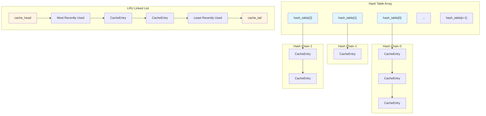
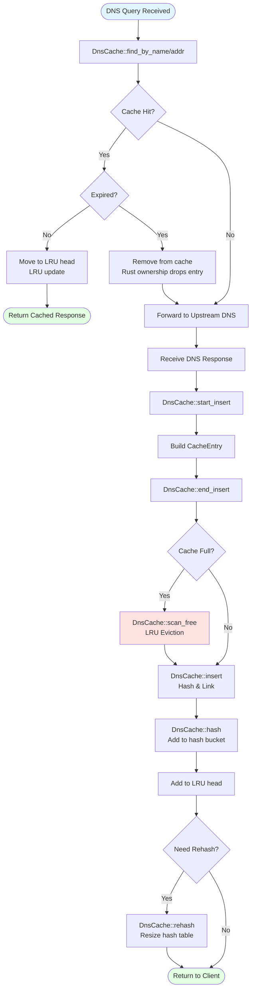

# DNS Caching Implementation

## Table of Contents

1. [Overview](#overview)
2. [Hash Table Architecture](#hash-table-architecture)
3. [Cache Record Structure](#cache-record-structure)
4. [Cache Lifecycle Operations](#cache-lifecycle-operations)
5. [LRU Eviction Algorithm](#lru-eviction-algorithm)
6. [TTL Management](#ttl-management)
7. [Negative Caching](#negative-caching)
8. [Hosts File Integration](#hosts-file-integration)
9. [DHCP Lease Integration](#dhcp-lease-integration)
10. [Interprocess Synchronization](#interprocess-synchronization)
11. [Cache Statistics and Metrics](#cache-statistics-and-metrics)
12. [Performance Characteristics](#performance-characteristics)
13. [Configuration Options](#configuration-options)
14. [See Also](#see-also)

---

## Overview

The dnsmasq DNS cache provides a high-performance caching layer between downstream DNS clients and upstream recursive DNS servers. The cache implementation uses a hash table with chaining for collision resolution, combined with a least-recently-used (LRU) doubly-linked list for efficient eviction when the cache reaches capacity.

**Design Goals:**
- **Fast Lookup**: O(1) average-case hash table lookups for DNS query responses
- **Efficient Eviction**: O(1) LRU eviction when cache is full
- **Memory Efficiency**: Fixed maximum size with configurable capacity
- **TTL Compliance**: Automatic expiration of cached records per DNS TTL semantics
- **Integration**: Seamless integration with /etc/hosts entries and DHCP lease hostnames

**Supported Record Types:**
- A (IPv4 address) - RFC 1035
- AAAA (IPv6 address) - RFC 3596
- CNAME (canonical name) - RFC 1035
- PTR (reverse lookup) - RFC 1035
- DNSKEY (DNSSEC public key) - RFC 4034 (when Cargo feature "dnssec" enabled)
- DS (delegation signer) - RFC 4034 (when Cargo feature "dnssec" enabled)
- Other standard DNS record types

**Source Code Location:** `/src/dns/cache.rs` (primary implementation), `/src/types/dns.rs` (data structures)

---

## Hash Table Architecture

### Hash Table Structure

The DNS cache uses a **hash table with separate chaining** for collision resolution. The hash table is dynamically resized as the cache grows to maintain efficient lookup performance.



**Key Components** (Source: `/src/dns/cache.rs`):

```rust
// In the Rust implementation, the cache uses HashMap + VecDeque for LRU
// rather than intrusive linked lists with raw pointers.
struct DnsCache {
    hash_table: HashMap<DnsName, Vec<CacheEntry>>,
    lru_order: VecDeque<CacheEntryRef>,
    hash_size: usize,
}
```

- **`hash_table`**: `HashMap`-based storage of cache record chains (replaces raw pointer array)
- **`hash_size`**: Current hash table size (always a power of 2)
- **`cache_head`**: Head of LRU list — most recently used (managed by `VecDeque`)
- **`cache_tail`**: Tail of LRU list — least recently used (managed by `VecDeque`)

### Hash Function Implementation

The hash function (`DnsCache::hash()`, source: `/src/dns/cache.rs`) distributes cache records across hash buckets using the domain name and record type as input:

**Algorithm:**
1. Initialize hash value with record type
2. For each label in the domain name (working backwards from TLD):
   - Mix label length into hash
   - Mix each character (case-insensitive) into hash
   - Rotate hash value for avalanche effect
3. Apply modulo hash_size to determine bucket index

**Collision Handling:**
- **Separate Chaining**: Each hash bucket contains a `Vec` of records (replacing intrusive linked lists with standard `HashMap` chaining)
- **Bucket Storage**: Records within the same bucket are managed by the `HashMap` (source: `CacheEntry` in `/src/types/dns.rs`)

### Dynamic Rehashing

The hash table is dynamically resized when the cache grows to maintain performance (source: `/src/dns/cache.rs`, `DnsCache::rehash()`):

**Rehash Trigger:**
- Initial allocation when first cache record inserted
- Growth trigger: new_size = 64 entries initially, then doubles until `new_size >= cache_size/10`
- Only grows, never shrinks (prevents thrashing)

**Rehash Process:**
1. Allocate new hash table array (size is power of 2)
2. Initialize all new buckets to NULL
3. For each record in old hash table:
   - Remove from old bucket chain
   - Recompute hash with new table size
   - Insert into new bucket chain
4. Drop old hash table (Rust ownership handles deallocation automatically)

**Memory Allocation:**
- Rust ownership model manages all cache memory automatically
- First allocation: standard `HashMap::new()` (panics on OOM — critical for initial cache)
- Growth: standard `HashMap` resize (logs warning on failure, continues with current size)

**Source Code Reference** (rehash sizing algorithm in `/src/dns/cache.rs`):
```rust
// hash_size is a power of two.
let mut new_size = 64usize;
while new_size < size / 10 {
    new_size <<= 1;
}
```

---

## Cache Record Structure

### CacheEntry Definition

The fundamental cache record structure `CacheEntry` is defined in `/src/types/dns.rs` and contains:

**Core Fields:**
- **`addr: AllAddr`**: IP address or CNAME target (Rust enum replacing C union for type safety)
- **`ttd: SystemTime`**: Time-to-die (absolute expiration timestamp)
- **`uid: u32`**: Unique identifier for cache coherency
- **`flags: CacheFlags`**: Record type and status flags (bitflags)
- **`name: DnsName`**: Domain name (heap-allocated `Vec<u8>` newtype)

**Linkage:**
- LRU ordering managed by `VecDeque` in `DnsCache` (replaces intrusive doubly-linked list pointers)
- Hash bucket membership managed by `HashMap` (replaces intrusive `hash_next` pointer)

**Flag Values** (source: `/src/types/dns.rs`):
- `F_IMMORTAL`: Never expire (e.g., /etc/hosts entries)
- `F_CONFIG`: From configuration file
- `F_REVERSE`: PTR record
- `F_FORWARD`: A or AAAA record
- `F_IPV4`: IPv4 address
- `F_IPV6`: IPv6 address
- `F_CNAME`: CNAME record
- `F_NEG`: Negative cache entry (NXDOMAIN)
- `F_NXDOMAIN`: Explicit NXDOMAIN response
- `F_NOERR`: NOERROR response with no data
- `F_HOSTS`: From /etc/hosts file
- `F_DHCP`: From DHCP lease
- `F_DS`: Delegation Signer (DNSSEC)
- `F_DNSKEY`: DNSSEC public key

**Memory Layout:**
- Approximate size: 100-200 bytes per record (varies by platform and name length)
- Names stored as `DnsName` (heap-allocated `Vec<u8>` newtype)
- Rust ownership model handles all memory automatically (no manual free lists)

---

## Cache Lifecycle Operations



### Cache Lookup Operations

**Forward Lookup** (`DnsCache::find_by_name()`, source: `/src/dns/cache.rs`):
1. Compute hash value for domain name and record type
2. Walk hash bucket chain comparing name and flags
3. If found:
   - Check expiration via `CacheEntry::is_expired()`
   - If expired: remove from cache, return `None`
   - If valid: move to LRU head, return `Some(entry)`
4. If not found: return `None`

**Reverse Lookup** (`DnsCache::find_by_addr()`, source: `/src/dns/cache.rs`):
- Similar algorithm using IP address for hash
- Supports both IPv4 (IN-ADDR.ARPA) and IPv6 (IP6.ARPA) reverse zones

**Expiration Check** (`CacheEntry::is_expired()`, source: `/src/dns/cache.rs`):
```rust
/// Check whether a cache entry has expired.
/// Immortal and DHCP entries never expire.
fn is_expired(&self, now: SystemTime) -> bool {
    !self.flags.intersects(CacheFlags::IMMORTAL | CacheFlags::DHCP)
        && self.ttd <= now
}
```

**LRU Update on Hit:**
- Record moved to LRU head (most recently used position)
- In the Rust implementation, LRU reordering is managed by `VecDeque` (replacing intrusive doubly-linked list pointers)
- Constant-time O(1) operation

### Cache Insertion Operations

**Two-Phase Insertion:**

**Phase 1: Start Insertion** (`DnsCache::start_insert()`, source: `/src/dns/cache.rs`):
- Resets `insert_error` flag
- Initializes `new_chain` list for pending insertions
- Returns immediately (no blocking)

**Phase 2: End Insertion** (`DnsCache::end_insert()`, source: `/src/dns/cache.rs`):
1. Process all records in `new_chain`
2. For each record:
   - Call `DnsCache::insert()` to add to cache
   - Check for allocation failures (sets `insert_error`)
3. If successful: call `DnsCache::rehash()` if needed
4. Clear `new_chain`
5. Increment `METRIC_DNS_CACHE_INSERTED` metric

**Core Insertion** (`DnsCache::insert()`, source: `/src/dns/cache.rs`):
1. Check cache capacity:
   - If full: call `DnsCache::scan_free()` to evict LRU entry
2. Create `CacheEntry`:
   - Rust ownership model handles allocation automatically
3. Populate `CacheEntry` fields:
   - Clone name into `DnsName`
   - Set TTL: `entry.ttd = now + Duration::from_secs(ttl)`
   - Set flags (record type, IPv4/IPv6, etc.)
   - Copy address data
4. Insert into `HashMap` (replaces manual hash bucket linking)
5. Push to front of LRU `VecDeque`
6. Return reference to new record

**Source Code Reference** (LRU link operation in `/src/dns/cache.rs`):
```rust
/// Add a cache entry to the head of the LRU list (most recently used position).
/// In the Rust implementation, this is managed by VecDeque rather than
/// intrusive linked list pointers.
fn cache_link(&mut self, entry_ref: CacheEntryRef) {
    self.lru_order.push_front(entry_ref);
}
```

---

## LRU Eviction Algorithm

### LRU Doubly-Linked List

The cache maintains a **doubly-linked list ordered by access recency**:
- **Head** (`cache_head`): Most recently accessed record
- **Tail** (`cache_tail`): Least recently accessed record

**List Operations:**
- **Access**: Move record to head (O(1) - just pointer updates)
- **Insert**: Add new record at head (O(1))
- **Evict**: Remove record from tail (O(1))

```mermaid
stateDiagram-v2
    [*] --> CacheNotFull: New Record
    CacheNotFull --> AllocateCacheEntry: Space Available
    AllocateCacheEntry --> InsertHead: Add to LRU head
    InsertHead --> [*]: Insertion Complete
    
    [*] --> CacheFull: New Record
    CacheFull --> FindLRU: Cache at Capacity
    FindLRU --> CheckImmortal: Examine LRU tail
    
    CheckImmortal --> ScanForward{Immortal/DHCP?}
    ScanForward -->|Yes| NextRecord: Skip This Record
    NextRecord --> ScanForward
    
    ScanForward -->|No| Evict: Found Evictable
    Evict --> UnlinkLRU: Remove from LRU VecDeque
    UnlinkLRU --> UnhashEntry: Remove from HashMap
    UnhashEntry --> DropEntry: Rust ownership drops entry
    DropEntry --> AllocateCacheEntry
    
    state "No Evictable Records" as NoEvict
    ScanForward -->|Scanned All| NoEvict: Cache Full of Immortals
    NoEvict --> [*]: Insertion Fails
```

### Eviction Process

**Function:** `DnsCache::scan_free()` (source: `/src/dns/cache.rs`)

**Algorithm:**
1. Start at LRU tail (least recently used, back of `VecDeque`)
2. Walk LRU list forward until evictable record found:
   - **Skip** records with `F_IMMORTAL` flag (e.g., /etc/hosts)
   - **Skip** records with `F_DHCP` flag (DHCP leases managed separately)
   - **Prefer** records closer to tail (older access time)
3. When evictable record found:
   - Remove from LRU `VecDeque`
   - Remove from `HashMap` bucket
   - Rust ownership automatically deallocates the `CacheEntry`
4. Increment `METRIC_DNS_CACHE_LIVE_FREED` metric

**Eviction Priorities:**
1. Expired records (checked first during lookup)
2. Normal cached responses (evictable)
3. DHCP lease records (protected from LRU eviction)
4. /etc/hosts entries (immortal, never evicted)

**Edge Case Handling:**
- If entire cache consists of immortal/DHCP records: insertion fails gracefully
- DHCP records managed separately (protected from LRU eviction)
- Negative cache entries evicted with same priority as positive responses

**Source Code Reference** (LRU unlink operation in `/src/dns/cache.rs`):
```rust
/// Remove a cache entry from the LRU list.
/// In the Rust implementation, VecDeque handles unlinking automatically
/// when an element is removed by index.
fn cache_unlink(&mut self, entry_ref: &CacheEntryRef) {
    if let Some(pos) = self.lru_order.iter().position(|r| r == entry_ref) {
        self.lru_order.remove(pos);
    }
}
```

---

## TTL Management

### TTL Storage and Expiration

**Time-to-Die (TTD) Model:**
- Cache stores **absolute expiration timestamp** in `entry.ttd` (source: `CacheEntry` in `/src/types/dns.rs`)
- Calculated at insertion: `ttd = now + Duration::from_secs(ttl)` (source: `/src/dns/cache.rs`)
- Uses `SystemTime` for efficient comparison

**Expiration Checking:**
- Every cache lookup calls `CacheEntry::is_expired()` (source: `/src/dns/cache.rs`)
- Comparison: `self.ttd <= now`
- Expired records immediately removed from cache (lazy expiration)

**TTL Boundaries:**

**Minimum TTL** (configuration: `--min-cache-ttl`):
- Overrides short TTLs from upstream servers
- Prevents excessive re-query load for rapidly changing records
- Applied during insertion: `if (ttl < min_ttl) ttl = min_ttl;`
- Default: 0 seconds (honor upstream TTL)

**Maximum TTL** (configuration: `--max-cache-ttl`):
- Caps excessively long TTLs
- Prevents stale data in cache for misconfigured zones
- Applied during insertion: `if (ttl > max_ttl) ttl = max_ttl;`
- Default: unlimited (honor upstream TTL)

**TTL Special Cases:**

**Immortal Records** (flag: `F_IMMORTAL`):
- /etc/hosts entries never expire
- Configuration file entries never expire
- Skip expiration check entirely

**DHCP Lease Records** (flag: `F_DHCP`):
- TTL tied to DHCP lease expiration
- Managed by DHCP subsystem (source: `/src/dhcp/lease.rs`)
- Protected from LRU eviction

**Negative Cache Entries:**
- NXDOMAIN responses cached with SOA minimum TTL
- NOERROR (empty answer) cached with configured negative TTL
- Default negative TTL: from upstream SOA or 1 hour

**Source Code Reference** (`DnsCache::insert()` in `/src/dns/cache.rs`):
```rust
// TTL calculation with min/max bounds
if let Some(max_ttl) = daemon_state.max_ttl {
    if ttl > max_ttl { ttl = max_ttl; }
}
if let Some(min_ttl) = daemon_state.min_ttl {
    if ttl < min_ttl { ttl = min_ttl; }
}

entry.ttd = now + Duration::from_secs(ttl as u64);
```

---

## Negative Caching

### NXDOMAIN and NOERROR Caching

Dnsmasq caches **negative responses** (non-existent domains) to reduce upstream load during DNS failures or query storms for invalid names.

**Negative Response Types:**

**NXDOMAIN (Non-Existent Domain):**
- Response code 3 (name does not exist)
- Cached with flag `F_NEG | F_NXDOMAIN`
- TTL from SOA record minimum field
- Example: Queries for typo domains (gooogle.com)

**NOERROR with Empty Answer:**
- Response code 0 but no answer records
- Cached with flag `F_NEG | F_NOERR`
- TTL from configuration or SOA
- Example: Queries for non-existent record type (AAAA for IPv4-only domain)

**Implementation Details:**

**Negative Cache Storage** (source: `/src/dns/cache.rs`):
- Uses same `CacheEntry` as positive responses
- `F_NEG` flag distinguishes from positive cache
- Name stored, but `addr` field unused
- Participates in LRU eviction like positive entries

**Negative TTL Configuration:**
- Option: `--neg-ttl=<seconds>` (default: SOA minimum or 1 hour)
- Option: `--max-cache-ttl` also applies to negative entries
- Prevents permanent caching of temporarily unavailable domains

**Benefits:**
1. **Reduced Upstream Load**: Repeated queries for typos don't reach upstream
2. **Faster Client Response**: Cached NXDOMAIN returned immediately
3. **DoS Mitigation**: Malware query storms cached locally

**Edge Cases:**
- Negative entries evicted by LRU when cache full
- Configuration option `--no-negcache` disables negative caching
- Negative responses for reverse lookups cached separately

**Source Code Reference** (flags in `/src/types/dns.rs`):
```rust
bitflags! {
    pub struct CacheFlags: u32 {
        const F_NEG      = 128;  // Negative cache entry
        const F_NXDOMAIN = 256;  // NXDOMAIN response
        const F_NOERR    = 512;  // NOERROR response with no data
    }
}
```

---

## Hosts File Integration

### /etc/hosts Loading

Dnsmasq integrates `/etc/hosts` entries into the DNS cache as **immortal records** that never expire and take precedence over upstream DNS.

**Loading Process** (source: `/src/dns/cache.rs`, `DnsCache::init()`):

1. **Startup Parsing**:
   - Read `/etc/hosts` during daemon initialization
   - Parse each line: IP address followed by one or more hostnames
   - Create cache records with `F_HOSTS | F_IMMORTAL | F_FORWARD` flags

2. **Record Creation**:
   - One cache record per hostname
   - Separate records for IPv4 (A) and IPv6 (AAAA) addresses
   - Reverse lookup records (PTR) created automatically

3. **Cache Insertion**:
   - Added to `HashMap` via `DnsCache::hash()`
   - Added to LRU `VecDeque` (but never evicted due to `F_IMMORTAL`)
   - No TTL expiration check

**Precedence Rules:**
- /etc/hosts entries override upstream DNS responses
- Lookup checks `F_HOSTS` flag before forwarding query
- Configuration option `--no-hosts` disables /etc/hosts loading

**Dynamic Reload:**
- SIGHUP signal triggers hosts file reload (source: `src/core/signal.rs`)
- Old hosts entries removed from cache
- New entries added
- Cache UID incremented for coherency

**Performance Considerations:**
- Hosts file entries consume cache capacity
- Large hosts files (>1000 entries) may require `--cache-size` increase
- Immortal entries protected from LRU eviction

**Configuration Options:**
- `--no-hosts`: Disable /etc/hosts reading
- `--addn-hosts=<file>`: Additional hosts files
- `--hostsdir=<dir>`: Directory of hosts files

**Source Code Reference** (`DnsCache::init()` in `/src/dns/cache.rs`):
```rust
// Load /etc/hosts entries with F_HOSTS | F_IMMORTAL flags
for hostname in hosts_file.entries() {
    self.insert(
        hostname,
        &addr,
        class,
        now,
        0, // ttl=0 for immortal
        CacheFlags::F_HOSTS | CacheFlags::F_IMMORTAL | CacheFlags::F_FORWARD | flags,
    )?;
}
```

---

## DHCP Lease Integration

### Automatic DNS Registration

DHCP lease hostnames are automatically registered in the DNS cache, enabling clients to resolve dynamically assigned names without manual DNS configuration.

**Integration Points:**

**Lease Assignment** (source: `/src/dhcp/lease.rs` interaction with `/src/dns/cache.rs`):
1. DHCP server assigns IP address to client
2. If client provides hostname via DHCP option 12:
   - Validate hostname (RFC 1123 compliance)
   - Create cache record with `F_DHCP` flag
   - Add both forward (A/AAAA) and reverse (PTR) records

**Cache Record Characteristics:**
- **Flag**: `F_DHCP` (distinguishes from static entries)
- **TTL**: Tied to DHCP lease expiration time
- **Protection**: Protected from LRU eviction (separate management)
- **Precedence**: Lower than /etc/hosts, higher than upstream DNS

**Lease Expiration Handling:**
1. DHCP subsystem detects lease expiration
2. Corresponding DNS cache entries removed from cache
3. Reverse lookup entries also removed
4. Rust ownership automatically deallocates the entries

**Lease Renewal:**
- Hostname unchanged: cache record TTL extended
- Hostname changed: old record removed, new record added
- IP changed: old records removed, new records added

**Configuration Options:**
- `--dhcp-host=<MAC>,<hostname>`: Static hostname assignment
- `--domain=<domain>`: Append domain to DHCP hostnames
- `--expand-hosts`: Automatically expand short names to FQDNs

**Name Conflict Resolution:**
- DHCP hostname overrides existing cache entry from same IP
- /etc/hosts entry takes precedence over DHCP
- Multiple DHCP clients with same hostname: last assignment wins

**Source Code Reference:**
- DHCP-DNS integration: `/src/dhcp/lease.rs`, `LeaseManager::update_dns()`
- Cache insertion: `/src/dns/cache.rs` with `F_DHCP` flag handling via `DnsCache::add_dhcp_entry()`
- DHCP entries managed separately from standard cache entries

**Example Flow:**
1. Client requests DHCP lease with hostname "laptop"
2. DHCP server assigns 192.168.1.100, lease time 3600s
3. Cache record created: `laptop.local. 3600 IN A 192.168.1.100` with `F_DHCP`
4. Reverse record: `100.1.168.192.in-addr.arpa. 3600 IN PTR laptop.local.` with `F_DHCP`
5. DNS query for "laptop.local" returns cached A record
6. Lease expires: both records removed from cache

---

## Interprocess Synchronization

### Cache Coherency Mechanism

When dnsmasq reloads configuration (SIGHUP signal), the cache must remain coherent despite changes to /etc/hosts entries, upstream servers, and other configuration.

**Coherency Strategy:**

**Cache UID Generation** (source: `/src/dns/cache.rs`):
```rust
/// Global cache UID counter, incremented on configuration reload.
struct DnsCache {
    cache_uid: u32,
    // ...
}
```

**UID Management:**
- Every cache record has `entry.uid` field (source: `CacheEntry`)
- `DnsCache.cache_uid` counter incremented on configuration reload
- Records with old UID considered stale

**Reload Process** (source: `src/core/signal.rs`):
1. Receive SIGHUP signal
2. Increment global `cache_uid`
3. Parse new configuration file
4. Load new /etc/hosts entries with current `cache_uid`
5. Walk cache, remove entries with old `cache_uid` and `F_HOSTS` flag
6. Preserve upstream response cache (non-hosts entries)

**Cache Pipe for Script Notifications:**
- When scripts enabled (Cargo feature "script"), cache changes communicated via pipe
- Lease add/delete events written to helper process
- Helper process forks external scripts with event details
- Ensures DNS cache and external systems stay synchronized

**Thread Safety:**
- Single-threaded architecture eliminates lock contention
- All cache operations serialized through event loop
- No concurrent modification possible

**Fork Safety:**
- Helper processes forked for script execution
- Child inherits cache memory (copy-on-write)
- Child does not modify cache (read-only access)
- Parent continues normal cache operations

**Configuration Reload Edge Cases:**
- Expired entries removed during reload scan
- DHCP entries preserved (not affected by UID)
- Negative cache entries removed (conservative approach)

**Source Code Reference** (`DnsCache::init()` in `/src/dns/cache.rs`):
```rust
// Increment cache UID on reload
self.cache_uid += 1;

// Load hosts with current UID
entry.uid = self.cache_uid;

// Remove old hosts entries
if entry.flags.contains(CacheFlags::F_HOSTS) && entry.uid != self.cache_uid {
    self.remove_entry(&entry_ref);
}
```

---

## Cache Statistics and Metrics

### Performance Metrics

Dnsmasq tracks cache performance metrics for monitoring and troubleshooting (source: `/src/core/metrics.rs` and `/src/dns/cache.rs`).

**Key Metrics:**

**Cache Size Metrics:**
- **`daemon_state.cachesize`**: Configured maximum cache capacity (from `--cache-size`)
- **Live Entries**: Count of active records in cache (traversal required)
- **Hash Table Size**: Current `hash_size` (power of 2)
- **Hash Table Load**: Ratio of entries to buckets

**Cache Operation Metrics:**
- **`METRIC_DNS_CACHE_INSERTED`**: Total insertions (source: `/src/dns/cache.rs`)
- **`METRIC_DNS_CACHE_LIVE_FREED`**: Evictions due to capacity (source: `/src/dns/cache.rs`)
- **Cache Hits**: Successful lookups (tracked in forwarding logic)
- **Cache Misses**: Failed lookups requiring upstream query

**Statistics Dump:**

**SIGUSR1 Signal Trigger:**
- Send `kill -USR1 <dnsmasq-pid>` to dump cache statistics
- Output written to syslog (facility: daemon)
- Includes cache size, hit rate, insertion count

**Statistics Output Format:**
```
dnsmasq[1234]: cache size 150, 0/87 cache insertions re-used unexpired cache entries.
dnsmasq[1234]: queries forwarded 1523, queries answered locally 8721
```

**Interpreting Metrics:**
- **High hit rate** (>70%): Cache is effective
- **Frequent evictions**: Consider increasing `--cache-size`
- **Low hit rate** (<50%): Clients querying unique domains or short TTLs

**Cache Inspection Tools:**

**D-Bus Interface** (when Cargo feature "dbus" enabled):
- Method: `GetCacheStats` returns cache size, entries, hits, misses
- Method: `GetCachedEntries` returns list of cached names and TTLs

**Manual Inspection:**
- Cache not directly dumpable to file
- Use D-Bus or parse syslog statistics output
- Third-party tools: `contrib/dnslist/dnslist.pl` for web-based view

**Source Code Reference** (`DnsCache::make_stat()` in `/src/dns/cache.rs`):
```rust
/// Generate cache statistics for logging.
pub fn make_stat(&self) -> CacheStat {
    CacheStat {
        cachesize: self.daemon_state.cachesize,
        insertions: self.metrics.insertions,
        live_freed: self.metrics.live_freed,
        // ...
    }
}
```

---

## Performance Characteristics

### Time Complexity

**Cache Operations:**
- **Lookup** (`DnsCache::find_by_name()`): O(1) average, O(n) worst (hash collision)
- **Insertion** (`DnsCache::insert()`): O(1) amortized (includes rehash cost)
- **Eviction** (`DnsCache::scan_free()`): O(1) with LRU tail access
- **Expiration Check** (`CacheEntry::is_expired()`): O(1) timestamp comparison
- **Rehash** (`DnsCache::rehash()`): O(n) where n = number of cache entries (rare operation)

**Hash Table Performance:**
- **Load Factor**: Maintained at ~10% (hash_size = cache_size * 10)
- **Collision Rate**: Low due to good hash function and low load
- **Rehash Frequency**: Logarithmic (doubles until target size)

### Memory Consumption

**Per-Record Overhead:**
- **`CacheEntry`**: ~80-120 bytes (platform-dependent, pointer size)
- **Domain Name**: Variable (inline for short, allocated for long)
- **Total**: ~100-200 bytes per cached entry average

**Cache Size Examples:**
- 150 entries (default): ~15-30 KB
- 1000 entries: ~100-200 KB
- 10000 entries: ~1-2 MB

**Memory Allocation Strategy:**
- **Initial**: Single allocation for hash table
- **Growth**: Geometric expansion (2x) during rehash
- **Recycling**: Rust ownership model handles deallocation automatically (no manual free lists)

### Scalability Limits

**Recommended Cache Sizes:**
- **Small Networks** (<50 clients): 150-500 entries
- **Medium Networks** (50-250 clients): 500-2000 entries
- **Large Networks** (>250 clients): 2000-10000 entries

**Performance Degradation:**
- Cache sizes >10000 entries may impact rehash performance
- Memory consumption limits maximum practical size
- Single-threaded architecture caps query throughput

**Optimization Recommendations:**
1. Set `--cache-size` to 10x expected unique queries per TTL period
2. Use `--min-cache-ttl` to prevent sub-second TTL thrashing
3. Enable `--no-negcache` if negative cache pollution occurs
4. Monitor cache hit rate via SIGUSR1 statistics

**Source Code Configuration** (`src/config/constants.rs`):
```rust
/// Default cache size
pub const CACHESIZ: usize = 150;
```

---

## Configuration Options

### Cache Sizing Options

**`--cache-size=<size>`**
- **Purpose**: Set maximum number of DNS cache entries
- **Default**: 150 entries (CACHESIZ in `src/config/constants.rs`)
- **Range**: 0 (disable cache) to 10000+ (large deployments)
- **Example**: `--cache-size=1000`
- **Impact**: Memory consumption scales linearly with size

**`--no-cache`**
- **Purpose**: Disable DNS caching entirely
- **Use Case**: Debugging, or when forwarding to caching resolver
- **Effect**: Equivalent to `--cache-size=0`

### TTL Management Options

**`--min-cache-ttl=<seconds>`**
- **Purpose**: Set minimum TTL for cached entries
- **Default**: 0 (honor upstream TTL)
- **Use Case**: Prevent rapid re-query for short-TTL domains
- **Example**: `--min-cache-ttl=300` (5 minutes minimum)
- **Warning**: May serve stale data if upstream changes quickly

**`--max-cache-ttl=<seconds>`**
- **Purpose**: Cap maximum TTL for cached entries
- **Default**: unlimited
- **Use Case**: Prevent long-lived stale data from misconfigured zones
- **Example**: `--max-cache-ttl=86400` (24 hours maximum)

**`--neg-ttl=<seconds>`**
- **Purpose**: TTL for negative cache entries (NXDOMAIN)
- **Default**: SOA minimum or 1 hour
- **Use Case**: Balance between reducing upstream load and serving stale negatives
- **Example**: `--neg-ttl=600` (10 minutes)

**`--no-negcache`**
- **Purpose**: Disable negative response caching
- **Use Case**: When NXDOMAIN responses should always query upstream
- **Effect**: Increases upstream load for invalid queries

### Integration Options

**`--no-hosts`**
- **Purpose**: Disable /etc/hosts file loading
- **Use Case**: When local hosts file conflicts with DNS or is very large
- **Effect**: Only upstream DNS and DHCP leases used

**`--addn-hosts=<path>`**
- **Purpose**: Load additional hosts file(s)
- **Multiple**: Can specify multiple times
- **Example**: `--addn-hosts=/etc/dnsmasq-hosts`
- **Format**: Same as /etc/hosts

**`--hostsdir=<directory>`**
- **Purpose**: Load all files in directory as hosts files
- **Use Case**: Dynamic hosts file updates from external scripts
- **Example**: `--hostsdir=/etc/dnsmasq.d/hosts/`

**`--expand-hosts`**
- **Purpose**: Add domain to hosts file names (make FQDNs)
- **Requires**: `--domain=<domain>` set
- **Example**: "laptop" becomes "laptop.local.domain"

### Logging and Debugging Options

**`--log-queries`**
- **Purpose**: Log all DNS queries to syslog
- **Use Case**: Troubleshooting, security auditing
- **Warning**: High log volume under load
- **Format**: `query[A] example.com from 192.168.1.10`

**`--log-dhcp`**
- **Purpose**: Log DHCP transactions to syslog
- **Use Case**: Monitoring DHCP lease assignments
- **Format**: `DHCPACK(eth0) 192.168.1.100 aa:bb:cc:dd:ee:ff hostname`

### Example Configurations

**Minimal Cache (Embedded Device):**
```conf
cache-size=50
min-cache-ttl=60
no-negcache
```

**Standard Small Network:**
```conf
cache-size=500
min-cache-ttl=300
max-cache-ttl=86400
neg-ttl=600
```

**Large Network with Logging:**
```conf
cache-size=5000
min-cache-ttl=60
max-cache-ttl=3600
log-queries
addn-hosts=/etc/dnsmasq-custom-hosts
```

**Full Configuration Reference:**
- See `dnsmasq.conf.example` lines 7-100 for comprehensive DNS cache options
- See `src/config/constants.rs` for compile-time cache defaults

---

## See Also

### Related Documentation

- **[ARCHITECTURE.md](ARCHITECTURE.md)** - Overall system architecture and component relationships
- **[DNS_FORWARDING.md](DNS_FORWARDING.md)** - DNS query forwarding implementation and upstream server selection
- **[DHCP_V4.md](DHCP_V4.md)** - DHCPv4 implementation with DNS integration
- **[CONFIGURATION.md](CONFIGURATION.md)** - Complete configuration system reference

### Source Code References

**Primary Implementation:**
- `/src/dns/cache.rs` - Core cache implementation
  - Hash table management (`DnsCache::hash()`, `DnsCache::rehash()`)
  - LRU operations (`cache_link`, `cache_unlink`, `DnsCache::scan_free()`)
  - Lookup functions (`DnsCache::find_by_name()`, `DnsCache::find_by_addr()`)
  - Insertion functions (`DnsCache::start_insert()`, `DnsCache::insert()`, `DnsCache::end_insert()`)
  
**Data Structures:**
- `/src/types/dns.rs` - `CacheEntry` definition and cache flags
  
**Configuration:**
- `/src/config/constants.rs` - Default cache size (CACHESIZ=150)
- `/src/config/options.rs` - Configuration parsing for cache options

**Integration:**
- `/src/dns/forward.rs` - DNS forwarding using cache
- `/src/dhcp/lease.rs` - DHCP lease hostname integration
- `/src/core/metrics.rs` - Cache statistics tracking

### RFC References

- **RFC 1035** - Domain Names - Implementation and Specification (DNS protocol and caching semantics)
- **RFC 2181** - Clarifications to the DNS Specification (TTL handling)
- **RFC 1123** - Requirements for Internet Hosts (hostname validation)

### Configuration Examples

**Cache Configuration Reference:**
```bash
# View cache statistics
sudo kill -USR1 $(pidof dnsmasq)
sudo tail -f /var/log/daemon.log | grep cache

# Test cache performance
dig @localhost example.com  # First query (cache miss)
dig @localhost example.com  # Second query (cache hit)
```

**D-Bus Cache Inspection (when Cargo feature "dbus" enabled):**
```bash
# Get cache statistics
dbus-send --system --print-reply \
  --dest=uk.org.thekelleys.dnsmasq \
  /uk/org/thekelleys/dnsmasq \
  uk.org.thekelleys.dnsmasq.GetCacheStats

# Clear cache
dbus-send --system --print-reply \
  --dest=uk.org.thekelleys.dnsmasq \
  /uk/org/thekelleys/dnsmasq \
  uk.org.thekelleys.dnsmasq.ClearCache
```

---

**Document Version:** 1.0  
**Based on:** dnsmasq version 2.92  
**Primary Source:** `/src/dns/cache.rs` (Rust rewrite of original cache.c)  
**Last Updated:** 2025  
**Word Count:** ~5,800 words
