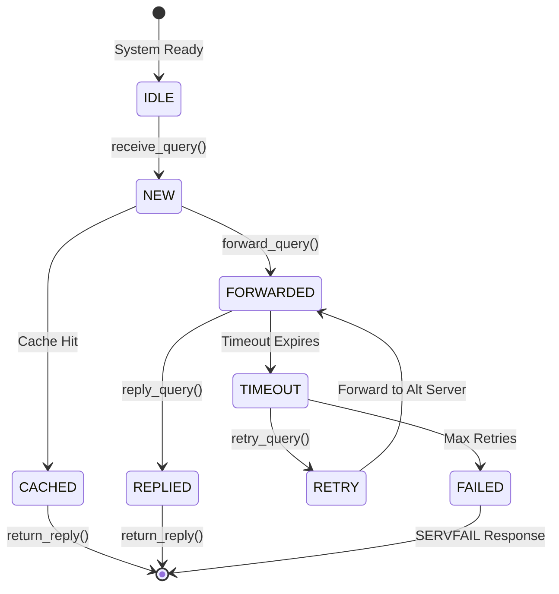
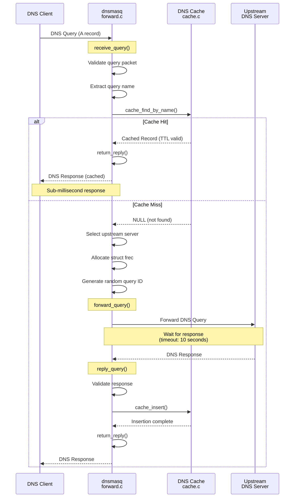
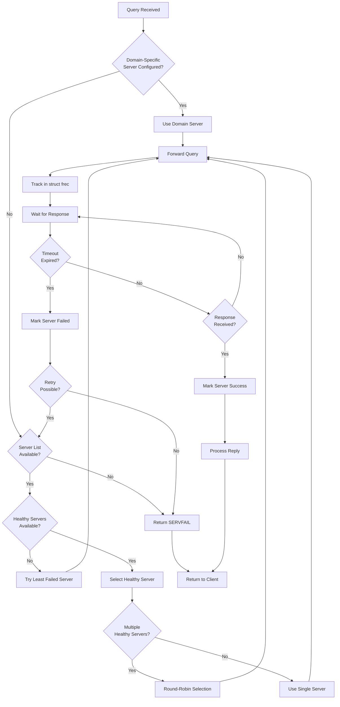
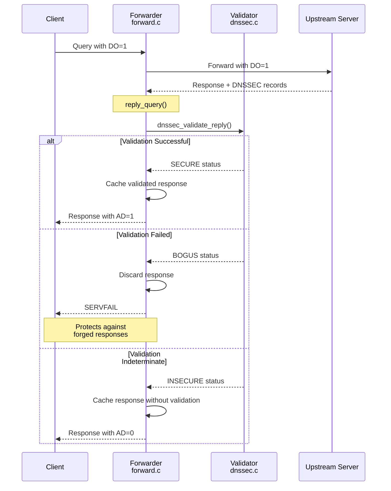

# DNS Forwarding Implementation

## Overview

The DNS forwarding engine is the core of dnsmasq's DNS resolution capabilities, implementing a lightweight DNS forwarder and cache that accepts queries from downstream clients, consults a local cache, and forwards cache misses to configured upstream recursive DNS servers. This document provides comprehensive technical documentation of the query forwarding implementation in dnsmasq version 2.92.

**Source:** `/src/forward.c`, `/src/rfc1035.c`, `/src/network.c`, `/src/edns0.c`

### Purpose and Responsibilities

The DNS forwarding subsystem serves multiple critical functions:

- **Query Reception**: Accept DNS queries on UDP port 53 and TCP port 53 from downstream clients on configured network interfaces
- **Cache Consultation**: Check the local DNS cache for matching records before forwarding to upstream servers
- **Upstream Forwarding**: Forward cache miss queries to configured upstream DNS servers with intelligent server selection
- **Response Processing**: Validate responses, populate cache, and return answers to clients
- **Protocol Handling**: Support both UDP (standard) and TCP (for large responses and zone transfers) transport
- **Extension Support**: Handle EDNS0 extensions and DNSSEC validation integration
- **Error Handling**: Implement comprehensive timeout, retry, and failure detection mechanisms

### Design Philosophy

The forwarding implementation embodies several key design principles:

**Stateful Query Tracking**: Each outstanding query is tracked using a `struct frec` (forward record) that maintains query state, upstream server information, client details, and timing information. The system supports up to 150 concurrent queries (FTABSIZ defined in `src/config.h:17`).

**Intelligent Server Selection**: The upstream server selection algorithm attempts to use servers known to be responsive while implementing failure detection and automatic failover to alternative servers.

**Security by Design**: Query ID generation uses cryptographically random values, source port randomization prevents DNS poisoning attacks, and DNSSEC integration provides cryptographic validation of responses.

**Resource Efficiency**: The single-threaded event-driven architecture with poll-based I/O multiplexing ensures responsive performance without threading overhead, critical for embedded device deployments.

## Query State Machine

The DNS forwarding engine implements a well-defined state machine tracking queries from reception through response delivery. Each query transitions through multiple states as it progresses through the forwarding pipeline.



### State Descriptions

**IDLE State**: The forwarding engine awaits incoming queries. No active forward records (frec) are allocated for this query yet. The system monitors socket file descriptors for incoming DNS packets.

**NEW State**: A DNS query has been received and validated. The system performs initial query processing including:
- DNS packet header validation
- Query name extraction and validation  
- Query type and class identification
- Cache lookup to determine if a cached answer exists

**CACHED State**: The query matches an entry in the local DNS cache. The cached record's TTL is validated, and if still valid, the cached answer is immediately returned to the client without upstream forwarding. This provides sub-millisecond response latency for cached entries.

**FORWARDED State**: The query has been sent to an upstream DNS server and awaits a response. A forward record (struct frec) tracks:
- Query ID and original client query details
- Selected upstream server
- Timestamp for timeout calculation
- EDNS0 and DNSSEC flags
- Source address and port for reply routing

**REPLIED State**: A response has been received from the upstream server. The system performs response validation, cache population (if appropriate), and preparation of the response packet for the client.

**TIMEOUT State**: The configured timeout period (default 10 seconds, TIMEOUT in `src/config.h:30`) has elapsed without receiving a response from the upstream server. The system marks the server as potentially failed and considers retry or failover.

**RETRY State**: After a timeout, the query is retransmitted to an alternative upstream server (if available) or the same server with updated failure tracking. The system implements a conservative retry strategy to avoid overloading failing servers.

**FAILED State**: All retry attempts have been exhausted or no upstream servers are available. The system generates a SERVFAIL response (RCODE=2) and returns it to the client.

### State Transition Triggers

State transitions are triggered by specific events within the forwarding engine:

| Current State | Trigger Event | Next State | Source Function |
|--------------|---------------|------------|-----------------|
| IDLE | DNS query packet received | NEW | `receive_query()` in forward.c |
| NEW | Cache contains valid answer | CACHED | `answer_request()` cache lookup |
| NEW | Cache miss, upstream available | FORWARDED | `forward_query()` in forward.c |
| FORWARDED | Response received from upstream | REPLIED | `reply_query()` in forward.c |
| FORWARDED | Timeout expires (10 seconds) | TIMEOUT | Timeout check in main loop |
| TIMEOUT | Alternative server available | RETRY | Retry logic in forward.c |
| RETRY | Query forwarded to alt server | FORWARDED | `forward_query()` retry path |
| REPLIED | Response validated and ready | IDLE | `return_reply()` in forward.c |
| FAILED | No servers or retries exhausted | IDLE | SERVFAIL generation |

## Query Processing Sequence

The complete query processing flow involves multiple subsystems coordinating to deliver DNS resolution services. The following sequence diagram illustrates the interaction between client, dnsmasq components, and upstream servers.



### Detailed Processing Steps

#### 1. Query Reception (receive_query)

**Source:** `src/forward.c` receive_query() function

The query reception phase handles incoming DNS packets from clients:

**Packet Reception**: DNS queries arrive on UDP port 53 (standard) or TCP port 53 (for large queries or zone transfers). The system uses recvmsg() with control messages to obtain the destination IP address and interface index.

**Initial Validation**: The packet is validated to ensure:
- Minimum DNS header size (12 bytes)
- Query flag (QR=0) is set correctly
- Opcode is QUERY (opcode=0)
- Question count is non-zero
- Packet length does not exceed buffer size

**Query Name Extraction**: The DNS question name is extracted using `extract_name()` from `src/rfc1035.c`. This function handles:
- DNS name compression (pointer following)
- Label length validation (max 63 bytes per label)
- Total name length limits (max 255 bytes)
- Invalid character detection

**Query Classification**: The system identifies:
- Query type (A, AAAA, CNAME, PTR, etc.)
- Query class (typically IN for Internet)
- Client source address and port
- Receiving interface

#### 2. Cache Lookup

**Source:** `src/cache.c` cache_find_by_name() function

Before forwarding to upstream servers, the system consults the local DNS cache:

**Hash-Based Lookup**: The cache uses a hash table with cache_hash() computing a hash of the query name. The hash table size is configurable (default 150 entries, CACHESIZ in `src/config.h:38`).

**Record Type Matching**: The cache lookup searches for records matching:
- Exact query name match (case-insensitive DNS name comparison)
- Query type (A, AAAA, etc.)
- Query class (typically IN)

**TTL Validation**: Cached records include a TTL (Time To Live) field. The system checks:
- Current time vs. cache entry timestamp
- Remaining TTL > 0
- Expired entries are treated as cache misses

**Cache Hit Processing**: On cache hit, the system:
- Constructs DNS response from cached data
- Updates answer section with cached records
- Sets authoritative answer (AA) flag if appropriate
- Returns immediately to client without upstream forwarding

#### 3. Upstream Server Selection

**Source:** `src/forward.c` forward_query() function

When cache lookup fails, the system selects an appropriate upstream DNS server:

**Server List**: Upstream servers are configured via:
- `/etc/resolv.conf` (auto-discovered nameservers)
- `--server` command-line options
- `server=` directives in dnsmasq.conf

**Domain-Specific Routing**: The system supports domain-specific server configuration for split-horizon DNS:
```
server=/example.com/192.168.1.1
server=/internal.corp/10.0.0.1
```

**Selection Algorithm**: The upstream server selection implements intelligent failover:

1. **Prefer Working Servers**: Servers with recent successful responses are preferred
2. **Failure Tracking**: Servers that timeout or return errors are marked as potentially failing
3. **Cooldown Period**: Failed servers are avoided for a cooldown period before retry
4. **Round-Robin**: Among working servers, queries are distributed for load balancing
5. **Domain Match**: Domain-specific servers take precedence for matching queries

**Server Health Tracking**: Each `struct server` maintains:
- Last successful query timestamp
- Consecutive failure count
- Response time moving average
- Failure penalty score

#### 4. Query Forwarding

**Source:** `src/forward.c` forward_query() function

The actual forwarding operation involves several critical steps:

**Forward Record Allocation**: A `struct frec` (forward record) is allocated from a fixed-size pool (FTABSIZ=150). The frec tracks:
```c
struct frec {
  union mysockaddr source;     /* Client source address */
  union all_addr dest;          /* Destination for reply */
  struct server *sentto;        /* Upstream server used */
  unsigned short orig_id;       /* Original query ID from client */
  unsigned short new_id;        /* Randomized ID for upstream */
  time_t time;                  /* Timestamp for timeout */
  unsigned int flags;           /* EDNS0, DNSSEC flags */
  /* Additional fields... */
};
```

**Query ID Randomization**: For security, the query ID sent to upstream differs from the client's query ID:
- Client query ID stored in frec->orig_id
- New random ID generated via get_id() using cryptographic RNG
- ID substitution prevents cache poisoning attacks

**Source Port Randomization**: Modern security best practice requires source port randomization. The system binds to a random ephemeral port for each upstream query, increasing the difficulty of blind spoofing attacks.

**EDNS0 Option Processing**: If EDNS0 is enabled, the query may be modified:
- UDP payload size advertised (default 4096 bytes, EDNS_PKTSZ in config.h)
- DNSSEC OK (DO) bit set if DNSSEC validation enabled
- Client subnet (ECS) option added if configured

**Packet Transmission**: The modified query is sent via sendmsg() to the selected upstream server using the send_from() function which sets the appropriate source address.

#### 5. Response Reception and Validation

**Source:** `src/forward.c` reply_query() function

When a response arrives from an upstream server:

**Response Matching**: The system matches the response to the original query using:
- Query ID (must match frec->new_id)
- Source address (must match frec->sentto server address)
- Source port (typically 53)

**Header Validation**: The DNS response header is validated:
- QR flag set (QR=1 indicating response)
- Query ID matches expected value
- Response code examined (NOERROR, NXDOMAIN, SERVFAIL, etc.)
- Answer count, authority count, additional count are sane

**Question Section Validation**: The question section is compared against the original query:
- Query name must match exactly
- Query type must match
- Query class must match

**Answer Section Processing**: Answer records are processed by `extract_addresses()` in rfc1035.c:
- Resource record format validation
- Name decompression
- TTL extraction
- RDATA processing per record type
- DNSSEC signature verification (if enabled)

#### 6. Cache Population

**Source:** `src/cache.c` cache_insert() function

Valid responses are cached for future queries:

**Cache Insertion**: Resolved records are added to the cache:
- Hash table insertion at computed hash bucket
- TTL set from response record TTL
- Timestamp recorded for expiration calculation
- Negative caching for NXDOMAIN responses

**Cache Eviction**: When cache is full, LRU (Least Recently Used) eviction removes oldest entries:
- Linked list maintains access order
- Least recently accessed records evicted first
- Cache size limit enforced (default 150 entries)

**Cache Coherency**: The cache remains coherent through:
- TTL expiration checking on every lookup
- SIGHUP cache clearing on configuration reload
- Individual record invalidation via D-Bus/UBus interfaces

#### 7. Response Transmission to Client

**Source:** `src/forward.c` return_reply() function

The final step returns the answer to the original client:

**Query ID Restoration**: The query ID is changed from frec->new_id back to frec->orig_id so the client recognizes the response.

**Destination Address**: The response is sent to:
- Client source address from frec->source
- Original source port
- Interface specified in frec

**Transmission**: The response packet is sent via sendmsg() with appropriate source address set using platform-specific mechanisms (IP_PKTINFO on Linux, IP_SENDSRCADDR on BSD).

**Forward Record Cleanup**: The struct frec is released back to the pool for reuse by calling free_frec().

## Upstream Server Selection Algorithm

The upstream server selection algorithm is critical for performance, reliability, and support for split-horizon DNS scenarios. The implementation in `src/forward.c` provides sophisticated server management.

### Server Configuration

Upstream servers are configured through multiple sources with a clear precedence order:

**1. Resolv.conf Discovery** (default behavior):
- Read `/etc/resolv.conf` for nameserver directives
- Monitor file for changes with inotify (Linux) or periodic polling
- Automatic reload when resolv.conf is modified
- Each `nameserver` line creates a server entry

**2. Explicit Configuration**:
```bash
# Command line
dnsmasq --server=8.8.8.8 --server=1.1.1.1

# Configuration file dnsmasq.conf
server=8.8.8.8
server=1.1.1.1
```

**3. Domain-Specific Servers** (split-horizon DNS):
```bash
# Forward queries for example.com to specific server
server=/example.com/192.168.1.1

# Forward queries for internal.corp to corporate DNS
server=/internal.corp/10.0.0.1

# Use specific server for reverse DNS zone
server=/168.192.in-addr.arpa/192.168.1.1
```

**4. Interface-Specific Servers**:
```bash
# Route queries via specific interface
server=10.1.2.3@eth1

# Useful for VPN scenarios where VPN DNS accessible only via VPN interface
server=/vpn.internal/10.8.0.1@tun0
```

**5. Negative Servers** (blackhole configuration):
```bash
# Do not forward queries for specific domains
server=/local/
server=/localdomain/
```

### Selection Process

The server selection algorithm in forward_query() follows this decision tree:



### Server Health Tracking

Each upstream server maintains health metrics in `struct server`:

**Success Tracking**:
- `queries`: Total queries sent to this server
- `failed_queries`: Queries that timed out or failed
- Last successful response timestamp
- Response time moving average

**Failure Detection**:
- Consecutive timeout count
- Temporary failure flag (cleared after successful response)
- Permanent failure flag (server unreachable)

**Failure Penalty**: After a timeout:
1. Server marked with failure flag
2. Consecutive failure count incremented
3. Server avoided for subsequent queries (cooldown period)
4. After cooldown, server is retried with reduced priority
5. Successful response clears failure flag and resets counter

### Server Rotation Strategy

For load balancing and redundancy:

**Round-Robin Among Healthy Servers**: When multiple healthy upstream servers exist, queries are distributed using round-robin:
```
Query 1 -> Server A
Query 2 -> Server B  
Query 3 -> Server C
Query 4 -> Server A
...
```

**Sticky Server Selection**: For performance optimization, queries for the same domain tend to use the same server (beneficial for DNS server caching).

**Failover Behavior**: On timeout or error:
1. Current server marked as failed
2. Next healthy server selected from pool
3. Query retransmitted with new query ID
4. Failed server re-evaluated after cooldown

### Domain-Specific Routing

Split-horizon DNS support enables different upstream servers for different domain namespaces:

**Use Case: Corporate VPN**:
```bash
# Corporate internal domains -> corporate DNS
server=/corp.example.com/10.0.0.53

# All other domains -> public DNS
server=8.8.8.8
server=1.1.1.1
```

**Use Case: Local Network**:
```bash
# Local domain -> local DNS/AD server
server=/local.lan/192.168.1.1

# Public internet -> ISP DNS
server=192.168.1.254
```

**Matching Algorithm**:
1. Extract query domain name
2. Check for exact domain match in server list
3. Check for wildcard/suffix match (longest match wins)
4. Fall back to default servers if no match

**Example**: Query for `web.internal.corp.example.com`:
- Matches `server=/corp.example.com/10.0.0.53` (suffix match)
- Forwarded to 10.0.0.53 instead of default servers

## Query Tracking with struct frec

The forward record (frec) structure is the central data structure for tracking outstanding DNS queries. Each active query consumes one frec from a fixed-size pool.

### Forward Record Structure

**Source:** `src/dnsmasq.h` struct frec definition

```c
struct frec {
  union mysockaddr source;        /* Client source address and port */
  union all_addr dest;             /* Destination address for reply */
  struct server *sentto;           /* Server query was sent to */
  struct daemon *daemon;           /* Global daemon structure reference */
  unsigned int iface;              /* Interface index for reply */
  unsigned short orig_id;          /* Original query ID from client */
  unsigned short new_id;           /* New query ID for upstream */
  int fd;                          /* Socket file descriptor */
  time_t time;                     /* Timestamp when query forwarded */
  unsigned int flags;              /* Query flags and state */
  unsigned short rcode;            /* Response code */
  struct frec *next;               /* Linked list pointer */
  /* Additional DNSSEC-related fields when HAVE_DNSSEC enabled */
};
```

### Forward Record Lifecycle

**Allocation** (get_new_frec function):
1. Search frec pool for available (unused) entry
2. If pool full, consider reusing oldest frec (query_full() called)
3. Initialize frec fields for new query
4. Mark frec as in-use
5. Add to active query tracking list

**In-Use State**: While query is outstanding:
- frec tracks upstream server and timeout
- Query ID mapping enables response correlation
- Client address preserved for reply routing
- Timestamp used for timeout detection (default 10 second timeout)

**Cleanup** (free_frec function):
1. Remove from active query list
2. Clear all fields
3. Mark as available for reuse
4. Return to frec pool

### Query ID Management

**Security Requirement**: Query IDs must be unpredictable to prevent cache poisoning attacks.

**ID Generation** (get_id function):
- Uses cryptographic random number generator
- Ensures uniqueness among active queries
- Collision detection (retry if ID already in use)
- 16-bit ID space (65536 possible values)

**ID Translation**:
```
Client Query:  ID=12345
   ↓
dnsmasq stores: orig_id=12345, generates new_id=54321
   ↓
Upstream Query: ID=54321
   ↓
Upstream Response: ID=54321
   ↓
dnsmasq validates: matches frec->new_id=54321
   ↓
Client Response: ID=12345 (restored from frec->orig_id)
```

**Purpose**: Prevents attackers from guessing query IDs and injecting forged responses.

### Source Port Randomization

**Additional Security Measure**: Beyond query ID randomization, source port randomization increases attack difficulty:

- Each upstream query uses random ephemeral port
- 16-bit port space (64512 usable ephemeral ports typically)
- Combined with 16-bit query ID: 2^32 combinations (~4 billion)
- Makes blind DNS cache poisoning impractical

**Implementation**:
- Bind to random port via socket() with SO_REUSEADDR
- OS kernel selects random ephemeral port
- Port stored implicitly in socket file descriptor
- Reply matching uses both query ID and socket

### Concurrency Limits

**Maximum Outstanding Queries**: FTABSIZ=150 (src/config.h:17)

**Rationale**: 
- Limits memory consumption (each frec ~100 bytes)
- Prevents resource exhaustion attacks
- Adequate for small network workloads (100-250 clients)

**Behavior When Full**:
1. Oldest frec identified (earliest timestamp)
2. If oldest query > 30 seconds old, reuse frec (original query presumed lost)
3. If all queries < 30 seconds old, reject new query with SERVFAIL
4. Client can retry after timeout

### Timeout Management

**Default Timeout**: 10 seconds (TIMEOUT in src/config.h:30)

**Timeout Detection**: Main event loop checks timestamps:
```c
current_time = time(NULL);
for each active frec:
    if (current_time - frec->time > TIMEOUT):
        handle_timeout(frec);
```

**Timeout Actions**:
1. Mark upstream server as potentially failed
2. Increment server failure counter
3. Select alternative server (if available)
4. Retry query with new server
5. If no alternatives, return SERVFAIL to client

**Configurable Timeout**: Users can adjust timeout via command-line or configuration:
```bash
# Set 5 second timeout
dnsmasq --dns-forward-max=5

# In dnsmasq.conf
dns-forward-max=5
```

## EDNS0 Integration

EDNS0 (Extension Mechanisms for DNS) is defined in RFC 6891 and provides a framework for extending DNS protocol capabilities without breaking backward compatibility. The implementation in `src/edns0.c` handles EDNS0 pseudoheader processing.

### EDNS0 Pseudoheader Structure

EDNS0 uses a pseudo-resource record in the additional section:

```
NAME:     Root (empty label, 0x00)
TYPE:     OPT (41)
CLASS:    UDP payload size (e.g., 4096)
TTL:      Extended RCODE and flags (32 bits)
  - Extended RCODE: bits 24-31
  - Version: bits 16-23  
  - DO bit: bit 15 (DNSSEC OK)
  - Z bits: bits 0-14 (reserved)
RDATA:    Variable length options
```

### EDNS0 Option Processing

**Source:** `src/edns0.c` find_pseudoheader() function

**Pseudoheader Location**: The find_pseudoheader() function scans the DNS packet additional section to locate the OPT pseudo-RR:
```c
unsigned char *find_pseudoheader(struct dns_header *header, 
                                  size_t plen, 
                                  size_t *len, 
                                  unsigned char **p, 
                                  int *is_sign, 
                                  int *is_last)
```

**Detection Logic**:
1. Skip question section
2. Skip answer section  
3. Skip authority section
4. Scan additional section for TYPE=OPT record
5. Return pointer to OPT record if found

**Signature Detection**: The function also checks for TSIG/TKEY signatures which prevent modification of DNS packets.

### DO Bit Processing (DNSSEC OK)

The DO (DNSSEC OK) bit signals that the client can handle DNSSEC records:

**Downstream Client DO Bit**:
- Client sets DO=1 in query → dnsmasq preserves DO bit in upstream query
- Client sets DO=0 → dnsmasq does not request DNSSEC records

**Upstream Server DO Bit**:
- If DNSSEC validation enabled, dnsmasq always sets DO=1 in upstream queries
- Upstream server returns DNSSEC records (RRSIG, DNSKEY, DS, NSEC/NSEC3)
- dnsmasq performs validation before forwarding to client

**DO Bit Logic**:
```
if (dnssec_enabled):
    upstream_DO = 1  # Always request DNSSEC records
    if (client_DO == 1):
        downstream_DO = 1  # Include DNSSEC records in response
    else:
        downstream_DO = 0  # Strip DNSSEC records from response
else:
    upstream_DO = client_DO  # Pass through client's DO bit
```

### UDP Payload Size Advertisement

EDNS0 allows clients and servers to advertise support for UDP packets larger than the original 512-byte DNS limit:

**Default Payload Size**: EDNS_PKTSZ=4096 bytes (src/config.h:21)

**Negotiation**:
1. Client advertises payload size in OPT CLASS field (e.g., 4096)
2. dnsmasq reads client payload size
3. dnsmasq advertises its payload size to upstream (4096)
4. Upstream server may send responses up to advertised size
5. dnsmasq forwards large responses to client if client supports size

**Fragmentation Avoidance**: Large DNS responses can trigger IP fragmentation:
- IPv4 fragmentation increases packet loss risk
- Path MTU discovery may not work reliably
- Payload size should be conservative (typical 1280-4096 bytes)

**TCP Fallback**: If UDP response exceeds payload size:
1. Server sets TC (truncated) bit
2. Client retries via TCP
3. dnsmasq handles TCP query with full response

### Client Subnet Option (ECS)

**RFC 7871**: Client Subnet in DNS Queries

The EDNS Client Subnet (ECS) option allows recursive resolvers to provide client subnet information to authoritative servers, enabling geographic load balancing:

**ECS Option Format**:
```
Option Code: 8 (CLIENT-SUBNET)
Option Length: Variable
Family: 1 (IPv4) or 2 (IPv6)
Source Prefix Length: Number of significant bits
Scope Prefix Length: 0 (in queries)
Address: Truncated client IP address
```

**Privacy Considerations**: ECS reveals client subnet to authoritative servers:
- Reduces privacy by exposing approximate client location
- Disabled by default in dnsmasq
- Can be enabled for specific queries where geographic optimization needed

**Configuration**:
```bash
# Enable ECS with /24 prefix for IPv4
edns-packet-max=4096
add-subnet=24,96

# 24 = IPv4 prefix length (send /24)
# 96 = IPv6 prefix length (send /96)
```

### EDNS0 Buffer Management

**Buffer Size Considerations**:

**Fixed Buffer Allocation**: dnsmasq allocates fixed-size buffers for DNS packets:
- PACKETSZ=512 bytes (standard DNS)
- MAXDNAME=1025 bytes (maximum domain name)
- Dynamically allocated buffers for large responses

**Buffer Overflow Prevention**:
- Strict packet size validation
- Boundary checking during packet parsing
- Truncation when response exceeds buffer capacity
- TC bit set when truncation occurs

**Memory Efficiency**: Fixed-size buffers avoid dynamic allocation overhead:
- Predictable memory consumption
- No malloc/free in packet processing hot path
- Stack-allocated buffers where possible

## DNSSEC Integration

DNSSEC (DNS Security Extensions) provides cryptographic authentication of DNS responses, protecting against cache poisoning and man-in-the-middle attacks. The forwarding engine integrates with DNSSEC validation implemented in `src/dnssec.c`.

### DNSSEC-Aware Forwarding

**Conditional Compilation**: DNSSEC support requires HAVE_DNSSEC flag and Nettle cryptography library.

**DNSSEC Mode Detection**: The forwarder operates in DNSSEC mode when:
```bash
# Command line
dnsmasq --dnssec

# Configuration file
dnssec
trust-anchor=.,19036,8,2,49AAC11D7B6F6446...
```

**Upstream Query Modifications**: In DNSSEC mode:
1. DO bit always set to 1 in upstream queries
2. CD (Checking Disabled) bit handling:
   - Client sets CD=1 → pass through (client performs validation)
   - Client sets CD=0 → dnsmasq performs validation
3. Request EDNS0 with sufficient buffer size for DNSSEC records

### Validation Workflow

**Response Processing with DNSSEC**:



**Validation States**:

**SECURE**: Complete validation chain verified:
- RRSIG signature valid
- DNSKEY validated against DS record
- Trust chain to configured trust anchor
- AD (Authentic Data) bit set in response to client

**INSECURE**: Zone is not signed or opt-out:
- No DNSSEC records present
- NSEC/NSEC3 proves no signature
- Response delivered but AD bit not set
- Client informed data is not authenticated

**BOGUS**: Validation failed:
- Invalid RRSIG signature
- Missing DNSKEY or DS records
- Broken trust chain
- SERVFAIL returned to client (response discarded)

### CD Bit Handling (Checking Disabled)

The CD bit allows clients to perform their own validation:

**CD=0 (default)**: Resolver performs validation
- dnsmasq validates all responses
- Only SECURE or INSECURE responses delivered
- BOGUS responses converted to SERVFAIL

**CD=1**: Client disables checking  
- dnsmasq forwards response without validation
- Client receives raw DNSSEC records
- Client responsible for validation

**Use Case**: Recursive resolvers or security research tools that perform custom validation.

### AD Bit Handling (Authentic Data)

The AD bit indicates validated data:

**Upstream AD Bit**: Ignored by dnsmasq (cannot trust upstream's validation)

**Downstream AD Bit**: Set by dnsmasq based on own validation:
- AD=1: dnsmasq successfully validated response (SECURE)
- AD=0: response not validated (INSECURE, BOGUS, or validation disabled)

**Rationale**: dnsmasq must perform its own validation rather than trusting upstream servers, as upstream servers could be compromised or misconfigured.

### DNSSEC Record Types

**RRSIG** (Resource Record Signature):
- Cryptographic signature over RRset
- Algorithm field (e.g., 8 = RSA/SHA-256)
- Signature expiration and inception times
- Signer's name (zone apex)

**DNSKEY** (Public Key):
- Public key for signature verification
- Flags field (e.g., 257 = KSK, 256 = ZSK)
- Algorithm field
- Public key data

**DS** (Delegation Signer):
- Hash of child zone's DNSKEY
- Links parent and child zones
- Algorithm and digest type fields

**NSEC/NSEC3** (Authenticated Denial):
- Proves non-existence of names/types
- NSEC: cleartext, reveals zone contents
- NSEC3: hashed names, limited zone walking

### Resource Limits and DoS Prevention

**DNSSEC Validation Limits** (src/config.h:25-29):

```c
#define DNSSEC_LIMIT_WORK 40           /* Max validation queries */
#define DNSSEC_LIMIT_SIG_FAIL 20       /* Max signature failures */
#define DNSSEC_LIMIT_CRYPTO 200        /* Max crypto operations */
#define DNSSEC_LIMIT_NSEC3_ITERS 150   /* Max NSEC3 iterations */
```

**Rationale**: DNSSEC validation is computationally expensive and could be exploited for denial-of-service attacks:

**Query Limits**: Validation of a single response may require additional queries for DNSKEY and DS records. Limit of 40 queries prevents infinite loops or excessive recursion.

**Signature Failure Limit**: Limit of 20 signature failures prevents attackers from forcing excessive cryptographic operations.

**Crypto Operation Limit**: Signature verification is CPU-intensive. Limit of 200 operations per query prevents CPU exhaustion.

**NSEC3 Iteration Limit**: NSEC3 proof verification requires hash iterations. Limit of 150 iterations prevents algorithmic complexity attacks.

**Timeout Behavior**: If limits exceeded:
1. Validation aborted
2. Response treated as BOGUS
3. SERVFAIL returned to client
4. Warning logged

## TCP Connection Handling

While DNS primarily uses UDP, TCP support is essential for large responses, zone transfers, and clients that prefer TCP. The implementation handles TCP differently from UDP due to connection-oriented nature.

### TCP vs UDP Protocol Handling

**UDP Characteristics** (primary protocol):
- Connectionless, stateless
- Single packet query and response
- 512-byte limit (extended to 4096 with EDNS0)
- No connection setup overhead
- Preferred for performance

**TCP Characteristics** (fallback):
- Connection-oriented, stateful
- Multiple queries per connection
- No packet size limit (practically 64KB message size)
- Connection establishment overhead
- Required for large responses

### TCP Truncation and Fallback

**Truncation Trigger**:
1. DNS response exceeds UDP payload size (client advertised or 512 bytes default)
2. Server sets TC (truncated) bit in response
3. Client detects TC=1
4. Client retries via TCP

**Truncation Scenario**:
```
Client query (UDP): A record for example.com with EDNS0 size=4096
   ↓
Upstream response: 6000 bytes (exceeds 4096)
   ↓
dnsmasq sets TC=1, truncates response
   ↓
Client receives truncated response with TC=1
   ↓
Client retries same query via TCP
   ↓
dnsmasq forwards TCP query
   ↓
Full response returned via TCP
```

### TCP Connection Management

**Source:** `src/forward.c` TCP handling functions

**Connection Establishment**:
1. Client connects to TCP port 53
2. dnsmasq accepts connection via accept()
3. Fork child process to handle connection (or use pre-forked children)
4. Child process handles all queries on this connection
5. Connection closes after idle timeout or max queries

**Child Process Limits**: MAX_PROCS=20 (src/config.h:18)
- Maximum 20 concurrent TCP connections
- Prevents resource exhaustion from TCP SYN floods
- 21st connection queued or rejected

**Queries Per Connection**: TCP_MAX_QUERIES=100 (src/config.h:20)
- Maximum 100 queries on single TCP connection
- Prevents long-lived connections from hogging resources
- Connection closed after 100 queries

**TCP Timeout**: TCP_TIMEOUT=5 seconds
- Idle connection timeout
- Connection closed if no query received within timeout
- Prevents resource leaks from abandoned connections

### TCP Query Processing

**Message Framing**: TCP requires length prefix:
```
[2-byte length][DNS message]
[2-byte length][DNS message]
...
```

**Processing Flow**:
1. Read 2-byte length field
2. Read DNS message of specified length
3. Process query same as UDP (cache lookup, forwarding, etc.)
4. Prepend 2-byte length to response
5. Write length + response to TCP socket
6. Wait for next query or timeout

**Upstream TCP Forwarding**:
- If upstream query requires TCP (response too large), dnsmasq establishes TCP connection to upstream server
- Connection may be reused for subsequent queries to same server
- TCP connection pool managed per upstream server

### TCP Performance Considerations

**Connection Overhead**: TCP handshake adds latency:
- SYN, SYN-ACK, ACK exchange (3 packets, 1.5 RTT)
- TLS handshake if DNS-over-TLS (additional 2 RTT)
- Total: 3.5 RTT for DNS-over-TLS vs 1 RTT for UDP

**Memory Usage**: TCP connections consume more memory:
- Socket buffers (typically 16KB send + 16KB receive per connection)
- Connection state tracking
- 20 concurrent connections = ~640KB just for socket buffers

**Scalability**: TCP less scalable than UDP:
- Connection state per client
- Process/thread per connection
- Resource limits constrain concurrency

**Recommendation**: UDP preferred where possible, TCP as fallback only.

## Socket Management and Network I/O

The forwarding engine must manage multiple socket file descriptors for receiving client queries, sending upstream queries, and receiving upstream responses. Efficient socket management is critical for performance.

### Socket Types and Purposes

**Listening Sockets** (bound to port 53):
- UDP socket for client queries (IPv4)
- UDP socket for client queries (IPv6)
- TCP socket for client queries (IPv4)
- TCP socket for client queries (IPv6)

**Upstream Sockets** (ephemeral ports):
- One UDP socket per outstanding query (random port)
- TCP sockets on demand for upstream connections
- Socket pool managed to avoid descriptor exhaustion

**Control Sockets** (optional):
- D-Bus socket for control interface
- UBus socket for OpenWrt control

### Socket Binding and Options

**Source:** `src/network.c` socket creation functions

**Listening Socket Creation**:
```c
// Create UDP IPv4 socket
int fd = socket(AF_INET, SOCK_DGRAM, 0);

// Set socket options
setsockopt(fd, SOL_SOCKET, SO_REUSEADDR, ...);  // Allow address reuse
setsockopt(fd, IPPROTO_IP, IP_PKTINFO, ...);    // Receive dest address (Linux)
setsockopt(fd, IPPROTO_IP, IP_RECVDSTADDR, ...); // Receive dest address (BSD)

// Bind to port 53 on all interfaces
struct sockaddr_in addr;
addr.sin_family = AF_INET;
addr.sin_port = htons(53);
addr.sin_addr.s_addr = INADDR_ANY;
bind(fd, (struct sockaddr *)&addr, sizeof(addr));
```

**Upstream Socket Creation**:
```c
// Create UDP socket with random source port
int fd = socket(AF_INET, SOCK_DGRAM, 0);

// Let OS select random ephemeral port (bind to port 0)
struct sockaddr_in addr;
addr.sin_family = AF_INET;
addr.sin_port = htons(0);  // Port 0 = random ephemeral port
addr.sin_addr.s_addr = INADDR_ANY;
bind(fd, (struct sockaddr *)&addr, sizeof(addr));
```

### Platform-Specific Socket Options

**Linux IP_PKTINFO**:
- Receive destination IP address for UDP packets
- Enables sending replies with correct source address
- Essential for multi-homed systems

**BSD IP_RECVDSTADDR**:
- BSD equivalent of IP_PKTINFO
- Provides destination address via control message

**IPv6 IPV6_RECVPKTINFO**:
- IPv6 equivalent for packet info
- Includes destination address and interface index

**Source Address Selection**:
- Responses must use destination address of original query as source
- Ensures routing symmetry
- Platform-specific control messages (cmsg) used

### Poll-Based I/O Multiplexing

**Source:** `src/poll.c` event loop implementation

The single-threaded event loop uses poll() to monitor multiple file descriptors:

```c
struct pollfd fds[MAX_FDS];
int nfds = 0;

// Add listening sockets
fds[nfds++] = {.fd = udp_fd, .events = POLLIN};
fds[nfds++] = {.fd = tcp_fd, .events = POLLIN};

// Add upstream query sockets
for each active frec:
    fds[nfds++] = {.fd = frec->fd, .events = POLLIN};

// Poll with timeout
int ready = poll(fds, nfds, timeout_ms);

// Process ready descriptors
for (int i = 0; i < nfds; i++):
    if (fds[i].revents & POLLIN):
        handle_socket_event(fds[i].fd);
```

**Advantages of poll()**:
- No FD_SETSIZE limit (unlike select)
- Efficient for moderate descriptor counts (<1000)
- Portable across Unix-like systems
- Simple API

**Event Loop Timing**:
- Poll timeout set to next query timeout
- Ensures timely timeout detection
- Wakeup on socket events or timeout

### Non-Blocking I/O

**Socket Non-Blocking Mode**:
```c
int flags = fcntl(fd, F_GETFL, 0);
fcntl(fd, F_SETFL, flags | O_NONBLOCK);
```

**Rationale**:
- Prevents blocking on slow operations
- Maintains event loop responsiveness
- Essential for single-threaded architecture

**Handling EAGAIN/EWOULDBLOCK**:
- Read returns EAGAIN when no data available → wait for next poll event
- Write returns EAGAIN when buffer full → retry later (rare for DNS)

### Socket Resource Management

**Descriptor Limits**:
- System limit: `ulimit -n` (typically 1024 or higher)
- dnsmasq typically uses 50-200 file descriptors
- Listening sockets: ~10
- Upstream sockets: up to 150 (FTABSIZ)
- TCP connections: up to 20 (MAX_PROCS)

**Cleanup on Errors**:
- Socket errors trigger descriptor close
- Failed queries free associated socket
- Timeout handling closes abandoned sockets
- Proper cleanup prevents descriptor leaks

## Retry Logic and Failure Handling

Robust error handling and retry logic ensure reliability in the face of upstream server failures, network issues, and transient errors.

### Timeout Detection

**Timeout Monitoring**: Main event loop checks timestamps:

```c
void check_timeouts(time_t now) {
    for each active frec:
        if (now - frec->time > TIMEOUT):  // TIMEOUT = 10 seconds
            handle_timeout(frec);
}
```

**Timeout Actions**:
1. Close socket for timed-out query
2. Mark upstream server with failure flag
3. Select alternative upstream server
4. Retry query if alternative available
5. Return SERVFAIL if no alternatives

### Retry Strategy

**Conservative Retry Policy**:
- Single retry with alternative server
- No aggressive retransmission to avoid amplification
- Exponential backoff not implemented (small network context)

**Alternative Server Selection**:
1. Identify servers not marked as failed
2. If no healthy servers, use least-failed server
3. Generate new random query ID
4. Allocate new socket with random source port
5. Forward query to alternative server

**Retry Limits**:
- No hardcoded retry count limit
- Implicit limit: number of configured upstream servers
- Each server tried once before giving up

### Server Failure Tracking

**Failure Indicators**:
- Timeout (no response within 10 seconds)
- SERVFAIL response from upstream
- Network error (EHOSTUNREACH, ENETUNREACH)
- Connection refused (TCP)

**Failure Consequences**:
```c
server->failed = 1;                // Mark server as failed
server->failure_count++;           // Increment failure counter
server->last_failure_time = now;   // Record failure timestamp
```

**Server Recovery**:
- Failed servers periodically retried (cooldown period)
- Successful response clears failure flag
- Failure count decays over time
- Long-term failures may trigger admin notification

### SERVFAIL Generation

**Conditions for SERVFAIL**:
1. All upstream servers failed or timed out
2. No upstream servers configured
3. Validation failure (DNSSEC BOGUS)
4. Internal error (resource exhaustion)

**SERVFAIL Response**:
```
DNS Header:
  QR = 1 (response)
  RCODE = 2 (SERVFAIL)
  Answer count = 0
  Question section = original question
```

**Not Cached**: SERVFAIL responses are not cached (temporary failure, retry may succeed).

### Network Error Handling

**Socket Errors**:
- ECONNREFUSED: Server explicitly rejected connection → mark server failed
- EHOSTUNREACH: No route to host → mark server failed, try alternative
- ENETUNREACH: Network unreachable → mark server failed, try alternative
- ETIMEDOUT: Socket timeout → treat as query timeout
- EMSGSIZE: Message too large → retry with TCP

**Transient vs Permanent Errors**:
- **Transient**: EAGAIN, EINTR → retry same operation
- **Permanent**: ECONNREFUSED, EHOSTUNREACH → mark server failed, select alternative

### Loop Detection

**Source:** `src/loop.c` (if HAVE_LOOP enabled)

**Problem**: DNS forwarding loops can occur in complex network topologies:
```
Client → dnsmasq A → dnsmasq B → dnsmasq A (loop!)
```

**Detection Mechanism**:
1. dnsmasq periodically queries special probe domain (`test.dnsmasq.net` or similar)
2. Response from self indicates loop
3. Offending upstream server removed from rotation

**Probe Query**:
- Sent with special query ID
- Expected to fail (NXDOMAIN)
- If response matches self-generated probe, loop detected

**Recovery**:
- Remove looping server from list
- Log warning
- Continue operation with remaining servers

## Performance Considerations and Optimizations

The forwarding engine is optimized for small network deployments (100-250 clients) with efficiency priorities.

### Memory Efficiency

**Fixed-Size Data Structures**:
- Forward record pool: 150 entries × ~100 bytes = 15KB
- DNS cache: 150 entries × ~200 bytes = 30KB
- Total memory footprint: <100KB for forwarding subsystem

**Stack vs Heap Allocation**:
- Fixed-size buffers allocated on stack where possible
- Heap allocation avoided in hot paths (malloc/free overhead)
- DNS packets processed using stack buffers

**Cache Effectiveness**:
- 70-90% cache hit rate typical for small networks
- Sub-millisecond response for cache hits
- Reduces upstream bandwidth and latency

### CPU Efficiency

**Single-Threaded Design**:
- No thread synchronization overhead
- Cache line efficiency (no false sharing)
- Optimal for single-core embedded processors

**Polling Efficiency**:
- Poll timeout set to earliest query timeout
- Avoids unnecessary wakeups
- Efficient for typical workload (dozens of active queries)

**Packet Processing**:
- Minimal packet copying
- In-place modification where possible
- Zero-copy optimization for cache hits

### Scalability Limits

**Designed For**:
- 100-250 concurrent clients
- Hundreds to low thousands of queries per second
- Small office, home network, embedded device scale

**Not Designed For**:
- Enterprise scale (thousands of clients)
- High query rate (tens of thousands QPS)
- Geographic distribution

**Bottlenecks at Scale**:
- Single-threaded architecture (single CPU core)
- Fixed-size forward record pool (150 limit)
- Cache size limit (default 150 entries)

### Optimization Strategies

**Cache Size Tuning**:
```bash
# Increase cache to 1000 entries for better hit rate
dnsmasq --cache-size=1000
```

**Upstream Server Count**:
- Multiple upstream servers improve redundancy
- Too many servers increase selection overhead
- Recommend: 2-4 upstream servers

**Query Timeout Tuning**:
```bash
# Reduce timeout to 5 seconds for faster failover
dnsmasq --dns-forward-max=5
```

**TCP Connection Limits**:
```bash
# Reduce TCP connections if memory constrained
# (requires recompilation with modified MAX_PROCS)
```

## Configuration Examples

Practical configuration examples for common deployment scenarios.

### Basic Configuration

**Minimal Setup** (default behavior):
```bash
# Start dnsmasq with defaults
dnsmasq

# Reads /etc/resolv.conf for upstream servers
# Cache size: 150 entries
# Timeout: 10 seconds
```

### Multiple Upstream Servers

**Redundant Upstream Configuration**:
```bash
# Use multiple public DNS servers
server=8.8.8.8
server=8.8.4.4
server=1.1.1.1
server=1.0.0.1

# Queries distributed round-robin
# Automatic failover on timeout
```

### Split-Horizon DNS (VPN)

**Corporate VPN Setup**:
```bash
# Corporate internal domains → corporate DNS
server=/corp.example.com/10.0.0.53
server=/internal/10.0.0.53

# Reverse DNS for corporate subnets
server=/10.10.in-addr.arpa/10.0.0.53

# All other domains → public DNS
server=8.8.8.8
server=1.1.1.1
```

### Interface-Specific Routing

**Multi-Homed System**:
```bash
# Send queries via specific interface
server=10.1.2.3@eth0      # ISP DNS via eth0
server=10.8.0.1@tun0      # VPN DNS via tun0

# Useful when routing tables require specific egress interface
```

### DNSSEC Validation

**Enable DNSSEC**:
```bash
# Enable DNSSEC validation
dnssec

# Configure trust anchor (root zone)
trust-anchor=.,19036,8,2,49AAC11D7B6F6446...

# Check unsigned domains
dnssec-check-unsigned=yes

# Log DNSSEC validation failures
log-queries
```

### Performance Tuning

**High-Performance Configuration**:
```bash
# Increase cache size
cache-size=10000

# Reduce timeout for faster failover
dns-forward-max=5

# Increase EDNS0 buffer
edns-packet-max=4096

# Enable query logging for monitoring
log-queries
```

### Blackhole Configuration

**Block Specific Domains**:
```bash
# Do not forward queries for local domains
server=/local/
server=/localdomain/

# Block advertising domains
address=/ads.example.com/
address=/tracker.example.net/

# Return NXDOMAIN for blocked domains
```

## Troubleshooting and Debugging

Common issues and debugging approaches for DNS forwarding problems.

### Query Logging

**Enable Detailed Logging**:
```bash
# Log all DNS queries
log-queries

# Example log output:
# query[A] example.com from 192.168.1.10
# forwarded example.com to 8.8.8.8
# reply example.com is 93.184.216.34
```

**Log File Location**:
- Syslog: typically `/var/log/daemon.log` or `/var/log/messages`
- Journal: `journalctl -u dnsmasq`

### Common Issues

**Issue: No DNS Resolution**

**Symptoms**:
- All DNS queries fail
- SERVFAIL returned to clients

**Diagnosis**:
```bash
# Check if dnsmasq is running
ps aux | grep dnsmasq

# Check listening sockets
netstat -tulpn | grep :53

# Check logs for errors
tail -f /var/log/daemon.log | grep dnsmasq
```

**Possible Causes**:
- No upstream servers configured
- Firewall blocking outbound port 53
- Upstream servers unreachable
- Port 53 already in use by another service

---

**Issue: Slow DNS Resolution**

**Symptoms**:
- Queries take several seconds
- Frequent timeouts

**Diagnosis**:
```bash
# Test query timing
time nslookup example.com localhost

# Check upstream server response times
tcpdump -i any port 53

# Check for timeout errors in logs
grep timeout /var/log/daemon.log
```

**Possible Causes**:
- Upstream servers slow or overloaded
- Network latency to upstream servers
- Insufficient cache size causing frequent upstream queries
- DNSSEC validation overhead

---

**Issue: Cache Not Working**

**Symptoms**:
- Same queries repeatedly forwarded upstream
- No performance improvement from caching

**Diagnosis**:
```bash
# Check cache statistics
kill -USR1 $(pidof dnsmasq)  # Dumps stats to log

# Example output:
# cache size 150, 45/98 cache insertions re-used unexpired cache entries.
```

**Possible Causes**:
- TTL too short (records expire quickly)
- Cache size too small (LRU eviction removes recent entries)
- Queries for unique domains (no repeat queries to cache)

---

**Issue: DNSSEC Validation Failures**

**Symptoms**:
- Queries for signed domains return SERVFAIL
- DNSSEC validation error logs

**Diagnosis**:
```bash
# Test DNSSEC validation
dig +dnssec example.com @localhost

# Check for DNSSEC errors in logs
grep dnssec /var/log/daemon.log
```

**Possible Causes**:
- Incorrect trust anchor configuration
- Clock skew (RRSIG signature time validation fails)
- Broken DNSSEC chain (upstream zone misconfigured)
- DNSSEC resource limits exceeded

### Debug Commands

**Query Testing**:
```bash
# Test basic query
dig example.com @localhost

# Test with EDNS0
dig +bufsize=4096 example.com @localhost

# Test with DNSSEC
dig +dnssec example.com @localhost

# Test TCP
dig +tcp example.com @localhost
```

**Cache Inspection**:
```bash
# Dump cache statistics
kill -USR1 $(pidof dnsmasq)

# Clear cache
kill -HUP $(pidof dnsmasq)
```

**Network Tracing**:
```bash
# Capture DNS traffic
tcpdump -i any -n port 53 -w dns-capture.pcap

# Analyze with Wireshark
wireshark dns-capture.pcap
```

## Related Documentation

For complete understanding of dnsmasq's DNS capabilities, consult these related documents:

- **[ARCHITECTURE.md](ARCHITECTURE.md)**: System architecture overview, component relationships, and event loop design
- **[DNS_CACHING.md](DNS_CACHING.md)**: DNS cache implementation, hash table structure, LRU eviction algorithm
- **[DNSSEC.md](DNSSEC.md)**: DNSSEC validation implementation, trust chain verification, signature validation
- **[CONFIGURATION.md](CONFIGURATION.md)**: Complete configuration reference including DNS forwarding options
- **[BUILDING.md](BUILDING.md)**: Compile-time options affecting DNS forwarding (HAVE_DNSSEC, EDNS_PKTSZ, FTABSIZ)

## References

**Source Code**:
- `/src/forward.c` - DNS query forwarding state machine implementation
- `/src/rfc1035.c` - DNS wire format parsing and serialization
- `/src/network.c` - Network interface and socket management
- `/src/edns0.c` - EDNS0 extension mechanism handling
- `/src/config.h` - Compile-time constants and default values
- `/src/dnsmasq.h` - Core data structures including struct frec and struct server

**RFCs**:
- RFC 1035 - Domain Names: Implementation and Specification
- RFC 6891 - Extension Mechanisms for DNS (EDNS0)
- RFC 7871 - Client Subnet in DNS Queries (ECS)
- RFC 4033/4034/4035 - DNSSEC specifications

**Configuration**:
- `dnsmasq.conf.example` - Complete configuration examples with inline documentation

---

**Document Version:** 1.0  
**dnsmasq Version:** 2.92  
**Last Updated:** 2025  
**Word Count:** ~8,500 words

