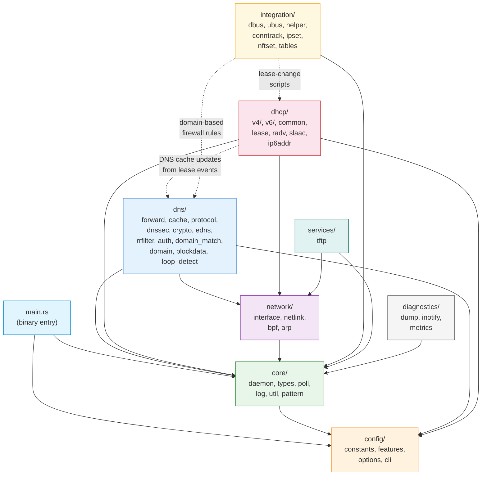

# Rust Module Architecture

## dnsmasq v2.92 — Memory-Safe Rust Implementation

## Table of Contents

1. [Overview](#overview)
2. [Architectural Principles](#architectural-principles)
3. [Module Hierarchy](#module-hierarchy)
4. [Module Dependency Graph](#module-dependency-graph)
5. [State Management Architecture](#state-management-architecture)
6. [Async Runtime Architecture](#async-runtime-architecture)
7. [Feature Flag Architecture](#feature-flag-architecture)
8. [Error Handling Architecture](#error-handling-architecture)
9. [Platform Abstraction](#platform-abstraction)
10. [Cross-References](#cross-references)

---

## Overview

This document describes the complete Rust module architecture for the dnsmasq implementation — a memory-safe rewrite of the dnsmasq v2.92 C codebase (50 source files, 92,894 lines) in Rust 1.91.0 stable. The Rust implementation is a single-binary daemon that uses the `tokio` async runtime, replacing the original C `poll()`-based event loop with Rust's `async`/`await` paradigm while preserving the single-process, event-driven architecture.

The Rust binary is a **drop-in replacement** for the C `dnsmasq` binary: it accepts identical configuration files (`dnsmasq.conf` with 350+ directives), command-line flags, signal semantics (SIGHUP, SIGUSR1, SIGUSR2, SIGTERM), and produces identical network behavior (DNS forwarding/caching, DHCPv4/v6 server, Router Advertisement, TFTP/PXE boot, DNSSEC validation, authoritative DNS).

The primary goal of this rewrite is to **eliminate all memory-safety vulnerabilities** — buffer overflows, use-after-free, double-free, and dangling pointer issues — by leveraging Rust's ownership system, borrow checker, and lifetime annotations. All manual `malloc`/`free`/`realloc` calls (including the `safe_malloc`/`whine_malloc` wrappers from `src/util.c`) are replaced by Rust's RAII model with `Box`, `Vec`, `String`, `Arc`, and `Rc`.

> **C Architecture Reference:** For the original C design that this Rust implementation mirrors, see [`docs/ARCHITECTURE.md`](../../docs/ARCHITECTURE.md) in the repository root.

---

## Architectural Principles

The Rust implementation applies the following design principles, adapted from the C architecture to take full advantage of Rust's type system and safety guarantees.

### 1. Module-per-File Pattern

Each C source file (`.c`) maps to a dedicated Rust module (`.rs`), maintaining logical grouping and discoverability. C header files (`.h`) dissolve into Rust module-level `pub` type, trait, struct, and const definitions within their respective modules.

| C Pattern | Rust Pattern |
|-----------|-------------|
| `src/forward.c` | `dns/forward.rs` |
| `src/cache.c` | `dns/cache.rs` |
| `src/dnsmasq.h` (types) | `core/types.rs` |
| `src/dns-protocol.h` (constants) | `dns/protocol.rs` (constants section) |

### 2. Ownership-Based Memory Safety

RAII (Resource Acquisition Is Initialization) replaces all manual memory management. Every heap allocation is owned by exactly one variable, and deallocation occurs automatically when that variable goes out of scope via the `Drop` trait. There are no `malloc`/`free` calls, no manual reference counting, and no dangling pointers.

| C Pattern | Rust Replacement |
|-----------|-----------------|
| `safe_malloc()` / `whine_malloc()` / `free()` | `Vec<T>`, `Box<T>`, `String` — automatic `Drop` |
| `struct crec` linked-list cache | `HashMap<DnsName, CacheEntry>` with owned values |
| `struct frec` fixed-size pool | `Vec<ForwardRecord>` with capacity management |
| Manual buffer sizing in packet construction | `bytes::BytesMut` with runtime bounds checking |
| `union all_addr` (type punning) | `enum AllAddr { V4(Ipv4Addr), V6(Ipv6Addr), ... }` |

### 3. Async I/O via Tokio

The C `poll()`-based event loop (`src/poll.c`, `src/dnsmasq.c`) is replaced by a single-threaded `tokio` runtime using `epoll` (Linux) or `kqueue` (BSD/macOS) backends via `mio`. The `tokio::select!` macro multiplexes all event sources — DNS sockets, DHCP sockets, signal handlers, timers, and inotify watchers — in a single async event loop.

### 4. Type-State Pattern

DHCP protocol state machines (DHCPv4: DISCOVER → OFFER → REQUEST → ACK; DHCPv6: SOLICIT → ADVERTISE → REQUEST → REPLY) are expressed as Rust `enum` types with compile-time state transition enforcement. Invalid state transitions become type errors caught at compile time, eliminating an entire class of protocol bugs.

### 5. Builder Pattern

DNS packet construction (`src/rfc1035.c` → `dns/protocol.rs`) uses the builder pattern for type-safe packet assembly. Each DNS header field, question section, and resource record is added through chained method calls that enforce correct ordering and field completeness at compile time.

### 6. Strategy Pattern

Upstream DNS server selection (`src/forward.c` → `dns/forward.rs`) uses trait objects for pluggable selection algorithms (round-robin, domain-specific routing, fallback on timeout). This replaces the C function-pointer and conditional-logic approach with a composable, testable abstraction.

### 7. Platform Abstraction via `cfg`

Conditional compilation uses `#[cfg(target_os = "...")]` attributes to replace C preprocessor guards (`#ifdef HAVE_LINUX_NETWORK` / `#ifdef HAVE_BSD_NETWORK`). Platform-specific modules are gated at the module declaration level, so they are completely excluded from compilation on unsupported platforms.

### 8. Feature Flags via Cargo

Optional features are gated by Cargo feature flags, replacing the C `HAVE_*` / `NO_*` preprocessor macros. Feature flags control module inclusion at the `mod.rs` level using `#[cfg(feature = "...")]` attributes. See the [Feature Flag Architecture](#feature-flag-architecture) section for the complete mapping.

### 9. Error Handling via Result

All fallible operations return `Result<T, DnsmasqError>`, replacing C patterns of errno checking and `goto` cleanup blocks. The `?` operator propagates errors up the call stack with zero-cost abstractions. The `thiserror` crate derives `Display` and `Error` implementations for the central `DnsmasqError` enum.

---

## Module Hierarchy

The Rust source tree mirrors the C source organization, grouped by functional domain. The complete module hierarchy from `rust/src/` is:

```
rust/src/
├── main.rs                     (binary entry point, tokio runtime init, daemon bootstrap)
├── lib.rs                      (library crate root, module declarations, public re-exports)
│
├── config/                     [Configuration — from config.h + option.c]
│   ├── mod.rs                  (config module root with sub-module declarations)
│   ├── constants.rs            (numeric constants: FTABSIZ, CACHESIZ, MAXLEASES, EDNS_PKTSZ, etc.)
│   ├── features.rs             (feature flag compilation logic as Cargo cfg attributes)
│   ├── options.rs              (config file parser for 350+ dnsmasq.conf directives)
│   └── cli.rs                  (clap-based CLI argument processing, matching C dnsmasq CLI exactly)
│
├── core/                       [Core Runtime — from dnsmasq.c/h, poll.c, log.c, util.c, pattern.c]
│   ├── mod.rs                  (core module root)
│   ├── daemon.rs               (main async event loop, signal handling, initialization, privilege drop)
│   ├── types.rs                (DaemonState struct, AllAddr enum, MySockAddr, global type definitions)
│   ├── poll.rs                 (async I/O abstraction using tokio::select!)
│   ├── log.rs                  (tracing-based structured logging, syslog + JSON output)
│   ├── util.rs                 (string utilities, helper functions — NO manual malloc wrappers)
│   └── pattern.rs              (wildcard/glob pattern matching)
│
├── dns/                        [DNS Subsystem — from forward.c, cache.c, rfc1035.c, etc.]
│   ├── mod.rs                  (DNS module root, protocol constant re-exports)
│   ├── forward.rs              (async query forwarding with tokio, upstream server selection, retry logic)
│   ├── cache.rs                (DNS cache using HashMap/BTreeMap, TTL-based eviction, LRU management)
│   ├── protocol.rs             (DNS wire format parsing/construction, name compression, RR types/opcodes)
│   ├── dnssec.rs               (DNSSEC validation, chain of trust verification)
│   ├── crypto.rs               (cryptographic operations for DNSSEC — nettle-rs integration)
│   ├── edns.rs                 (EDNS0 option processing, client subnet, DNS cookies)
│   ├── rrfilter.rs             (DNS resource record type filtering)
│   ├── auth.rs                 (authoritative DNS zone serving, SOA/NS record generation)
│   ├── domain_match.rs         (domain matching algorithms, server selection rules)
│   ├── domain.rs               (reverse DNS domain synthesis)
│   ├── blockdata.rs            (block-allocated DNSSEC record storage using Vec/Box)
│   └── loop_detect.rs          (DNS forwarding loop detection)
│
├── dhcp/                       [DHCP Subsystem — from dhcp*.c, rfc2131.c, rfc3315.c, etc.]
│   ├── mod.rs                  (DHCP module root)
│   ├── v4/                     [DHCPv4 — from dhcp.c, rfc2131.c, dhcp-protocol.h]
│   │   ├── mod.rs              (DHCPv4 sub-module root)
│   │   ├── server.rs           (DHCPv4 server initialization, raw socket I/O, packet dispatch)
│   │   ├── protocol.rs         (DHCPv4 state machine: DISCOVER → OFFER → REQUEST → ACK)
│   │   └── options.rs          (DHCPv4 option encode/decode)
│   ├── v6/                     [DHCPv6 — from dhcp6.c, rfc3315.c, dhcp6-protocol.h]
│   │   ├── mod.rs              (DHCPv6 sub-module root)
│   │   ├── server.rs           (DHCPv6 server, relay agent, prefix delegation)
│   │   ├── protocol.rs         (DHCPv6 state machine: SOLICIT → ADVERTISE → REQUEST → REPLY)
│   │   └── outpacket.rs        (DHCPv6 output packet buffer construction)
│   ├── common.rs               (shared DHCP utilities, vendor class matching)
│   ├── lease.rs                (lease management, file persistence, lease state machine)
│   ├── radv.rs                 (Router Advertisement construction/dispatch, ICMPv6)
│   ├── slaac.rs                (SLAAC address tracking)
│   └── ip6addr.rs              (IPv6 address utility functions)
│
├── network/                    [Network & Platform — from network.c, netlink.c, bpf.c, arp.c]
│   ├── mod.rs                  (network module root, platform dispatch)
│   ├── interface.rs            (interface enumeration, async socket binding via tokio)
│   ├── netlink.rs              (Linux netlink via nix crate — cfg(target_os = "linux"))
│   ├── bpf.rs                  (BSD BPF via nix crate — cfg(target_os = "freebsd"/"macos"))
│   └── arp.rs                  (ARP cache reading via nix crate)
│
├── integration/                [External Integrations — feature-gated]
│   ├── mod.rs                  (integration module root)
│   ├── dbus.rs                 (D-Bus interface via dbus crate — cfg(feature = "dbus"))
│   ├── ubus.rs                 (OpenWrt ubus — cfg(feature = "ubus"))
│   ├── helper.rs               (script execution via tokio::process::Command, lease-change callbacks)
│   ├── conntrack.rs            (conntrack marks via nix/netlink — cfg(feature = "conntrack"))
│   ├── ipset.rs                (ipset integration via netlink — cfg(feature = "ipset"))
│   ├── nftset.rs               (nftables set integration — cfg(feature = "nftset"))
│   └── tables.rs               (routing table interaction — cfg(target_os = "freebsd"))
│
├── services/                   [Network Services]
│   ├── mod.rs                  (services module root)
│   └── tftp.rs                 (TFTP server with async I/O, PXE boot — cfg(feature = "tftp"))
│
└── diagnostics/                [Diagnostics & Monitoring]
    ├── mod.rs                  (diagnostics module root)
    ├── dump.rs                 (pcap-format packet dump — cfg(feature = "dumpfile"))
    ├── inotify.rs              (async inotify file change monitoring — cfg(feature = "inotify"))
    └── metrics.rs              (runtime counters using AtomicU64)
```

### Module-to-C-Source Mapping

Every Rust module traces back to one or more C source files. This mapping is the authoritative reference for understanding the transformation.

| Rust Module | C Source Origin | Lines (C) | Key Transformation |
|-------------|----------------|-----------|-------------------|
| `main.rs` | `src/dnsmasq.c` | 3,827 | `poll()` loop → `tokio` async runtime |
| `lib.rs` | `src/dnsmasq.h` | 2,233 | Universal header → module declarations |
| `config/constants.rs` | `src/config.h` | 3,020 | `#define` → `pub const` |
| `config/features.rs` | `src/config.h` | — | `HAVE_*` macros → `cfg(feature = "...")` |
| `config/options.rs` | `src/option.c` | 8,128 | 350+ directives, `switch` → `match` |
| `config/cli.rs` | `src/option.c` | — | `getopt_long` → `clap` derive API |
| `core/daemon.rs` | `src/dnsmasq.c` | 3,827 | `main()` + event loop → async main |
| `core/types.rs` | `src/dnsmasq.h` | 2,233 | `struct daemon` → `DaemonState` |
| `core/poll.rs` | `src/poll.c` | 484 | `poll()` → `tokio::select!` |
| `core/log.rs` | `src/log.c` | 1,120 | `syslog` → `tracing` crate |
| `core/util.rs` | `src/util.c` | 2,730 | `safe_malloc` eliminated; string utils kept |
| `core/pattern.rs` | `src/pattern.c` | 648 | C strings → `&str`/`String` |
| `dns/forward.rs` | `src/forward.c` | 6,068 | Blocking send/recv → async, retry logic |
| `dns/cache.rs` | `src/cache.c` | 4,119 | Manual hash table → `HashMap` + TTL eviction |
| `dns/protocol.rs` | `src/rfc1035.c` + `src/dns-protocol.h` | 3,622 + 873 | Wire format via `bytes` crate |
| `dns/dnssec.rs` | `src/dnssec.c` | 4,009 | Nettle FFI → `nettle` crate |
| `dns/crypto.rs` | `src/crypto.c` | 1,295 | C crypto → `nettle` crate safe wrappers |
| `dns/edns.rs` | `src/edns0.c` | 1,340 | Raw byte manipulation → typed builders |
| `dns/rrfilter.rs` | `src/rrfilter.c` | 918 | Direct translation |
| `dns/auth.rs` | `src/auth.c` | 1,284 | Feature-gated: `cfg(feature = "auth")` |
| `dns/domain_match.rs` | `src/domain-match.c` | 1,591 | C string compare → Rust `str` methods |
| `dns/domain.rs` | `src/domain.c` | 707 | Direct translation |
| `dns/blockdata.rs` | `src/blockdata.c` | 810 | Block allocator → `Vec<Box<[u8]>>` |
| `dns/loop_detect.rs` | `src/loop.c` | 539 | Direct translation |
| `dhcp/v4/server.rs` | `src/dhcp.c` | 2,344 | Raw socket → tokio async |
| `dhcp/v4/protocol.rs` | `src/rfc2131.c` + `src/dhcp-protocol.h` | 5,209 + 936 | `goto` state → enum state machine |
| `dhcp/v4/options.rs` | `src/dhcp-common.c` | 2,337 | Option encode/decode |
| `dhcp/v6/server.rs` | `src/dhcp6.c` | 1,487 | Direct translation + async |
| `dhcp/v6/protocol.rs` | `src/rfc3315.c` + `src/dhcp6-protocol.h` | 4,216 + 685 | `goto` state → enum state machine |
| `dhcp/v6/outpacket.rs` | `src/outpacket.c` | 702 | Buffer management → `Vec<u8>` |
| `dhcp/common.rs` | `src/dhcp-common.c` | 2,337 | Shared utilities |
| `dhcp/lease.rs` | `src/lease.c` | 3,364 | `FILE*` → `tokio::fs`, manual list → `Vec` |
| `dhcp/radv.rs` | `src/radv.c` + `src/radv-protocol.h` | 2,175 + 869 | Timer → `tokio::time` |
| `dhcp/slaac.rs` | `src/slaac.c` | 537 | Direct translation |
| `dhcp/ip6addr.rs` | `src/ip6addr.h` | 183 | C macros → Rust functions |
| `network/interface.rs` | `src/network.c` | 6,331 | Platform-specific socket ops |
| `network/netlink.rs` | `src/netlink.c` | 740 | `cfg(target_os = "linux")` |
| `network/bpf.rs` | `src/bpf.c` | 805 | `cfg(any(target_os = "freebsd", ...))` |
| `network/arp.rs` | `src/arp.c` | 475 | Platform-specific ARP |
| `integration/dbus.rs` | `src/dbus.c` | 2,175 | `cfg(feature = "dbus")` |
| `integration/ubus.rs` | `src/ubus.c` | 968 | `cfg(feature = "ubus")` |
| `integration/helper.rs` | `src/helper.c` | 1,528 | `fork`/`exec` → `tokio::process` |
| `integration/conntrack.rs` | `src/conntrack.c` | 324 | `cfg(feature = "conntrack")` |
| `integration/ipset.rs` | `src/ipset.c` | 532 | `cfg(feature = "ipset")` |
| `integration/nftset.rs` | `src/nftset.c` | 392 | `cfg(feature = "nftset")` |
| `integration/tables.rs` | `src/tables.c` | 386 | `cfg(target_os = "freebsd")` |
| `services/tftp.rs` | `src/tftp.c` | 1,647 | `cfg(feature = "tftp")` |
| `diagnostics/dump.rs` | `src/dump.c` | 815 | `cfg(feature = "dumpfile")` |
| `diagnostics/inotify.rs` | `src/inotify.c` | 687 | `cfg(feature = "inotify")` |
| `diagnostics/metrics.rs` | `src/metrics.c` + `src/metrics.h` | 315 + 365 | Global counters → `AtomicU64` |

---

## Module Dependency Graph

The C codebase uses a flat compilation model where every `.c` file includes `dnsmasq.h`, which in turn includes `config.h` — effectively giving every module access to every type and function prototype. The Rust implementation replaces this with explicit, scoped `use crate::` imports.

### Import Transformation

| C Pattern | Rust Pattern |
|-----------|-------------|
| `#include "dnsmasq.h"` (universal) | Explicit per-module `use crate::` imports |
| `extern struct daemon *daemon;` | `Arc<RwLock<DaemonState>>` function parameter |
| `extern void function_name(args);` | `pub fn function_name(args)` in defining module |
| `#ifdef HAVE_DHCP` | `#[cfg(feature = "dhcp")]` module attribute |

### Inter-Module Dependencies

- **`config`** — Leaf module with no internal dependencies. Provides constants, feature flag logic, configuration parsing, and CLI processing. Used by all other modules.

- **`core`** — Depends on `config` (for constants and parsed options). Provides `DaemonState`, logging, utilities, and the async event loop. All other modules depend on `core::types` for the shared `DaemonState` struct and common type definitions.

- **`dns`** — Depends on `core` (types, logging, util), `config` (constants, feature flags), and `network` (socket I/O for upstream DNS communication). The DNS cache (`dns::cache`) integrates with the DHCP lease database for automatic hostname resolution of DHCP clients.

- **`dhcp`** — Depends on `core` (types, logging), `config` (constants, DHCP ranges), and `network` (raw socket I/O, interface enumeration). Optionally depends on `dns` for DNS cache updates from DHCP lease assignments (dashed edge in diagram).

- **`network`** — Depends on `core` (types, logging). Platform-conditional sub-modules (`netlink`, `bpf`) are compiled independently based on `target_os` and have no cross-dependencies.

- **`integration`** — Each integration module independently depends on `core` for state access. Modules optionally access `dns` and/or `dhcp` state for domain-based firewall rules (ipset/nftset) or lease-change script execution (helper).

- **`services`** — The `tftp` module depends on `core` (types, logging) and `network` (socket binding, interface management).

- **`diagnostics`** — Depends on `core` (types, logging). The `metrics` module is a leaf with no internal dependencies beyond `std::sync::atomic`.

### Dependency Diagram



> **Legend:** Solid arrows (→) indicate hard compile-time dependencies. Dashed arrows (-.→) indicate optional or conditional dependencies (feature-gated or only active when both subsystems are enabled).

---

## State Management Architecture

### C Pattern: Global Singleton

In the C implementation, all runtime state is held in a single global `struct daemon` instance (defined in `src/dnsmasq.h`, approximately 100+ members), accessed directly by every module through `extern struct daemon *daemon;`. This creates implicit coupling between all modules and makes the codebase inherently single-threaded.

### Rust Pattern: Shared State via `Arc<RwLock<DaemonState>>`

The Rust implementation defines a `DaemonState` struct in `core/types.rs` that mirrors the C `struct daemon`. Instead of a global mutable singleton, `DaemonState` is wrapped in `Arc<RwLock<DaemonState>>` and passed through function parameters to modules that need access.

```rust
// core/types.rs — Central state struct (conceptual outline)
pub struct DaemonState {
    // DNS subsystem state
    pub dns_cache: DnsCache,                    // from struct daemon.cache/cache_size
    pub servers: Vec<UpstreamServer>,           // from struct daemon.servers

    // DHCP subsystem state
    pub leases: Vec<DhcpLease>,                 // from struct daemon.dhcp_leases
    pub dhcp_contexts: Vec<DhcpContext>,         // from struct daemon.dhcp

    // Network state
    pub listeners: Vec<Listener>,               // from struct daemon.listeners
    pub interfaces: Vec<InterfaceRecord>,        // from struct daemon.interfaces

    // Configuration
    pub options: DaemonOptions,                  // from struct daemon.options/options2
    pub namebuff: String,                        // from struct daemon.namebuff

    // Runtime counters
    pub metrics: MetricsCounters,                // from metrics.c global counters
}
```

### Design Rationale

`Arc<RwLock<DaemonState>>` was chosen for the following reasons:

1. **Safe shared access** — Multiple async tasks can hold references to the state without data races, enforced at compile time.
2. **Read-write semantics** — `RwLock` allows concurrent readers with exclusive writers, matching the C access pattern where most operations read state and only specific events (config reload, lease update, cache insert) modify it.
3. **Future-proofing** — Although the current implementation uses a single-threaded tokio runtime (matching the C single-process model), the `Arc<RwLock<>>` wrapper enables future migration to a multi-threaded runtime if needed, with zero code changes to state access patterns.
4. **Explicit dependency** — Passing state as a function parameter makes module dependencies visible in function signatures, unlike the C implicit global access.

---

## Async Runtime Architecture

### Tokio Configuration

The Rust implementation uses a **single-threaded tokio runtime**, preserving the C implementation's single-process, event-driven model:

```rust
// main.rs
#[tokio::main(flavor = "current_thread")]
async fn main() -> anyhow::Result<()> {
    // Initialize daemon, bind sockets, drop privileges, enter event loop
}
```

The `current_thread` flavor runs all async tasks on a single OS thread, matching the C `poll()` loop behavior. Under the hood, tokio uses `epoll` on Linux and `kqueue` on BSD/macOS (via the `mio` crate) for efficient kernel-level I/O event notification.

### Event Sources

The main event loop multiplexes all I/O sources using `tokio::select!`, replacing the C `poll()` fd set managed by `src/poll.c`. The following event sources are monitored:

| Event Source | C Implementation | Rust Implementation | Port/Trigger |
|-------------|-----------------|---------------------|--------------|
| DNS UDP queries | `poll()` on UDP socket fd | `tokio::net::UdpSocket::recv_from()` | Port 53 |
| DNS TCP connections | `poll()` on TCP listener fd | `tokio::net::TcpListener::accept()` | Port 53 |
| DHCPv4 packets | `poll()` on raw socket fd | Async raw socket read | Port 67 |
| DHCPv6 packets | `poll()` on UDP socket fd | `tokio::net::UdpSocket::recv_from()` | Port 547 |
| TFTP requests | `poll()` on UDP socket fd | `tokio::net::UdpSocket::recv_from()` | Port 69 |
| Signal handlers | Signal pipe (`sig_handler()` → pipe write) | `tokio::signal::unix::signal()` | SIGHUP, SIGUSR1, SIGUSR2, SIGTERM |
| Timer events | `poll()` timeout calculation | `tokio::time::interval()` / `sleep()` | Lease expiry, DNS retry, RA periodic |
| inotify events | `poll()` on inotify fd | `tokio::io::AsyncReadExt` on inotify fd | `/etc/hosts`, `/etc/resolv.conf` changes |
| Netlink events | `poll()` on netlink fd (Linux) | Async netlink socket read | Interface/address changes |
| D-Bus messages | `poll()` on D-Bus connection fd | Async D-Bus message loop | NetworkManager integration |

### Main Loop Pattern

The core event loop in `core/daemon.rs` uses `tokio::select!` to await the first ready event from all sources:

```rust
// core/daemon.rs — Conceptual event loop structure
loop {
    tokio::select! {
        // DNS query received on UDP
        result = dns_udp_socket.recv_from(&mut buf) => {
            handle_dns_udp_query(result?, &state).await?;
        }
        // DNS TCP connection accepted
        result = dns_tcp_listener.accept() => {
            handle_dns_tcp_connection(result?, &state).await?;
        }
        // DHCPv4 packet received
        result = dhcp4_socket.recv(&mut buf) => {
            handle_dhcp4_packet(result?, &state).await?;
        }
        // Signal received
        _ = sighup_signal.recv() => {
            clear_cache_and_reload(&state).await?;
        }
        _ = sigusr1_signal.recv() => {
            dump_cache_statistics(&state);
        }
        _ = sigterm_signal.recv() => {
            graceful_shutdown(&state).await?;
            break;
        }
        // Lease expiry timer
        _ = lease_timer.tick() => {
            prune_expired_leases(&state).await?;
        }
        // inotify file change
        result = inotify_watcher.next() => {
            handle_file_change(result?, &state).await?;
        }
    }
}
```

This replaces the C pattern of:
1. `poll_reset()` — clear the fd set
2. `poll_listen(fd, event)` — register each fd (repeated for all sockets)
3. `do_poll(timeout)` — block waiting for events
4. `poll_check(fd, event)` — check each fd for readiness (repeated)

### Signal Handling

The C implementation uses a two-stage signal handling mechanism: the signal handler (`sig_handler()` in `src/dnsmasq.c`) writes the signal number to a pipe, and the main loop reads from the pipe to process the signal in a safe context.

The Rust implementation simplifies this using `tokio::signal::unix::signal()`, which provides async signal notification directly in the event loop without requiring a self-pipe trick:

| Signal | C Behavior | Rust Behavior |
|--------|-----------|---------------|
| `SIGHUP` | Clear DNS cache, re-read config, re-enumerate interfaces | `clear_cache_and_reload()` async function |
| `SIGUSR1` | Dump cache statistics to syslog | `dump_cache_statistics()` |
| `SIGUSR2` | Dump detailed status to syslog | `dump_detailed_status()` |
| `SIGTERM` | Graceful shutdown: close sockets, write lease DB, exit | `graceful_shutdown()` async function |
| `SIGCHLD` | Collect child process exit status | Handled by `tokio::process` automatically |

---

## Feature Flag Architecture

### Cargo Feature Flag Mapping

The C `HAVE_*` preprocessor macro system maps to Cargo feature flags. The default feature set matches the C default-enabled features exactly:

| C Macro | Cargo Feature | Default | Rust Module(s) Affected | External Dependency |
|---------|---------------|---------|------------------------|-------------------|
| `HAVE_DHCP` | `dhcp` | **enabled** | `dhcp/v4/` | None |
| `HAVE_DHCP6` | `dhcp6` | **enabled** | `dhcp/v6/`, `dhcp/radv.rs`, `dhcp/slaac.rs` | None (implies `dhcp`) |
| `HAVE_TFTP` | `tftp` | **enabled** | `services/tftp.rs` | None |
| `HAVE_SCRIPT` | `script` | **enabled** | `integration/helper.rs` | None |
| `HAVE_AUTH` | `auth` | **enabled** | `dns/auth.rs` | None |
| `HAVE_IPSET` | `ipset` | **enabled** | `integration/ipset.rs` | None |
| `HAVE_LOOP` | `loop-detect` | **enabled** | `dns/loop_detect.rs` | None |
| `HAVE_DUMPFILE` | `dumpfile` | **enabled** | `diagnostics/dump.rs` | None |
| `HAVE_INOTIFY` | `inotify` | **enabled** | `diagnostics/inotify.rs` | None (Linux auto-detected) |
| `HAVE_DNSSEC` | `dnssec` | disabled | `dns/dnssec.rs`, `dns/crypto.rs`, `dns/blockdata.rs` | `nettle` crate (libnettle) |
| `HAVE_DBUS` | `dbus` | disabled | `integration/dbus.rs` | `dbus` crate (libdbus-1) |
| `HAVE_UBUS` | `ubus` | disabled | `integration/ubus.rs` | (libubus) |
| `HAVE_IDN` / `HAVE_LIBIDN2` | `idn` | disabled | Core domain name processing | `idna` crate |
| `HAVE_CONNTRACK` | `conntrack` | disabled | `integration/conntrack.rs` | (libnetfilter_conntrack) |
| `HAVE_NFTSET` | `nftset` | disabled | `integration/nftset.rs` | `nftables` crate (libnftables) |
| `HAVE_LUASCRIPT` | `luascript` | disabled | Lua scripting support | `mlua` crate (liblua) |

### Auto-Detected Platform Features

The following features are detected automatically by `build.rs` at compile time, replacing the C Makefile's platform detection logic:

| C Macro | Detection Method | Modules Affected |
|---------|-----------------|-----------------|
| `HAVE_LINUX_NETWORK` | `cfg(target_os = "linux")` | `network/netlink.rs` |
| `HAVE_BSD_NETWORK` | `cfg(any(target_os = "freebsd", target_os = "openbsd", target_os = "netbsd", target_os = "macos"))` | `network/bpf.rs` |

### Module-Level Feature Gating

Feature flags are applied at the module declaration level in each `mod.rs` file:

```rust
// dns/mod.rs
pub mod forward;
pub mod cache;
pub mod protocol;

#[cfg(feature = "dnssec")]
pub mod dnssec;
#[cfg(feature = "dnssec")]
pub mod crypto;
#[cfg(feature = "dnssec")]
pub mod blockdata;

#[cfg(feature = "auth")]
pub mod auth;

#[cfg(feature = "loop-detect")]
pub mod loop_detect;
```

```rust
// integration/mod.rs
#[cfg(feature = "dbus")]
pub mod dbus;
#[cfg(feature = "ubus")]
pub mod ubus;
#[cfg(feature = "script")]
pub mod helper;
#[cfg(feature = "conntrack")]
pub mod conntrack;
#[cfg(feature = "ipset")]
pub mod ipset;
#[cfg(feature = "nftset")]
pub mod nftset;
#[cfg(target_os = "freebsd")]
pub mod tables;
```

### Build Examples

```bash
# Default features (matches C default build)
cargo build --release

# Minimal DNS-only build (no DHCP, no TFTP)
cargo build --release --no-default-features

# Full-featured build with all optional features
cargo build --release --all-features

# DNS + DHCP with DNSSEC
cargo build --release --features "dnssec"

# With D-Bus support for NetworkManager
cargo build --release --features "dbus"
```

---

## Error Handling Architecture

### Central Error Type

All fallible operations across the codebase return `Result<T, DnsmasqError>`, where `DnsmasqError` is a comprehensive error enum defined in `core/types.rs` using the `thiserror` crate:

```rust
// core/types.rs
use thiserror::Error;

#[derive(Error, Debug)]
pub enum DnsmasqError {
    #[error("configuration error: {0}")]
    Config(String),

    #[error("I/O error: {0}")]
    Io(#[from] std::io::Error),

    #[error("DNS protocol error: {0}")]
    Dns(String),

    #[error("DHCP error: {0}")]
    Dhcp(String),

    #[error("network error: {0}")]
    Network(String),

    #[error("platform error: {0}")]
    Platform(String),

    #[error("permission denied: {0}")]
    Permission(String),
}
```

### Error Propagation

The `?` operator replaces C's `goto` cleanup blocks and errno-checking patterns:

| C Pattern | Rust Pattern |
|-----------|-------------|
| `if (func() == -1) { goto cleanup; }` | `func()?;` |
| `errno` checking after syscalls | `Result<T, std::io::Error>` return |
| `die("message", ...)` → `exit(EC_BADCONF)` | `return Err(DnsmasqError::Config(...))` |
| Multi-label `goto` cleanup chains | Automatic `Drop` via RAII |

### Top-Level Error Handling

The binary entry point (`main.rs`) uses `anyhow::Result` for top-level error reporting, which wraps `DnsmasqError` with contextual backtraces:

```rust
// main.rs
#[tokio::main(flavor = "current_thread")]
async fn main() -> anyhow::Result<()> {
    let config = config::cli::parse_args()?;
    let state = core::daemon::initialize(config).await?;
    core::daemon::run_event_loop(state).await?;
    Ok(())
}
```

---

## Platform Abstraction

All platform-specific code is isolated behind `#[cfg(target_os = "...")]` attributes and the `build.rs` platform detection script, replacing the C preprocessor guards (`#ifdef HAVE_LINUX_NETWORK`, `#ifdef HAVE_BSD_NETWORK`).

### Linux

| Capability | Rust Module | C Source | Mechanism |
|-----------|-------------|----------|-----------|
| Network interface monitoring | `network/netlink.rs` | `src/netlink.c` | Netlink sockets via `nix` crate |
| File change monitoring | `diagnostics/inotify.rs` | `src/inotify.c` | Async inotify via `tokio` |
| Capability management | `core/daemon.rs` | `src/dnsmasq.c` | `capset()`/`prctl()` via `nix`/`libc` |
| ipset/nftset integration | `integration/ipset.rs`, `integration/nftset.rs` | `src/ipset.c`, `src/nftset.c` | Netlink via `libc` FFI |
| Conntrack marks | `integration/conntrack.rs` | `src/conntrack.c` | Netfilter via `libc` FFI |

### BSD (FreeBSD, OpenBSD, NetBSD)

| Capability | Rust Module | C Source | Mechanism |
|-----------|-------------|----------|-----------|
| Raw packet capture | `network/bpf.rs` | `src/bpf.c` | BPF device via `nix` crate |
| Interface monitoring | `network/bpf.rs` | `src/bpf.c` | Routing sockets |
| Routing table interaction | `integration/tables.rs` | `src/tables.c` | `cfg(target_os = "freebsd")` |

### macOS

| Capability | Rust Module | C Source | Mechanism |
|-----------|-------------|----------|-----------|
| Raw packet capture | `network/bpf.rs` | `src/bpf.c` | BPF via `/dev/bpf*` devices |
| Interface monitoring | `network/bpf.rs` | `src/bpf.c` | Routing sockets |

### Platform Detection in build.rs

The `build.rs` script detects the target platform and emits `cargo:rustc-cfg` directives for conditional compilation:

```rust
// build.rs (conceptual)
fn main() {
    let target_os = std::env::var("CARGO_CFG_TARGET_OS").unwrap();

    match target_os.as_str() {
        "linux" => {
            println!("cargo:rustc-cfg=linux_network");
            println!("cargo:rustc-cfg=have_inotify");
        }
        "freebsd" | "openbsd" | "netbsd" | "macos" => {
            println!("cargo:rustc-cfg=bsd_network");
        }
        _ => {}
    }
}
```

### Unsafe Code Policy

Zero `unsafe` blocks are permitted in core logic modules (`dns/`, `dhcp/`, `config/`, `core/` excluding platform FFI). `unsafe` FFI blocks are allowed only in platform-specific modules (`network/netlink.rs`, `network/bpf.rs`, `network/arp.rs`, `core/daemon.rs` for privilege management) and must include `// SAFETY:` comments explaining the invariant maintained. See [SAFETY.md](SAFETY.md) for the complete inventory.

---

## Cross-References

| Document | Purpose |
|----------|---------|
| [README.md](README.md) | Build instructions, quick start, feature flags, deployment |
| [MIGRATION.md](MIGRATION.md) | C-to-Rust pattern mapping, file-by-file transformation guide |
| [SAFETY.md](SAFETY.md) | Unsafe block inventory, safety justifications, eliminated vulnerabilities |
| [API.md](API.md) | Internal module API reference, public type/function documentation |
| [`docs/ARCHITECTURE.md`](../../docs/ARCHITECTURE.md) | Original C architecture documentation (for comparison) |

> **Rustdoc:** Run `cargo doc --open` from the `rust/` directory to generate and browse the full API documentation derived from inline `///` doc comments in the source code.
